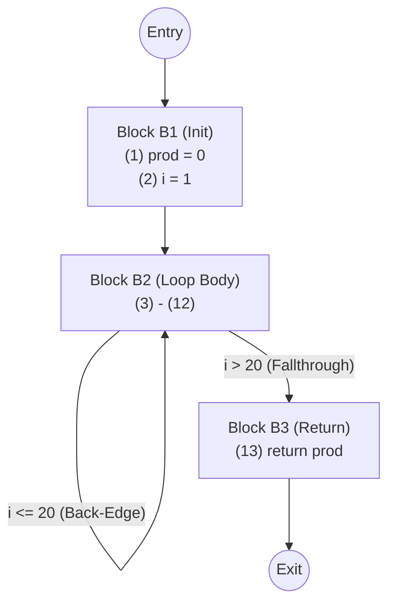

# Basic Block Partitioning and Next-Use Computation Example

> 📖 **Reading Order:** Step 39 of 55 | **Module 4:** Code Generation  
> ◄ **Previous:** [[Peephole Optimization Techniques]] | ► **Next:** [[DAG-Based Basic Block Optimization Example]]

---

## Problem

Given the following sequence of Three-Address Code instructions:

```
(1)  prod = 0
(2)  i = 1
(3)  t1 = 4 * i
(4)  t2 = a[t1]
(5)  t3 = 4 * i
(6)  t4 = b[t3]
(7)  t5 = t2 * t4
(8)  t6 = prod + t5
(9)  prod = t6
(10) t7 = i + 1
(11) i = t7
(12) if i <= 20 goto (3)
(13) return prod
```

### Tasks:
1. Apply the 3 leader rules to partition this program into Basic Blocks.
2. Draw the resulting Control Flow Graph (CFG).
3. Perform backward next-use and liveness analysis on the loop body block (instructions 3 through 12). Assume user variables `prod, i, a, b` are live at block exit, and all `t_i` temporaries are dead at block exit.

---

## Solution

The loop has one initialization region, a repeatedly executed body, and a return. Jump `(12)` goes to `(3)`, so `(3)` starts the body. Its successor `(13)` starts the exit region; instruction `(1)` starts the fragment.

Build those blocks before next-use analysis. The body is straight-line until its final branch, so a backward scan has a definite local order. The question supplies live-out assumptions for prod, i, a, and b; use them as boundary data rather than deriving different global facts.

At each instruction, first record the known suffix state. Then kill the assigned result's old value and add its operands as uses. [[Liveness and Next-Use Analysis within Basic Blocks]] explains why the suffix tells us what must survive earlier.

The two `4*i` computations are a later optimization opportunity, but identifying blocks and computing next use should describe the provided program before transformations alter it.

### Identifying Leaders:
- **Rule 1 (First Instruction):** Instruction `(1)` is a Leader.
- **Rule 2 (Jump Targets):** Instruction (12) targets `(3)` $\implies$ Instruction `(3)` is a Leader.
- **Rule 3 (Successor of Jumps):** Instruction (12) is a jump $\implies$ Instruction `(13)` is a Leader.

**Leaders:** $\{ (1), (3), (13) \}$

### Resulting Basic Blocks:
- **Block $B_1$ (Initialization):**
  ```
  (1) prod = 0
  (2) i = 1
  ```
- **Block $B_2$ (Inner Loop Body):**
  ```
  (3)  t1 = 4 * i
  (4)  t2 = a[t1]
  (5)  t3 = 4 * i
  (6)  t4 = b[t3]
  (7)  t5 = t2 * t4
  (8)  t6 = prod + t5
  (9)  prod = t6
  (10) t7 = i + 1
  (11) i = t7
  (12) if i <= 20 goto (3)
  ```
- **Block $B_3$ (Function Exit):**
  ```
  (13) return prod
  ```

---
### Control Flow Graph (CFG)



---
### Next-Use and Liveness Tracing in Block $B_2$

We scan backwards from instruction (12) to instruction (3).

### Initial Symbol Table at Exit of $B_2$:
- `prod`: (live, none)
- `i`: (live, none)
- `a`: (live, none)
- `b`: (live, none)
- `t1 .. t7`: all (dead, none)

---

### Step-by-Step Backward Scan:

1. **Instruction (12): `if i <= 20 goto (3)`**
   - Attach info: `i`: (live, none)
   - Operands: `i` is used $\implies$ `i`: **(live, 12)**
2. **Instruction (11): `i = t7`**
   - Attach info: `i`: (live, 12), `t7`: (dead, none)
   - Update: `i` defined $\implies$ `i`: **(dead, none)**; `t7` used $\implies$ `t7`: **(live, 11)**
3. **Instruction (10): `t7 = i + 1`**
   - Attach info: `t7`: (live, 11), `i`: (dead, none)
   - Update: `t7` defined $\implies$ `t7`: **(dead, none)**; `i` used $\implies$ `i`: **(live, 10)**
4. **Instruction (9): `prod = t6`**
   - Attach info: `prod`: (live, none), `t6`: (dead, none)
   - Update: `prod` defined $\implies$ `prod`: **(dead, none)**; `t6` used $\implies$ `t6`: **(live, 9)**
5. **Instruction (8): `t6 = prod + t5`**
   - Attach info: `t6`: (live, 9), `prod`: (dead, none), `t5`: (dead, none)
   - Update: `t6` defined $\implies$ `t6`: **(dead, none)**; `prod` used $\implies$ `prod`: **(live, 8)**; `t5` used $\implies$ `t5`: **(live, 8)**
6. **Instruction (7): `t5 = t2 * t4`**
   - Attach info: `t5`: (live, 8), `t2`: (dead, none), `t4`: (dead, none)
   - Update: `t5` defined $\implies$ `t5`: **(dead, none)**; `t2` used $\implies$ `t2`: **(live, 7)**; `t4` used $\implies$ `t4`: **(live, 7)**
7. **Instruction (6): `t4 = b[t3]`**
   - Attach info: `t4`: (live, 7), `b`: (live, none), `t3`: (dead, none)
   - Update: `t4` defined $\implies$ `t4`: **(dead, none)**; `b` used $\implies$ `b`: **(live, 6)**; `t3` used $\implies$ `t3`: **(live, 6)**
8. **Instruction (5): `t3 = 4 * i`**
   - Attach info: `t3`: (live, 6), `i`: (live, 10)
   - Update: `t3` defined $\implies$ `t3`: **(dead, none)**; `i` used $\implies$ `i`: **(live, 5)**
9. **Instruction (4): `t2 = a[t1]`**
   - Attach info: `t2`: (live, 7), `a`: (live, none), `t1`: (dead, none)
   - Update: `t2` defined $\implies$ `t2`: **(dead, none)**; `a` used $\implies$ `a`: **(live, 4)**; `t1` used $\implies$ `t1`: **(live, 4)**
10. **Instruction (3): `t1 = 4 * i`**
    - Attach info: `t1`: (live, 4), `i`: (live, 5)
    - Update: `t1` defined $\implies$ `t1`: **(dead, none)**; `i` used $\implies$ `i`: **(live, 3)**

---

## Result

| Inst # | Statement | Attached Variable Status |
| :---: | :---: | :--- |
| **(3)** | `t1 = 4 * i` | $t_1$: dead, none; &nbsp; $i$: live, next-use: (5) |
| **(4)** | `t2 = a[t1]` | $t_2$: dead, none; &nbsp; $t_1$: live, next-use: (4); &nbsp; $a$: live, none |
| **(5)** | `t3 = 4 * i` | $t_3$: dead, none; &nbsp; $i$: live, next-use: (10) |
| **(6)** | `t4 = b[t3]` | $t_4$: dead, none; &nbsp; $t_3$: live, next-use: (6); &nbsp; $b$: live, none |
| **(7)** | `t5 = t2 * t4` | $t_5$: dead, none; &nbsp; $t_2$: live, next-use: (7); &nbsp; $t_4$: live, next-use: (7) |
| **(8)** | `t6 = prod + t5` | $t_6$: dead, none; &nbsp; $prod$: dead, none; &nbsp; $t_5$: live, next-use: (8) |
| **(9)** | `prod = t6` | $prod$: live, none; &nbsp; $t_6$: live, next-use: (9) |
| **(10)** | `t7 = i + 1` | $t_7$: dead, none; &nbsp; $i$: dead, none |
| **(11)** | `i = t7` | $i$: live, next-use: (12); &nbsp; $t_7$: live, next-use: (11) |
| **(12)** | `if i <= 20 goto (3)` | $i$: live, none |

---

## What to carry forward

Keep the original instruction numbers through the analysis. A next-use table is tied to that sequence; after optimization, recompute or update it. [[DAG-Based Basic Block Optimization Example]] develops value reuse separately.

## Related notes

- [[Liveness and Next-Use Analysis within Basic Blocks]]
- [[DAG-Based Basic Block Optimization Example]]

## Sources

- **Lecture Slides:** [[cse309/01 - Sources/Lectures/KMS Merged.pdf|KMS Merged.pdf]], Chapter 8 (Slides 323–334).
- **Textbook:** Aho, Lam, Sethi, Ullman, *Compilers: Principles, Techniques, & Tools* (2nd Ed.), Section 8.4.
