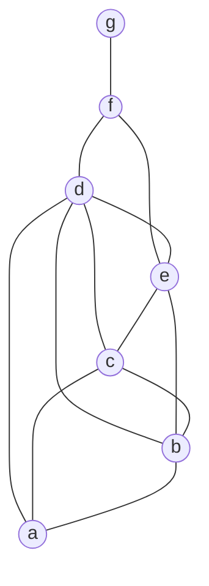

# Chaitin's Graph Coloring Register Allocation Example

> 📖 **Reading Order:** Step 48 of 55 | **Module 5:** Register Allocation  
> ◄ **Previous:** [[Linear Scan Register Allocation Step-by-Step Example]] | ► **Next:** [[Problem — Linear Scan Register Allocation Simulation]]

---

## Problem

We trace the exact Register Interference Graph (RIG) and execution of Chaitin's Algorithm presented in the KMS lecture slides (Slides 444–528).

Consider a program with 7 live ranges: $\{ a, b, c, d, e, f, g \}$.
The target machine has **$K = 3$ hardware registers**: $\{ R_0, R_1, R_2 \}$.

### Register Interference Graph Adjacency:
```
Node a: connected to { b, c, d }             (Degree = 3)
Node b: connected to { a, c, d, e }          (Degree = 4)
Node c: connected to { a, b, d, e }          (Degree = 4)
Node d: connected to { a, b, c, e, f }       (Degree = 5)
Node e: connected to { b, c, d, f }          (Degree = 4)
Node f: connected to { d, e, g }             (Degree = 3)
Node g: connected to { f }                   (Degree = 1)
```



---

## Solution

With three registers, a node of degree below three is easy to remove because it can be reinserted after its neighbors are colored. Begin with the low-degree nodes in the supplied graph and update neighbor degrees after each removal.

When only higher-degree nodes remain, record that simplification has stalled. Inspect the residual graph before claiming a necessary spill. In this example, a,b,c,d form a four-node clique, so those four mutually conflicting ranges require four colors if all remain intact; three interchangeable registers cannot hold them without some transformation.

[[Chaitin's Graph Coloring Register Allocation Algorithm]] chooses a candidate and continues simplifying. The select phase pops the stack and forbids colors already assigned to neighbors. Keep the candidate status separate from whether selection actually needs spill code.

This example's clique argument is stronger than the generic degree heuristic. Degree at least K alone would not establish impossibility.

### Phase 1: Simplify (Kempe's Rule: Find Node with Degree $< 3$)

1. **Step 1:** Node $g$ has $\text{degree}(g) = 1 < 3$.
   - Remove $g$ from graph.
   - Push $g$ onto stack: `Stack: [ g ]`.
   - Update neighbors: $f$'s degree decreases from $3$ to $2$.
2. **Step 2:** Node $f$ now has $\text{degree}(f) = 2 < 3$.
   - Remove $f$ from graph.
   - Push $f$ onto stack: `Stack: [ g, f ]`.
   - Update neighbors: $d$'s degree decreases from $5$ to $4$; $e$'s degree decreases from $4$ to $3$.
3. **Step 3 (The Kempe Jam!):**
   Inspect remaining nodes in graph: $\{ a, b, c, d, e \}$.
   - $\text{degree}(a) = 3$
   - $\text{degree}(b) = 4$
   - $\text{degree}(c) = 4$
   - $\text{degree}(d) = 4$
   - $\text{degree}(e) = 3$

   **Every single remaining node has degree $\ge 3$! Kempe's rule is stuck.**

---

### Phase 2: Spill Candidate Selection (Chaitin Spill)

Because all remaining degrees are $\ge K = 3$, we must select a **spill candidate**.
Assume all variables have equal spill cost ($1$). We evaluate Chaitin's metric:
$$\text{Metric}(v) = \frac{\text{Cost}(v)}{\text{degree}(v)}$$
- Node $d$ has the highest degree ($4$), minimizing $\frac{\text{Cost}}{\text{degree}} = \frac{1}{4} = 0.25$.
- Node $d$ is selected as the **Spill Candidate**!
- Remove $d$ from the graph and mark as candidate spill.
- Degrees of neighbors drop:
  - $\text{degree}(a) = 3 - 1 = 2 < 3$!
  - $\text{degree}(b) = 4 - 1 = 3$
  - $\text{degree}(c) = 4 - 1 = 3$
  - $\text{degree}(e) = 3 - 1 = 2 < 3$!

Removing $d$ immediately unblocks Kempe's heuristic!

---

### Phase 3: Resume Simplification

4. **Step 4:** Node $a$ now has $\text{degree}(a) = 2 < 3$.
   - Remove $a$. Push $a$: `Stack: [ g, f, a ]`.
   - Neighbors $b$ and $c$ drop from degree $3$ to $2$.
5. **Step 5:** Node $e$ has $\text{degree}(e) = 2 < 3$.
   - Remove $e$. Push $e$: `Stack: [ g, f, a, e ]`.
   - Neighbors $b$ and $c$ drop from degree $2$ to $1$.
6. **Step 6:** Node $b$ has $\text{degree}(b) = 1 < 3$.
   - Remove $b$. Push $b$: `Stack: [ g, f, a, e, b ]`.
7. **Step 7:** Node $c$ has $\text{degree}(c) = 0 < 3$.
   - Remove $c$. Push $c$: `Stack: [ g, f, a, e, b, c ]`.

The graph is now completely empty!

---

### Phase 4: Select (Popping Stack and Assigning Colors)

We pop nodes in reverse order: `c -> b -> e -> a -> (d) -> f -> g`:

1. **Pop $c$:** No colored neighbors $\implies$ **Color($c$) = $R_0$**.
2. **Pop $b$:** Neighbor $c$ has $R_0 \implies$ **Color($b$) = $R_1$**.
3. **Pop $e$:** Neighbors are $b$ ($R_1$) and $c$ ($R_0$) $\implies$ **Color($e$) = $R_2$**.
4. **Pop $a$:** Neighbors are $b$ ($R_1$) and $c$ ($R_0$) $\implies$ **Color($a$) = $R_2$** (reuses $R_2$, disjoint from $e$).
5. **Pop Spill Candidate $d$:**
   - Neighbors of $d$ are $a$ ($R_2$), $b$ ($R_1$), $c$ ($R_0$), and $e$ ($R_2$).
   - Colors used by neighbors: $\{ R_0, R_1, R_2 \}$.
   - All 3 colors are consumed! **$d$ CANNOT be colored.**
   - **$d$ is confirmed as an ACTUAL SPILL!** Spilled to memory stack slot.
6. **Pop $f$:** Neighbor $d$ is spilled (in memory); neighbor $e$ has $R_2 \implies$ **Color($f$) = $R_0$**.
7. **Pop $g$:** Neighbor $f$ has $R_0 \implies$ **Color($g$) = $R_1$**.

---

## Result

| Variable | Final Allocation | Physical Location |
| :---: | :---: | :---: |
| **$a$** | Register | **$R_2$** |
| **$b$** | Register | **$R_1$** |
| **$c$** | Register | **$R_0$** |
| **$d$** | **Spilled** | Memory Stack Offset `[ebp - 4]` |
| **$e$** | Register | **$R_2$** |
| **$f$** | Register | **$R_0$** |
| **$g$** | Register | **$R_1$** |

Only 1 variable ($d$) required spilling, while 6 variables were packed perfectly into just 3 physical registers!

---

## What to carry forward

Validate every final edge, then identify any actual spill and the code rewrite it requires. A coloring trace must not assign the same register to clique neighbors merely because one was provisionally removed earlier.

## Related notes

- [[Chaitin's Graph Coloring Register Allocation Algorithm]]

## Sources

- **Lecture Slides:** [[cse309/01 - Sources/Lectures/KMS Merged.pdf|KMS Merged.pdf]], Register Allocation (Slides 444–528).
- **Textbook / Papers:** Chaitin, "Register Allocation & Spilling via Graph Coloring", ACM SIGPLAN 1982.
