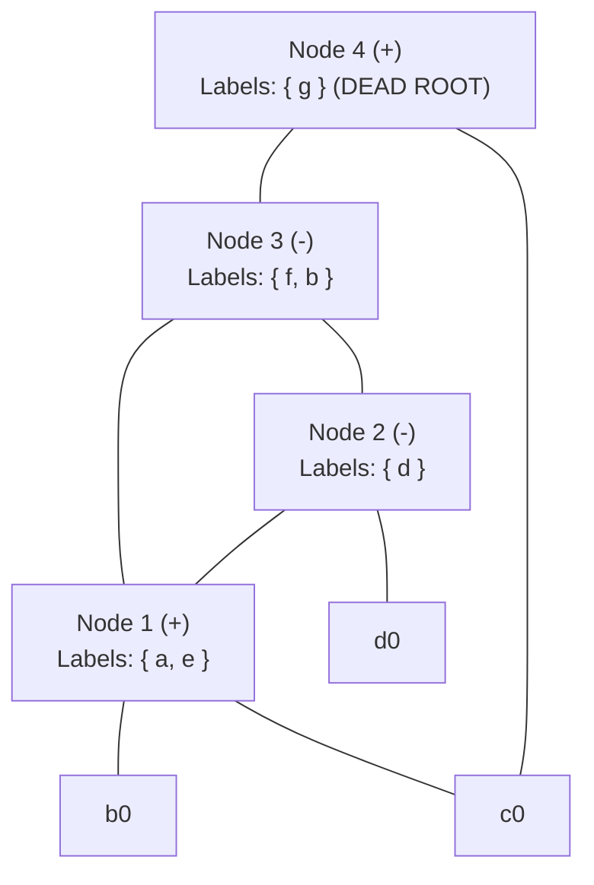

# DAG-Based Basic Block Optimization Example

> 📖 **Reading Order:** Step 40 of 55 | **Module 4:** Code Generation  
> ◄ **Previous:** [[Basic Block Partitioning and Next-Use Computation Example]] | ► **Next:** [[Problem — Basic Block Partitioning and Next-Use Table]]

---

## Problem

Consider the following basic block containing redundant computations and array references:

```
(1) a = b + c
(2) d = a - d
(3) e = b + c
(4) f = e - d
(5) b = a - d
(6) g = b + c
```

Assume that at the exit of this basic block:
- Variables `a`, `b`, and `f` are **live**.
- All other variables (`c`, `d`, `e`, `g`) are **dead**.

### Tasks:
1. Construct the Directed Acyclic Graph (DAG) for this basic block step-by-step.
2. Identify and eliminate local common subexpressions.
3. Perform dead code elimination on the DAG.
4. Reassemble the optimal Three-Address Code from the simplified DAG.

---

## Solution

The repeated `b+c` at statements 1 and 3 can share a node because b and c still denote their incoming values. After statement 5 assigns b, statement 6's `b+c` has a different operand identity and cannot reuse that earlier addition.

Create leaves for incoming values, such as b0 and d0. Assignment changes labels attached to value nodes, not the historical meaning of those leaves. For `d=a-d`, the right-hand d is the incoming d0; after the instruction, the name d denotes the new subtraction result.

[[DAG Construction and Local Optimization of Basic Blocks]] uses these identities to distinguish real redundancy from repeated spelling. Once live-out names are known, retain the dependencies needed to produce a, b, and f. A dead variable's computation may still be necessary as an ancestor of a live result.

The example consists of scalar assignments; array-store aliasing is a separate issue explored in its linked problem.

### Step 1: Statement (1) `a = b + c`
- Create leaf nodes $b_0$ and $c_0$.
- Create interior node $N_1 = ('+', b_0, c_0)$.
- Attach label `a` to $N_1$.

### Step 2: Statement (2) `d = a - d`
- Create leaf node $d_0$.
- Create interior node $N_2 = ('-', N_1, d_0)$.
- Attach label `d` to $N_2$.

### Step 3: Statement (3) `e = b + c`
- Signature `('+', b_0, c_0)` **already exists** at Node $N_1$!
- Do NOT create a new node. Simply attach label `e` to $N_1$.
- Node $N_1$ now has labels `{ a, e }`.

### Step 4: Statement (4) `f = e - d`
- Left child is $N_1$ (since `e` is at $N_1$).
- Right child is $N_2$ (since `d` is at $N_2$).
- Create interior node $N_3 = ('-', N_1, N_2)$.
- Attach label `f` to $N_3$.

### Step 5: Statement (5) `b = a - d`
- Left child is $N_1$, right child is $N_2$.
- Signature `('-', N_1, N_2)` **already exists** at Node $N_3$!
- Attach label `b` to $N_3$.
- Node $N_3$ now has labels `{ f, b }`.

### Step 6: Statement (6) `g = b + c`
- Left child is $N_3$ (since `b` is now at $N_3$).
- Right child is leaf $c_0$.
- Create interior node $N_4 = ('+', N_3, c_0)$.
- Attach label `g` to $N_4$.

---
### DAG Optimization and Dead Code Elimination



### Applying Dead Code Elimination:
1. Node $N_4$ has only label `g` attached.
2. Given that `g` is **dead at block exit**, node $N_4$ is an unused root. **Eliminate Node $N_4$!**
3. Label `e` on $N_1$ and label `d` on $N_2$ are dead at exit, but the nodes themselves must be evaluated to compute $N_3$ (which computes live variables `f` and `b`).

---
### Reassembling Optimized Three-Address Code

We evaluate the surviving nodes in topological order ($N_1 \to N_2 \to N_3$):

1. **Evaluate Node $N_1$:**
   - Computes $b_0 + c_0$. Live label `a` is attached:
     ```
     a = b + c
     ```
2. **Evaluate Node $N_2$:**
   - Computes $N_1 - d_0$. Use temporary `d` (or `t1`):
     ```
     d = a - d
     ```
3. **Evaluate Node $N_3$:**
   - Computes $N_1 - N_2$. Attached live labels are `f` and `b`:
     ```
     b = a - d
     f = b
     ```

### Complete Reconstructed Code:
```
a = b + c
d = a - d
b = a - d
f = b
```

### Result Analysis:
- Original code: **6 statements**.
- Optimized code: **4 statements**.
- The redundant common subexpressions `b + c` (statement 3) and `a - d` (statement 5) were completely eliminated, and dead computation `g = b + c` was purged!

---

## What to carry forward

Delete unused result nodes only after checking whether live nodes depend on them. Reassembled code must preserve the final values of all live-out variables, including names assigned more than once.

## Related notes

- [[DAG Construction and Local Optimization of Basic Blocks]]

## Sources

- **Lecture Slides:** [[cse309/01 - Sources/Lectures/KMS Merged.pdf|KMS Merged.pdf]], Chapter 8 (Slides 335–347).
- **Textbook:** Aho, Lam, Sethi, Ullman, *Compilers: Principles, Techniques, & Tools* (2nd Ed.), Section 8.5, Example 8.10.
