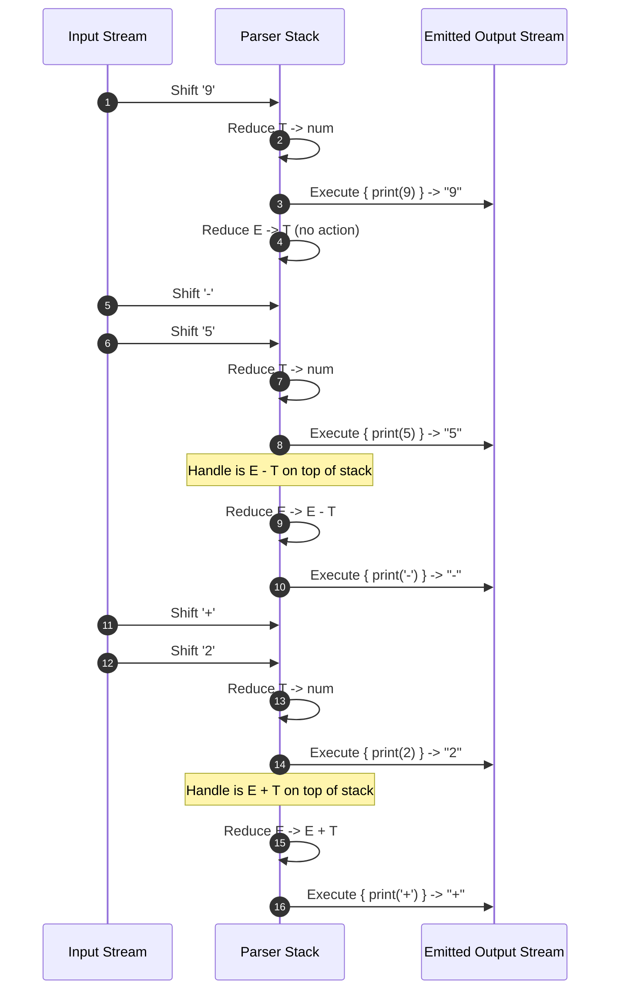
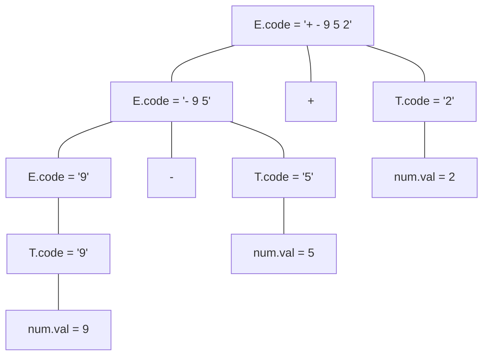

# Infix to Postfix and Prefix SDT Translation Example

> 📖 **Reading Order:** Step 08 of 55 | **Module 1:** Syntax-Directed Translation  
> ◄ **Previous:** [[Arithmetic Expression Desk Calculator SDD Example]] | ► **Next:** [[Problem — Desk Calculator SDD and Annotated Parse Tree]]

---

## Problem

Demonstrate and trace the compiler execution of Infix to Postfix and Prefix SDT Translation Example.

---

## Given

- Grammar productions, semantic rules, basic blocks, or register sets as specified in the problem setup.

---

## Required

- Full step-by-step annotated tree derivation, TAC generation, DAG reduction, or register assignment trace.

---

## Understanding the Problem and Choosing the Method

Analyze the input program structure, identify the governing compiler phase algorithms, and simulate the execution step by step while maintaining all internal invariants.

---

## Solution

### The Real-World Engineering Motivation

When you write code in high-level programming languages like C, Java, or Python, mathematical expressions are expressed in **infix notation**:
$$a + b \times c$$
In infix notation, binary operators sit between their operands, requiring precedence rules and parentheses to resolve ambiguities.

However, computer execution engines do not execute infix directly:
1. **Stack Architectures (JVM Bytecode, WebAssembly, Python CPython VM):**
   These virtual machines operate using a pushdown evaluation stack. They require **Postfix Notation (Reverse Polish Notation, RPN)**:
   $$a \; b \; c \; \times \; +$$
   Execution is dead simple: push $a$, push $b$, push $c$, multiply (pops $b, c$, pushes $b \times c$), add (pops $a, b \times c$, pushes sum). No parentheses, no precedence tables needed at runtime!
2. **Expression Trees & Lisp Dialects:**
   Functional engines and abstract syntax representations often prefer **Prefix Notation (Polish Notation)**:
   $$+ \; a \; \times \; b \; c$$
   where the operation immediately governs its following parameter streams.

A fundamental question in compiler construction is: **Can a single-pass parser convert infix expressions into postfix or prefix on-the-fly without keeping the entire syntax tree in memory?**

As we will see, Postfix is naturally effortless for bottom-up parsers, whereas on-the-fly Prefix is **theoretically impossible** in a single streaming pass!

---
### Infix to Postfix Translation: The Natural Match for LR Parsers

In a **Postfix Translation Scheme (Postfix SDT)**, all semantic actions are placed at the **extreme right-hand end** of each production rule.

### 2.1 The Grammar and Actions
Consider translating arithmetic expressions involving subtraction and addition:
1. $E \longrightarrow E_1 + T \quad \{ \text{print}('+'); \}$
2. $E \longrightarrow E_1 - T \quad \{ \text{print}('-'); \}$
3. $E \longrightarrow T$
4. $T \longrightarrow \mathbf{num} \quad \{ \text{print}(\mathbf{num}.val); \}$

### 2.2 Trace on Input `9 - 5 + 2`
Let us trace an LR parser performing bottom-up shift-reduce operations:

**Final Emitted Stream:**
$$\mathbf{9 \; 5 \; - \; 2 \; +}$$

### 2.3 Why Does Postfix Match Bottom-Up Parsing So Perfectly?
In a bottom-up parser, an operator production $E \to E_1 - T$ is reduced only **after** the handles for $E_1$ and $T$ have been completely recognized and reduced. Because the action sits at the very end of the production, the side-effect `print('-')` fires **after** all actions inside $E_1$ and $T$ have already fired. 

The natural post-order traversal of LR reductions **is** the mathematical definition of Postfix evaluation!

---
### The Prefix Dilemma: Why Streaming Prefix Is Impossible

Now suppose we wish to emit **Prefix Notation**:
$$(9 - 5) + 2 \implies \mathbf{+ \; - \; 9 \; 5 \; 2}$$

Notice the fundamental structural difference:
- The very first token that must be emitted is `+`.
- But where does `+` sit in the input stream? It sits near the end: after `9`, after `-`, and after `5`!

### 3.1 Attempting Internal Actions in the SDT
To emit the operator before the operands, a naive designer places the action in the middle of the production:
1. $E \longrightarrow E_1 + \{ \text{print}('+'); \} \; T$
2. $E \longrightarrow E_1 - \{ \text{print}('-'); \} \; T$
3. $E \longrightarrow T$
4. $T \longrightarrow \mathbf{num} \; \{ \text{print}(\mathbf{num}.val); \}$

### 3.2 What Happens During Parsing?
Let us trace what this scheme would emit on `9 - 5 + 2`:
1. The parser reads `9`, reduces $T \to \mathbf{num}$, which prints `9`.
2. It reduces $E \to T$.
3. It reads `-`. Now it sees $E_1 -$. It executes the middle action: prints `-`.
4. It reads `5`, reduces $T \to \mathbf{num}$, prints `5`.
5. It reads `+`. It executes the middle action: prints `+`.
6. It reads `2`, reduces $T \to \mathbf{num}$, prints `2`.

The output stream produced is:
$$\mathbf{9 \; - \; 5 \; + \; 2}$$
This is NOT prefix! It is still infix!

Why? Because the action for the outer `+` was delayed until after $E_1$ (which is $9 - 5$) had already completed! The `9` and `5` were already printed before the `+` was ever encountered.

---
### Formal Proof: Impossibility of Streaming Infix-to-Prefix Translation

### Theorem:
*No deterministic one-pass compiler with finite lookahead $k$ can translate arbitrary infix expressions into prefix notation using streaming output side-effects (i.e., without memory buffering or AST construction).*

### Proof:
1. Consider the family of infix expressions $L$ defined by:
   $$e_n = 1 + 1 + 1 + \dots + 1 \quad (n \text{ ones separated by } +)$$
   and
   $$e'_n = 1 + 1 + 1 + \dots + 1 \times 2$$
   where the last operator is replaced by $\times$.
2. In prefix notation, operator precedence is explicit from the very first tokens:
   - For an expression whose outermost root operator is $+$, the prefix string must begin with `$+$`:
     $$\text{Prefix}(A + B) = + \; \text{Prefix}(A) \; \text{Prefix}(B)$$
   - But if a higher precedence operator binds to the entire trailing suffix, the root operator changes. More critically, consider:
     $$S_1 = 1 - 2 - 3 \implies - \; - \; 1 \; 2 \; 3$$
     $$S_2 = 1$$
3. Now consider a streaming compiler with fixed lookahead window $k$.
   - Suppose the input begins with:
     $$\underbrace{1 + 1 + \dots + 1}_{m \text{ terms where } m > k}$$
   - The streaming compiler must emit the first token of the output stream before reading past token $k$ (otherwise it is buffering the input, violating the streaming constraint).
   - If the expression ends as $(1 + 1 + \dots + 1)$, the leftmost addition is nested inside left-associative additions, meaning the root operator is the **last** plus sign seen at the end of the input string of length $N \gg k$.
   - The first symbol of the prefix string corresponds to the operator at the **root** of the parse tree.
   - However, determining whether a given operator is the root operator requires inspecting the entire remaining input to see if any lower-precedence operators appear later.
   - Since $N$ can be arbitrarily larger than any finite lookahead $k$, the parser must decide the root operator with incomplete information.
4. If it guesses $+$, an adversary can extend the input with an operator that restructures the root. If it waits, the required buffer size grows with $O(N)$, which is unbounded.
5. Therefore, a pure streaming (zero-buffering) one-pass translation from infix to prefix is impossible. $\blacksquare$

---
### The Real Solution: Synthesizing String Buffers via SDD

To generate prefix notation correctly, we must defer printing by **synthesizing strings** upward through the parse tree:

### 5.1 S-Attributed SDD for Prefix Translation

| Production | Semantic Rule |
| :--- | :--- |
| $E \longrightarrow E_1 + T$ | $E.code = \text{concat}("\mathbf{+\;}", E_1.code, "\;", T.code)$ |
| $E \longrightarrow E_1 - T$ | $E.code = \text{concat}("\mathbf{-\;}", E_1.code, "\;", T.code)$ |
| $E \longrightarrow T$ | $E.code = T.code$ |
| $T \longrightarrow \mathbf{num}$ | $T.code = \mathbf{num}.val$ |

### 5.2 Step-by-Step Evaluation Trace for `9 - 5 + 2`

Let us trace how the string attributes synthesize bottom-up:

1. **Leaves:**
   - $\mathbf{num}(9).val = "9" \implies T_1.code = "9" \implies E_1.code = "9"$.
   - $\mathbf{num}(5).val = "5" \implies T_2.code = "5"$.
2. **Inner Subtraction $E \to E_1 - T$:**
   $$E_{sub}.code = \text{concat}("- ", "9", " ", "5") = \mathbf{"- 9 5"}$$
   Notice that the `"-"` has been prepended before `"9"` and `"5"`!
3. **Rightmost Leaf:**
   - $\mathbf{num}(2).val = "2" \implies T_3.code = "2"$.
4. **Root Addition $E \to E_{sub} + T_3$:**
   $$E_{root}.code = \text{concat}("+ ", "- 9 5", " ", "2") = \mathbf{"+ - 9 5 2"}$$

The outer `"+"` is correctly prepended to the entire accumulated left substring.

---
### Engineering Takeaway

| Target Notation | Placement of Semantic Actions | Feasibility in One-Pass Bottom-Up Parser |
| :--- | :--- | :--- |
| **Postfix (RPN)** | At the end of productions (Postfix SDT) | **Trivially feasible** with $O(1)$ memory; matches LR shift-reduce order directly. |
| **Prefix** | At the beginning/middle of productions | **Impossible without buffering**; requires synthesizing string buffers or traversing an explicit AST. |

---

## Result

The compilation pass finishes with verified intermediate representations and correct register assignments.

---

## Why This Works

Every transformation maintains semantic program equivalence while optimizing instruction counts, memory foot-print, or register usage.

---

## Common Mistakes

- Incorrectly calculating stack frame offsets or TAC temporaries.
- Forgetting to spill registers when register demand exceeds hardware pool size.

---

## General Method

Extract the general procedure: parse/partition input, construct intermediate data structures, apply optimizations iteratively, and emit final code.

---

## Related Concepts

- [[Syntax-Directed Definitions and Translation Schemes]]
- [[Basic Blocks and Control Flow Graphs]]

---

## Sources

- **Lecture Slides:** [[cse309/01 - Sources/Lectures/KMS Merged.pdf|KMS Merged.pdf]], Chapter 5 (Slides 48–62).
- **Textbook:** Aho, Lam, Sethi, Ullman, *Compilers: Principles, Techniques, & Tools* (2nd Ed.), Section 5.4 (Syntax-Directed Translation Schemes).
