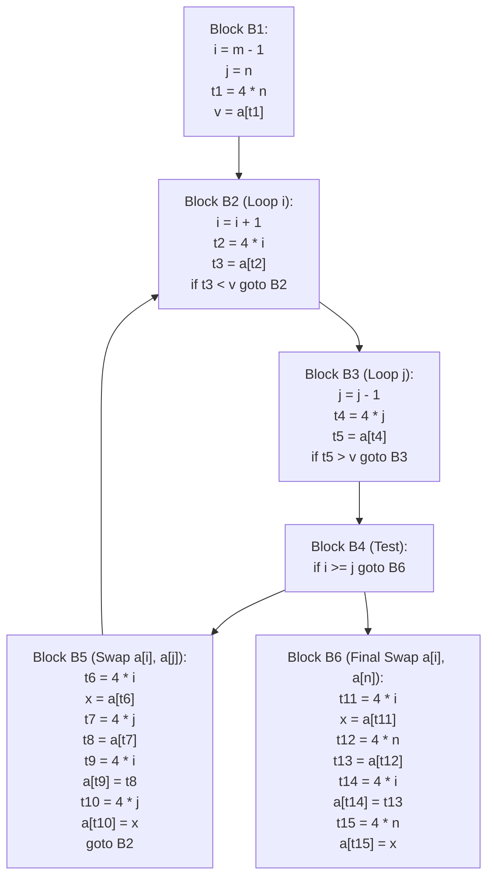
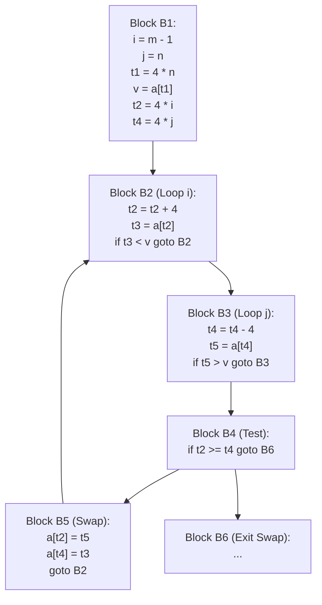

# Quicksort Partition Loop Complete Optimization Example

> 📖 **Reading Order:** Step 54 of 55 | **Module 6:** Machine-Independent Optimization  
> ◄ **Previous:** [[Loop Optimizations and Strength Reduction]] | ► **Next:** [[Problem — Quicksort Loop Induction Variable Strength Reduction]]

---

---

## Problem

Demonstrate and trace the compiler execution of Quicksort Partition Loop Complete Optimization Example.

---

## Given

- Grammar productions, semantic rules, basic blocks, or register sets as specified in the problem setup.

---

## Required

- Full step-by-step annotated tree derivation, TAC generation, DAG reduction, or register assignment trace.

---

## Understanding the Problem and Choosing the Method

Analyze the input program structure, identify the governing compiler phase algorithms, and simulate the execution step by step while maintaining all internal invariants.

---

## Solution

### The Classic Dragon Book / BUET Lecture Example

We trace the comprehensive, end-to-end optimization of the inner partitioning loop of Quicksort presented in the KMS lecture slides (Slides 538–565) and Dragon Book (Chapter 9, Figures 9.3–9.10).

### High-Level Source Code (C):
```c
void quicksort(int m, int n) {
    int i, j, v, x;
    if (n <= m) return;
    i = m - 1;
    j = n;
    v = a[n];
    while (1) {
        do i = i + 1; while (a[i] < v);
        do j = j - 1; while (a[j] > v);
        if (i >= j) break;
        x = a[i]; a[i] = a[j]; a[j] = x;
    }
    x = a[i]; a[i] = a[n]; a[n] = x;
    quicksort(m, j);
    quicksort(i + 1, n);
}
```

---
### Initial Unoptimized Flow Graph (TAC)

The unoptimized Three-Address Code consists of 6 basic blocks:



---
### Pass 1: Common Subexpression Elimination (CSE)

Notice the redundancies:
1. **Inside Block $B_5$:**
   - $t_6, t_9$ recalculate $4 * i$. But upon reaching $B_5$, $t_2 = 4 * i$ was already computed in $B_2$, and neither $i$ nor $t_2$ changed!
   - Similarly, $t_7, t_{10}$ recalculate $4 * j$. But $t_4 = 4 * j$ was computed in $B_3$!
   - Furthermore, $x = a[t_6]$ simply re-loads $a[t_2]$, which was already loaded into $t_3$ in $B_2$!
   - And $t_8 = a[t_7]$ re-loads $a[t_4]$, which was already loaded into $t_5$ in $B_3$!
2. **Inside Block $B_6$:**
   - $t_{11}, t_{14}$ compute $4 * i \to$ replace with $t_2$.
   - $t_{12}, t_{15}$ compute $4 * n \to$ replace with $t_1$.
   - $x = a[t_{11}] \to x = t_3$.

### Transformed Block $B_5$:
```
x = t3
a[t2] = t5
a[t4] = x
goto B2
```

---
### Pass 2: Copy Propagation and Dead Code Elimination

In Block $B_5$:
- `x = t3` is a copy statement.
- Substitute `t3` directly for `x`:
  ```
  a[t4] = t3
  ```
- Now variable `x` is never used! Delete `x = t3`.

### Streamlined Block $B_5$:
```
a[t2] = t5
a[t4] = t3
goto B2
```
Block $B_5$ was reduced from **9 instructions down to just 3 instructions**!

---
### Pass 3: Induction Variables and Strength Reduction

Now inspect the inner loops:
- In $B_2$: $i$ is a basic induction variable ($i = i + 1$).
  - $t_2 = 4 * i$ is a derived induction variable.
  - Multiplier is $4$, increment of $i$ is $1 \implies$ increment for $t_2$ is $4 \times 1 = 4$!
  - **Transform:** Initialize $t_2 = 4 * i$ in $B_1$. In $B_2$, replace $t_2 = 4 * i$ with:
    $$t_2 = t_2 + 4$$
- In $B_3$: $j$ is a basic induction variable ($j = j - 1$).
  - $t_4 = 4 * j$ is a derived induction variable.
  - Multiplier is $4$, decrement of $j$ is $-1 \implies$ decrement for $t_4$ is $4 \times (-1) = -4$!
  - **Transform:** Initialize $t_4 = 4 * j$ in $B_1$. In $B_3$, replace $t_4 = 4 * j$ with:
    $$t_4 = t_4 - 4$$

---
### Pass 4: Induction Variable Elimination

In Block $B_4$:
- The test was: `if i >= j goto B6`.
- Notice that:
  $$i \ge j \iff 4 * i \ge 4 * j \iff t_2 \ge t_4$$
- Transform the test in $B_4$ to:
  $$\text{if } t_2 \ge t_4 \text{ goto } B_6$$
- **The Payoff:** Variable $i$ and variable $j$ are now **never referenced anywhere in the entire loop ($B_2, B_3, B_4, B_5$)**!
- The instructions `i = i + 1` in $B_2$ and `j = j - 1` in $B_3$ are **completely deleted**!

---

---

## Result



### Performance Comparison:
- **Inner loop $B_2$:** Reduced from 4 instructions (with an expensive multiplication) to **3 instructions (pure addition and load)**.
- **Inner loop $B_3$:** Reduced from 4 instructions to **3 instructions**.
- **Loop body $B_5$:** Reduced from 9 instructions to **3 instructions**.
- **Memory accesses:** Cut by more than $50\%$.

---

---

## Why This Works

Every transformation maintains semantic program equivalence while optimizing instruction counts, memory foot-print, or register usage.

---

## Common Mistakes

- Incorrectly calculating stack frame offsets or TAC temporaries.
- Forgetting to spill registers when register demand exceeds hardware pool size.

---

## General Method

Extract the general procedure: parse/partition input, construct intermediate data structures, apply optimizations iteratively, and emit final code.

---

## Related Concepts

- [[Syntax-Directed Definitions and Translation Schemes]]
- [[Basic Blocks and Control Flow Graphs]]

---

## Sources

- **Lecture Slides:** [[cse309/01 - Sources/Lectures/KMS Merged.pdf|KMS Merged.pdf]], Chapter 9 (Slides 538–565).
- **Textbook:** Aho, Lam, Sethi, Ullman, *Compilers: Principles, Techniques, & Tools* (2nd Ed.), Section 9.1, Figures 9.3–9.10.
