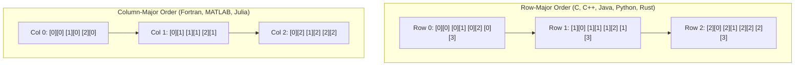

# Multi-Dimensional Array Addressing Formulas

> 📖 **Reading Order:** Step 13 of 55 | **Module 2:** Intermediate Code Generation  
> ◄ **Previous:** [[Type Expressions and Storage Layout]] | ► **Next:** [[Translation of Expressions and Array References]]

---

## The Question and Earlier Knowledge

How does a compiler map high-dimensional array references (such as `A[i][j]` or `A[i][j][k]`) down into linear physical byte memory addresses, and how can the emitted Three-Address Code compute these offsets using minimum runtime instructions?

Physical memory is a flat, one-dimensional array of bytes indexed from $0$ to $2^{64}-1$. The central obstacle is that high-level programmers conceptualize multi-dimensional matrices as 2D grids or 3D cubes. The compiler must squash this high-dimensional coordinate system into a flat memory ribbon while evaluating indexing expressions efficiently at runtime.

---

## Developing the Formula

In row-major order (used by C, C++, Java), arrays are stored row by contiguous row:
- In a 2D array $A[d_1][d_2]$ with element width $w$, each complete row consists of $d_2$ elements.
- To access element $A[i][j]$, we must skip $i$ full rows of size $d_2 \times w$, plus $j$ individual elements of size $w$.
- This gives the offset formula: $\text{Offset} = (i \times d_2 + j) \times w$.
- For $k$ dimensions, Horner's polynomial recurrence computes the offset incrementally without repetitive high-degree multiplications:
  $$\text{Offset} = ((\dots ((i_1 \times d_2 + i_2) \times d_3 + i_3) \dots) \times d_k + i_k) \times w$$

---

## Formula

$$\text{Address}(A[i][j]) = \text{base} + (i \times d_2 + j) \times w$$

$$\text{Address}(A[i_1][i_2][\dots][i_k]) = \text{base} + \left( \sum_{m=1}^k i_m \prod_{r=m+1}^k d_r \right) \times w$$

---

## Variables

| Symbol | Meaning |
|---|---|
| $\text{base}$ | Memory address of the very first element of array $A$ |
| $d_m$ | Declared capacity / size of the $m$-th dimension |
| $i_m$ | Array index along the $m$-th dimension ($0 \le i_m < d_m$) |
| $w$ | Width / byte size of a single array element |

---

## Conditions

- The array is stored in **Row-Major Order** (standard for C, C++, Java, Python numpy C-contiguous).
- Subscripts are 0-indexed; for arbitrary lower bounds $low_m$, replace $i_m$ with $(i_m - low_m)$.

---

## Intuition

### The Physical Reality: The 1D Memory Illusion

To feel how multi-dimensional array formulas work, you must confront the physical reality of computer hardware:

> **Physical RAM is a flat, 1-dimensional ribbon of consecutive byte addresses.**

There is no such thing as a 2D grid, a 3D cube, or an $N$-dimensional hypercube in silicon. Multi-dimensional arrays are a pure mathematical illusion created by the compiler.

When a programmer writes `A[i][j]` or `A[i][j][k]`, the compiler's job is to map that multi-dimensional coordinate onto a **single, flat 1D byte address** in linear RAM.

---
### 2D Array Layout: Squashing a Grid into a Ribbon

Consider a 2D array $A[n_1][n_2]$ with $n_1 = 3$ rows and $n_2 = 4$ columns.

```
Conceptual 2D Grid (3 rows x 4 columns):
            Col 0      Col 1      Col 2      Col 3
Row 0:    [0][0]     [0][1]     [0][2]     [0][3]
Row 1:    [1][0]     [1][1]     [1][2]     [1][3]
Row 2:    [2][0]     [2][1]     [2][2]     [2][3]
```

How do we squash this 2D sheet of paper into a 1-dimensional line of RAM? There are only two ways:



---

## Derivation

### Deriving the 2D Row-Major Formula

To locate element $A[i][j]$ in row-major layout:
1. **Preceding Rows:** Every preceding row $0, 1, \dots, i-1$ contains exactly $n_2$ elements. Skipping $i$ complete rows requires skipping $i \times n_2$ elements.
2. **Current Row Offset:** Within row $i$, element $A[i][j]$ is preceded by $j$ elements (indices $0, 1, \dots, j-1$).
3. **Total Element Offset:** The total number of elements preceding $A[i][j]$ is:
   $$\text{elements\_before} = i \times n_2 + j$$
4. **Byte Offset:** Multiplying by the element width $w$ gives the byte offset:
   $$\text{Offset} = (i \times n_2 + j) \times w$$
5. **Physical Memory Address:** Adding the base address yields:
   $$\text{Address}(A[i][j]) = \text{base} + (i \times n_2 + j) \times w$$

---

### Horner's Polynomial Recurrence (How Compilers Compute Fast)

Look closely at the 3D element expression:
$$i \cdot n_2 \cdot n_3 + j \cdot n_3 + k$$

If you factor out common multipliers, it collapses into a nested polynomial (**Horner's Rule**):
$$((i \times n_2 + j) \times n_3 + k)$$

Look at the structure! It is an incremental loop:
$$\text{offset}_1 = i$$
$$\text{offset}_2 = \text{offset}_1 \times n_2 + j$$
$$\text{offset}_3 = \text{offset}_2 \times n_3 + k$$
$$\text{Address} = \text{base} + \text{offset}_3 \times w$$

### The General $k$-Dimensional Formula:
For any $k$-dimensional array $A[n_1][n_2]\dots[n_k]$ with indices $i_1, i_2, \dots, i_k$:
$$\mathbf{\text{Address} = \text{base} + \left( \sum_{j=1}^k i_j \prod_{m=j+1}^k n_m \right) \times w}$$

The compiler evaluates this in a simple linear loop during parsing, multiplying by the next dimension size and adding the next index at each grammatical level!

---

## Example

Consider array `int A[2][3]` with $w = 4$ bytes starting at base address $1000$:
To access `A[1][2]`:
$$\text{Offset} = (1 \times 3 + 2) \times 4 = (3 + 2) \times 4 = 20 \text{ bytes}$$
$$\text{Address} = 1000 + 20 = 1020$$
Verified against manual memory walk: Row 0 spans 1000-1011 (12 bytes), A[1][0] at 1012, A[1][1] at 1016, A[1][2] at 1020.

---

## Common Mistakes

- Confusing **Row-Major Order** with **Column-Major Order** (used in Fortran, MATLAB, R): In column-major, the first index varies fastest, yielding offset $(j \times d_1 + i) \times w$.
- Multiplying the outer index by the wrong dimension capacity (e.g. using $d_1$ instead of $d_2$).

---

## Related Concepts

- [[Type Expressions and Storage Layout]]
- [[Translation of Expressions and Array References]]

---

## Prerequisites

- [[Type Expressions and Storage Layout]]

---

## Problems

- [[Problem — Array Reference Three-Address Code Generation]]

---

## Sources

- [[cse309/01 - Sources/Lectures/KMS Merged.pdf|KMS Merged.pdf]] (Lecture 16, Slides 3–11)
- Alfred V. Aho, Monica S. Lam, Ravi Sethi, Jeffrey D. Ullman, *Compilers: Principles, Techniques, & Tools* (2nd Edition), Section 6.4.3.
