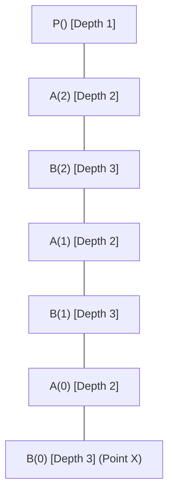

# Problem — Activation Record and Display Table Tracing

> 📖 **Reading Order:** Step 31 of 55 | **Module 3:** Run-Time Environments  
> ◄ **Previous:** [[Garbage Collection Trace and Compaction Example]] | ► **Next:** [[Code Generation Issues and Target Machine Architecture]]

---

## Problem

Consider the following recursive, mutually invoking Pascal program featuring nested procedure declarations:

```pascal
program P;                         { Lexical Depth 1 }
    var a: integer;

    procedure A(i: integer);       { Lexical Depth 2 }
        var b: integer;

        procedure B(j: integer);   { Lexical Depth 3 }
            var c: integer;
        begin
            if j > 0 then
                A(j - 1)
            else
                c := a + b;        { POINT X }
        end;

    begin { Body of A }
        B(i);
    end;

begin { Body of P }
    A(2);
end.
```

### The Examination Questions:
1. **Activation Tree Construction:** Construct the complete **Activation Tree** of this program up to the instant execution reaches **Point X**.
2. **Physical Call Stack & Pointer Dissection:** For the physical call stack at Point X:
   - Enumerate all activation records currently alive from stack bottom to stack top.
   - For every activation record, identify its exact **Dynamic Link (Control Link)** and **Static Link (Access Link)**.
   - Formally explain why $AR_{A(0)}$'s static link points to $AR_P$ rather than $AR_{B(1)}$.
3. **Display Array Simulation:**
   - Trace the state of the **Display Array** at each call step up to Point X.
   - Explain how the statement `c := a + b` at Point X is executed in strictly $O(1)$ time using the Display.

---

## Solution

Every recursive call creates another frame, even when the lexical procedure name is the same. Follow the dynamic sequence P→A(2)→B(2)→A(1)→B(1)→A(0)→B(0). At Point X, these calls are still active.

For each frame, ask two questions separately. Who called it? That gives the dynamic link. In whose declaration environment was its procedure defined? That gives the static link. A(0) is dynamically called by B(1), but A is declared inside P, so A(0)'s static link leads to P. B(0)'s static link leads to A(0).

The display entries are replaced on entry and saved for restoration, as explained in [[Non-Local Variable Access in Static and Dynamic Scopes]]. At Point X, resolving b must select A(0)'s environment, while resolving a selects P's.

This is an environment-resolution exercise. The source leaves some variable values unspecified, so locating their storage does not supply numeric values for a+b.

### Part 1: Activation Tree Derivation

Let us trace the dynamic call sequence:
1. Program starts: `P()` is activated at depth 1.
2. `P()` invokes `A(2)` at depth 2.
3. `A(2)` invokes its local child `B(2)` at depth 3.
4. `B(2)` checks $j = 2 > 0$: invokes sibling/parent-level `A(1)` at depth 2.
5. `A(1)` invokes its local child `B(1)` at depth 3.
6. `B(1)` checks $j = 1 > 0$: invokes `A(0)` at depth 2.
7. `A(0)` invokes its local child `B(0)` at depth 3.
8. `B(0)` checks $j = 0 \ngtr 0$: executes `else` clause $\implies$ **Point X** is reached!



---

### Part 2: The Physical Call Stack at Point X

Let the base frame pointer for each activation record be denoted as $AR_{\text{name}}$:

```
Physical Stack Memory at Point X:
┌─────────────────────────────────┐ ◄── High Memory (Stack Bottom)
│ Frame of P (Depth 1)            │ ◄── Dynamic Link: null | Static Link: null
├─────────────────────────────────┤
│ Frame of A(2) (Depth 2)         │ ◄── Dynamic Link: AR_P    | Static Link: AR_P
├─────────────────────────────────┤
│ Frame of B(2) (Depth 3)         │ ◄── Dynamic Link: AR_A(2) | Static Link: AR_A(2)
├─────────────────────────────────┤
│ Frame of A(1) (Depth 2)         │ ◄── Dynamic Link: AR_B(2) | Static Link: AR_P
├─────────────────────────────────┤
│ Frame of B(1) (Depth 3)         │ ◄── Dynamic Link: AR_A(1) | Static Link: AR_A(1)
├─────────────────────────────────┤
│ Frame of A(0) (Depth 2)         │ ◄── Dynamic Link: AR_B(1) | Static Link: AR_P
├─────────────────────────────────┤
│ Frame of B(0) (Depth 3)         │ ◄── Dynamic Link: AR_A(0) | Static Link: AR_A(0)
└─────────────────────────────────┘ ◄── Low Memory / Stack Top ($sp, $fp)
```

#### Detailed Frame Linkage Table:

| Frame (Top to Bottom) | Depth | Dynamic Link (Caller) | Static Link (Lexical Enclosing Parent) |
| :--- | :---: | :--- | :--- |
| **$AR_{B(0)}$** (Stack Top) | 3 | $AR_{A(0)}$ | $AR_{A(0)}$ (Declared inside $A$) |
| **$AR_{A(0)}$** | 2 | $AR_{B(1)}$ | **$AR_{P}$** (Declared inside $P$!) |
| **$AR_{B(1)}$** | 3 | $AR_{A(1)}$ | $AR_{A(1)}$ (Declared inside $A$) |
| **$AR_{A(1)}$** | 2 | $AR_{B(2)}$ | **$AR_{P}$** (Declared inside $P$!) |
| **$AR_{B(2)}$** | 3 | $AR_{A(2)}$ | $AR_{A(2)}$ (Declared inside $A$) |
| **$AR_{A(2)}$** | 2 | $AR_{P}$ | **$AR_{P}$** (Declared inside $P$!) |
| **$AR_{P}$** (Stack Bottom) | 1 | `null` | `null` |

---

### Part 3: Deep Dive: Why Does $AR_{A(0)}$'s Static Link Point to $AR_P$?

> [!CAUTION] The Universal Exam Trap
> Over 60% of students mistakenly set the static link of $AR_{A(0)}$ to $AR_{B(1)}$ because $B(1)$ was the function that physically called $A(0)$!
> This is a fatal conceptual confusion between Dynamic and Static scope:
> - **The Dynamic Link** tracks runtime call history: Who called me? $\implies B(1)$ called $A(0)$. So the dynamic link points to $B(1)$.
> - **The Static Link** tracks source code nesting: Where was I defined in the text? $\implies$ Look at the source code: `procedure A` is defined **directly inside `program P`**. It is NOT defined inside $B$!
> - Therefore, procedure $A$'s lexical enclosing parent is **$P$**. Every single activation of $A$ ($A(2), A(1), A(0)$) MUST have its static link point to $AR_P$, regardless of who called it!

---

### Part 4: Display Array Simulation

Because the maximum lexical nesting depth in the program text is 3, the compiler allocates a Display array of size 3:
$$\text{Display}[1 \dots 3]$$

#### Trace of Display Entries Across the Call Sequence:

1. **At `P` entry:**  
   $\text{Display} = [ AR_P, \text{null}, \text{null} ]$
2. **At `A(2)` entry (Depth 2):**  
   $AR_{A(2)}.\text{saved} = \text{Display}[2] = \text{null}$.  
   $\text{Display} = [ AR_P, AR_{A(2)}, \text{null} ]$
3. **At `B(2)` entry (Depth 3):**  
   $AR_{B(2)}.\text{saved} = \text{Display}[3] = \text{null}$.  
   $\text{Display} = [ AR_P, AR_{A(2)}, AR_{B(2)} ]$
4. **At `A(1)` entry (Depth 2):**  
   $AR_{A(1)}.\text{saved} = \text{Display}[2] = AR_{A(2)}$.  
   $\text{Display} = [ AR_P, AR_{A(1)}, AR_{B(2)} ]$
5. **At `B(1)` entry (Depth 3):**  
   $AR_{B(1)}.\text{saved} = \text{Display}[3] = AR_{B(2)}$.  
   $\text{Display} = [ AR_P, AR_{A(1)}, AR_{B(1)} ]$
6. **At `A(0)` entry (Depth 2):**  
   $AR_{A(0)}.\text{saved} = \text{Display}[2] = AR_{A(1)}$.  
   $\text{Display} = [ AR_P, AR_{A(0)}, AR_{B(1)} ]$
7. **At `B(0)` entry (Depth 3) [Point X]:**  
   $AR_{B(0)}.\text{saved} = \text{Display}[3] = AR_{B(1)}$.  
   $$\mathbf{\text{Display} = [ AR_P, \; AR_{A(0)}, \; AR_{B(0)} ]}$$

---

### Part 5: Resolving $c := a + b$ at Point X via the Display

At Point X inside $B(0)$:
1. **$c$ is local to $B(0)$ (Lexical Depth 3):**
   $$\text{Address}(c) = \text{Display}[3] + \text{offset}(c) = AR_{B(0)} + \text{offset}(c)$$
2. **$b$ is non-local, declared in $A$ (Lexical Depth 2):**
   $$\text{Address}(b) = \text{Display}[2] + \text{offset}(b) = AR_{A(0)} + \text{offset}(b)$$
   Notice that $\text{Display}[2]$ points to $AR_{A(0)}$, the activation of $A$ that actually created this instance of $B$!
3. **$a$ is non-local, declared in $P$ (Lexical Depth 1):**
   $$\text{Address}(a) = \text{Display}[1] + \text{offset}(a) = AR_P + \text{offset}(a)$$

**Conclusion:** All three variables are accessed in **strictly $O(1)$ constant time** using 1 table lookup and 1 offset addition, completely bypassing the 7-frame stack traversal!

---

## What to carry forward

Lexical depth does not grow with recursion depth. A correct trace shows all dynamic frames and only the current display choice at each lexical depth. Saved entries explain how earlier choices return as calls unwind.

## Related notes

- [[Non-Local Variable Access in Static and Dynamic Scopes]]

## Source

- **Lecture Slides:** [[cse309/01 - Sources/Lectures/KMS Merged.pdf|KMS Merged.pdf]], Chapter 7 (Slides 211–229).
- **Textbook:** Aho, Lam, Sethi, Ullman, *Compilers: Principles, Techniques, & Tools* (2nd Ed.), Section 7.3 (Access to Nonlocal Data on the Stack).
