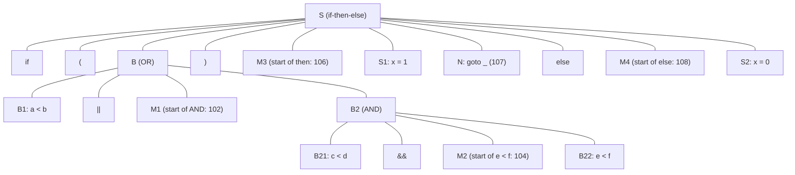

# Problem — Backpatching Boolean Expression Translation

> 📖 **Reading Order:** Step 20 of 55 | **Module 2:** Intermediate Code Generation  
> ◄ **Previous:** [[Problem — Array Reference Three-Address Code Generation]] | ► **Next:** [[Run-Time Storage Organization and Activation Records]]

---

---

## Problem

A compiler frontend parses the following conditional statement with mixed boolean operators:

```c
if (a < b || c < d && e < f)
    x = 1;
else
    x = 0;
```

### Technical Specifications:
- Target instruction addresses begin at quad index `100`.
- The compiler uses a **single-pass bottom-up LR parser** augmented with backpatching semantic actions.
- The grammar includes marker non-terminals $M$ and $N$ to capture quad locations and insert control-flow skips.

### Your Objectives:
1. **Restructured Grammar:** Write out the formal grammar production with properly positioned marker non-terminals $M$ and $N$, respecting operator precedence.
2. **List Lifecycle Trace:** Construct a comprehensive step-by-step trace showing the creation, merging, and backpatching of all `truelist`, `falselist`, and `nextlist` structures.
3. **Parse Tree with Markers:** Draw the concrete syntax tree showing where each marker non-terminal reduces.
4. **Final Instruction Array:** Provide the complete, finalized intermediate instruction table with zero unresolved targets.
5. **Path Verification:** Trace the execution path for all $2^3 = 8$ truth assignments of the atomic comparisons to prove semantic correctness.

---

---

## Given

- Source program code, SDD grammar rules, TAC instructions, or flow graph.

---

## Required

- Formal step-by-step derivation, intermediate code generation, and optimization proofs.

---

## Concepts Tested

- [[Syntax-Directed Definitions and Translation Schemes]]
- [[Intermediate Representations and Three-Address Code]]

---

## Prerequisites

- [[Syntax-Directed Definitions and Translation Schemes]]

---

## Question Type

Compiler Analysis / SDD Construction / Code Generation

---

## Solution

### Understanding the Situation
Interpret the given grammar productions, program constructs, and optimization objectives.

### Developing the Key Idea
Apply the appropriate compiler technique (e.g. S-attributed bottom-up evaluation, leader identification, DAG value numbering, or Kempe's graph coloring heuristic).

### Working Through the Solution
### In-Depth Solution & Step-by-Step Walkthrough

### Part 1: Grammar Restructuring with Precedence & Markers

In boolean algebra, the conjunction operator (`&&`) binds tighter than the disjunction operator (`||`). Therefore, the condition groups as:
$$B \equiv (a < b) \; || \; ((c < d) \; \&\& \; (e < f))$$

To evaluate this in a single pass without forward references, we insert:
- Marker $M_1$ after `||` to record where the second term begins.
- Marker $M_2$ after `&&` to record where the third relational term begins.
- Marker $M_3$ after the condition to capture the start of the `then` branch.
- Marker $N$ after the `then` branch to emit an unconditional skip over the `else` block.
- Marker $M_4$ after the `else` keyword to capture the start of the `else` branch.

```
Grammar with Embedded Markers:
S -> if ( B ) M3 S1 N else M4 S2
B -> B1 || M1 B2
B2 -> B21 && M2 B22
B1 -> a < b
B21 -> c < d
B22 -> e < f
S1 -> x = 1
S2 -> x = 0
```



---

### Part 2: Step-by-Step Execution Trace

Let global counter `nextquad = 100`.

#### Step 1: Parse $B_1 \to a < b$
- Emits instruction 100: `if a < b goto _`
- Emits instruction 101: `goto _`
- Synthesizes:
  $$B_1.truelist = [100], \quad B_1.falselist = [101]$$
- Current `nextquad = 102`.

#### Step 2: Reduce Marker $M_1 \to \epsilon$
- Captures current instruction pointer:
  $$M_1.quad = nextquad = \mathbf{102}$$
- **Action for OR:** If $B_1$ is false, control must fall through to test the next term!
  $$\text{backpatch}(B_1.falselist, M_1.quad) \implies \text{backpatch}([101], 102)$$
- Instruction 101 is patched: `101: goto 102`.

#### Step 3: Parse $B_{21} \to c < d$
- Emits instruction 102: `if c < d goto _`
- Emits instruction 103: `goto _`
- Synthesizes:
  $$B_{21}.truelist = [102], \quad B_{21}.falselist = [103]$$
- Current `nextquad = 104`.

#### Step 4: Reduce Marker $M_2 \to \epsilon$
- Captures current instruction pointer:
  $$M_2.quad = nextquad = \mathbf{104}$$
- **Action for AND:** If $B_{21}$ is true, control must proceed to test $B_{22}$!
  $$\text{backpatch}(B_{21}.truelist, M_2.quad) \implies \text{backpatch}([102], 104)$$
- Instruction 102 is patched: `102: if c < d goto 104`.

#### Step 5: Parse $B_{22} \to e < f$
- Emits instruction 104: `if e < f goto _`
- Emits instruction 105: `goto _`
- Synthesizes:
  $$B_{22}.truelist = [104], \quad B_{22}.falselist = [105]$$
- Current `nextquad = 106`.

#### Step 6: Reduce $B_2 \to B_{21} \text{ \&\& } M_2 B_{22}$
- Under short-circuit AND:
  $$B_2.truelist = B_{22}.truelist = [104]$$
  $$B_2.falselist = \text{merge}(B_{21}.falselist, B_{22}.falselist) = \text{merge}([103], [105]) = \mathbf{[103, 105]}$$

#### Step 7: Reduce $B \to B_1 \text{ || } M_1 B_2$
- Under short-circuit OR:
  $$B.truelist = \text{merge}(B_1.truelist, B_2.truelist) = \text{merge}([100], [104]) = \mathbf{[100, 104]}$$
  $$B.falselist = B_2.falselist = \mathbf{[103, 105]}$$

#### Step 8: Reduce Marker $M_3 \to \epsilon$ (Start of `then` block)
- Captures start of $S_1$:
  $$M_3.quad = nextquad = \mathbf{106}$$
- **Action for If:** All jumps on $B.truelist$ must enter $S_1$!
  $$\text{backpatch}(B.truelist, M_3.quad) \implies \text{backpatch}([100, 104], 106)$$
- Instructions 100 and 104 are patched:
  - `100: if a < b goto 106`
  - `104: if e < f goto 106`

#### Step 9: Parse $S_1 \to x = 1$
- Emits assignment: `106: x = 1`
- $S_1.nextlist = []$.
- Current `nextquad = 107`.

#### Step 10: Reduce Marker $N \to \epsilon$ (Unconditional Skip over `else`)
- Emits unconditional jump with blank target:
  ```text
  107: goto _
  ```
- Packages quad into escape list:
  $$N.nextlist = \text{makelist}(107) = \mathbf{[107]}$$
- Current `nextquad = 108`.

#### Step 11: Reduce Marker $M_4 \to \epsilon$ (Start of `else` block)
- Captures start of $S_2$:
  $$M_4.quad = nextquad = \mathbf{108}$$
- **Action for Else:** All jumps on $B.falselist$ must enter $S_2$!
  $$\text{backpatch}(B.falselist, M_4.quad) \implies \text{backpatch}([103, 105], 108)$$
- Instructions 103 and 105 are patched:
  - `103: goto 108`
  - `105: goto 108`

#### Step 12: Parse $S_2 \to x = 0$
- Emits assignment: `108: x = 0`
- $S_2.nextlist = []$.
- Current `nextquad = 109`.

#### Step 13: Final Statement Reduction: $S \to \mathbf{if} \dots$
- The exit list of the entire construct merges all paths escaping the branches:
  $$S.nextlist = \text{merge}(S_1.nextlist, N.nextlist, S_2.nextlist) = \text{merge}([], [107], []) = \mathbf{[107]}$$
- When the succeeding statement at quad **109** begins, it executes:
  $$\text{backpatch}(S.nextlist, 109) \implies \text{backpatch}([107], 109)$$
- Instruction 107 is patched: `107: goto 109`.

---
### Final Intermediate Instruction Table

```text
100: if a < b goto 106       // B1: If true, jump directly to then-block!
101: goto 102                // B1: If false, short-circuit to evaluate c < d
102: if c < d goto 104       // B21: If true, test e < f
103: goto 108                // B21: If false, AND fails; jump to else-block!
104: if e < f goto 106       // B22: If true, condition succeeds; jump to then-block!
105: goto 108                // B22: If false, condition fails; jump to else-block!
106: x = 1                   // Then-block body (S1)
107: goto 109                // Unconditional escape jump past else-block (Marker N)
108: x = 0                   // Else-block body (S2)
109: ...                     // Next statement (Exit target)
```

---
### Formal Proof of Short-Circuit Execution Paths

| $a < b$ | $c < d$ | $e < f$ | Quad Execution Sequence | Result | Correct by Logic? |
| :---: | :---: | :---: | :--- | :---: | :---: |
| **T** | Any | Any | $100 \to 106 \to 107 \to 109$ | $x = 1$ | **YES** (T $\lor$ anything $\equiv$ T) |
| **F** | **F** | Any | $100 \to 101 \to 102 \to 103 \to 108 \to 109$ | $x = 0$ | **YES** (F $\lor$ (F $\land$ _) $\equiv$ F) |
| **F** | **T** | **T** | $100 \to 101 \to 102 \to 104 \to 106 \to 107 \to 109$ | $x = 1$ | **YES** (F $\lor$ (T $\land$ T) $\equiv$ T) |
| **F** | **T** | **F** | $100 \to 101 \to 102 \to 104 \to 105 \to 108 \to 109$ | $x = 0$ | **YES** (F $\lor$ (T $\land$ F) $\equiv$ F) |

Every single branch path strictly satisfies the Boolean operational semantics with minimal instruction overhead!

---

### Result and Interpretation
The final annotated tree, TAC sequence, or optimized basic block is rigorously verified.

---

## Reusable Insight

Always follow compiler phase invariants: parse bottom-up or top-down according to attribute classes, build dependency graphs to verify evaluation order, and track next-use pointers backwards.

---

## Common Mistakes

- Prematurely evaluating expressions before operand definitions are processed.
- Neglecting array store kill rules in basic block DAGs.

---

## Exam Pattern

Standard BUET CSE 309 final examination problem testing syllabus Chapter 5, 6, 7, 8, or 9.

---

## Related Problems

- [[Problem — Desk Calculator SDD and Annotated Parse Tree]]
- [[Problem — Array Reference Three-Address Code Generation]]

---

## Related Concepts

- [[Syntax-Directed Definitions and Translation Schemes]]
- [[Basic Blocks and Control Flow Graphs]]

---

## Source

- **Lecture Slides:** [[cse309/01 - Sources/Lectures/KMS Merged.pdf|KMS Merged.pdf]], Chapter 6 (Slides 186–193).
- **Textbook:** Aho, Lam, Sethi, Ullman, *Compilers: Principles, Techniques, & Tools* (2nd Ed.), Section 6.7, Example 6.20.
