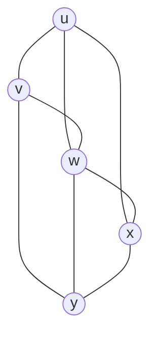

# Problem — Chaitin Graph Coloring Register Allocation

> 📖 **Reading Order:** Step 50 of 55 | **Module 5:** Register Allocation  
> ◄ **Previous:** [[Problem — Linear Scan Register Allocation Simulation]] | ► **Next:** [[Principal Sources of Code Optimization]]

---

## Problem

Consider the following Register Interference Graph (RIG) for 5 variables $\{ u, v, w, x, y \}$ in a compiler back-end:

```
Edges:
(u, v), (u, w), (u, x)
(v, w), (v, y)
(w, x), (w, y)
(x, y)
```

The target machine architecture has **$K = 3$ hardware registers**: $\{ R_1, R_2, R_3 \}$.

### Questions:
1. Compute the initial degree of each node in the graph.
2. Apply **Chaitin's Graph Coloring Algorithm** step-by-step:
   - Identify whether a spill candidate is required.
   - Show the state of the coloring stack after the Simplify phase.
   - Show the color assignment during the Select phase.
3. If an actual spill occurs, explain the exact code modifications (loads and stores) the compiler must insert into the intermediate representation.

---

## Solution

The graph initially has no node of degree below three, but that does not establish that three colors are impossible. Simplification's sufficient condition has stalled; an optimistic algorithm can remove a candidate and try to color it later.

Use [[Register Interference Graphs and Graph Coloring Principles]] to separate those claims. Provisional removal reduces neighbor degrees, enabling the rest of the stack to be built. On selection, pop nodes and forbid only the colors actually used by their already colored neighbors.

A node with many neighbors can still find a color if several neighbors share colors. That is why the degree bound is sufficient for easy insertion but not necessary for successful insertion. The example exposes precisely this gap.

Distinguish [[Chaitin's Graph Coloring Register Allocation Algorithm]] variants: optimistic selection may rescue the candidate, whereas an eager spill policy can rewrite it immediately. State which policy the solution uses before interpreting the result.

### Part 1: Initial Graph Degrees



- $\text{degree}(u) = 3$ (connected to $v, w, x$)
- $\text{degree}(v) = 3$ (connected to $u, w, y$)
- $\text{degree}(w) = 4$ (connected to $u, v, x, y$)
- $\text{degree}(x) = 3$ (connected to $u, w, y$)
- $\text{degree}(y) = 3$ (connected to $v, w, x$)

---

### Part 2: Chaitin's Algorithm ($K = 3$)

#### Step 1: Simplify Phase Check
We search for any node with:
$$\text{degree} < K = 3$$
- Notice that all 5 nodes have degree $\ge 3$ ($\text{degree}(w) = 4$, and $u, v, x, y$ have degree $3$).
- **No node satisfies Kempe's rule!**

#### Step 2: Spill Candidate Selection
The compiler must select a spill candidate using Chaitin's metric:
$$\text{Metric}(z) = \frac{\text{SpillCost}(z)}{\text{degree}(z)}$$
Assuming equal static costs:
- Node $w$ has the highest degree ($4$), minimizing $\frac{\text{Cost}}{\text{degree}} = \frac{1}{4} = 0.25$.
- **Node $w$ is chosen as the Spill Candidate!**
- Remove $w$ and its incident edges from the graph.

#### Step 3: Resume Simplification on $G - \{ w \}$
With $w$ removed, the degrees of all its neighbors decrease by 1:
- $\text{degree}(u) = 3 - 1 = 2 < 3$
- $\text{degree}(v) = 3 - 1 = 2 < 3$
- $\text{degree}(x) = 3 - 1 = 2 < 3$
- $\text{degree}(y) = 3 - 1 = 2 < 3$

Now **every single remaining node has degree $< 3$!**
1. Remove $u$: push $u$ to stack.
2. Remove $v$: push $v$ to stack.
3. Remove $x$: push $x$ to stack.
4. Remove $y$: push $y$ to stack.

**Coloring Stack (Bottom to Top):**
$$\text{Stack} = [ \; w \text{ (spill candidate)}, \; u, \; v, \; x, \; y \; ]$$

---

#### Step 4: Select Phase (Coloring)

We pop nodes in reverse order:

1. **Pop $y$:** No neighbors colored yet $\implies$ **Color($y$) = $R_1$**.
2. **Pop $x$:** Neighbor is $y$ ($R_1$) $\implies$ **Color($x$) = $R_2$**.
3. **Pop $v$:** Neighbor is $y$ ($R_1$) $\implies$ **Color($v$) = $R_2$** (can share $R_2$ with $x$ since $(v, x) \notin E$).
4. **Pop $u$:** Neighbors are $v$ ($R_2$) and $x$ ($R_2$) $\implies$ **Color($u$) = $R_1$** (can share $R_1$ with $y$ since $(u, y) \notin E$).
5. **Pop Spill Candidate $w$:**
   - Neighbors of $w$ in original graph: $\{ u, v, x, y \}$.
   - Inspect colors of neighbors:
     - $u$: $R_1$
     - $y$: $R_1$
     - $v$: $R_2$
     - $x$: $R_2$
   - Total colors consumed by neighbors of $w$: $\{ R_1, R_2 \}$!
   - Color $R_3$ is **COMPLETELY FREE**!
   - **Color($w$) = $R_3$!**

> [!IMPORTANT] The Optimistic Coloring Triumph!
> Although $w$ had degree $4 \ge 3$ and was selected as a spill candidate, **no actual spill occurred**! Because its neighbors ended up sharing colors ($u$ and $y$ shared $R_1$; $v$ and $x$ shared $R_2$), a color remained open for $w$. This demonstrates why modern compilers (Briggs optimistic coloring) push spill candidates to the stack instead of immediately emitting spill code!

---
### Final Physical Register Allocation

| Variable | Assigned Register |
| :---: | :---: |
| **$u$** | **$R_1$** |
| **$v$** | **$R_2$** |
| **$w$** | **$R_3$** |
| **$x$** | **$R_2$** |
| **$y$** | **$R_1$** |

Zero spills! All 5 variables are colored with 3 registers.

---

## What to carry forward

A complete legal coloring, checked against every edge, is a certificate of colorability. Choosing a candidate is not a certificate of uncolorability. If spilling occurs, show how loads/stores and new live ranges replace the original range.

## Related notes

- [[Register Interference Graphs and Graph Coloring Principles]]
- [[Chaitin's Graph Coloring Register Allocation Algorithm]]

## Source

- **Lecture Slides:** [[cse309/01 - Sources/Lectures/KMS Merged.pdf|KMS Merged.pdf]], Register Allocation (Slides 444–531).
- **Textbook / Papers:** Chaitin et al., 1981; Briggs et al., "Improvements to Graph Coloring Register Allocation", ACM TOPLAS 1994.
