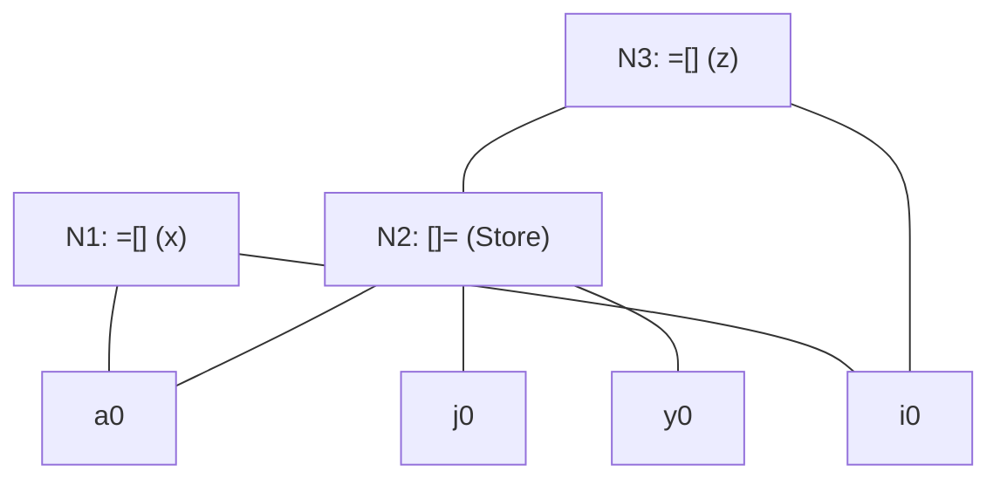
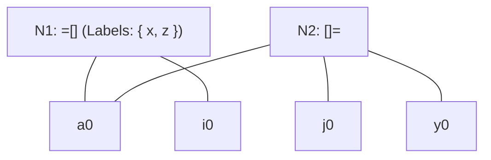

# Problem — DAG Optimization of Basic Block with Array Store

> 📖 **Reading Order:** Step 42 of 55 | **Module 4:** Code Generation  
> ◄ **Previous:** [[Problem — Basic Block Partitioning and Next-Use Table]] | ► **Next:** [[Live Ranges and Live Intervals in Register Allocation]]

---

---

## Problem

Consider the following basic block containing array operations:

```
(1) x = a[i]
(2) a[j] = y
(3) z = a[i]
```

### Questions:
1. Explain why it is **incorrect** in general to eliminate statement (3) by reusing the value of `x` computed in statement (1).
2. Construct the DAG representation of this basic block adhering to the compiler rules for array load (`=[]`) and array store (`[]=`) operations.
3. Under what specific condition can the compiler optimize away statement (3)? Show the resulting simplified DAG under that condition.

---

---

## Given

- Source program code, SDD grammar rules, TAC instructions, or flow graph.

---

## Required

- Formal step-by-step derivation, intermediate code generation, and optimization proofs.

---

## Concepts Tested

- [[Syntax-Directed Definitions and Translation Schemes]]
- [[Intermediate Representations and Three-Address Code]]

---

## Prerequisites

- [[Syntax-Directed Definitions and Translation Schemes]]

---

## Question Type

Compiler Analysis / SDD Construction / Code Generation

---

## Solution

### Understanding the Situation
Interpret the given grammar productions, program constructs, and optimization objectives.

### Developing the Key Idea
Apply the appropriate compiler technique (e.g. S-attributed bottom-up evaluation, leader identification, DAG value numbering, or Kempe's graph coloring heuristic).

### Working Through the Solution
### Step-by-Step Solution

### Part 1: Why Reusing `x` is Semantically Unsound
In statement (2), the assignment `a[j] = y` modifies an element of array `a`.
- If the runtime indices are equal ($i == j$), statement (2) overwrites the value of `a[i]` with $y$.
- When statement (3) `z = a[i]` executes, the true value of `z` must be $y$, **NOT** the old value of `x`!
- Therefore, without proving $i \ne j$, reusing `x` introduces a fatal data-corruption bug.

---

### Part 2: DAG Construction with Array Store Rules

In a compiler DAG:
1. **Statement (1) `x = a[i]`:**
   - Create leaf nodes $a_0$ and $i_0$.
   - Create load node $N_1 = \text{'=[]'}(a_0, i_0)$.
   - Attach label `x` to $N_1$.
2. **Statement (2) `a[j] = y`:**
   - Create leaf nodes $j_0$ and $y_0$.
   - Create store node $N_2 = \text{'[]='}(a_0, j_0, y_0)$.
   - Node $N_2$ has 3 children: array $a_0$, index $j_0$, and value $y_0$.
   - **The Kill Effect:** $N_2$ represents a new version of array $a$. Any subsequent access to $a$ must depend on $N_2$!
3. **Statement (3) `z = a[i]`:**
   - The array operand is now the modified array represented by node $N_2$.
   - Create new load node $N_3 = \text{'=[]'}(N_2, i_0)$.
   - Attach label `z` to $N_3$.



Notice that $N_3$ takes $N_2$ as its array parent, perfectly preserving the sequential dependence!

---

### Part 3: Compile-Time Index Disambiguation

If the compiler can prove at compile time that $i$ and $j$ refer to distinct constants (e.g., `i = 4` and `j = 8`), then $i \ne j$ is guaranteed.

Under this condition:
- The write `a[j] = y` cannot alter `a[i]`.
- The load `a[i]` at statement (3) is an identical subexpression to statement (1).
- Node $N_3$ is eliminated, and label `z` is attached directly to Node $N_1$:



### Reassembled Optimized Code (when $i \ne j$ is guaranteed):
```
x = a[i]
a[j] = y
z = x
```

---

### Result and Interpretation
The final annotated tree, TAC sequence, or optimized basic block is rigorously verified.

---

## Reusable Insight

Always follow compiler phase invariants: parse bottom-up or top-down according to attribute classes, build dependency graphs to verify evaluation order, and track next-use pointers backwards.

---

## Common Mistakes

- Prematurely evaluating expressions before operand definitions are processed.
- Neglecting array store kill rules in basic block DAGs.

---

## Exam Pattern

Standard BUET CSE 309 final examination problem testing syllabus Chapter 5, 6, 7, 8, or 9.

---

## Related Problems

- [[Problem — Desk Calculator SDD and Annotated Parse Tree]]
- [[Problem — Array Reference Three-Address Code Generation]]

---

## Related Concepts

- [[Syntax-Directed Definitions and Translation Schemes]]
- [[Basic Blocks and Control Flow Graphs]]

---

## Source

- **Lecture Slides:** [[cse309/01 - Sources/Lectures/KMS Merged.pdf|KMS Merged.pdf]], Chapter 8 (Slides 341–343).
- **Textbook:** Aho, Lam, Sethi, Ullman, *Compilers: Principles, Techniques, & Tools* (2nd Ed.), Section 8.5.2.
