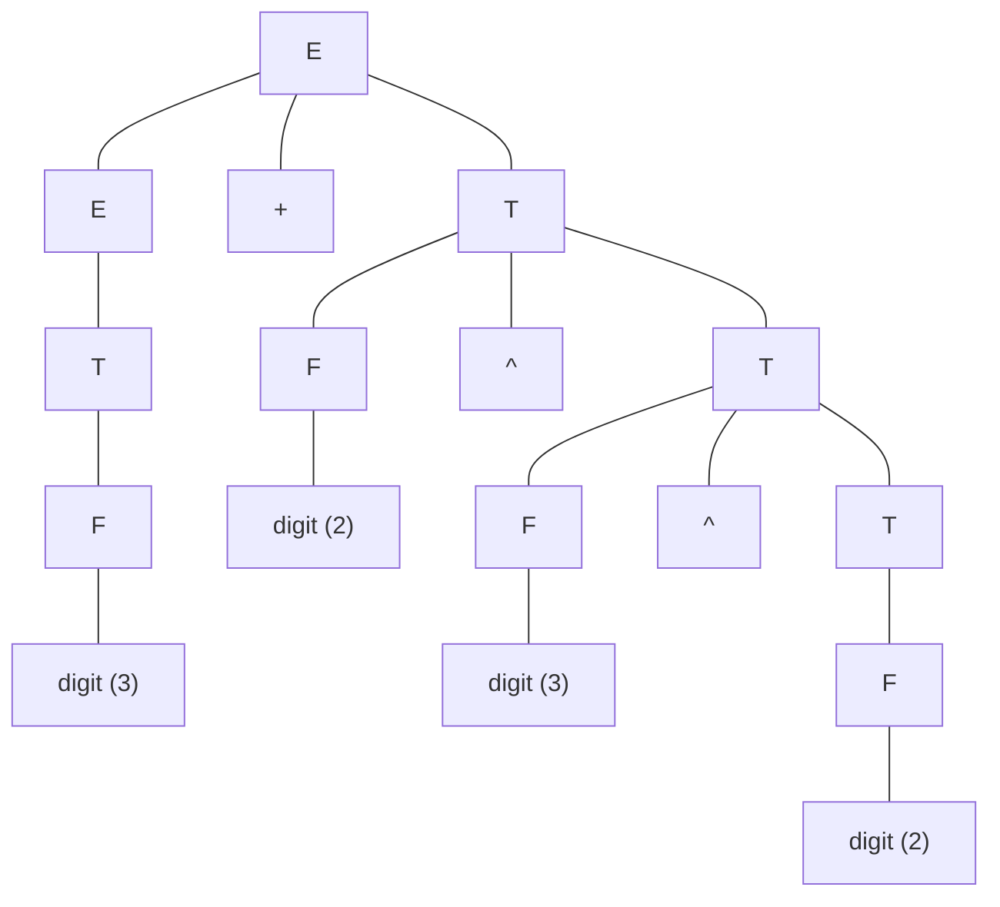
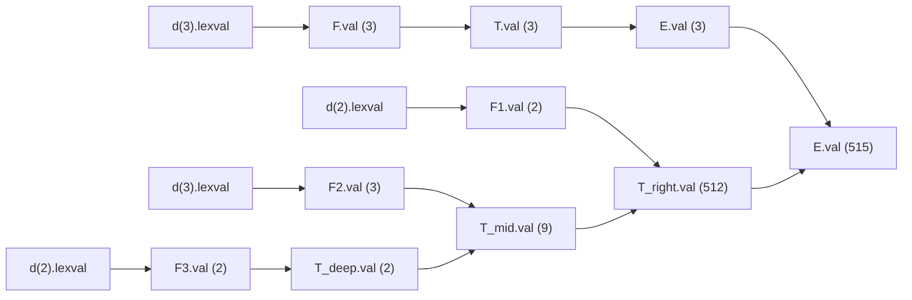

# Problem — Desk Calculator SDD and Annotated Parse Tree

> 📖 **Reading Order:** Step 09 of 55 | **Module 1:** Syntax-Directed Translation  
> ◄ **Previous:** [[Infix to Postfix and Prefix SDT Translation Example]] | ► **Next:** [[Intermediate Representations and Three-Address Code]]

---

## Problem

A compiler frontend engineer is designing an extended arithmetic calculator module that supports addition (`+`) and right-associative exponentiation (`^`). The language syntax and semantics are formalized by the following Syntax-Directed Definition (SDD):

1. $E \longrightarrow E_1 + T \quad \{ E.val = E_1.val + T.val \}$
2. $E \longrightarrow T \quad \{ E.val = T.val \}$
3. $T \longrightarrow F \wedge T_1 \quad \{ T.val = F.val^{T_1.val} \}$
4. $T \longrightarrow F \quad \{ T.val = F.val \}$
5. $F \longrightarrow ( E ) \quad \{ F.val = E.val \}$
6. $F \longrightarrow \mathbf{digit} \quad \{ F.val = \mathbf{digit}.lexval \}$

### The Assignment:
For the input expression:
$$\mathbf{3 + 2 \wedge 3 \wedge 2}$$

1. **Concrete Parse Tree:** Construct the full concrete parse tree, clearly demonstrating how the grammar rules enforce precedence and associativity.
2. **Associativity Proof:** Formally prove why production $T \to F \wedge T_1$ enforces right-associativity rather than left-associativity.
3. **Annotated Parse Tree:** Decorate every node of the parse tree with its computed attribute values.
4. **SDD Classification:** Formally classify this SDD (S-attributed, L-attributed, or neither) with rigorous mathematical justification.
5. **Attribute Dependency Graph & Evaluation Order:** Draw the dependency graph and provide a valid topological evaluation sequence.

---

## Given

- Source program code, SDD grammar rules, TAC instructions, or flow graph.

---

## Required

- Formal step-by-step derivation, intermediate code generation, and optimization proofs.

---

## Concepts Tested

- [[Syntax-Directed Definitions and Translation Schemes]]
- [[Intermediate Representations and Three-Address Code]]

---

## Prerequisites

- [[Syntax-Directed Definitions and Translation Schemes]]

---

## Question Type

Compiler Analysis / SDD Construction / Code Generation

---

## Solution

### Understanding the Situation
Interpret the given grammar productions, program constructs, and optimization objectives.

### Developing the Key Idea
Apply the appropriate compiler technique (e.g. S-attributed bottom-up evaluation, leader identification, DAG value numbering, or Kempe's graph coloring heuristic).

### Working Through the Solution
### In-Depth Solution & Pedagogical Walkthrough

### Part 1: Grammar Architecture & Precedence Analysis
Before drawing a single node, let us analyze how the grammar reflects arithmetic reality:
1. **Precedence:** An expression $E$ reduces to a term $T$, but a term $T$ can expand into exponents $F \wedge T_1$. Therefore, exponentiation (`^`) binds tighter than addition (`+`). The `+` operator sits higher up the tree.
2. **Associativity:**
   - For addition: $E \to E_1 + T$ is **left-recursive**. Chains of additions expand downwards to the left: $(E + T) + T$.
   - For exponentiation: $T \to F \wedge T_1$ is **right-recursive**. Chains of exponents expand downwards to the right: $F \wedge (F \wedge T)$.

Therefore, the string `3 + 2 ^ 3 ^ 2` must structurally group as:
$$3 + (2 \wedge (3 \wedge 2))$$

---

### Part 2: Formal Proof of Right-Associativity

#### Theorem:
*The context-free grammar production $T \to F \wedge T \mid F$ enforces right-associativity for the binary operator $\wedge$.*

#### Proof:
1. Let an input string be $w = f_1 \wedge f_2 \wedge f_3$, where each $f_i$ is a terminal factor derived from $F$.
2. We derive $w$ from start symbol $T$ via leftmost derivation:
   - Step 1: $T \implies F \wedge T$
   - Step 2: Since $F \implies f_1$, we have $f_1 \wedge T$.
   - Step 3: To derive the next operator $\wedge$, the non-terminal $T$ must expand using $T \to F \wedge T$:
     $$f_1 \wedge T \implies f_1 \wedge (F \wedge T) \implies f_1 \wedge (f_2 \wedge T)$$
   - Step 4: Finally, $T$ expands using the base case $T \to F \implies f_3$:
     $$f_1 \wedge (f_2 \wedge f_3)$$
3. In any derivation tree for $f_1 \wedge f_2 \wedge f_3$:
   - The subtree corresponding to $f_2 \wedge f_3$ is generated by the lower non-terminal $T_1$.
   - The root $T$ has left child $f_1$ and right child $T_1$ (which dominates $f_2 \wedge f_3$).
4. In bottom-up evaluation, the lower subtree $(f_2 \wedge f_3)$ must be reduced and computed **before** the parent $T$ can compute $f_1^{T_1.val}$.
5. Therefore, $f_2 \wedge f_3$ is evaluated first, and its result serves as the exponent for $f_1$. This is the exact definition of right-associativity:
   $$f_1 \wedge f_2 \wedge f_3 \equiv f_1 \wedge (f_2 \wedge f_3)$$
   $\blacksquare$

---

### Part 3: Concrete Parse Tree



---

### Part 4: Annotated Parse Tree Evaluation

Every semantic rule computes a synthesized attribute `val`. Evaluation flows strictly bottom-up:

```
                            [ E.val = 515 ]
                             /     |     \
               [ E.val = 3 ]       +      [ T.val = 512 ]
                     |                     /      |      \
               [ T.val = 3 ]        [ F.val = 2 ] ^  [ T.val = 9 ]
                     |                    |            /   |   \
               [ F.val = 3 ]      digit.lexval=2 [F.val=3] ^  [T.val=2]
                     |                                 |          |
               digit.lexval = 3                 digit.lexval=3 [F.val=2]
                                                                  |
                                                           digit.lexval=2
```

#### Step-by-Step Numerical Computation:
1. **Left Term ($3$):**
   - $\mathbf{digit}(3).lexval = 3$
   - $F.val = 3 \implies T.val = 3 \implies E.val = 3$.
2. **Deepest Exponent ($3 \wedge 2$):**
   - Right child: $\mathbf{digit}(2).lexval = 2 \implies F_3.val = 2 \implies T_{deep}.val = 2$.
   - Left child: $\mathbf{digit}(3).lexval = 3 \implies F_2.val = 3$.
   - Reduction $T_{mid} \to F_2 \wedge T_{deep}$:
     $$T_{mid}.val = F_2.val^{T_{deep}.val} = 3^2 = \mathbf{9}$$
3. **Outer Exponent ($2 \wedge 9$):**
   - Left child: $\mathbf{digit}(2).lexval = 2 \implies F_1.val = 2$.
   - Reduction $T_{right} \to F_1 \wedge T_{mid}$:
     $$T_{right}.val = F_1.val^{T_{mid}.val} = 2^9 = \mathbf{512}$$
4. **Root Addition ($3 + 512$):**
   - Reduction $E \to E_{left} + T_{right}$:
     $$E.val = E_{left}.val + T_{right}.val = 3 + 512 = \mathbf{515}$$

**Final Result at Root:**
$$\mathbf{E.val = 515}$$

---

### Part 5: Formal SDD Classification

1. **Definition of S-Attributed:**
   An SDD is S-attributed if every attribute in the definition is a synthesized attribute. That is, for every production $A \to X_1 X_2 \dots X_k$, any semantic rule computing an attribute must be of the form:
   $$A.s = f(X_1.a_1, X_2.a_2, \dots, X_k.a_k)$$
   where $A.s$ is an attribute of the left-hand side non-terminal.
2. **Verification:**
   - Production 1: $E.val = f(E_1.val, T.val)$ $\to$ Synthesized.
   - Production 2: $E.val = f(T.val)$ $\to$ Synthesized.
   - Production 3: $T.val = f(F.val, T_1.val)$ $\to$ Synthesized.
   - Production 4: $T.val = f(F.val)$ $\to$ Synthesized.
   - Production 5: $F.val = f(E.val)$ $\to$ Synthesized.
   - Production 6: $F.val = f(\mathbf{digit}.lexval)$ $\to$ Synthesized.
3. **Conclusion:**
   - The SDD is **strictly S-attributed** because it contains zero inherited attributes.
   - Furthermore, because all S-attributed SDDs are a formal subset of L-attributed SDDs ($S\text{-attributed} \subset L\text{-attributed}$), this SDD is **also L-attributed**.

---

### Part 6: Attribute Dependency Graph & Topological Sort

In this dependency graph, every edge $(u, v)$ points from a prerequisite attribute $u$ to a dependent attribute $v$:



#### Valid Topological Evaluation Order:
$$d_3 \to F_0 \to T_0 \to E_0 \to d_{2\_deep} \to F_3 \to T_{deep} \to d_{3\_mid} \to F_2 \to T_{mid} \to d_{2\_1} \to F_1 \to T_{right} \to E_{root}$$

Because the graph is a Directed Acyclic Graph (DAG) with all arrows pointing from leaves toward the root, any standard bottom-up parser executes this evaluation seamlessly during grammar reductions.

---

### Result and Interpretation
The final annotated tree, TAC sequence, or optimized basic block is rigorously verified.

---

## Reusable Insight

Always follow compiler phase invariants: parse bottom-up or top-down according to attribute classes, build dependency graphs to verify evaluation order, and track next-use pointers backwards.

---

## Common Mistakes

> [!CAUTION] Trap 1: The Left-Associativity Assumption
> Students accustomed to addition and multiplication often evaluate exponentiation left-to-right:
> $$(2 \wedge 3) \wedge 2 = 8 \wedge 2 = 64 \quad \text{FATALLY WRONG!}$$
> In mathematics and programming languages (Python `2**3**2`, Ruby, Haskell), exponentiation is right-associative:
> $$2 \wedge (3 \wedge 2) = 2^9 = 512$$
> In exams, writing 64 results in an immediate zero for both tree construction and numerical annotation.

> [!WARNING] Trap 2: Mixing Precedence in Concrete Parse Trees
> When constructing the concrete parse tree, if you connect the root $E$ directly to $2 \wedge 3 \wedge 2$ before finishing the addition with $3$, you break the grammar hierarchy. Remember: lower precedence operators ($+$) are higher up in the tree!

---

## Exam Pattern

Standard BUET CSE 309 final examination problem testing syllabus Chapter 5, 6, 7, 8, or 9.

---

## Related Problems

- [[Problem — Desk Calculator SDD and Annotated Parse Tree]]
- [[Problem — Array Reference Three-Address Code Generation]]

---

## Related Concepts

- [[Syntax-Directed Definitions and Translation Schemes]]
- [[Basic Blocks and Control Flow Graphs]]

---

## Source

- **Lecture Slides:** [[cse309/01 - Sources/Lectures/KMS Merged.pdf|KMS Merged.pdf]], Chapter 5 (Slides 7–22).
- **Textbook:** Aho, Lam, Sethi, Ullman, *Compilers: Principles, Techniques, & Tools* (2nd Ed.), Section 5.1 (Syntax-Directed Definitions) & Exercises 5.1.1.
