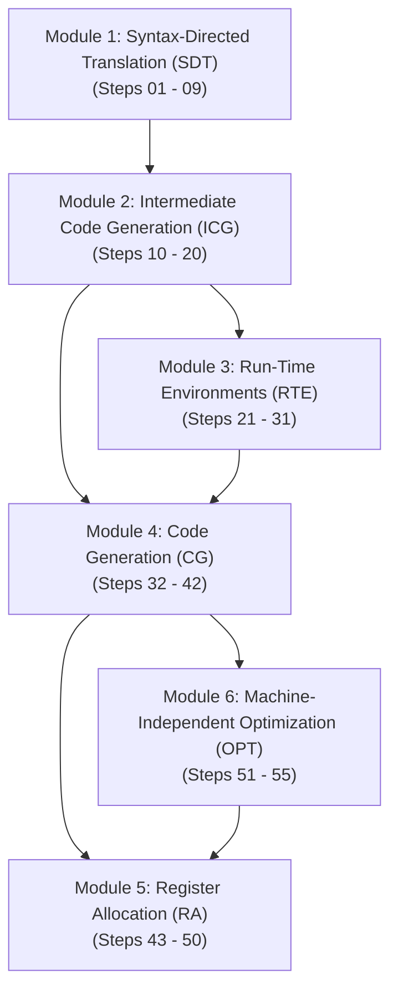

# CSE 309 — Dependency Map (Part II: Synthesis & Back End)

This dependency map visualizes the conceptual prerequisites, algorithmic foundations, and learning pathways across all six modules of Part II of CSE 309 (Compilers).

---

## 1. High-Level Modular Learning Flow

---

## 2. Detailed Topic Dependency Graph

```mermaid
flowchart TD
    %% Module 1: SDT
    SDD["Syntax-Directed Definitions & Schemes"] --> ATTR["Synthesized & Inherited Attributes"]
    ATTR --> CLASS["S-Attributed & L-Attributed SDDs"]
    CLASS --> AST["AST Construction with SDDs"]
    CLASS --> LREC["Eliminating Left Recursion from SDTs"]
    CLASS --> BU_EVAL["Bottom-Up L-Attributed Evaluation"]
    ATTR --> EX_CALC["Desk Calculator SDD Example"]
    LREC --> EX_INFIX["Infix to Postfix/Prefix Example"]
    EX_CALC --> PROB_CALC["Problem — Desk Calculator SDD (Q-001)"]

    %% Module 2: ICG
    SDD --> IR_TAC["Intermediate Representations & Three-Address Code"]
    IR_TAC --> VAL_NUM["Value-Number Method for DAGs"]
    IR_TAC --> TYPES["Type Expressions & Storage Layout"]
    TYPES --> FORM_ARR["Multi-Dimensional Array Addressing Formulas"]
    FORM_ARR --> TRANS_EXPR["Translation of Expressions & Arrays"]
    IR_TAC --> TRANS_CTRL["Control Flow Translation & Booleans"]
    TRANS_CTRL --> BACKPATCH["Backpatching in ICG"]
    BACKPATCH --> ALG_BACK["Backpatching Algorithm"]
    TRANS_EXPR --> EX_TAC["Array & Control-Flow TAC Example"]
    TRANS_CTRL --> EX_TAC
    TRANS_EXPR --> PROB_ARR["Problem — Array TAC Generation (Q-002)"]
    ALG_BACK --> PROB_BP["Problem — Backpatching Translation (Q-003)"]

    %% Module 3: RTE
    TYPES --> STORAGE["Run-Time Storage Organization & AR"]
    STORAGE --> CALL_SEQ["Calling Sequences & Frame Management"]
    STORAGE --> NON_LOCAL["Non-Local Access in Static/Dynamic Scopes"]
    STORAGE --> HEAP["Heap Memory Management & Allocation"]
    HEAP --> GC_FUND["Garbage Collection Fundamentals & Refcounting"]
    GC_FUND --> TRACE_GC["Trace-Based GC Algorithms"]
    TRACE_GC --> MS_GC["Mark-and-Sweep GC Algorithm"]
    TRACE_GC --> COPY_GC["Copying GC Algorithm (Cheney)"]
    NON_LOCAL --> EX_DISP["Display Simulation Example"]
    TRACE_GC --> EX_GC["GC Trace & Compaction Example"]
    NON_LOCAL --> PROB_AR["Problem — AR & Display Tracing (Q-004)"]

    %% Module 4: Code Generation
    IR_TAC --> CG_ISSUES["Code Generation Issues & Architecture"]
    CG_ISSUES --> BB_CFG["Basic Blocks & Control Flow Graphs"]
    BB_CFG --> ALG_LEAD["Basic Block Partitioning Algorithm"]
    BB_CFG --> LIVE_NEXT["Liveness & Next-Use Analysis"]
    VAL_NUM --> DAG_OPT["DAG Construction & Local Optimization"]
    BB_CFG --> DAG_OPT
    LIVE_NEXT --> SIMPLE_CG["A Simple Code Generator Algorithm"]
    CG_ISSUES --> PEEPHOLE["Peephole Optimization Techniques"]
    ALG_LEAD --> EX_BB["Block Partitioning & Next-Use Example"]
    LIVE_NEXT --> EX_BB
    DAG_OPT --> EX_DAG["DAG Basic Block Optimization Example"]
    ALG_LEAD --> PROB_BB["Problem — Basic Block Partitioning (Q-005)"]
    DAG_OPT --> PROB_DAG["Problem — DAG Array Store (Q-006)"]

    %% Module 5: Register Allocation
    LIVE_NEXT --> LIVE_INT["Live Ranges & Live Intervals"]
    LIVE_INT --> RIG["Register Interference Graphs & Coloring"]
    LIVE_INT --> LIN_SCAN["Linear Scan Register Allocation Algorithm"]
    RIG --> CHAITIN["Chaitin's Graph Coloring Algorithm"]
    LIN_SCAN --> EX_LS["Linear Scan Step-by-Step Example"]
    CHAITIN --> EX_CHAITIN["Chaitin Graph Coloring Example"]
    LIN_SCAN --> PROB_LS["Problem — Linear Scan Simulation (Q-007)"]
    CHAITIN --> PROB_CHAITIN["Problem — Chaitin Graph Coloring (Q-008)"]

    %% Module 6: Machine-Independent Optimization
    BB_CFG --> OPT_SRC["Principal Sources of Optimization"]
    OPT_SRC --> CSE_CP["Global CSE & Copy Propagation"]
    OPT_SRC --> LOOP_OPT["Loop Optimizations & Strength Reduction"]
    CSE_CP --> EX_QS["Quicksort Partition Loop Complete Example"]
    LOOP_OPT --> EX_QS
    LOOP_OPT --> PROB_SR["Problem — Quicksort Strength Reduction (Q-009)"]
```

---

## 3. Prerequisite Matrix

| Knowledge Note | Direct Prerequisites | Unlocks / Enables |
| :--- | :--- | :--- |
| [[Synthesized and Inherited Attributes]] | [[Syntax-Directed Definitions and Translation Schemes]] | [[S-Attributed and L-Attributed SDDs]], [[Arithmetic Expression Desk Calculator SDD Example]] |
| [[S-Attributed and L-Attributed SDDs]] | [[Synthesized and Inherited Attributes]] | [[Abstract Syntax Tree Construction with SDDs]], [[Eliminating Left Recursion from SDTs]], [[Bottom-Up Evaluation of L-Attributed SDDs]] |
| [[Intermediate Representations and Three-Address Code]] | [[Syntax-Directed Definitions and Translation Schemes]] | [[Value-Number Method for DAG Construction]], [[Type Expressions and Storage Layout]], [[Control Flow Translation and Boolean Expressions]] |
| [[Multi-Dimensional Array Addressing Formulas]] | [[Type Expressions and Storage Layout]] | [[Translation of Expressions and Array References]], [[Problem — Array Reference Three-Address Code Generation]] |
| [[Backpatching in Intermediate Code Generation]] | [[Control Flow Translation and Boolean Expressions]] | [[Backpatching Control-Flow Code Generation Algorithm]], [[Problem — Backpatching Boolean Expression Translation]] |
| [[Run-Time Storage Organization and Activation Records]] | [[Type Expressions and Storage Layout]] | [[Calling Sequences and Stack Frame Management]], [[Non-Local Variable Access in Static and Dynamic Scopes]], [[Heap Memory Management and Allocation Strategies]] |
| [[Non-Local Variable Access in Static and Dynamic Scopes]] | [[Run-Time Storage Organization and Activation Records]] | [[Display Maintenance and Non-Local Access Simulation Example]], [[Problem — Activation Record and Display Table Tracing]] |
| [[Trace-Based Garbage Collection Algorithms]] | [[Garbage Collection Fundamentals and Reference Counting]] | [[Mark-and-Sweep Garbage Collection Algorithm]], [[Copying Garbage Collection Algorithm]], [[Garbage Collection Trace and Compaction Example]] |
| [[Basic Blocks and Control Flow Graphs]] | [[Intermediate Representations and Three-Address Code]] | [[Basic Block Partitioning Algorithm]], [[Liveness and Next-Use Analysis within Basic Blocks]], [[Principal Sources of Code Optimization]] |
| [[Liveness and Next-Use Analysis within Basic Blocks]] | [[Basic Blocks and Control Flow Graphs]] | [[A Simple Code Generator Algorithm]], [[Live Ranges and Live Intervals in Register Allocation]] |
| [[Linear Scan Register Allocation Algorithm]] | [[Live Ranges and Live Intervals in Register Allocation]] | [[Linear Scan Register Allocation Step-by-Step Example]], [[Problem — Linear Scan Register Allocation Simulation]] |
| [[Chaitin's Graph Coloring Register Allocation Algorithm]] | [[Register Interference Graphs and Graph Coloring Principles]] | [[Chaitin's Graph Coloring Register Allocation Example]], [[Problem — Chaitin Graph Coloring Register Allocation]] |
| [[Loop Optimizations and Strength Reduction]] | [[Principal Sources of Code Optimization]] | [[Quicksort Partition Loop Complete Optimization Example]], [[Problem — Quicksort Loop Induction Variable Strength Reduction]] |
