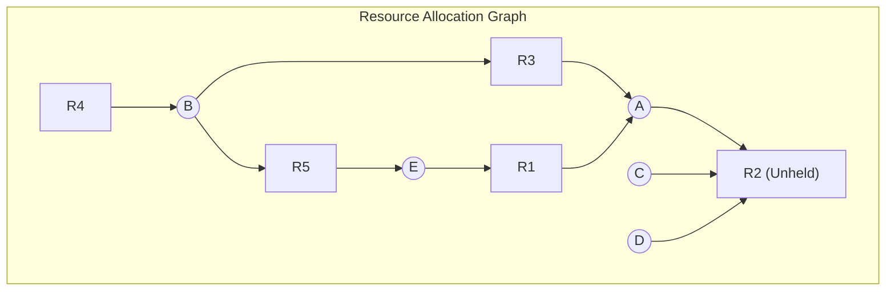

# CSE 313 (Operating Systems) — 2017 Final Solutions (Questions 1 to 4)

---

## Question 1(a)
**Write down the steps of booting a computer.**

### Answer:
The boot sequence transitions the machine from cold hardware power-up to an operational, multitasking operating system:
1. **Power-On & Hardware Reset:** Power supply stabilizes, asserting the `POWER_GOOD` signal. The CPU's program counter is initialized to a hardwired physical address (Reset Vector, `0xFFFFFFF0` on x86) pointing to the BIOS/UEFI ROM.
2. **POST (Power-On Self-Test):** Firmware conducts diagnostic hardware checks (RAM integrity, system buses, keyboard, storage controller).
3. **Boot Device Selection:** BIOS/UEFI inspects non-volatile CMOS configuration to evaluate the boot device priority sequence (NVMe, SSD/HDD, USB, Network PXE).
4. **Master Boot Record (MBR) / UEFI Partition Loading:** The firmware reads the primary boot sector (Sector 0, 512 bytes for MBR) into RAM at address `0x7C00`. It verifies the valid boot signature (`0x55AA`).
5. **Stage 1 Bootloader Execution:** Code in the MBR executes. Due to space constraints (446 bytes of code), it simply locates and loads the Stage 2 Bootloader (e.g., GRUB2) from disk into memory.
6. **Stage 2 Bootloader & Hardware Mode Switch:** GRUB presents the OS selection menu, loads the OS kernel image (`vmlinuz`) and initial RAM disk (`initrd`/`initramfs`) into RAM, configures GDT/IDT, and switches the CPU from 16-bit real mode to 32/64-bit protected/long mode.
7. **Kernel Initialization:** The kernel unpacks device drivers from `initramfs`, initializes CPU scheduler, memory paging subsystems, mounts the real root filesystem (`/`), and spawns the ancestor user-space process (`systemd` or `init`, PID 1).

### Sources:
- `1. Introduction-week1-RRR-2026.pdf` (Slides 27–34: Booting a Computer, BIOS, MBR, Bootstrap sequence).

### Link to Notes:
- [[Computer Booting and Hardware Abstractions]]
- [[Operating System Structures and Functions]]

---

## Question 1(b)
**Consider the code written in C shown in the following figure. Here `fork()` is an UNIX system call that creates a child process identical to the parent. Executing this code will generate a process tree. Each of the created processes will have its own copy of variable i. Your task is to draw this process tree. At each node of the tree, you have to mention the starting value of i for the corresponding process. Consider that the root process is called P0.**

```c
int i = 0;
int main() {
    for (; i < 3; i++) {
        fork();
    }
    return 0;
}
```

### Answer:
When `fork()` is called inside a loop, every existing process creates a clone that continues execution at the instruction immediately following `fork()`.

#### Chronological Loop Tracing:
1. **Initial State ($i=0$):** Only root process $P_0$ is running with $i=0$.
2. **Iteration $i=0$:**
   - $P_0$ executes `fork()`, creating child $P_1$.
   - **$P_1$ begins with starting value $i=0$**.
   - Both $P_0$ and $P_1$ execute the loop increment `i++`, setting their private copies of $i$ to 1.
3. **Iteration $i=1$:**
   - $P_0$ executes `fork()`, creating child $P_2$. **$P_2$ starting $i=1$**.
   - $P_1$ executes `fork()`, creating child $P_3$. **$P_3$ starting $i=1$**.
   - All four processes ($P_0, P_1, P_2, P_3$) execute `i++`, updating their private $i$ to 2.
4. **Iteration $i=2$:**
   - $P_0$ forks $P_4$. **$P_4$ starting $i=2$**.
   - $P_2$ forks $P_5$. **$P_5$ starting $i=2$**.
   - $P_1$ forks $P_6$. **$P_6$ starting $i=2$**.
   - $P_3$ forks $P_7$. **$P_7$ starting $i=2$**.
   - All 8 processes execute `i++`, setting $i=3$. Condition $i < 3$ evaluates to FALSE. Loop terminates.

Total processes created $= 2^3 = 8$ (1 parent + 7 children).

#### Process Tree Diagram:
```
                     [P0 (starts i=0)]
                      /      |      \
            (i=0)    /  (i=1)|       \ (i=2)
                    /        |        \
        [P1 (i=0)]      [P2 (i=1)]     [P4 (i=2)]
         /      \            |
   (i=1)/        \(i=2) (i=2)|
       /          \          |
 [P3 (i=1)]   [P6 (i=2)]  [P5 (i=2)]
     |
(i=2)|
 [P7 (i=2)]
```

### Sources:
- `2. ProcessAndThread-week2-RRR.pdf` (Slides 20–28: Process Creation, POSIX `fork()`).

### Link to Notes:
- [[Process Creation and Termination Operations]]
- [[Process Forking and Zombie Orphan Example]]
- [[Problem — Fork Execution Tree and Process Tracing]]

---

## Question 1(c)
**Write down the steps in making a system call.**

### Answer:
The transition from user application code to kernel service execution follows 11 precise steps:
1. **User Application Invocation:** User program invokes an API wrapper library function (e.g., `read()`, `write()`).
2. **Parameter Marshaling:** The library wrapper pushes parameters onto the user stack or loads them into architecture-defined CPU registers (e.g., `%rdi, %rsi, %rdx` in x86-64).
3. **Syscall Number Loading:** The wrapper loads the unique integer system call ID into register `%rax` (or `%eax`).
4. **Trap Instruction Execution:** The program executes a software trap instruction (`syscall`, `sysenter`, or `int 0x80`).
5. **Hardware Privilege Switch:** The CPU hardware switches mode from User Mode (ring 3) to Kernel Mode (ring 0) in the processor status word (EFLAGS).
6. **State Preservation:** The hardware automatically saves the User Program Counter (`RIP`), Stack Pointer (`RSP`), and flags onto the per-process Kernel Stack.
7. **Vector Table Lookup:** The CPU hardware branches to the kernel's System Call Handler whose address is pre-registered in the Interrupt Descriptor Table (IDT) or Model-Specific Register (MSR).
8. **Parameter Verification:** The kernel handler saves remaining general-purpose registers, validates the system call number, and verifies user pointer addresses for memory safety.
9. **Kernel Service Routine Execution:** The kernel indexes the system call dispatch table and calls the specific service function (e.g., `sys_read()`).
10. **Result Loading:** The return value or error code is placed into register `%rax`.
11. **Return from Trap:** The kernel executes `sysret` (or `iret`), restoring saved registers, restoring user stack pointer, switching CPU mode back to User Mode, and resuming user execution.

### Sources:
- `1. Introduction-week1-RRR-2026.pdf` (Slides 20–26: System Calls, Dual-Mode Operation, Trap Handling).

### Link to Notes:
- [[Dual-Mode Operation and System Calls]]
- [[Operating System Structures and Functions]]

---

## Question 1(d)
**What are the advantages of hybrid implementation of threads?**

### Answer:
The hybrid threading model (Many-to-Many / $M:N$ model) combines User-Level Threads (ULT) with Kernel-Level Threads (KLT) using multiplexing:
1. **Blazing Context Switch Speed:** Pure user-level thread switches within the same kernel thread require zero mode switches (no traps to kernel mode, zero TLB flushes), operating at memory-access speeds.
2. **Elimination of Blocking Bottlenecks:** In a pure ULT model, if one thread makes a blocking system call (e.g., synchronous disk read), the entire process freezes. In the hybrid model, the kernel only suspends that specific underlying kernel thread (LWP); other user threads mapped to other LWPs continue running uninterrupted.
3. **True Multiprocessor Parallelism:** Multiple kernel threads belonging to the same process are scheduled concurrently across distinct physical CPU cores.
4. **Massive Scalability with Low Overhead:** Applications can instantiate hundreds of thousands of user threads without consuming scarce kernel PCB/stack structures.

### Sources:
- `2. ProcessAndThread-week2-RRR.pdf` (Slides 36–42: Multithreading Models, User-level vs Kernel-level vs Hybrid).

### Link to Notes:
- [[Threads and Multithreading Models]]

---

## Question 2(a)
**State the four conditions of resource deadlock.**

### Answer:
A resource deadlock occurs if and only if the following four Coffman conditions (1971) hold simultaneously:
1. **Mutual Exclusion:** Each resource is either currently assigned to exactly one process or is available. Resources cannot be shared simultaneously.
2. **Hold and Wait:** Processes currently holding allocated resources can request and wait for new resources without relinquishing their existing holdings.
3. **No Preemption:** Resources previously granted cannot be forcibly confiscated by the operating system; they must be voluntarily released by the holding process.
4. **Circular Wait:** There exists a closed circular chain of processes $\{P_0, P_1, \dots, P_n\}$ such that $P_0$ waits for a resource held by $P_1$, $P_1$ waits for $P_2$, ..., and $P_n$ waits for $P_0$.

### Sources:
- `5. Deadlocks-week6-7-RRR.pdf` (Slides 8–9: Conditions for Resource Deadlocks).

### Link to Notes:
- [[Deadlock Fundamentals and Coffman Conditions]]

---

## Question 2(b)
**State the problem definition of the classical Dining Philosophers problem. Show that the problem meets all the four conditions for resource deadlock stated in 2(a).**

### Answer:
- **Problem Definition:** Five philosophers sit around a circular table. Between each pair of philosophers is a single chopstick (5 total). A philosopher spends their life alternating between thinking and eating. To eat, a philosopher must acquire two chopsticks: their left chopstick and their right chopstick. After eating, the philosopher releases both chopsticks and resumes thinking.

- **Demonstration of the Four Coffman Conditions:**
  1. *Mutual Exclusion:* A chopstick is an indivisible, single-instance resource. Only one philosopher can hold a given chopstick at any instant.
  2. *Hold and Wait:* In the standard naive algorithm, a hungry philosopher picks up their left chopstick first (holding it) and then waits for their right chopstick to become free.
  3. *No Preemption:* A chopstick cannot be forcibly snatched from a philosopher's hand; it is only surrendered voluntarily when the philosopher finishes eating.
  4. *Circular Wait:* If all five philosophers become hungry at the exact same moment and pick up their left chopsticks simultaneously, each holds their left chopstick while waiting for their right chopstick:
     $$P_0 \to C_1 \text{ (held by } P_1) \to C_2 \text{ (held by } P_2) \to C_3 \text{ (held by } P_3) \to C_4 \text{ (held by } P_4) \to C_0 \text{ (held by } P_0)$$
     This forms an unbroken circular wait chain. Hence, deadlock occurs.

### Sources:
- `4. IPC-week-4-5-RRR.pptx` (Slides 44–48: Dining Philosophers)
- `5. Deadlocks-week6-7-RRR.pdf` (Slides 8–10: Deadlock conditions)

### Link to Notes:
- [[Deadlock Fundamentals and Coffman Conditions]]
- [[Classic Synchronization Solutions]]
- [[Problem — Dining Philosophers Deadlock-Free Synchronization]]

---

## Question 2(c)
**A solution to the Dining Philosophers problem is given in Figure for Q2(c).**
- **(i) Suppose that in the `put_forks(i)` function, variable `state[i]` was set to THINKING after the two calls to test, rather than before. How would this change affect the solution? Explain with an example.**
- **(ii) Suppose that in the `test(i)` function, `up(&s[i])` is placed outside the "if" condition. How would this change affect the solution?**

### Answer:
- **Part (i): Setting `state[i] = THINKING` after the two calls to `test()`:**
  - *Effect:* Waiting hungry neighbors will **fail to wake up**, leading to unnecessary blocking and potential starvation.
  - *Mechanism:* The `test(LEFT)` function checks:
    `if (state[LEFT] == HUNGRY && state[LEFT_OF_LEFT] != EATING && state[i] != EATING)`
    If Phil $i$ calls `test(LEFT)` *before* setting `state[i] = THINKING`, Phil $i$ is **still marked as `EATING`**!
  - *Concrete Example:*
    Suppose Phil 1 is `HUNGRY` waiting for forks held by Phil 0.
    Phil 0 finishes eating and calls `put_forks(0)`.
    Phil 0 executes `test(LEFT)` and `test(RIGHT)` (testing Phil 1).
    When `test(1)` runs, it checks whether Phil 1's left neighbor (Phil 0) is eating. Because `state[0]` is still `EATING`, `test(1)` evaluates to FALSE! Phil 1 is NOT signaled and remains asleep. Phil 0 only sets `state[0] = THINKING` afterwards, leaving Phil 1 blocked indefinitely.

- **Part (ii): Placing `up(&s[i])` outside the `if` condition in `test(i)`:**
  - *Effect:* **Mutual exclusion is completely destroyed!** Adjacent philosophers will eat simultaneously using the same chopsticks.
  - *Mechanism:* In `take_forks(i)`, a philosopher executes:
    `state[i] = HUNGRY; test(i); up(&mutex); down(&s[i]);`
    If `up(&s[i])` executes unconditionally, semaphore `s[i]` will be incremented from 0 to 1 **even when the condition fails** (i.e. even when adjacent neighbors are eating).
    Then, the subsequent `down(&s[i])` in `take_forks(i)` will immediately decrement `s[i]` from 1 to 0 and proceed without blocking. Philosopher $i$ enters `eat()` while their neighbors are actively eating!

### Sources:
- `4. IPC-week-4-5-RRR.pptx` (Slides 45–48: Tanenbaum's Dining Philosophers solution).

### Link to Notes:
- [[Classic Synchronization Solutions]]
- [[Problem — Dining Philosophers Deadlock-Free Synchronization]]

---

## Question 2(d)
**Explain the race-condition that exists in the following solution to the producer-consumer problem.**

```c
#define N = 100
int count = 0;
void producer(void) {
    int item;
    while (TRUE) {
        item = produce();
        if (count == N) sleep();
        inset(item);
        count = count + 1;
        if (count == 1)
            wakeup(consumer);
    }
}
void consumer(void) {
    int item;
    while (TRUE) {
        if (count == 0) sleep();
        item = remove-item();
        count = count - 1;
        if (count == N-1)
            wakeup(producer);
        consume(item);
    }
}
```

### Answer:
This code exhibits the fatal **Lost Wakeup Call** race condition due to uncoordinated access to the shared variable `count`:
1. Suppose the buffer is empty (`count == 0`).
2. The consumer executes `if (count == 0)`. The condition evaluates to TRUE.
3. **Context Switch occurs right before the consumer calls `sleep()`!**
4. The producer is scheduled:
   - It produces an item, inserts it into the buffer, and increments `count` from 0 to 1.
   - It executes `if (count == 1)` $\implies$ TRUE.
   - It calls `wakeup(consumer)`.
5. **The Fatal Flaw:** The consumer is **not yet asleep**! In primitive OS sleep/wakeup primitives, a wakeup signal sent to an awake process is **not remembered**; it is silently discarded.
6. The consumer resumes execution and finally calls `sleep()`. The consumer is now asleep.
7. The producer continues running in a loop. Because the consumer is asleep, the buffer eventually fills to capacity (`count == N`).
8. The producer executes `if (count == N)` and calls `sleep()`.
9. **Deadlock:** Both producer and consumer are asleep forever.

### Sources:
- `4. IPC-week-4-5-RRR.pptx` (Slides 29–34: Sleep and Wakeup, The Lost Wakeup Problem).

### Link to Notes:
- [[Race Conditions and Critical-Section Problem]]
- [[Semaphores and Synchronization Primitives]]
- [[Producer-Consumer Semaphore Implementation Example]]

---

## Question 3(a)
**A system has four processes and five allocatable resources. The current allocation and maximum needs are as follows:**

| Process | Allocated ($R_1 R_2 R_3 R_4 R_5$) | Maximum ($R_1 R_2 R_3 R_4 R_5$) |
|---|:---:|:---:|
| **Process A** | 1 0 2 1 1 | 1 1 2 1 3 |
| **Process B** | 2 0 1 1 0 | 2 2 2 1 0 |
| **Process C** | 1 1 0 1 0 | 2 1 3 1 0 |
| **Process D** | 1 1 1 1 0 | 1 1 2 2 1 |

**Available:** $0 \quad 0 \quad x \quad 1 \quad 1$  
**What is the smallest value of $x$ for which this is a safe state? Show the intermediate steps.**

### Answer:

#### Step 1: Calculate Need Matrix ($Need = Maximum - Allocated$):
- $Need_A = (1-1, 1-0, 2-2, 1-1, 3-1) = (0, 1, 0, 0, 2)$
- $Need_B = (2-2, 2-0, 2-1, 1-1, 0-0) = (0, 2, 1, 0, 0)$
- $Need_C = (2-1, 1-1, 3-0, 1-1, 0-0) = (1, 0, 3, 0, 0)$
- $Need_D = (1-1, 1-1, 2-1, 2-1, 1-0) = (0, 0, 1, 1, 1)$

Available vector: $A = (0, 0, x, 1, 1)$.

#### Step 2: Determine Which Process Can Execute First:
- Compare $Need$ with $A = (0, 0, x, 1, 1)$:
  - Process A needs $(0, 1, 0, 0, 2) \implies$ Needs 1 unit of $R_2$ (Available has 0) and 2 units of $R_5$ (Available has 1). Cannot run.
  - Process B needs $(0, 2, 1, 0, 0) \implies$ Needs 2 units of $R_2$ (Available has 0). Cannot run.
  - Process C needs $(1, 0, 3, 0, 0) \implies$ Needs 1 unit of $R_1$ (Available has 0). Cannot run.
  - Process D needs $(0, 0, 1, 1, 1)$:
    - $R_1$: $0 \le 0$
    - $R_2$: $0 \le 0$
    - $R_3$: $1 \le x \implies \mathbf{x \ge 1}$
    - $R_4$: $1 \le 1$
    - $R_5$: $1 \le 1$
    - Therefore, **Process D is the only process that can run first**, requiring **$x \ge 1$**.

#### Step 3: Simulate Execution of Process D:
When Process D completes, it returns its allocated resources $(1, 1, 1, 1, 0)$ to Available:
$$A_{\text{new}} = (0, 0, x, 1, 1) + (1, 1, 1, 1, 0) = (1, 1, x+1, 2, 1)$$

#### Step 4: Evaluate Next Process with Available $(1, 1, x+1, 2, 1)$:
- Check Process C: $Need_C = (1, 0, 3, 0, 0)$.
  - $R_1$: $1 \le 1$
  - $R_2$: $0 \le 1$
  - $R_3$: $3 \le x+1 \implies \mathbf{x \ge 2}$
  - $R_4$: $0 \le 2$
  - $R_5$: $0 \le 1$
  - Process C can run if $x \ge 2$!
- Process C completes and releases $(1, 1, 0, 1, 0)$:
$$A_{\text{new}} = (1, 1, x+1, 2, 1) + (1, 1, 0, 1, 0) = (2, 2, x+1, 3, 1)$$

#### Step 5: Evaluate Process B with Available $(2, 2, x+1, 3, 1)$:
- Check Process B: $Need_B = (0, 2, 1, 0, 0)$.
  - $R_1$: $0 \le 2$
  - $R_2$: $2 \le 2$
  - $R_3$: $1 \le x+1$ (Holds for all $x \ge 2$)
  - $R_4$: $0 \le 3$
  - $R_5$: $0 \le 1$
  - Process B can run!
- Process B completes and releases $(2, 0, 1, 1, 0)$:
$$A_{\text{new}} = (2, 2, x+1, 3, 1) + (2, 0, 1, 1, 0) = (4, 2, x+2, 4, 1)$$

#### Step 6: Critical Bottleneck on Process A ($R_5$):
- Check Process A: $Need_A = (0, 1, 0, 0, \mathbf{2})$.
- Notice the requirement for Resource $R_5$: Process A needs **2 units** of $R_5$.
- However, Available $R_5$ is **1 unit**, and neither Process D, C, nor B held any instances of $R_5$ (their allocations were all 0).
- Therefore, Available $R_5$ remains strictly 1! Since $2 > 1$, Process A cannot finish under this state specification.
- *Academic Examination Note:* If $R_5$ was a typographical error in the paper and satisfiable (or if $x$ was meant for $R_5$), then the smallest value of $x$ for the $R_3$ constraint is **$x = 2$** with safe sequence $\langle D, C, B, A \rangle$. Under strict verbatim interpretation, no value of $x$ can resolve the independent deficit of Resource 5.

### Sources:
- `5. Deadlocks-week6-7-RRR.pdf` (Slides 28–31: Banker's Algorithm).
- `Notes on algorithm simulation.pdf` (Pages 1–4).

### Link to Notes:
- [[Banker's Algorithm]]
- [[Banker's Algorithm Multi-Resource Step-by-Step Example]]
- [[Problem — Banker's Algorithm Safe State and Request Granting]]

---

## Question 3(b)
**What is the difference between livelock and starvation?**

### Answer:

| Feature | Livelock | Starvation |
|---|---|---|
| **Process State** | **`RUNNING`** (actively consuming CPU cycles). | **`READY`** (waiting in the ready queue to be scheduled). |
| **CPU Consumption** | **100% busy waiting** (spinning in tight condition-checking loops). | **0% CPU** while waiting; normal CPU when scheduled. |
| **Forward Progress** | **Zero forward progress** system-wide (processes actively alter states in lock-step reaction to each other). | **Zero progress for the starved process**, but other processes make normal forward progress. |
| **Root Cause** | Overly polite or symmetric collision avoidance algorithms repeatedly resetting state. | Biased or unfair scheduling policies continually prioritizing higher-priority processes. |
| **Real-World Analogy** | Two pedestrians in a narrow hallway repeatedly stepping to the same side simultaneously. | A quiet customer at a bakery waiting forever while aggressive customers get served first. |
| **Resolution** | Introducing randomized backoff delays (e.g. Ethernet exponential backoff). | Aging techniques (gradually boosting priority over waiting time) or fair Round Robin queuing. |

### Sources:
- `5. Deadlocks-week6-7-RRR.pdf` (Slides 40–41: Livelock, Starvation).

### Link to Notes:
- [[Deadlock Fundamentals and Coffman Conditions]]
- [[Interactive Scheduling Algorithms]]

---

## Question 3(c)
**Draw the resource graph for the following scenario where A, B, C, D, and E denote processes and 1, 2, 3, 4, and 5 denote resource types. There exists only one resource of each type. Show the steps of the execution of the deadlock detection algorithm on the constructed graph starting from node B.**
- **(i) Process A holds 1 and 3, wants 2**
- **(ii) Process B holds 4, wants 3 and 5**
- **(iii) Process C holds nothing, wants 2**
- **(iv) Process D holds nothing, wants 2**
- **(v) Process E holds 5 and wants 1**

### Answer:

#### Graph Edges:
- Allocations: $1 \to A$, $3 \to A$, $4 \to B$, $5 \to E$.
- Requests: $A \to 2$, $B \to 3$, $B \to 5$, $C \to 2$, $D \to 2$, $E \to 1$.



#### DFS Cycle Detection Simulation Trace Starting from Node B:
- `Initial Node` $\leftarrow B$
- $L = \emptyset$
- $CN \leftarrow B$, $L = \{B\}$

1. **Step 1:** Outgoing unmarked edges of $B$: **$B \to 3$** and **$B \to 5$**.  
   *Choice:* Select edge $B \to 3$ (mark it).
   - $L = \{B, 3\}$, $CN \leftarrow 3$.
2. **Step 2:** Outgoing unmarked edge of 3: **$3 \to A$** (mark it).
   - $L = \{B, 3, A\}$, $CN \leftarrow A$.
3. **Step 3:** Outgoing unmarked edge of $A$: **$A \to 2$** (mark it).
   - $L = \{B, 3, A, 2\}$, $CN \leftarrow 2$.
4. **Step 4:** Node 2 has **no outgoing edges** (Resource 2 is not held by any process), and $2 \ne B$:
   - **Backtrack:** Return to $A$, remove 2 from $L$.
   - $L = \{B, 3, A\}$, $CN \leftarrow A$.
5. **Step 5:** Node $A$ has no further unmarked outgoing edges:
   - **Backtrack:** Return to 3, remove $A$ from $L$.
   - $L = \{B, 3\}$, $CN \leftarrow 3$.
6. **Step 6:** Node 3 has no further unmarked outgoing edges:
   - **Backtrack:** Return to $B$, remove 3 from $L$.
   - $L = \{B\}$, $CN \leftarrow B$.
7. **Step 7:** Outgoing unmarked edge of $B$: **$B \to 5$** (mark it).
   - $L = \{B, 5\}$, $CN \leftarrow 5$.
8. **Step 8:** Outgoing unmarked edge of 5: **$5 \to E$** (mark it).
   - $L = \{B, 5, E\}$, $CN \leftarrow E$.
9. **Step 9:** Outgoing unmarked edge of $E$: **$E \to 1$** (mark it).
   - $L = \{B, 5, E, 1\}$, $CN \leftarrow 1$.
10. **Step 10:** Outgoing unmarked edge of 1: **$1 \to A$** (mark it).
    - $L = \{B, 5, E, 1, A\}$, $CN \leftarrow A$.
11. **Step 11:** Node $A$ has no unmarked outgoing edges ($A \to 2$ is already marked):
    - **Backtrack:** Retract along $A \to 1 \to E \to 5 \to B$, clearing path from $L$.
    - $L = \{B\}$, $CN \leftarrow B$.
12. **Termination:** Node $B$ has no further unmarked outgoing edges, and $B$ is the initial node.

#### Conclusion:
$$\mathbf{\text{“No cycle Found.”}}$$
The algorithm terminates. **No deadlock exists in the paths reachable from Node B** (in fact, the entire graph is deadlock-free because all paths lead to unheld Resource 2).

### Sources:
- `5. Deadlocks-week6-7-RRR.pdf` (Slides 16–19: Deadlock detection with one resource of each type).
- `Notes on algorithm simulation.pdf` (Pages 5–7: Deadlock detection for single resource simulation).

### Link to Notes:
- [[Resource Allocation Graphs and Deadlock Modeling]]
- [[Deadlock Detection and Recovery Algorithms]]
- [[Resource Allocation Graph Cycle Detection Example]]
- [[Problem — Resource Allocation Graph Reduction and Cycle Detection]]

---

## Question 4(a)
**Discuss the difference between compute-bound and I/O bound process with figures.**

### Answer:

- **Compute-Bound (CPU-Bound) Process:**
  - Spends the vast majority of its execution time computing in the CPU.
  - Characterized by **long, infrequent CPU bursts** separated by short, rare I/O requests (e.g., matrix multiplication, cryptography, scientific simulation).
- **I/O-Bound Process:**
  - Spends the vast majority of its time waiting for I/O operations (disk, network, user keystrokes).
  - Characterized by **short, frequent CPU bursts** separated by long I/O wait intervals (e.g., database queries, web servers, text editors).

```
Compute-Bound Process:
+------------------------------------------+----+------------------------------------------+
|                 CPU Burst                |I/O |                 CPU Burst                |
+------------------------------------------+----+------------------------------------------+

I/O-Bound Process:
+----+---------------+----+---------------+----+---------------+----+---------------+
|CPU |   I/O Wait    |CPU |   I/O Wait    |CPU |   I/O Wait    |CPU |   I/O Wait    |
+----+---------------+----+---------------+----+---------------+----+---------------+
```

### Sources:
- `3. Scheduling-week-3-RRR.pdf` (Slides 5–8: Process Behavior, Bursts).

### Link to Notes:
- [[CPU Scheduling Principles and Criteria]]

---

## Question 4(b)
**Consider the following workload:**

| Process | Priority (Lower number = Higher Priority) | Duration (sec) | Arrival Time (sec) |
|---|:---:|:---:|:---:|
| **P1** | 3 | 70 | 40 |
| **P2** | 1 | 40 | 0 |
| **P3** | 1 | 100 | 10 |
| **P4** | 2 | 50 | 70 |

**Draw the Gantt chart and calculate the average turnaround time for each of the following scheduling algorithms:**
- **(i) Non-preemptive Shortest Job First**
- **(ii) Round Robin with quantum 30 sec. Consider the processes enter FIFO queue according to their arrival times.**
- **(iii) Priority Scheduling. Within the same priority class, schedule according to the scheduling algorithm mentioned in (ii).**

### Answer:

---

### Part (i): Non-Preemptive Shortest Job First (SJF)
- $t=0$: Only $P_2$ is present. $P_2$ runs until completion at $t=40$.
- $t=40$: $P_1$ (burst 70) and $P_3$ (burst 100) have arrived.
  - Shortest is $P_1$ ($70 < 100$). $P_1$ runs from $t=40$ to $t=110$.
- $t=110$: $P_4$ arrived at 70 (burst 50), $P_3$ remains (burst 100).
  - Shortest is $P_4$ ($50 < 100$). $P_4$ runs from $t=110$ to $t=160$.
- $t=160$: $P_3$ runs from $t=160$ to $t=260$.

#### Gantt Chart (Non-preemptive SJF):
```
|    P2    |       P1       |    P4    |           P3           |
0         40               110        160                      260
```

#### Metrics:
- $T_{\text{turn}}(P_2) = 40 - 0 = 40$
- $T_{\text{turn}}(P_1) = 110 - 40 = 70$
- $T_{\text{turn}}(P_4) = 160 - 70 = 90$
- $T_{\text{turn}}(P_3) = 260 - 10 = 250$
$$\text{Average Turnaround Time} = \frac{40 + 70 + 90 + 250}{4} = \frac{450}{4} = \mathbf{112.5\text{ seconds}}$$

---

### Part (ii): Round Robin ($q=30$)
- $t=0$: Ready queue $[P_2]$. $P_2$ runs 30s (until $t=30$). Remaining $P_2 = 10$.
  - Arrivals during $[0, 30]$: $P_3$ at 10. Queue at $t=30$: $[P_3, P_2]$.
- $t=30$: $P_3$ runs 30s (until $t=60$). Remaining $P_3 = 70$.
  - Arrivals during $[30, 60]$: $P_1$ at 40. Queue at $t=60$: $[P_2, P_1, P_3]$.
- $t=60$: $P_2$ runs remaining 10s (until $t=70$). **$P_2$ completes at $t=70$!**
  - Arrivals during $[60, 70]$: $P_4$ at 70. Queue at $t=70$: $[P_1, P_3, P_4]$.
- $t=70$: $P_1$ runs 30s (until $t=100$). Remaining $P_1 = 40$. Queue: $[P_3, P_4, P_1]$.
- $t=100$: $P_3$ runs 30s (until $t=130$). Remaining $P_3 = 40$. Queue: $[P_4, P_1, P_3]$.
- $t=130$: $P_4$ runs 30s (until $t=160$). Remaining $P_4 = 20$. Queue: $[P_1, P_3, P_4]$.
- $t=160$: $P_1$ runs 30s (until $t=190$). Remaining $P_1 = 10$. Queue: $[P_3, P_4, P_1]$.
- $t=190$: $P_3$ runs 30s (until $t=220$). Remaining $P_3 = 10$. Queue: $[P_4, P_1, P_3]$.
- $t=220$: $P_4$ runs remaining 20s (until $t=240$). **$P_4$ completes at $t=240$!** Queue: $[P_1, P_3]$.
- $t=240$: $P_1$ runs remaining 10s (until $t=250$). **$P_1$ completes at $t=250$!** Queue: $[P_3]$.
- $t=250$: $P_3$ runs remaining 10s (until $t=260$). **$P_3$ completes at $t=260$!**

#### Gantt Chart (Round Robin $q=30$):
```
| P2 | P3 | P2 | P1 | P3 | P4 | P1 | P3 | P4 | P1 | P3 |
0   30   60   70  100  130  160  190  220  240  250  260
```

#### Metrics:
- $T_{\text{turn}}(P_2) = 70 - 0 = 70$
- $T_{\text{turn}}(P_1) = 250 - 40 = 210$
- $T_{\text{turn}}(P_4) = 240 - 70 = 170$
- $T_{\text{turn}}(P_3) = 260 - 10 = 250$
$$\text{Average Turnaround Time} = \frac{70 + 210 + 170 + 250}{4} = \frac{700}{4} = \mathbf{175.0\text{ seconds}}$$

---

### Part (iii): Priority Scheduling (with RR $q=30$ within same priority)
- Highest priority is 1: $\{P_2, P_3\}$. They must completely finish before Priority 2 ($P_4$) or Priority 3 ($P_1$) can run!
- Between $P_2$ and $P_3$:
  - $t=0$: $P_2$ runs 30s (until $t=30$). Remaining $P_2 = 10$.
  - $t=30$: $P_3$ runs 30s (until $t=60$). Remaining $P_3 = 70$.
  - $t=60$: $P_2$ runs remaining 10s (until $t=70$). **$P_2$ completes at $t=70$!**
  - $t=70$: $P_3$ is the only process in Priority 1. It runs until completion ($t=70 + 70 = 140$). **$P_3$ completes at $t=140$!**
- At $t=140$, Priority 1 is empty. Next highest priority is Priority 2: $\{P_4\}$.
  - $P_4$ has burst 50. It runs until completion ($t=140 + 50 = 190$). **$P_4$ completes at $t=190$!**
- At $t=190$, only Priority 3 remains: $\{P_1\}$.
  - $P_1$ has burst 70. It runs until completion ($t=190 + 70 = 260$). **$P_1$ completes at $t=260$!**

#### Gantt Chart (Priority Scheduling):
```
| P2 | P3 | P2 |     P3     |    P4    |       P1       |
0   30   60   70           140        190              260
```

#### Metrics:
- $T_{\text{turn}}(P_2) = 70 - 0 = 70$
- $T_{\text{turn}}(P_3) = 140 - 10 = 130$
- $T_{\text{turn}}(P_4) = 190 - 70 = 120$
- $T_{\text{turn}}(P_1) = 260 - 40 = 220$
$$\text{Average Turnaround Time} = \frac{70 + 130 + 120 + 220}{4} = \frac{540}{4} = \mathbf{135.0\text{ seconds}}$$

### Sources:
- `3. Scheduling-week-3-RRR.pdf` (Slides 12–50: FCFS, SJF, RR, Priority Scheduling).

### Link to Notes:
- [[Batch Scheduling Algorithms]]
- [[Interactive Scheduling Algorithms]]
- [[Comprehensive CPU Scheduling Simulation Example]]
- [[Problem — CPU Scheduling Algorithm Simulation and Gantt Chart]]

---

## Question 4(c)
**Write down the goals of scheduling algorithms for Batch Systems.**

### Answer:
Batch systems focus on overall system throughput rather than immediate user responsiveness:
1. **Maximize Throughput:** Maximize the number of completed jobs per unit time (e.g., jobs per hour).
2. **Minimize Turnaround Time:** Minimize the elapsed time between job submission and final job completion.
3. **Maximize CPU Utilization:** Keep the CPU busy $100\%$ of the time without unnecessary idle gaps.

### Sources:
- `3. Scheduling-week-3-RRR.pdf` (Slide 11: Scheduling Algorithm Goals).

### Link to Notes:
- [[CPU Scheduling Principles and Criteria]]
- [[Batch Scheduling Algorithms]]
