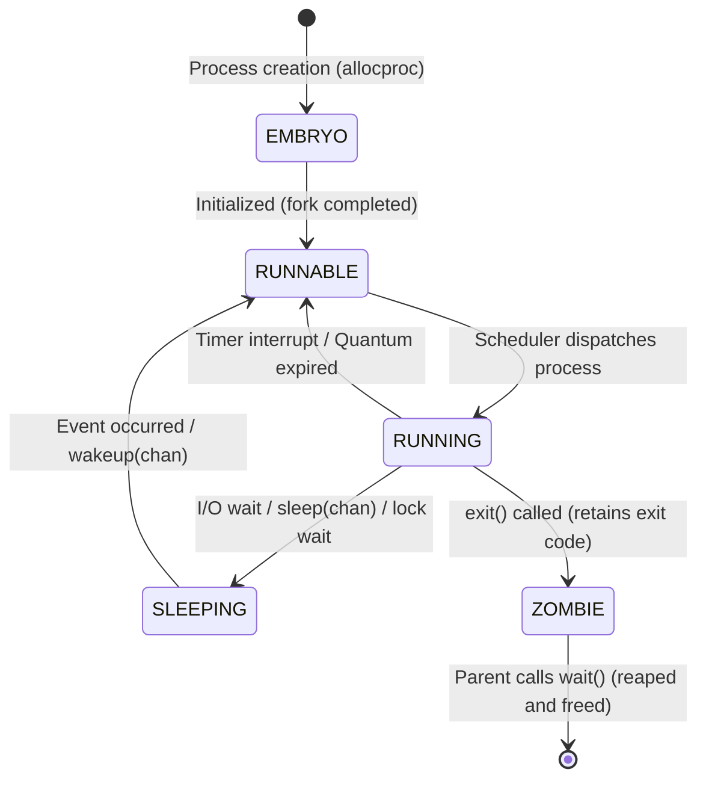

# CSE 313 (Operating Systems) — 2018 Final Solutions (Questions 1 to 4)

---

## Question 1(a)
**Draw the Processes State Transition Diagram. Include the following states: Embryo, Running, Runnable, Zombie, Sleeping.**

### Answer:
The state transitions represent the lifecycle of a process in standard Unix-like kernels (e.g., xv6):



- **EMBRYO:** Newly allocated process memory structure (PCB) currently being populated by `fork()`.
- **RUNNABLE:** Process is ready to execute and waiting in the CPU run queue.
- **RUNNING:** Process currently has control of the CPU core and is executing instructions.
- **SLEEPING:** Process is blocked waiting for an I/O completion, timer event, or lock release.
- **ZOMBIE:** Process has executed `exit()`; its resources are released, but its PCB and exit code remain in the process table until collected by its parent via `wait()`.

### Sources:
- `2. ProcessAndThread-week2-RRR.pdf` (Slides 10–14: Process States and Transitions).

### Link to Notes:
- [[Process Lifecycle and State Transitions]]
- [[Process Concepts and Memory Layout]]
- [[Process Forking and Zombie Orphan Example]]

---

## Question 1(b)
**Given a basic spinlock, Assume that locking the spinlock takes A time units (if no one is holding the lock); unlock also takes A time units. Assume further that a context switch takes C time units, and that a time slice is T time units long.**

**Assume this code sequence, executed by two threads on one processor at roughly the same time:**

```c
mutex_lock();
do_something(); // takes no time to execute
mutex_unlock();
```

- **(i) What is the best-case time for the two threads on one CPU to finish this code sequence?**
- **(ii) What is the worst-case time for the two threads to finish this code sequence? Assume that only three context switches can occur at a maximum.**
- **(iii) If the spin lock is instead changed to a queue-based lock, how does that change the worst-case time?**

### Answer:

#### (i) Best-Case Execution Time:
In the best case, Thread 1 acquires the lock, completes, and unlocks during its initial time slice. Then a single context switch occurs, and Thread 2 acquires the lock, completes, and unlocks without ever spinning:
- Thread 1: `mutex_lock()` ($A$) + `do_something()` ($0$) + `mutex_unlock()` ($A$) $= 2A$.
- Context switch to Thread 2: $C$.
- Thread 2: `mutex_lock()` ($A$) + `do_something()` ($0$) + `mutex_unlock()` ($A$) $= 2A$.
$$\mathbf{\text{Best-Case Time} = 2A + C + 2A = 4A + C}$$

#### (ii) Worst-Case Execution Time (Max 3 Context Switches):
In the worst case on a single uniprocessor:
1. Thread 1 acquires the lock ($A$). Immediately after acquiring the lock (before unlocking), Thread 1's time quantum $T$ expires! (Time spent $= T$).
2. Context switch to Thread 2: $C$.
3. Thread 2 attempts `mutex_lock()`. Because Thread 1 holds the lock, Thread 2 **spins wastefully for its entire time slice** $T$! (Time spent $= T$).
4. Context switch back to Thread 1: $C$.
5. Thread 1 resumes, executes `mutex_unlock()` ($A$), and finishes. (Time spent $= A$).
6. Context switch to Thread 2: $C$.
7. Thread 2 resumes, successfully executes `mutex_lock()` ($A$) + `mutex_unlock()` ($A$) $= 2A$.

Summing all phases:
$$\text{Total} = T + C + T + C + A + C + 2A = \mathbf{2T + 3C + 3A}$$

#### (iii) Impact of a Queue-Based (Blocking) Lock:
With a queue-based lock (such as a semaphore or mutex with sleep/wakeup):
- When Thread 2 attempts to acquire the lock and finds it held by Thread 1, **Thread 2 does NOT spin for time $T$**.
- Instead, Thread 2 immediately blocks, voluntarily yields the CPU, and causes an immediate context switch back to Thread 1!
- The entire wasted spinning time slice $T$ is eliminated, drastically reducing the worst-case time to approximately:
  $$\mathbf{T + 3C + 3A} \quad \text{(or } 2C + 4A \text{ if Thread 1 finishes immediately)}$$

### Sources:
- `4. IPC-week-4-5-RRR.pptx` (Slides 16–28: Spinlocks, Busy Waiting overhead vs Sleep).

### Link to Notes:
- [[Race Conditions and Critical-Section Problem]]
- [[Peterson's Algorithm and Hardware Mutual Exclusion]]
- [[Semaphores and Synchronization Primitives]]

---

## Question 1(c)
**You are given a new atomic function, called `FetchAndSubtract()`. It executes as a single atomic instruction, and is defined as follows:**

```c
int FetchAndSubtract(int *location) {
    int value = *location;    // read the value pointed to by location
    *location = value - 1;    // decrement it and store result back
    return value;            // return old value
}
```

**You are given the task: write the `lock_init()`, `lock()`, and `unlock()` functions (and also Define a `lock_t` structure) that use `FetchAndSubtract()` to implement a working lock.**

### Answer:
To implement a mutual exclusion lock using `FetchAndSubtract()`, we initialize the lock state to `1` (indicating free/available):
- When a thread tries to acquire the lock, it atomically decrements the location.
- If the old value returned was `1`, the thread successfully transitioned the lock from $1 \to 0$ and acquired the lock.
- If the old value returned was $\le 0$, another thread already holds the lock; the thread must spin and repeatedly retry (or restore the value and wait).

```c
typedef struct {
    int flag;
} lock_t;

void lock_init(lock_t *lock) {
    lock->flag = 1; // 1 means unlocked/available, 0 or less means locked
}

void lock(lock_t *lock) {
    // Atomically decrement flag. If old value was 1, lock is acquired!
    while (FetchAndSubtract(&(lock->flag)) <= 0) {
        // Did not acquire lock. Restore counter to prevent underflow:
        // We can atomically restore or spin until flag becomes 1 again:
        lock->flag = 0; // Reset to 0 while spinning
        while (lock->flag <= 0) {
            // Spin-wait (or yield)
        }
    }
}

void unlock(lock_t *lock) {
    lock->flag = 1; // Release the lock
}
```

### Sources:
- `4. IPC-week-4-5-RRR.pptx` (Slides 24–28: Hardware Mutual Exclusion, TSL, XCHG).

### Link to Notes:
- [[Peterson's Algorithm and Hardware Mutual Exclusion]]
- [[Race Conditions and Critical-Section Problem]]

---

## Question 2(a)
**The variable counter, is shared within process A and process B. The initial value is counter = 0 before execution of either process. Here, R0 is a register.**

| Process A | Process B |
|---|---|
| `LOAD (counter, R0)` | `LOAD (counter, R0)` |
| `ADD (R0, 1, R0)` | `ADD (R0, 2, R0)` |
| `STORE (R0, counter)` | `STORE (R0, counter)` |

- **(i) Add semaphores (with initial values) so that the final value of counter is 2.**
- **(ii) Add semaphores (with initial values) so that the final value of counter is not 3.**

### Answer:

#### (i) Final value must be 2:
For the final value to be 2, Process B must execute completely *after* Process A has read or written 0, or Process B's write must be the final store:
- **Solution using an ordering semaphore `s = 0`:**
  Have Process A run first, but have Process B overwrite it, OR force Process A to run first and Process B to load 0:
  ```c
  semaphore s = 0;

  // Process A:
  LOAD (counter, R0)
  ADD (R0, 1, R0)
  STORE (R0, counter) // writes counter = 1
  signal(&s);

  // Process B:
  wait(&s);
  LOAD (counter, R0) // loads 1? No! If we want final value 2:
  ```
  Wait! If Process A writes 1, and Process B loads 1 and adds 2, counter becomes 3!
  To get final value **2**, Process B must read `counter = 0`, add 2, and write 2 **after** Process A writes 1:
  ```c
  semaphore s1 = 0, s2 = 0;

  // Process B:
  LOAD (counter, R0) // loads 0 (R0 = 0)
  signal(&s1);        // tell A to proceed
  wait(&s2);          // wait for A to finish writing
  ADD (R0, 2, R0)    // R0 = 2
  STORE (R0, counter)// writes counter = 2!

  // Process A:
  wait(&s1);
  LOAD (counter, R0) // loads 0
  ADD (R0, 1, R0)    // R0 = 1
  STORE (R0, counter)// writes counter = 1
  signal(&s2);        // wake up B to clobber counter with 2!
  ```

#### (ii) Final value must NOT be 3:
If both processes execute with mutual exclusion in serial order, the final value will be $0 + 1 + 2 = 3$.
To guarantee that the final value is **NOT 3**, we force an interleaved race condition so that one process overwrites the other (producing either 1 or 2):
```c
semaphore s = 0;

// Process A:
LOAD (counter, R0)   // A reads 0
signal(&s);          // signal B to read 0 before A writes!
ADD (R0, 1, R0)
STORE (R0, counter)  // A writes 1

// Process B:
wait(&s);            // B waits until A has read 0
LOAD (counter, R0)   // B reads 0
ADD (R0, 2, R0)
STORE (R0, counter)  // B writes 2 (clobbering A's write)
```
Final counter value is **2**, which is strictly **not 3**.

### Sources:
- `4. IPC-week-4-5-RRR.pptx` (Slides 3–15, 29–42: Race conditions, Semaphores).

### Link to Notes:
- [[Race Conditions and Critical-Section Problem]]
- [[Semaphores and Synchronization Primitives]]

---

## Question 2(b)
**You wrote a piece of code with four threads (1-4) and four locks (A-D).**
- **Thread 1 grabs Locks A and B (in some order)**
- **Thread 2 grabs Locks B and C (in some order)**
- **Thread 3 grabs Locks C and D (in some order)**
- **Thread 4 grabs Locks D and A (in some order)**
**Is it possible that this code might result in deadlock? Briefly explain.**

### Answer:
**YES, deadlock is strictly possible.**

#### Detailed Explanation:
Deadlock will occur if each thread acquires its first lock and then attempts to acquire its second lock, forming a **circular wait**:
Suppose the execution orders are:
- Thread 1 grabs Lock A first, then requests Lock B.
- Thread 2 grabs Lock B first, then requests Lock C.
- Thread 3 grabs Lock C first, then requests Lock D.
- Thread 4 grabs Lock D first, then requests Lock A.

If all four threads execute concurrently and interleave as follows:
1. Thread 1 acquires Lock A.
2. Thread 2 acquires Lock B.
3. Thread 3 acquires Lock C.
4. Thread 4 acquires Lock D.

Now:
- Thread 1 requests Lock B $\implies$ blocked by Thread 2.
- Thread 2 requests Lock C $\implies$ blocked by Thread 3.
- Thread 3 requests Lock D $\implies$ blocked by Thread 4.
- Thread 4 requests Lock A $\implies$ blocked by Thread 1.

This creates the classic Coffman circular wait:
$$\text{Thread 1} \to \text{Lock B} \to \text{Thread 2} \to \text{Lock C} \to \text{Thread 3} \to \text{Lock D} \to \text{Thread 4} \to \text{Lock A} \to \text{Thread 1}$$
Since all four Coffman conditions are satisfied, the system is deadlocked permanently.

### Sources:
- `5. Deadlocks-week6-7-RRR.pdf` (Slides 8–10: Conditions for Deadlocks, Resource Graphs).

### Link to Notes:
- [[Deadlock Fundamentals and Coffman Conditions]]
- [[Resource Allocation Graphs and Deadlock Modeling]]
- [[Deadlock Prevention and Avoidance Strategies]]

---

## Question 2(c)
**Consider the following program:**

```c
1   int main() {
2       int count = 1;
3       int pid = 0, pid2 = 0;
4       if ((pid = fork())) {
5           count = count + 2;
6           printf("%d ", count);
7       }
8
9       if (count == 1) {
10          count++;
12          pid2 = fork();
13          printf("%d ", count);
14      }
15
16      if (pid2) {
17          wait(pid2, NULL, 0);
18          count = count * 2;
19          printf("%d ", count);
20      }
21  }
```

- **(i) How many processes are created during the execution of this program? Explain briefly.**
- **(ii) List all the possible outputs of the program.**

### Answer:

#### (i) Total Number of Processes Created:
Let $P_0$ be the initial parent process.
1. **Line 4:** $P_0$ executes `fork()`.
   - In parent $P_0$: `pid` is positive (child's PID).
   - In child $P_1$: `pid = 0`.
   - So **$P_1$ is created** (Total: 2 processes).
2. **Line 4 `if` branch:**
   - For $P_0$: `(pid = fork())` is non-zero (TRUE).
     - $P_0$ executes lines 5–6: `count = 1 + 2 = 3`. Prints `"3 "`.
   - For $P_1$: `pid = 0` (FALSE).
     - $P_1$ skips lines 5–6. Its `count` remains `1`.
3. **Line 9 `if (count == 1)` branch:**
   - For $P_0$: `count == 3` $\implies$ condition is FALSE. Skips lines 10–14.
   - For $P_1$: `count == 1` $\implies$ condition is TRUE!
     - $P_1$ increments `count++` $\implies count = 2$.
     - **Line 12:** $P_1$ executes `pid2 = fork()`.
     - **$P_2$ is created** (Total: 3 processes).
     - Both $P_1$ (parent) and $P_2$ (child) print `"2 "`.
4. **Line 16 `if (pid2)` branch:**
   - For $P_0$: `pid2 = 0` $\implies$ FALSE. Skips lines 17–20.
   - For $P_2$: `pid2 = 0` in child $\implies$ FALSE. Skips lines 17–20.
   - For $P_1$: `pid2` is child $P_2$'s PID $\implies$ TRUE!
     - $P_1$ waits for $P_2$ to terminate via `wait()`.
     - Then executes `count = count * 2 = 2 * 2 = 4`.
     - Prints `"4 "`.

**Total processes created:** **3 processes** (Original parent $P_0$, child $P_1$, and grandchild $P_2$).

#### (ii) All Possible Outputs of the Program:
- Prints emitted:
  - $P_0$ prints `"3 "` (independent of $P_1$ and $P_2$).
  - $P_1$ prints `"2 "` (at line 13).
  - $P_2$ prints `"2 "` (at line 13).
  - $P_1$ prints `"4 "` (at line 19, strictly *after* $P_2$ finishes).
- Due to `wait(pid2, ...)`:
  - Both `"2 "` outputs must be printed before `"4 "` can be printed!
  - `"3 "` can appear anywhere in the order relative to the others.
- Therefore, the string contains one `'3'`, two `'2'`s, and one `'4'`, subject to the constraint that both `'2'`s precede `'4'`:
  Valid interleavings:
  - `3 2 2 4`
  - `2 3 2 4`
  - `2 2 3 4`
  - `2 2 4 3`

### Sources:
- `2. ProcessAndThread-week2-RRR.pdf` (Slides 20–32: `fork()`, `wait()`, memory isolation).

### Link to Notes:
- [[Process Creation and Termination Operations]]
- [[Process Forking and Zombie Orphan Example]]
- [[Problem — Fork Execution Tree and Process Tracing]]

---

## Question 3(a)
**Let's examine a program having two threads:**

Thread 1:
```c
pending = 1;
while (pending) {
    printf("hello\n");
}
```

Thread 2:
```c
pending = 0;
```

**How could we re-write the code such that Thread 2 would only run after "hello" has been printed at least twice? You can use any synchronization primitive of your choice.**

### Answer:
We can synchronize Thread 1 and Thread 2 using a counting semaphore `sem` initialized to `0`:

```c
#include <semaphore.h>

sem_t sem;
int hello_count = 0;
volatile int pending = 1;

void init() {
    sem_init(&sem, 0, 0); // Initialized to 0
}

// Thread 1:
void *thread1(void *arg) {
    while (pending) {
        printf("hello\n");
        hello_count++;
        if (hello_count == 2) {
            sem_post(&sem); // Signal Thread 2 after printing at least twice
        }
    }
    return NULL;
}

// Thread 2:
void *thread2(void *arg) {
    sem_wait(&sem); // Blocks until Thread 1 prints "hello" at least twice
    pending = 0;    // Stops Thread 1's loop
    return NULL;
}
```

### Sources:
- `4. IPC-week-4-5-RRR.pptx` (Slides 29–42: Semaphores, Thread synchronization).

### Link to Notes:
- [[Semaphores and Synchronization Primitives]]
- [[Classic Synchronization Solutions]]

---

## Question 3(b)
**Scheduling policies can be easily depicted with some graphs. For example, let's say we run scheduler S for 1 time unit, job A for 5 time units, run scheduler S again for 1 time unit, and then run job B for time units.**

- **(i) Draw a graph of ROUND-ROBIN scheduling for jobs A (arriving at T = 0), B (arriving at T = 5), and C (arriving at T = 10), each running for 6 time-units. Assume a 2 time unit time slice; also assume that the scheduler (S) takes 1 time unit to make a scheduling decision. Make sure to label the x-axis appropriately.**
- **(ii) What is the average RESPONSE TIME for jobs A, B and C?**
- **(iii) What is the average TURNAROUND TIME for jobs A, B and C?**

### Answer:

#### (i) Step-by-Step Execution Trace ($q = 2$, $S = 1$):
- $t=0$: Job A arrives (Burst 6). Scheduler runs $S$ from $t=0$ to $t=1$.
- $t=1$: Job A runs quantum 2 (from $t=1$ to $t=3$). Remaining A: 4. Queue: $[A]$.
- $t=3$: Scheduler $S$ runs from $t=3$ to $t=4$.
- $t=4$: Job A runs quantum 2 (from $t=4$ to $t=6$).
  - At $t=5$: **Job B arrives** (Burst 6). Enters queue.
  - At $t=6$: Job A quantum ends (Remaining A: 2). Queue: $[B, A]$.
- $t=6$: Scheduler $S$ runs from $t=6$ to $t=7$.
- $t=7$: Job B runs quantum 2 (from $t=7$ to $t=9$). Remaining B: 4. Queue: $[A, B]$.
- $t=9$: Scheduler $S$ runs from $t=9$ to $t=10$.
  - At $t=10$: **Job C arrives** (Burst 6). Enters queue. Queue: $[A, B, C]$.
- $t=10$: Job A runs its final 2 units (from $t=10$ to $t=12$). **Job A completes at $t=12$!**
- $t=12$: Scheduler $S$ runs from $t=12$ to $t=13$. Queue: $[B, C]$.
- $t=13$: Job B runs quantum 2 (from $t=13$ to $t=15$). Remaining B: 2. Queue: $[C, B]$.
- $t=15$: Scheduler $S$ runs from $t=15$ to $t=16$.
- $t=16$: Job C runs quantum 2 (from $t=16$ to $t=18$). Remaining C: 4. Queue: $[B, C]$.
- $t=18$: Scheduler $S$ runs from $t=18$ to $t=19$.
- $t=19$: Job B runs final 2 units (from $t=19$ to $t=21$). **Job B completes at $t=21$!** Queue: $[C]$.
- $t=21$: Scheduler $S$ runs from $t=21$ to $t=22$.
- $t=22$: Job C runs quantum 2 (from $t=22$ to $t=24$). Remaining C: 2. Queue: $[C]$.
- $t=24$: Scheduler $S$ runs from $t=24$ to $t=25$.
- $t=25$: Job C runs final 2 units (from $t=25$ to $t=27$). **Job C completes at $t=27$!**

#### Gantt Chart:
```
| S | A | S | A | S | B | S | A  | S  | B  | S  | C  | S  | B  | S  | C  | S  | C  |
0   1   3   4   6   7   9  10   12  13  15  16  18  19  21  22  24  25  27
```

#### (ii) Average Response Time:
- $T_{\text{resp}} = \text{First Run Time} - \text{Arrival Time}$
- Job A: First runs at $t=1$, arrived at $0 \implies 1 - 0 = 1$.
- Job B: First runs at $t=7$, arrived at $5 \implies 7 - 5 = 2$.
- Job C: First runs at $t=16$, arrived at $10 \implies 16 - 10 = 6$.
$$\mathbf{\text{Average Response Time} = \frac{1 + 2 + 6}{3} = \frac{9}{3} = 3.0\text{ time units}}$$

#### (iii) Average Turnaround Time:
- $T_{\text{turn}} = \text{Completion Time} - \text{Arrival Time}$
- Job A: Completes at $12$, arrived at $0 \implies 12 - 0 = 12$.
- Job B: Completes at $21$, arrived at $5 \implies 21 - 5 = 16$.
- Job C: Completes at $27$, arrived at $10 \implies 27 - 10 = 17$.
$$\mathbf{\text{Average Turnaround Time} = \frac{12 + 16 + 17}{3} = \frac{45}{3} = 15.0\text{ time units}}$$

### Sources:
- `3. Scheduling-week-3-RRR.pdf` (Slides 12–25, 38–43: Round Robin, Context switch overhead).

### Link to Notes:
- [[Interactive Scheduling Algorithms]]
- [[Scheduling Metrics and Burst Estimation Formulas]]
- [[Problem — CPU Scheduling Algorithm Simulation and Gantt Chart]]

---

## Question 3(c)
**Consider the producer/consumer problem and the (broken) solution mentioned below. Briefly describe why solution is broken, and demonstrate it with a specific example of thread interleaving (Hint: you can assume two consumers and one producer).**

```c
// Producer:
void *producer(void *arg) {
    while (1) {
        mutex_lock(&mutex);        // p1
        if (count == MAX)          // p2
            cond_wait(&empty, &mutex); // p3
        put(i);                    // p4
        cond_signal(&full);        // p5
        mutex_unlock(&mutex);      // p6
    }
}
// Consumer:
void *consumer(void *arg) {
    while (1) {
        mutex_lock(&mutex);        // c1
        if (count == 0)            // c2
            cond_wait(&full, &mutex); // c3
        int tmp = get();           // c4
        cond_signal(&empty);       // c5
        mutex_unlock(&mutex);      // c6
        printf("%d\n", tmp);
    }
}
```

### Answer:
The solution is broken because it uses an **`if` statement instead of a `while` loop** to check the condition (`if (count == 0)` and `if (count == MAX)`). Under standard **Mesa semantics** (signal-and-continue), signaling a thread only moves it to the ready queue; by the time it re-acquires the mutex, another thread may have altered the shared buffer state!

#### Concrete Interleaving with 2 Consumers ($C_1, C_2$) and 1 Producer ($P$):
Suppose buffer capacity `MAX = 1`, and initially `count = 0`.
1. **$C_1$ runs:** Acquires mutex (c1), checks `if (count == 0)` (c2, TRUE), and executes `cond_wait(&full, &mutex)` (c3). $C_1$ releases mutex and sleeps.
2. **$P$ runs:** Acquires mutex (p1), checks `if (count == MAX)` (p2, FALSE), executes `put(i)` (p4, buffer now has 1 item, `count = 1`). Executes `cond_signal(&full)` (p5), which wakes up $C_1$ (moving $C_1$ to ready list), and releases mutex (p6).
3. **$C_2$ sneaks in before $C_1$ re-acquires the mutex:**
   $C_2$ is scheduled, acquires mutex (c1), checks `if (count == 0)` (c2, FALSE because count is 1). $C_2$ executes `get()` (c4), extracts the single item, sets `count = 0`, signals empty (c5), and releases mutex (c6).
4. **$C_1$ now resumes execution inside the monitor:**
   $C_1$ re-acquires the mutex and returns from `cond_wait()` (c3).
   Because of the `if` statement, **$C_1$ does not re-check `count`**!
   $C_1$ proceeds directly to line c4: `int tmp = get()`.
5. **CRASH:** The buffer is completely empty (`count == 0`). Calling `get()` on an empty buffer causes a **buffer underflow / segmentation fault**!

**Fix:** Replace `if` with `while`:
```c
while (count == 0)
    cond_wait(&full, &mutex);
```

### Sources:
- `4. IPC-week-4-5-RRR.pptx` (Slides 43–52: Monitors, Condition variables, Hoare vs Mesa semantics).

### Link to Notes:
- [[Monitors and Condition Variables]]
- [[Classic Synchronization Solutions]]

---

## Question 4(a)
**A typical OS provides some APIs to create processes. `fork()`, `exec()`, and `wait()` can be used combinedly for that purpose. Write some code that uses these system calls to launch a new child process, have the child execute a program named "hello" (with no arguments), and have the parent wait for the child to complete.**

### Answer:

```c
#include <stdio.h>
#include <stdlib.h>
#include <unistd.h>
#include <sys/wait.h>

int main() {
    pid_t pid = fork();

    if (pid < 0) {
        // Fork failed
        perror("fork failed");
        exit(1);
    } else if (pid == 0) {
        // Child process
        char *args[] = {"./hello", NULL};
        execvp(args[0], args);

        // If execvp returns, an error occurred
        perror("execvp failed");
        exit(1);
    } else {
        // Parent process
        int status;
        waitpid(pid, &status, 0); // Wait for child process to complete

        if (WIFEXITED(status)) {
            printf("Child exited with status %d\n", WEXITSTATUS(status));
        }
    }
    return 0;
}
```

### Sources:
- `2. ProcessAndThread-week2-RRR.pdf` (Slides 20–32: Process Creation, `fork()`, `exec()`, `wait()`).

### Link to Notes:
- [[Process Creation and Termination Operations]]
- [[Process Forking and Zombie Orphan Example]]

---

## Question 4(b)
**Assume an OS with MLFQ (multi-level feedback queue) scheduler.**
**Here is a timeline of what happens when two CPU-bound (no I/O) jobs, A and B run:**

| Time interval (ms) | Running job |
|---|---|
| 0-10 | A |
| 10-20 | B |
| 20-40 | A |
| 40-60 | B |
| 60-115 | A |
| 115-170 | B |
| 170-225 | A |
| 225-280 | B |
| ... | ... |
| 500-510 | A |
| 510-520 | B |

- **(i) How many queues do you think there are in this MLFQ scheduler?**
- **(ii) How long is the time slice at the top-most (high priority) queue?**
- **(iii) How long is the time slice at the bottom-most (low priority) queue?**
- **(iv) How often do processes get moved back to the topmost queue?**
- **(v) Why does the scheduling policy MLFQ move processes to higher priority levels (i.e., the topmost queue) sometimes? Briefly explain.**

### Answer:
- **(i) Number of Queues:** **3 queues ($Q_0, Q_1, Q_2$)**.
  - Top Queue $Q_0$: Jobs run for intervals of 10 ms ($0-10$ for A, $10-20$ for B).
  - Middle Queue $Q_1$: Jobs run for intervals of 20 ms ($20-40$ for A, $40-60$ for B).
  - Bottom Queue $Q_2$: Jobs run for intervals of 55 ms ($60-115$ for A, $115-170$ for B, $170-225$ for A, $225-280$ for B).
- **(ii) Top-most Queue Time Slice:** **$10\text{ ms}$**.
- **(iii) Bottom-most Queue Time Slice:** **$55\text{ ms}$** ($115 - 60 = 55\text{ ms}$).
- **(iv) Frequency of Priority Boost:** Every **$500\text{ ms}$**. (Notice at $t=500$, jobs A and B are reset back to running in 10 ms bursts: $500-510$ for A, $510-520$ for B).
- **(v) Rationale for Priority Boost:**
  1. *Starvation Prevention:* If CPU-bound jobs drop to the lowest queue and new interactive jobs continually arrive, the CPU-bound jobs would starve. Boosting resets all jobs so everyone gets CPU service.
  2. *Adapting to Behavior Changes:* If a previously CPU-bound process changes phase and becomes interactive, boosting allows it to be treated as high-priority again.

### Sources:
- `3. Scheduling-week-3-RRR.pdf` (Slides 45–50: Multilevel Feedback Queues).

### Link to Notes:
- [[Interactive Scheduling Algorithms]]
- [[CPU Scheduling Principles and Criteria]]

---

## Question 4(c)
**With the round robin (RR) scheduling policy, a question arises when a new job arrives in the system: should we put the job at the front of the RR queue, or the back? Does this subtle difference make a difference, or does RR behave pretty much the same way either way? Briefly explain.**

### Answer:
**It makes a significant difference!**
1. **Putting New Jobs at the BACK of the Queue (Standard FIFO Policy):**
   - *Behavior:* Preserves fairness. Existing ready processes that have been waiting get their turn before the newly arrived newcomer.
   - *Downside:* Response time for new interactive jobs is slightly longer.
2. **Putting New Jobs at the FRONT of the Queue:**
   - *Behavior:* Minimizes response time for new tasks (immediate execution).
   - *Severe Hazard (Starvation):* If new jobs arrive at a rate equal to or faster than the quantum completion rate, existing ready jobs at the back of the queue will **starve indefinitely**!
   - *Gaming the System:* A malicious user could spawn short processes repeatedly to monopolize the CPU.

### Sources:
- `3. Scheduling-week-3-RRR.pdf` (Slides 38–44: Round Robin Scheduling).

### Link to Notes:
- [[Interactive Scheduling Algorithms]]
- [[CPU Scheduling Principles and Criteria]]
