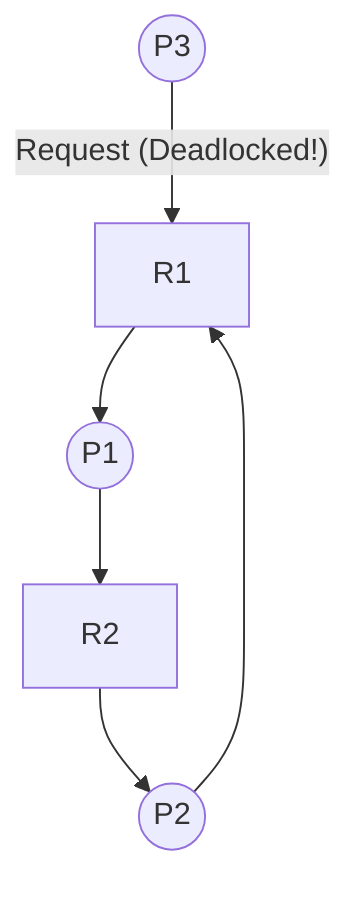

# CSE 313 (Operating Systems) — 2019 Final Solutions (Questions 1 to 4)

---

## Question 1(a)
**Consider the following workload:**

| Process | Priority (Lowest Number has Highest Priority) | Duration (sec) | Arrival Time (sec) |
|---|:---:|:---:|:---:|
| **P1** | 1 | 60 | 0 |
| **P2** | 1 | 25 | 30 |
| **P3** | 2 | 80 | 50 |
| **P4** | 3 | 20 | 70 |

**Draw the Gantt chart and calculate the average turnaround time for each of the following scheduling algorithms:**
- **Shortest Remaining Time Next (SRTF)**
- **Priority Scheduling. Within the same priority class, schedule according to Round Robin with quantum 20 sec. Each priority class maintains separate FIFO queue.**

### Answer:

---

### 1. Shortest Remaining Time Next (SRTF)

#### Execution Trace:
- $t=0$: Only $P_1$ arrives (Remaining: 60). $P_1$ executes.
- $t=30$: $P_2$ arrives (Duration 25). $P_1$ remaining is $60 - 30 = 30$.
  - Compare: $25 < 30 \implies \mathbf{P_1}$ **is preempted!** $P_2$ starts executing.
- $t=50$: $P_3$ arrives (Duration 80). $P_2$ remaining is $25 - 20 = 5$.
  - Compare: $5 < 80 \implies P_2$ continues.
- $t=55$: **$P_2$ completes at $t=55$!** ($C_2 = 55$).
  - Ready pool: $P_1$ (Remaining 30), $P_3$ (Remaining 80).
  - Shortest is $P_1$ (30). $P_1$ resumes running.
- $t=70$: $P_4$ arrives (Duration 20). $P_1$ has run 15s ($55 \to 70$), remaining $30 - 15 = 15$.
  - Compare: $P_1$ remaining (15) vs $P_4$ burst (20). Since $15 < 20$, $P_1$ continues!
- $t=85$: **$P_1$ completes at $t=85$!** ($C_1 = 85$).
  - Ready pool: $P_4$ (Burst 20), $P_3$ (Burst 80).
  - Shortest is $P_4$ (20). $P_4$ runs from $t=85$ to $t=105$.
- $t=105$: **$P_4$ completes at $t=105$!** ($C_4 = 105$).
  - Ready pool: $P_3$ (80). $P_3$ runs from $t=105$ to $t=185$.
- $t=185$: **$P_3$ completes at $t=185$!** ($C_3 = 185$).

#### Gantt Chart (SRTF):
```
|    P1    |    P2    |    P1    |   P4   |                P3                |
0         30         55         85      105                               185
```

#### Metrics Table (SRTF):
- $T_{\text{turn}}(P_1) = 85 - 0 = 85\text{ s}$
- $T_{\text{turn}}(P_2) = 55 - 30 = 25\text{ s}$
- $T_{\text{turn}}(P_3) = 185 - 50 = 135\text{ s}$
- $T_{\text{turn}}(P_4) = 105 - 70 = 35\text{ s}$
$$\mathbf{\text{Average Turnaround Time (SRTF)} = \frac{85 + 25 + 135 + 35}{4} = \frac{280}{4} = 70.0\text{ seconds}}$$

---

### 2. Priority Scheduling (RR $q=20$ within same priority class)

- Priority classes:
  - Class 1 (Highest): $P_1, P_2$.
  - Class 2: $P_3$.
  - Class 3 (Lowest): $P_4$.
- Highest priority class 1 runs until completely empty!

#### Execution Trace:
- $t=0$: $P_1$ (Priority 1) arrives. Runs for quantum 20 (until $t=20$). Remaining $P_1 = 40$.
- $t=20$: Only $P_1$ in Priority 1 queue. Runs quantum 20 (until $t=40$). Remaining $P_1 = 20$.
  - *At $t=30$: $P_2$ (Priority 1) arrives.* Enqueued in Priority 1 queue.
- $t=40$: Quantum expires for $P_1$. Priority 1 queue: $[P_2, P_1]$.
  - $P_2$ runs for quantum 20 (until $t=60$). Remaining $P_2 = 25 - 20 = 5$.
  - *At $t=50$: $P_3$ (Priority 2) arrives.* Enqueued in Priority 2 queue.
- $t=60$: Priority 1 queue: $[P_1, P_2]$.
  - $P_1$ runs for quantum 20 (until $t=80$). **$P_1$ completes at $t=80$!** ($C_1 = 80$).
  - *At $t=70$: $P_4$ (Priority 3) arrives.* Enqueued in Priority 3 queue.
- $t=80$: $P_2$ runs remaining 5s (until $t=85$). **$P_2$ completes at $t=85$!** ($C_2 = 85$).
- Priority 1 is now empty. Next is Priority 2 ($P_3$):
  - $P_3$ has burst 80. It runs until completion ($t=85 + 80 = 165$). **$P_3$ completes at $t=165$!** ($C_3 = 165$).
- Priority 2 is now empty. Next is Priority 3 ($P_4$):
  - $P_4$ has burst 20. It runs until completion ($t=165 + 20 = 185$). **$P_4$ completes at $t=185$!** ($C_4 = 185$).

#### Gantt Chart (Priority Scheduling):
```
|  P1  |  P1  |  P2  |  P1  | P2 |                P3                |   P4   |
0      20     40     60     80   85                               165      185
```

#### Metrics Table (Priority Scheduling):
- $T_{\text{turn}}(P_1) = 80 - 0 = 80\text{ s}$
- $T_{\text{turn}}(P_2) = 85 - 30 = 55\text{ s}$
- $T_{\text{turn}}(P_3) = 165 - 50 = 115\text{ s}$
- $T_{\text{turn}}(P_4) = 185 - 70 = 115\text{ s}$
$$\mathbf{\text{Average Turnaround Time (Priority)} = \frac{80 + 55 + 115 + 115}{4} = \frac{365}{4} = 91.25\text{ seconds}}$$

### Sources:
- `3. Scheduling-week-3-RRR.pdf` (Slides 12–50: SRTF, Priority Scheduling, Round Robin).

### Link to Notes:
- [[Batch Scheduling Algorithms]]
- [[Interactive Scheduling Algorithms]]
- [[Problem — CPU Scheduling Algorithm Simulation and Gantt Chart]]

---

## Question 1(b)
**Four jobs have arrived at the same time in a batch system. Their expected run times are 9, 3, 5, and X. In what order should they be run to obtain optimal average turnaround time? (Hint: The jobs are non-preemptive)**

### Answer:
To minimize average turnaround time for non-preemptive jobs arriving simultaneously, the optimal scheduling algorithm is **Shortest Job First (SJF)**, ordering jobs in ascending order of their burst times.

Known job burst times: $3, 5, 9$.  
The position of $X$ depends strictly on its value relative to 3, 5, and 9:

1. **Case 1 ($X \le 3$):**  
   Optimal Order: $\mathbf{\langle X, 3, 5, 9 \rangle}$
2. **Case 2 ($3 < X \le 5$):**  
   Optimal Order: $\mathbf{\langle 3, X, 5, 9 \rangle}$
3. **Case 3 ($5 < X \le 9$):**  
   Optimal Order: $\mathbf{\langle 3, 5, X, 9 \rangle}$
4. **Case 4 ($X > 9$):**  
   Optimal Order: $\mathbf{\langle 3, 5, 9, X \rangle}$

*(In case of ties, any ordering between tied jobs achieves identical optimal average turnaround time).*

### Sources:
- `3. Scheduling-week-3-RRR.pdf` (Slides 26–31: Shortest Job First optimality proof).

### Link to Notes:
- [[Batch Scheduling Algorithms]]
- [[CPU Scheduling Principles and Criteria]]

---

## Question 1(c)
**Differentiate between an unsafe state and a deadlock state.**

### Answer:

| Dimension | Unsafe State | Deadlock State |
|---|---|---|
| **Definition** | A system state from which the OS **cannot guarantee** that all processes will finish if they all suddenly request their declared maximum claims. | A system state where two or more processes are **actively and permanently frozen**, waiting for events that only each other can cause. |
| **Deadlock Exists?** | **Not necessarily.** An unsafe state is NOT a deadlock; it merely creates the *potential* for deadlock if maximum demands materialize. | **Strictly YES.** The circular wait is already formed, and processes cannot proceed. |
| **Process State** | Processes are running and making forward progress normally. | Processes are in `BLOCKED`/`SLEEPING` state, making zero forward progress. |
| **Relationship** | $\text{Deadlock} \subset \text{Unsafe States} \subset \text{All States}$. | Deadlock is a fatal subset of unsafe states. |
| **Can we escape?** | **Yes.** If processes do not request their maximum declared needs all at once, an unsafe state can return to a safe state without ever deadlocking. | **No.** The system cannot escape without external intervention (process termination, rollback, or resource preemption). |

### Sources:
- `5. Deadlocks-week6-7-RRR.pdf` (Slides 25–27: Safe and Unsafe States).

### Link to Notes:
- [[Deadlock Prevention and Avoidance Strategies]]
- [[Deadlock Fundamentals and Coffman Conditions]]

---

## Question 2(a)
**Peterson's solution for achieving mutual exclusion for using critical regions is presented in Figure for Question 2(a):**
- **(i) Discuss priority inversion problem with a high-priority process, H, and a low-priority process, L.**
- **(ii) Does the same problem occur if round-robin scheduling is used instead of priority scheduling? Justify.**

### Answer:

#### (i) Priority Inversion Problem with Peterson's Solution:
- Suppose Process $L$ (Low priority) enters its critical region using Peterson's solution.
- Mid-way through $L$'s critical section, Process $H$ (High priority) becomes ready (e.g. an I/O event finishes).
- Because $H$ has higher priority, the priority scheduler preempts $L$ and dispatches $H$.
- $H$ executes `enter_region()` and attempts to enter the critical region:
  - It sets `interested[H] = TRUE`, `turn = H`.
  - Because $L$ is inside the critical section (`interested[L] == TRUE`), $H$ enters the busy-wait loop: `while (turn == H && interested[L]);`.
- **The Deadlock Trap:**
  Because $H$ is continually running its busy-wait loop and has higher priority than $L$, the CPU scheduler **never schedules process $L$**!
  Since $L$ never gets CPU cycles, $L$ can never reach `leave_region()` to release the critical region.
  Therefore, $H$ spins in an infinite loop forever, and $L$ starves completely!

#### (ii) Does the same problem occur under Round-Robin Scheduling?
**NO, the priority inversion deadlock does NOT occur under Round-Robin scheduling.**
- **Justification:** Round-Robin scheduling assigns CPU time slices fairly in round-robin order, completely ignoring static priority differences.
- Even if $H$ spins during its time slice, when $H$'s quantum expires, the scheduler forcibly preempts $H$ and allocates the next quantum to $L$.
- Process $L$ gets CPU cycles, makes forward progress, completes its critical section, and calls `leave_region()`, setting `interested[L] = FALSE`.
- When $H$ gets the CPU again, $H$'s `while` condition evaluates to FALSE, and $H$ safely enters the critical region without hanging.

### Sources:
- `4. IPC-week-4-5-RRR.pptx` (Slides 16–28: Peterson's Solution, Priority Inversion Problem).

### Link to Notes:
- [[Peterson's Algorithm and Hardware Mutual Exclusion]]
- [[Race Conditions and Critical-Section Problem]]
- [[Interactive Scheduling Algorithms]]

---

## Question 2(b)
**In the dining philosophers problem, let the following protocol be used: An even-numbered philosopher always picks up his left fork before picking up his right fork; an odd-numbered philosopher always picks up his right fork before picking up his left fork. Investigate whether this modified protocol prevents deadlock.**

### Answer:
**YES, this asymmetric protocol strictly prevents deadlock!**

#### Mathematical Proof:
1. Five philosophers ($P_0..P_4$) and five forks ($F_0..F_4$).
   - For philosopher $i$: Left fork is $F_i$, Right fork is $F_{(i+1)\%5}$.
2. Under the proposed rule:
   - Even philosophers ($P_0, P_2, P_4$): Pick up **left first**, then right.
     - $P_0$ requests $F_0$ (left), then $F_1$ (right).
     - $P_2$ requests $F_2$ (left), then $F_3$ (right).
     - $P_4$ requests $F_4$ (left), then $F_0$ (right).
   - Odd philosophers ($P_1, P_3$): Pick up **right first**, then left.
     - $P_1$ requests $F_2$ (right), then $F_1$ (left).
     - $P_3$ requests $F_4$ (right), then $F_3$ (left).
3. **Analysis of Contention on Shared Forks:**
   - Consider Fork $F_2$: Both $P_2$ (its left) and $P_1$ (its right) attempt to acquire $F_2$ as their **very first fork**!
   - Because $F_2$ is a single-instance binary semaphore, only one of $\{P_1, P_2\}$ can successfully acquire $F_2$; the other is immediately blocked before holding any fork at all.
   - Consider Fork $F_4$: Both $P_4$ (its left) and $P_3$ (its right) attempt to acquire $F_4$ as their **very first fork**! One is immediately blocked without holding any fork.
4. **Pigeonhole Argument:**
   - At most 3 philosophers can ever hold a first fork simultaneously.
   - With 5 forks and at most 3 held forks, at least 2 forks remain free.
   - At least one philosopher will find their second fork available, eat, and release both forks.
   - Hence, a circular wait chain cannot form $\implies$ **Deadlock is impossible!**

### Sources:
- `4. IPC-week-4-5-RRR.pptx` (Slides 44–48: Dining Philosophers Solutions).

### Link to Notes:
- [[Classic Synchronization Solutions]]
- [[Problem — Dining Philosophers Deadlock-Free Synchronization]]

---

## Question 2(c)
**State the four requirements that must be present in a solution to support mutual exclusion among processes sharing resources.**

### Answer:
Per Tanenbaum and Silberschatz:
1. **Mutual Exclusion:** No two processes may be simultaneously inside their critical regions accessing the same shared resource.
2. **Progress (No Outside Blocking):** No process executing outside its critical region (in its remainder section) may block other processes from entering their critical regions.
3. **Bounded Waiting (Starvation Freedom):** No process should have to wait indefinitely to enter its critical region; there must be an upper bound on the number of times other processes are granted access before a requesting process.
4. **Speed & CPU Independence:** No assumptions may be made about the relative speeds of processes or the number of hardware CPUs.

### Sources:
- `4. IPC-week-4-5-RRR.pptx` (Slides 7–9: Mutual Exclusion Requirements).

### Link to Notes:
- [[Race Conditions and Critical-Section Problem]]

---

## Question 2(d)
**Differentiate between microkernel and monolithic kernel architectures.**

### Answer:

| Feature | Monolithic Kernel (Linux, FreeBSD) | Microkernel (Mach, L4, QNX, Minix) |
|---|---|---|
| **Architecture Design** | All OS services (scheduler, memory management, file systems, IPC, device drivers) run in **kernel space (Ring 0)** as a single giant binary. | Only absolute minimum services (IPC, basic scheduling, low-level memory primitives) run in kernel space; all file systems, networking, and drivers run in **user space (Ring 3)**. |
| **Performance** | **Very high performance;** internal OS subsystem calls are direct C function calls with zero IPC/mode-switch overhead. | **Slightly lower performance;** extensive message passing and context switching between user servers and kernel. |
| **Reliability & Fault Isolation** | **Low fault isolation;** a crash or memory bug in a third-party device driver panics/crashes the entire OS. | **Extremely high fault isolation;** if a driver or file system crashes, only its user-space server dies and can be restarted by the OS without a system reboot. |
| **Extensibility & Modularity** | Difficult to modify; adding new features requires recompiling or inserting kernel modules. | Highly modular; new drivers/servers can be added dynamically as ordinary user programs. |
| **Kernel Binary Size** | Large (tens of megabytes). | Microscopic (tens of kilobytes). |

### Sources:
- `1. Introduction-week1-RRR-2026.pdf` (Slides 14–19: Monolithic vs Microkernel).

### Link to Notes:
- [[Operating System Structures and Functions]]

---

## Question 3(a)
**Consider a system with 4 processes: P1 through P4 and 3 resources types: A (9 units), B (3 units), C (6 Units). Current allocation of resources and maximum requirement of a process for each resource are given in Figure for Question 3(a). Determine whether the current state of this system is safe or not.**

Current Allocation Matrix ($CA$):
| Process | A | B | C |
|---|:---:|:---:|:---:|
| **P1** | 1 | 0 | 0 |
| **P2** | 6 | 1 | 2 |
| **P3** | 2 | 1 | 1 |
| **P4** | 0 | 0 | 2 |
| **Total** | 9 | 2 | 5 |

Maximum Requirement Matrix ($MaxReq$):
| Process | A | B | C |
|---|:---:|:---:|:---:|
| **P1** | 3 | 2 | 2 |
| **P2** | 6 | 1 | 3 |
| **P3** | 3 | 1 | 4 |
| **P4** | 4 | 2 | 2 |

### Answer:

#### Step 1: Calculate Available Vector ($A$):
Total resources: $E = (9, 3, 6)$.
Allocated resources: $\sum CA = (1+6+2+0, \; 0+1+1+0, \; 0+2+1+2) = (9, 2, 5)$.
$$A = E - \sum CA = (9-9, \; 3-2, \; 6-5) = \mathbf{(0, 1, 1)}$$

#### Step 2: Calculate Request / Need Matrix ($R = MaxReq - CA$):
- $R(P_1) = (3-1, \; 2-0, \; 2-0) = \mathbf{(2, 2, 2)}$
- $R(P_2) = (6-6, \; 1-1, \; 3-2) = \mathbf{(0, 0, 1)}$
- $R(P_3) = (3-2, \; 1-1, \; 4-1) = \mathbf{(1, 0, 3)}$
- $R(P_4) = (4-0, \; 2-0, \; 2-2) = \mathbf{(4, 2, 0)}$

#### Step 3: Execute Safety Algorithm ($Work = A = (0, 1, 1)$):
1. **Iteration 1:**
   - Compare Needs with $Work = (0, 1, 1)$:
     - $P_1: (2, 2, 2) \le (0, 1, 1) \implies$ FALSE ($2 > 0$).
     - $P_2: (0, 0, 1) \le (0, 1, 1) \implies$ **TRUE!**
     - $P_3: (1, 0, 3) \le (0, 1, 1) \implies$ FALSE ($1 > 0$).
     - $P_4: (4, 2, 0) \le (0, 1, 1) \implies$ FALSE ($4 > 0$).
   - Only **$P_2$** can be served first!
   - $P_2$ runs to completion and releases $(6, 1, 2)$:
     $$Work = (0, 1, 1) + (6, 1, 2) = \mathbf{(6, 2, 3)}$$
2. **Iteration 2:**
   - Compare remaining $\{P_1, P_3, P_4\}$ with $Work = (6, 2, 3)$:
     - $P_1: (2, 2, 2) \le (6, 2, 3) \implies$ **TRUE!**
   - We select **$P_1$**:
   - $P_1$ runs to completion and releases $(1, 0, 0)$:
     $$Work = (6, 2, 3) + (1, 0, 0) = \mathbf{(7, 2, 3)}$$
3. **Iteration 3:**
   - Compare remaining $\{P_3, P_4\}$ with $Work = (7, 2, 3)$:
     - $P_3: (1, 0, 3) \le (7, 2, 3) \implies$ **TRUE!**
   - We select **$P_3$**:
   - $P_3$ runs to completion and releases $(2, 1, 1)$:
     $$Work = (7, 2, 3) + (2, 1, 1) = \mathbf{(9, 3, 4)}$$
4. **Iteration 4:**
   - Only $P_4$ remains:
     - $P_4: (4, 2, 0) \le (9, 3, 4) \implies$ **TRUE!**
   - $P_4$ runs to completion and releases $(0, 0, 2)$:
     $$Work = (9, 3, 4) + (0, 0, 2) = \mathbf{(9, 3, 6)} = E$$

#### Conclusion:
Every process completes. The current state of this system is **SAFE**.
**Valid Safe Sequence:**
$$\mathbf{\langle P_2 \to P_1 \to P_3 \to P_4 \rangle}$$

### Sources:
- `Notes on algorithm simulation.pdf` (Pages 1–4: Banker's Algorithm for multiple resource types simulation).
- `5. Deadlocks-week6-7-RRR.pdf` (Slides 28–31).

### Link to Notes:
- [[Banker's Algorithm]]
- [[Banker's Algorithm Multi-Resource Step-by-Step Example]]

---

## Question 3(b)
**Suppose that there is a resource deadlock in a system. Give an example scenario to show that the set of processes deadlocked can include some processes that are not in the circular chain in the corresponding resource allocation graph.**

### Answer:

#### Concrete Scenario:
Consider 3 processes ($P_1, P_2, P_3$) and 2 single-unit resources ($R_1, R_2$):
1. **The Circular Deadlock:**
   - $P_1$ holds Resource $R_1$ and requests Resource $R_2$.
   - $P_2$ holds Resource $R_2$ and requests Resource $R_1$.
   - A circular chain exists: $P_1 \to R_2 \to P_2 \to R_1 \to P_1$. Both $P_1$ and $P_2$ are deadlocked.
2. **The Non-Circular Blocked Process ($P_3$):**
   - Now suppose a third process, $P_3$, holds no resources and issues a request for Resource $R_1$ ($P_3 \to R_1$).
   - $P_3$ is **NOT part of the circular chain** (there is no directed path from any node back to $P_3$).
   - However, because $R_1$ is held by deadlocked process $P_1$, and $P_1$ will never finish or release $R_1$, **Process $P_3$ will wait forever and is also permanently deadlocked**!



Thus, the set of deadlocked processes is $\{P_1, P_2, P_3\}$, where $P_3$ is deadlocked despite being outside the cycle.

### Sources:
- `5. Deadlocks-week6-7-RRR.pdf` (Slides 16–17: Deadlock detection with resource graphs).

### Link to Notes:
- [[Resource Allocation Graphs and Deadlock Modeling]]
- [[Deadlock Detection and Recovery Algorithms]]

---

## Question 3(c)
**Explain how to attack the following conditions to structurally prevent deadlock:**
- **(i) Hold and wait condition**
- **(ii) Circular wait condition**

### Answer:

#### (i) Attacking the Hold and Wait Condition:
- **Strategy 1 (All-or-Nothing Allocation Upfront):** Require every process to request **all** of its required resources at the very beginning before execution starts. If even one resource is unavailable, none are allocated, and the process waits. A process never holds resources while waiting.
- **Strategy 2 (Release-Before-Request):** If a process holding resources requires additional resources, it must first voluntarily release all currently held resources before making the new request.

#### (ii) Attacking the Circular Wait Condition (Global Linear Ordering):
- **Protocol:**
  1. Define a global one-to-one indexing function $F: R \to \mathbb{N}$ that assigns every resource type a unique natural number:
     $$F(\text{Tape}) = 1, \quad F(\text{Disk}) = 2, \quad F(\text{Printer}) = 3$$
  2. Rule: A process can only request resource $R_j$ if $F(R_j) > F(R_i)$ for all resources $R_i$ currently held by that process.
- **Proof of Deadlock Elimination:**
  Suppose a circular wait exists: $P_0 \to R_1 \to P_1 \to R_2 \to \dots \to P_k \to R_0 \to P_0$.
  The ordering rule implies:
  $$F(R_0) < F(R_1) < F(R_2) < \dots < F(R_k) < F(R_0)$$
  This yields $F(R_0) < F(R_0)$, which is a strict mathematical contradiction. Hence, no cycle can form.

### Sources:
- `5. Deadlocks-week6-7-RRR.pdf` (Slides 34, 36–37: Attacking Hold and Wait, Attacking Circular Wait).

### Link to Notes:
- [[Deadlock Prevention and Avoidance Strategies]]
- [[Deadlock Fundamentals and Coffman Conditions]]

---

## Question 4(a)
**Write down the steps in making a system call.**

### Answer:
*(Identical canonical procedure as 2017 Q1(c)):*
1. User library pushes parameters / loads them into CPU registers (`%rdi`, `%rsi`, `%rdx`).
2. System call number is loaded into `%rax`.
3. Trap instruction (`syscall` or `int 0x80`) is executed.
4. CPU hardware switches from User Mode (Ring 3) to Kernel Mode (Ring 0).
5. Hardware saves user PC (`RIP`), stack pointer (`RSP`), and processor flags on the kernel stack.
6. CPU jumps to the system call dispatcher address looked up in the IDT/MSR.
7. Kernel saves general registers, validates parameters, and verifies user memory buffers.
8. Kernel invokes the specific service routine (`sys_call_table[sys_num]`).
9. Service executes and places return value in `%rax`.
10. Kernel executes return-from-trap instruction (`sysret` or `iret`).
11. Hardware restores user mode and returns execution to user application.

### Sources:
- `1. Introduction-week1-RRR-2026.pdf` (Slides 20–26).

### Link to Notes:
- [[Dual-Mode Operation and System Calls]]

---

## Question 4(b)
**Differentiate between process context switching and thread context switching. Identify which of the following are "per process item" and which are "per thread item"?**
**Program Counter, Stack, Address Space, Global Variables, Registers, Directories, Child Process, Local Variables**

### Answer:

#### Differences Between Process Context Switch (PCS) and Thread Context Switch (TCS):
1. **Address Space:** PCS changes the active virtual memory address space (reloads CR3 register / page table base), invalidating the CPU Translation Lookaside Buffer (TLB). TCS switches execution between threads within the same address space, requiring **no page table change and no TLB flush**.
2. **Overhead & Speed:** TCS only saves and restores registers and stack pointers, running an order of magnitude faster than PCS.

#### Classification of Items:
- **Per Process Items (Shared by all threads in that process):**
  - **Address Space**
  - **Global Variables**
  - **Directories (open file descriptors / working directory)**
  - **Child Processes**
- **Per Thread Items (Private to each thread):**
  - **Program Counter**
  - **Registers**
  - **Stack**
  - **Local Variables** (stored on the thread's private stack)

### Sources:
- `2. ProcessAndThread-week2-RRR.pdf` (Slides 15–18, 33–36: Context Switching, Thread state vs Process state).

### Link to Notes:
- [[Threads and Multithreading Models]]
- [[Process Control Block and Context Switching]]

---

## Question 4(c)
**Illustrate the position of scheduler, process table and thread table in user-level thread implementation and kernel-level thread implementation with diagrams. With the help of your diagrams, justify that kernel-level thread implementation is better than user-level thread implementation with respect to blocking.**

### Answer:

#### Architectural Diagrams:

```
User-Level Threads (ULT):
+---------------------------------------------------+
| USER SPACE                                        |
|  [ Thread 1 ]  [ Thread 2 ]  [ Thread 3 ]         |
|  [ Thread Table ]                                 |
|  [ Run-time System / User-level Thread Scheduler] |
+---------------------------------------------------+
=================== KERNEL BOUNDARY =================
| KERNEL SPACE                                      |
|  [ Process Table ]   [ Kernel Scheduler ]         |
|  (Kernel only sees 1 process; unaware of threads) |
+---------------------------------------------------+

Kernel-Level Threads (KLT):
+---------------------------------------------------+
| USER SPACE                                        |
|  [ Thread 1 ]  [ Thread 2 ]  [ Thread 3 ]         |
+---------------------------------------------------+
=================== KERNEL BOUNDARY =================
| KERNEL SPACE                                      |
|  [ Process Table ]   [ Thread Table ]             |
|  [ Kernel Scheduler (schedules threads directly) ]|
+---------------------------------------------------+
```

#### Justification with Respect to Blocking:
1. **User-Level Threads Failure on Blocking:**
   - In ULT, the kernel is completely unaware that multiple threads exist inside the process; it only manages the single Process Table entry.
   - If Thread 1 issues a blocking system call (e.g., synchronous read from disk or network), the kernel transitions the **entire process** to the `BLOCKED` state.
   - Even though Thread 2 and Thread 3 are ready to compute, they cannot run! The entire application freezes until the I/O finishes.
2. **Kernel-Level Threads Superiority on Blocking:**
   - In KLT, the kernel maintains an individual entry for every thread in its kernel **Thread Table**.
   - When Thread 1 executes a blocking system call, the kernel scheduler only suspends **Thread 1**.
   - The kernel immediately schedules **Thread 2 or Thread 3** on the CPU! The application continues executing seamlessly without stalling.

### Sources:
- `2. ProcessAndThread-week2-RRR.pdf` (Slides 36–42: Implementing Threads in User Space vs Kernel Space).

### Link to Notes:
- [[Threads and Multithreading Models]]
- [[Process Lifecycle and State Transitions]]
