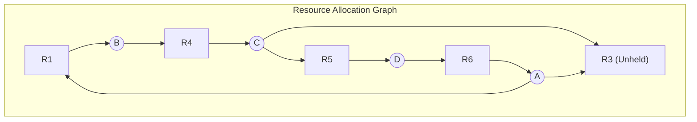
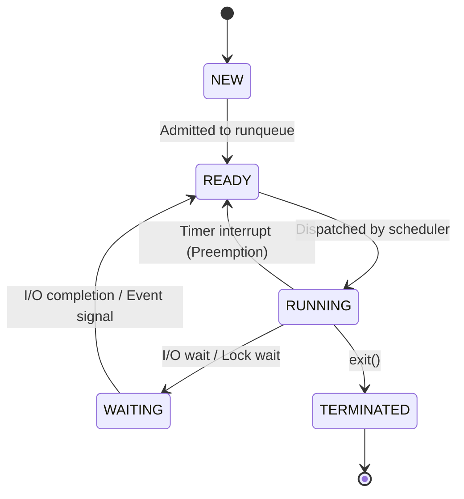

# CSE 313 (Operating Systems) — 2020 Final Solutions (Questions 1 to 4)

---

## Question 1(a)
**Consider the following workload:**

| Process | Priority (Lowest Number has Highest Priority) | Duration (sec) | Arrival Time (sec) |
|---|:---:|:---:|:---:|
| **P1** | 1 | 30 | 0 |
| **P2** | 2 | 40 | 30 |
| **P3** | 2 | 65 | 50 |
| **P4** | 1 | 70 | 70 |

**Construct the Gantt chart and calculate the average turnaround time for Priority Scheduling algorithm. Within the same priority class, schedule according to Round Robin with quantum size $q$. For the first 5 quantums, quantum size $q = 20\text{ secs}$; and for the rest of the quantums, quantum size $q = 30\text{ secs}$. Note that each priority class maintains separate FIFO queue.**

### Answer:

#### Priority Rules & Quantum Tracking:
- Priority 1 (Highest) runs before Priority 2.
- Separate queues: $Q_1$ (Priority 1), $Q_2$ (Priority 2).
- Quantum rule: Quanta 1 to 5 use $q = 20\text{ s}$; Quanta 6+ use $q = 30\text{ s}$.

#### Step-by-Step Chronological Execution:
1. **Quantum 1 ($q = 20\text{ s}$):**
   - At $t=0$: Only $P_1$ (Priority 1) arrives (Burst 30).
   - $P_1$ runs for 20s (from $t=0$ to $t=20$). Remaining $P_1 = 10$.
   - Queue at $t=20$: $Q_1 = [P_1]$.
2. **Quantum 2 ($q = 20\text{ s}$):**
   - At $t=20$: $P_1$ runs remaining 10s (from $t=20$ to $t=30$).
   - **$P_1$ completes at $t=30$!** ($C_1 = 30$).
   - *At $t=30$: $P_2$ (Priority 2, burst 40) arrives.* Enqueued in $Q_2 = [P_2]$.
3. **Quantum 3 ($q = 20\text{ s}$):**
   - At $t=30$: $Q_1$ is empty. $P_2$ runs for 20s (from $t=30$ to $t=50$). Remaining $P_2 = 20$.
   - *At $t=50$: $P_3$ (Priority 2, burst 65) arrives.*
   - Queue at $t=50$: $Q_2 = [P_3, P_2]$.
4. **Quantum 4 ($q = 20\text{ s}$):**
   - At $t=50$: $P_3$ runs for 20s (from $t=50$ to $t=70$). Remaining $P_3 = 45$.
   - *At $t=70$: $P_4$ (Priority 1, burst 70) arrives!*
   - Queues at $t=70$: $Q_1 = [P_4]$, $Q_2 = [P_2, P_3]$.
5. **Quantum 5 ($q = 20\text{ s}$, last quantum of 20s):**
   - At $t=70$: $Q_1$ has $P_4$ (higher priority!). $P_4$ preempts Priority 2.
   - $P_4$ runs for 20s (from $t=70$ to $t=90$). Remaining $P_4 = 50$.
   - Queue at $t=90$: $Q_1 = [P_4]$.
6. **Quantum 6 ($q = 30\text{ s}$, from now on quantum is 30s):**
   - At $t=90$: $P_4$ is alone in $Q_1$. $P_4$ runs for 30s (from $t=90$ to $t=120$). Remaining $P_4 = 20$.
7. **Quantum 7 ($q = 30\text{ s}$):**
   - At $t=120$: $P_4$ runs remaining 20s (from $t=120$ to $t=140$).
   - **$P_4$ completes at $t=140$!** ($C_4 = 140$).
   - $Q_1$ is now completely empty.
8. **Quantum 8 ($q = 30\text{ s}$):**
   - At $t=140$: Dispatch from $Q_2 = [P_2, P_3]$.
   - $P_2$ (remaining 20) runs until completion (from $t=140$ to $t=160$).
   - **$P_2$ completes at $t=160$!** ($C_2 = 160$).
9. **Quantum 9 ($q = 30\text{ s}$):**
   - At $t=160$: $P_3$ (remaining 45) runs for 30s (from $t=160$ to $t=190$). Remaining $P_3 = 15$.
10. **Quantum 10 ($q = 30\text{ s}$):**
    - At $t=190$: $P_3$ runs remaining 15s (from $t=190$ to $t=205$).
    - **$P_3$ completes at $t=205$!** ($C_3 = 205$).

#### Gantt Chart:
```
| P1 | P1 | P2 | P3 | P4 |  P4  | P4  | P2  |  P3  | P3  |
0   20   30   50   70   90    120   140  160    190   205
```

#### Metrics Table:
- $T_{\text{turn}}(P_1) = 30 - 0 = 30\text{ s}$
- $T_{\text{turn}}(P_2) = 160 - 30 = 130\text{ s}$
- $T_{\text{turn}}(P_3) = 205 - 50 = 155\text{ s}$
- $T_{\text{turn}}(P_4) = 140 - 70 = 70\text{ s}$
$$\mathbf{\text{Average Turnaround Time} = \frac{30 + 130 + 155 + 70}{4} = \frac{385}{4} = 96.25\text{ seconds}}$$

### Sources:
- `3. Scheduling-week-3-RRR.pdf` (Slides 12–50: Priority, Round Robin, Multilevel Queues).

### Link to Notes:
- [[Interactive Scheduling Algorithms]]
- [[Problem — CPU Scheduling Algorithm Simulation and Gantt Chart]]

---

## Question 1(b)
**Explain the problem definition of the classical Dining Philosophers problem. Argue that the Dining Philosophers problem meets all the four conditions for resource deadlock.**

### Answer:
*(Identical canonical problem as 2017 Q2(b)):*
- **Problem Formulation:** Five philosophers sit around a table with 5 shared chopsticks. Each philosopher alternates between thinking and eating. Eating requires acquiring both the left and right chopsticks simultaneously.
- **Verification of the 4 Coffman Conditions:**
  1. *Mutual Exclusion:* Each chopstick is an unshared physical resource that can be held by at most one philosopher.
  2. *Hold and Wait:* A philosopher picks up their left chopstick and retains ownership while waiting for their right chopstick.
  3. *No Preemption:* A held chopstick cannot be confiscated; it is only surrendered voluntarily upon completion of eating.
  4. *Circular Wait:* If all five philosophers simultaneously grab their left chopstick, $P_0$ waits for $P_1$, $P_1$ waits for $P_2$, ..., and $P_4$ waits for $P_0$, forming a closed circular cycle of dependencies.

### Sources:
- `4. IPC-week-4-5-RRR.pptx` (Slides 44–48).
- `5. Deadlocks-week6-7-RRR.pdf` (Slides 8–10).

### Link to Notes:
- [[Deadlock Fundamentals and Coffman Conditions]]
- [[Classic Synchronization Solutions]]
- [[Problem — Dining Philosophers Deadlock-Free Synchronization]]

---

## Question 1(c)
**Differentiate between process context switching (PCS) and thread context switching (TCS).**

### Answer:

| Feature | Process Context Switching (PCS) | Thread Context Switching (TCS) |
|---|---|---|
| **Memory Address Space** | **Switches address space:** Changes page table base pointer (CR3 register in x86). | **Retains address space:** All threads in a process share the exact same virtual memory mappings. |
| **TLB Cache Impact** | **Flushes or invalidates TLB entries**, causing major cache miss penalties immediately following the switch. | **Preserves TLB entries;** cache lines remain warm and valid. |
| **State Saved/Restored** | Saves PCB, CPU registers, stack pointers, memory maps, file descriptor tables, and IPC states. | Saves only Thread Control Block (TCB), CPU registers, program counter, and private stack pointer. |
| **Execution Speed** | Relatively slow (hundreds to thousands of nanoseconds / CPU cycles). | Extremely fast (fraction of PCS latency). |

### Sources:
- `2. ProcessAndThread-week2-RRR.pdf` (Slides 15–18, 33–36: Context Switching).

### Link to Notes:
- [[Process Control Block and Context Switching]]
- [[Threads and Multithreading Models]]

---

## Question 2(a)
**Differentiate between a CPU bound process (CPUB) and an IO bound process (IOB). Give an example demonstrating Convoy Effect that may occur due to FCFS scheduling algorithm.**

### Answer:

#### Differences:
- **CPU-Bound Process:** Spends most of its runtime calculating instructions in the CPU. Characterized by long CPU bursts and rare, short I/O operations.
- **I/O-Bound Process:** Spends most of its runtime waiting for I/O operations (disk/network). Characterized by short CPU bursts and frequent, long I/O wait periods.

#### Convoy Effect Example under FCFS:
Suppose we have one long CPU-bound process $P_1$ (Burst $= 100\text{ ms}$) and three short I/O-bound processes $P_2, P_3, P_4$ (Burst $= 2\text{ ms}$ each), arriving at nearly the same time ($t \approx 0$):
1. Under FCFS, $P_1$ is scheduled first and monopolizes the CPU for $100\text{ ms}$.
2. The three I/O-bound processes ($P_2, P_3, P_4$) sit idle in the ready queue behind $P_1$, unable to run their short 2 ms bursts.
3. During this entire 100 ms period, **all I/O devices sit idle and underutilized**!
4. When $P_1$ finally finishes at $t=100$, $P_2, P_3, P_4$ execute rapidly (taking only 2 ms each) and immediately initiate I/O.
5. Now, the CPU sits completely idle while all processes wait for I/O!
- **Consequence:** Average waiting time skyrockets ($T_{\text{wait}} = \frac{0 + 100 + 102 + 104}{4} = 76.5\text{ ms}$), and device utilization is severely degraded. This bottleneck where short processes trail behind a massive long process is the **Convoy Effect**.

### Sources:
- `3. Scheduling-week-3-RRR.pdf` (Slides 5–8, 14–17: Bursts, FCFS Convoy Effect).

### Link to Notes:
- [[CPU Scheduling Principles and Criteria]]
- [[Batch Scheduling Algorithms]]

---

## Question 2(b)
**Consider a variation of the classical producer consumer problem. In this variation, there is only one consumer and M producers $P_1, P_2, \dots, P_M$ and all producers belong to the same priority class. Producers produce item in a cyclic order. For example, producer $P_1$ produces first, then producer $P_2$, and so on. After producer $P_M$ produces an item, it enables producer $P_1$ to produce an item. Note that, the order of producing items and the order of insertion in the buffer may not always be the same.**

**A solution to the classical Producer-Consumer problem is presented in Figure for 2(b). Modify this solution with minimal changes to obtain a solution for the above mentioned problem. [You do not need to write down the consumer code.]**

### Answer:
To enforce cyclic production order ($P_1 \to P_2 \to \dots \to P_M \to P_1$), we introduce an array of $M$ signaling semaphores `turn[M]`:
- `turn[0]` is initialized to **1** (allowing $P_1$ to produce first).
- `turn[1] \dots turn[M-1]` are initialized to **0**.
- Before producing an item, producer $P_i$ executes `down(&turn[i])`.
- After producing the item (and before or after inserting into buffer), producer $P_i$ executes `up(&turn[(i + 1) % M])` to enable the next producer in the cycle!

```c
#define N 100                 /* buffer capacity */
#define M 5                   /* number of producers */

typedef int semaphore;
semaphore mutex = 1;          /* controls buffer critical section */
semaphore empty = N;          /* counts empty buffer slots */
semaphore full = 0;           /* counts full buffer slots */

/* Cyclic order semaphores: P_0 starts first */
semaphore turn[M] = {1, 0, 0, 0, 0}; 

void producer(int i)          /* i is producer index: 0 to M-1 */
{
    int item;
    while (TRUE) {
        /* Step 1: Wait for your turn in the cyclic sequence */
        down(&turn[i]);
        item = produce_item();
        /* Pass the turn to the next producer immediately */
        up(&turn[(i + 1) % M]);

        /* Step 2: Normal bounded buffer insertion */
        down(&empty);
        down(&mutex);
        insert_item(item);
        up(&mutex);
        up(&full);
    }
}
```

### Sources:
- `4. IPC-week-4-5-RRR.pptx` (Slides 35–42: Producer-Consumer with Semaphores).

### Link to Notes:
- [[Classic Synchronization Solutions]]
- [[Producer-Consumer Semaphore Implementation Example]]
- [[Semaphores and Synchronization Primitives]]

---

## Question 2(c)
**Explain the advantages and disadvantages of kernel-level thread.**

### Answer:

#### Advantages of Kernel-Level Threads (KLT):
1. **True Multiprocessor Parallelism:** The kernel can schedule multiple threads of the same process onto separate physical CPU cores simultaneously.
2. **Non-Blocking System Calls:** When one thread blocks (e.g. on disk/socket I/O), the kernel scheduler can immediately dispatch another thread from the same process; the process as a whole never freezes.
3. **Kernel Routine Concurrency:** Kernel routines themselves can be multithreaded.

#### Disadvantages of Kernel-Level Threads (KLT):
1. **Context Switch Overhead:** Creating, terminating, or context-switching between kernel threads requires crossing the user/kernel protection boundary (mode switch), which is significantly slower than user-space thread switching.
2. **Resource Consumption:** Each kernel thread requires a dedicated Kernel Stack and Thread Control Block (TCB) in kernel address space, limiting the total number of threads that can exist concurrently.

### Sources:
- `2. ProcessAndThread-week2-RRR.pdf` (Slides 36–42: Thread implementation trade-offs).

### Link to Notes:
- [[Threads and Multithreading Models]]

---

## Question 3(a)
**Construct the resource graph for the following scenario where A, B, C, and D denote processes and 1, 2, 3, 4, 5, and 6 denote resource types. There exists only one resource of each type. Show the steps of the execution of the deadlock detection algorithm on the constructed graph starting from node C.**
- **(i) Process A holds 6, and wants 1 and 3**
- **(ii) Process B holds 1, and wants 4**
- **(iii) Process C holds 4, and wants 3 and 5**
- **(iv) Process D holds 5, and wants 6**

### Answer:

#### Graph Edges:
- Allocations: $6 \to A$, $1 \to B$, $4 \to C$, $5 \to D$.
- Requests: $A \to 1$, $A \to 3$, $B \to 4$, $C \to 3$, $C \to 5$, $D \to 6$.



#### DFS Cycle Detection Simulation Trace Starting from Node C:
- `Initial Node` $\leftarrow C$
- $L = \emptyset$
- $CN \leftarrow C$, $L = \{C\}$

1. **Step 1:** Outgoing unmarked edges of $C$: **$C \to 3$** and **$C \to 5$**.  
   *Choice:* Select edge $C \to 3$ (mark it).
   - $L = \{C, 3\}$, $CN \leftarrow 3$.
2. **Step 2:** Node 3 has **no outgoing edges** (Resource 3 is unheld):
   - **Backtrack:** Return to $C$, remove 3 from $L$.
   - $L = \{C\}$, $CN \leftarrow C$.
3. **Step 3:** Outgoing unmarked edge of $C$: **$C \to 5$** (mark it).
   - $L = \{C, 5\}$, $CN \leftarrow 5$.
4. **Step 4:** Outgoing unmarked edge of 5: **$5 \to D$** (mark it).
   - $L = \{C, 5, D\}$, $CN \leftarrow D$.
5. **Step 5:** Outgoing unmarked edge of $D$: **$D \to 6$** (mark it).
   - $L = \{C, 5, D, 6\}$, $CN \leftarrow 6$.
6. **Step 6:** Outgoing unmarked edge of 6: **$6 \to A$** (mark it).
   - $L = \{C, 5, D, 6, A\}$, $CN \leftarrow A$.
7. **Step 7:** Outgoing unmarked edges of $A$: **$A \to 1$** and **$A \to 3$**.  
   *Choice:* Select edge $A \to 1$ (mark it).
   - $L = \{C, 5, D, 6, A, 1\}$, $CN \leftarrow 1$.
8. **Step 8:** Outgoing unmarked edge of 1: **$1 \to B$** (mark it).
   - $L = \{C, 5, D, 6, A, 1, B\}$, $CN \leftarrow B$.
9. **Step 9:** Outgoing unmarked edge of $B$: **$B \to 4$** (mark it).
   - $L = \{C, 5, D, 6, A, 1, B, 4\}$, $CN \leftarrow 4$.
10. **Step 10:** Outgoing unmarked edge of 4: **$4 \to C$** (mark it).
    - $L = \{C, 5, D, 6, A, 1, B, 4, C\}$, $CN \leftarrow C$.
11. **Termination Check:**  
    Node $C$ appears **twice** in list $L$ (at start and end)!

#### Conclusion:
A directed cycle is detected:
$$\mathbf{C \to 5 \to D \to 6 \to A \to 1 \to B \to 4 \to C}$$
Because this is a single-instance system, **a permanent deadlock exists** involving all four processes $\{A, B, C, D\}$ and resources $\{1, 4, 5, 6\}$.

### Sources:
- `5. Deadlocks-week6-7-RRR.pdf` (Slides 16–19: Deadlock detection with one resource).
- `Notes on algorithm simulation.pdf` (Pages 5–7).

### Link to Notes:
- [[Resource Allocation Graphs and Deadlock Modeling]]
- [[Deadlock Detection and Recovery Algorithms]]
- [[Resource Allocation Graph Cycle Detection Example]]
- [[Problem — Resource Allocation Graph Reduction and Cycle Detection]]

---

## Question 3(b)
**Distinguish between a safe state and an unsafe state. Consider a system with 4 processes: P1 through P4 and 1 resource type with 20 instances: Current allocation of resources and maximum requirement of each process are given in Figure for Question 3(b). Determine whether the current state of this system is safe or not. Show the intermediate steps.**

| Process | Has | Max |
|---|:---:|:---:|
| **P1** | 5 | 9 |
| **P2** | 6 | 12 |
| **P3** | 2 | 8 |
| **P4** | 0 | 15 |

**Free Instances:** $7$

### Answer:

#### Definitions:
- **Safe State:** A state where there exists at least one order (Safe Sequence) in which every process can obtain its maximum needed resources, finish, and return them, guaranteeing no deadlock.
- **Unsafe State:** A state from which no such guarantee can be made; if all processes suddenly demand their maximum claims, deadlock is possible.

#### Safety Simulation:
- Total capacity: $20$.
- Current allocation sum: $5 + 6 + 2 + 0 = 13$.
- Available (Free): $20 - 13 = \mathbf{7}$.
- Calculate Need ($Max - Has$):
  - $Need(P_1) = 9 - 5 = \mathbf{4}$
  - $Need(P_2) = 12 - 6 = \mathbf{6}$
  - $Need(P_3) = 8 - 2 = \mathbf{6}$
  - $Need(P_4) = 15 - 0 = \mathbf{15}$

#### Step-by-Step Execution:
- $Work = 7$:
  - Check $P_1$: $Need_1 = 4 \le 7 \implies$ **TRUE!** (We can also choose $P_2$ or $P_3$).
  - Let $P_1$ run to completion and release its 5 held units:
    $$Work = 7 + 5 = \mathbf{12}$$
- $Work = 12$:
  - Check $P_2$: $Need_2 = 6 \le 12 \implies$ **TRUE!**
  - Let $P_2$ run to completion and release its 6 held units:
    $$Work = 12 + 6 = \mathbf{18}$$
- $Work = 18$:
  - Check $P_3$: $Need_3 = 6 \le 18 \implies$ **TRUE!**
  - Let $P_3$ run to completion and release its 2 held units:
    $$Work = 18 + 2 = \mathbf{20}$$
- $Work = 20$:
  - Check $P_4$: $Need_4 = 15 \le 20 \implies$ **TRUE!**
  - $P_4$ runs to completion and releases 0 units:
    $$Work = 20$$

#### Conclusion:
All processes run to completion. The current system state is **SAFE**.
**Valid Safe Sequence:** $\mathbf{\langle P_1 \to P_2 \to P_3 \to P_4 \rangle}$  
*(Alternative valid sequences: $\langle P_2, P_1, P_3, P_4 \rangle$ and $\langle P_3, P_1, P_2, P_4 \rangle$).*

### Sources:
- `5. Deadlocks-week6-7-RRR.pdf` (Slides 26–29: Banker's Algorithm for Single Resource).

### Link to Notes:
- [[Deadlock Prevention and Avoidance Strategies]]
- [[Banker's Algorithm]]

---

## Question 3(c)
**Suppose that there is a resource deadlock in a system. Devise an example scenario to demonstrate that the set of processes deadlocked can include some processes that are not in the circular chain in the corresponding resource allocation graph.**

### Answer:
*(Identical concept to 2019 Q3(b)):*
- Consider processes $P_1, P_2, P_3$ and single-unit resources $R_1, R_2$:
  - $P_1$ holds $R_1$ and requests $R_2$ ($P_1 \to R_2$).
  - $P_2$ holds $R_2$ and requests $R_1$ ($P_2 \to R_1$).
  - Processes $P_1$ and $P_2$ form the cycle: $P_1 \to R_2 \to P_2 \to R_1 \to P_1$.
- Now, process $P_3$ requests $R_1$ ($P_3 \to R_1$).
- **Analysis:**
  $P_3$ is not inside the cycle. However, $P_3$ is waiting for Resource $R_1$, which is held by deadlocked process $P_1$. Because $P_1$ will never finish, $R_1$ will never be released. Hence, $P_3$ is permanently blocked and **part of the deadlocked set**, even though it does not participate in the circular chain.

### Sources:
- `5. Deadlocks-week6-7-RRR.pdf` (Slides 16–17).

### Link to Notes:
- [[Resource Allocation Graphs and Deadlock Modeling]]

---

## Question 4(a)
**Draw the state diagram of a process life cycle. Mention the respective states of a process when (i) it is involved in a starvation, and when (ii) it is involved in a livelock.**

### Answer:

#### Process Lifecycle State Diagram:


#### Process States:
- **(i) During Starvation:**  
  The process is in the **`READY`** state (waiting in the CPU ready queue, fully able to run, but continually bypassed by the scheduler in favor of higher-priority processes).
- **(ii) During Livelock:**  
  The process is in the **`RUNNING`** state (actively being scheduled and executing instructions on the CPU, but repeatedly changing state in reaction to another process without making forward progress).

### Sources:
- `2. ProcessAndThread-week2-RRR.pdf` (Slides 10–14: Process States).
- `5. Deadlocks-week6-7-RRR.pdf` (Slides 40–41: Livelock, Starvation).

### Link to Notes:
- [[Process Lifecycle and State Transitions]]
- [[Deadlock Fundamentals and Coffman Conditions]]

---

## Question 4(b)
**Process tree for loop-based `fork()`:**
```c
int i = 0;
int main() {
    for (; i < 3; i++) {
        fork();
    }
    return 0;
}
```

### Answer:
*(Identical problem to 2017 Q1(b)):*
- Initial process $P_0$ starts with $i=0$.
- Loop creates a total of $2^3 = 8$ processes ($P_0$ through $P_7$).
- **Starting values of $i$ for each process:**
  - $P_0$ starts with $i=0$.
  - $P_1$ created at $i=0$ $\implies$ starts with **$i=0$**.
  - $P_2, P_3$ created at $i=1$ $\implies$ start with **$i=1$**.
  - $P_4, P_5, P_6, P_7$ created at $i=2$ $\implies$ start with **$i=2$**.

```
                   P0 (starts i=0)
                 /        |        \
        P1 (i=0)      P2 (i=1)     P4 (i=2)
        /      \          |
   P3 (i=1)   P6 (i=2)  P5 (i=2)
      |
   P7 (i=2)
```

### Sources:
- `2. ProcessAndThread-week2-RRR.pdf` (Slides 20–28).

### Link to Notes:
- [[Problem — Fork Execution Tree and Process Tracing]]

---

## Question 4(c)
**Write short notes on the following concepts:**
- **(i) Multi-user OS**
- **(ii) Multi-processor OS**
- **(iii) Lottery scheduling**

### Answer:

- **(i) Multi-User OS:**
  An operating system that allows multiple concurrent users to access computer resources (CPU, memory, storage, printers) simultaneously from different terminals. Enforces strict hardware memory protection, access control lists (file permissions), and process isolation so one user's crash or malicious action cannot affect others (e.g., Linux, UNIX).
- **(ii) Multi-Processor OS:**
  An operating system designed to manage and schedule tasks across multiple physical CPUs or multi-core processors. Employs Symmetric Multiprocessing (SMP) architectures where all CPUs share a common physical memory and I/O bus, using kernel spinlocks and core-affinity schedulers to balance computational load.
- **(iii) Lottery Scheduling:**
  A randomized, proportional-share scheduling algorithm. Processes are allocated "lottery tickets" for system resources. Whenever a scheduling decision is made, a pseudo-random winning ticket is selected, and the process holding that ticket is granted the CPU for a time slice. The probability of getting the CPU is strictly proportional to the number of tickets held ($P = \text{tickets held} / \text{total tickets}$), inherently preventing starvation and providing smooth proportional allocation.

### Sources:
- `1. Introduction-week1-RRR-2026.pdf` (Slides 10–13: OS types).
- `3. Scheduling-week-3-RRR.pdf` (Slides 48–52: Lottery Scheduling).

### Link to Notes:
- [[Operating System Structures and Functions]]
- [[Interactive Scheduling Algorithms]]
