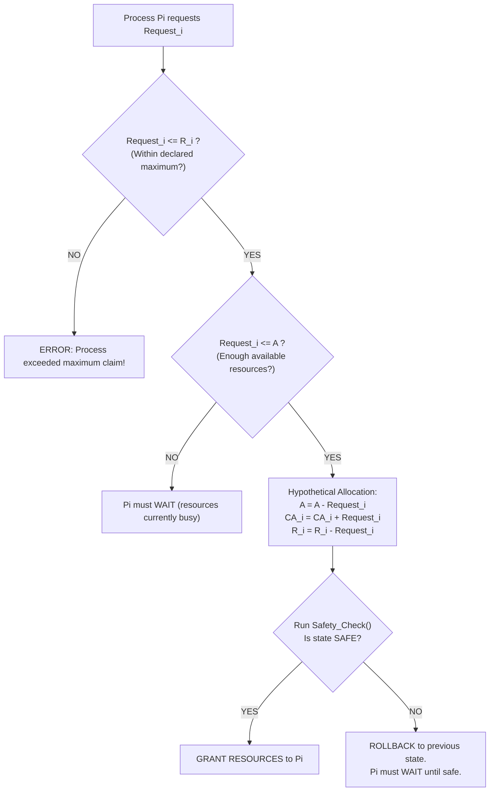

# Banker's Algorithm

> 📖 **Reading Order:** Step 29 of 34 | **Module 5:** Deadlocks  
> ◄ **Previous:** [[Deadlock Prevention and Avoidance Strategies]] | ► **Next:** [[Deadlock Detection and Recovery Algorithms]]

---

## 1. Algorithmic Overview & Motivation

Developed by **Edsger Dijkstra (1965)**, the **Banker's Algorithm** is the classic deadlock-avoidance algorithm for systems with multiple resource types and multiple instances per type.

### The Town Banker Analogy:
A small-town banker has a fixed total pool of cash. Several business clients request credit lines:
- Each client declares their **maximum credit limit** upfront.
- A client takes loans in small installments over time.
- The banker knows that once a client receives their maximum limit, they will finish their project and pay back the entire loan.
- **Banker's Invariant:** The banker will **never** approve a loan request if granting it would leave the vault with less cash than the maximum remaining need of at least one client. As long as one client can finish, their repaid funds can be used to satisfy the next, avoiding bankruptcy (deadlock).

---

## 2. Mathematical Formalization & Data Structures

Let $n$ be the number of processes in the system, and $m$ be the number of distinct resource types.

```
Total Resources:      E = (e_1, e_2, ..., e_m)
Current Allocation:   CA = [ n x m matrix ]  (CA[i][j] = instances of Rj held by Pi)
Maximum Requirements: MaxReq = [ n x m matrix ]
Request / Need:       R = MaxReq - CA
Available Resources:  A = E - \sum_{i=1}^n CA_i
```

### Vector Comparison Notation:
For vectors $X, Y \in \mathbb{R}^m$, we define:
$$X \le Y \iff X_j \le Y_j \quad \forall j \in \{1, 2, \dots, m\}$$

---

## 3. The Safety Algorithm

This algorithm determines whether the current system state is safe:

```
Algorithm Safety_Check:
1. Initialize Work = A (a vector of length m)
   Initialize Finish[i] = FALSE for all i = 1, 2, ..., n

2. Search for an index i such that:
      Finish[i] == FALSE  AND  R[i] <= Work
   
   If no such i exists:
      Go to Step 4.

3. // Process Pi can safely complete!
   Work = Work + CA[i]
   Finish[i] = TRUE
   Record Pi in safe sequence
   Go to Step 2.

4. If Finish[i] == TRUE for all i = 1, 2, ..., n:
      System is in a SAFE STATE.
   Else:
      System is in an UNSAFE STATE.
```

---

## 4. The Resource-Request Algorithm

When a running process $P_i$ issues a new resource request vector $Request_i$:



### Algorithmic Steps:
1. **Validation Check:**
   $$\text{If } Request_{i,j} \le R_{i,j} \quad \forall j \in \{1, \dots, m\} \implies \text{Proceed to Step 2.}$$
   Else: throw an error condition (process exceeded its declared maximum claim).
2. **Availability Check:**
   $$\text{If } Request_{i,j} \le A_j \quad \forall j \in \{1, \dots, m\} \implies \text{Proceed to Step 3.}$$
   Else: $P_i$ must wait, as resources are temporarily unavailable.
3. **Speculative / Tentative Allocation:**
   The OS simulates the allocation:
   $$\begin{aligned}
   A &= A - Request_i \\
   CA_i &= CA_i + Request_i \\
   R_i &= R_i - Request_i
   \end{aligned}$$
4. **Safety Verification:**
   Run `Safety_Check()` on the speculative state.
   - **If Safe:** The actual resources are granted, and $P_i$ continues.
   - **If Unsafe:** The OS undoes the tentative modifications (restores old $A, CA_i, R_i$) and forces $P_i$ to wait.

---

## 5. Algorithmic Complexity & Limitations

- **Time Complexity:** The safety check requires $O(m \times n^2)$ operations in the worst case (searching through $n$ rows up to $n$ times, each taking $m$ comparisons).
- **Practical Limitations in Modern OSs:**
  1. *A priori knowledge:* Real-world processes rarely know their exact peak resource demands before execution.
  2. *Static assumptions:* Assumes fixed process counts and fixed resource counts; modern systems dynamically add/remove hardware and fork/terminate processes.
  3. *Overhead:* Running an $O(m \cdot n^2)$ safety simulation on **every single system resource call** would cripple OS performance.

---

## Source Traceability & Metadata
- **Source Material:** `5. Deadlocks-week6-7-RRR.pdf` (Slides 28–31: Banker's Algorithm for Single and Multiple Resources) and `Notes on algorithm simulation.pdf`.
- **Previous Topic:** [[Deadlock Prevention and Avoidance Strategies]] (Step 28).
- **Next Topic:** [[Deadlock Detection and Recovery Algorithms]] (Step 30).
