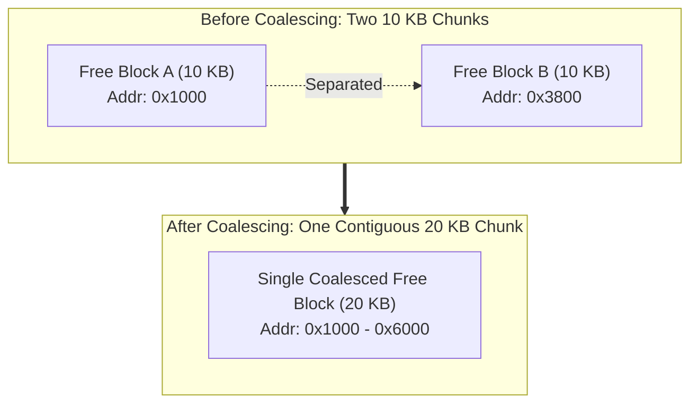

# Free-Space Management and Allocation Policies

> 📖 **Reading Order:** Step 38 of 68 | **Module 6: Virtual Memory Foundations**  
> ◄ **Previous:** [[Segmentation and External Fragmentation]] | ► **Next:** [[Segregated Free Lists and Binary Buddy Allocation]]

---

## Starting Point and Earlier Tools

When an operating system manages variable-sized memory allocations—such as physical memory segments under [[Segmentation and External Fragmentation]], or dynamic user allocations via `malloc()` and `free()`—it faces the challenge of **free-space management**.

Unlike fixed-size systems where any free block satisfies any request, a variable-sized allocator must service requests of arbitrary byte sizes while minimizing **external fragmentation** and maximizing execution speed.

---

## Developing the Core Idea

To manage arbitrary blocks of free space without external database overhead, the allocator uses the free memory itself to store its management structures: the **Explicit Free List**.

### 1. In-Band Allocation Headers
When memory is allocated, the allocator reserves extra space immediately before the returned memory pointer to store metadata:
```c
typedef struct {
    int size;       // Total size of allocated block including header
    int magic;      // Integrity verification magic number (e.g., 0x12345678)
} header_t;
```
When user code executes `free(ptr)`, the allocator inspects `((header_t *)ptr - 1)` to determine the exact number of bytes being returned to the free list.

### 2. Splitting
When an allocation request of size $S$ is received and the allocator finds a free block of size $B > S + \text{sizeof(header\_t)}$:
- The allocator splits the block into two chunks.
- Chunk 1 ($S + \text{sizeof(header\_t)}$ bytes) is allocated and returned to the caller.
- Chunk 2 (the remaining $B - (S + \text{sizeof(header\_t)})$ bytes) remains on the free list.

### 3. Coalescing
When a block is freed, simply adding it back to the free list creates adjacent, fragmented blocks. If block $A$ of size 10 KB and block $B$ of size 10 KB sit next to each other in physical RAM, an incoming request for 15 KB would fail if they remain separate.
- **Coalescing** checks the physical addresses of adjacent memory blocks upon `free()`.
- If the newly freed block ends exactly where another free block begins, the allocator merges them into a single 20 KB free block!



---

## Free-List Allocation Policies

When multiple free blocks are large enough to satisfy an allocation request, which one should the allocator pick? Four classic policies represent different trade-offs:

### 1. Best-Fit
- **Strategy:** Scans the entire free list to find the block that is $\ge \text{size}$ with the **smallest remaining leftover**.
- **Pros:** Keeps large free blocks intact for future large requests.
- **Cons:** Requires an exhaustive $O(N)$ scan of the entire free list; tends to leave behind tiny, useless free slivers ("dust") that increase external fragmentation.

### 2. Worst-Fit
- **Strategy:** Scans the entire free list to find the **largest available block**, splits it, and keeps the remainder on the free list.
- **Pros:** Leaves behind large remaining free chunks rather than tiny slivers.
- **Cons:** Still requires an exhaustive $O(N)$ scan; rapidly shreds large contiguous free blocks into medium-sized blocks, preventing large allocations later.

### 3. First-Fit
- **Strategy:** Traverses the free list from the beginning and selects the **very first block** that is $\ge \text{size}$.
- **Pros:** Fast ($O(1)$ to $O(K)$); does not need to scan the entire list.
- **Cons:** Concentrates small, fragmented free slivers at the beginning of the free list, slowing down subsequent searches.

### 4. Next-Fit
- **Strategy:** Like First-Fit, but maintains a pointer to where the previous search ended, resuming the search from that point rather than restarting at the head.
- **Pros:** Distributes allocations and fragments evenly across the entire memory pool, avoiding the head-clustering problem of First-Fit.
- **Cons:** Slightly worse overall fragmentation than First-Fit.

---

## Comparison of Free-Space Policies

| Policy | Search Cost | Fragmentation Characteristics | Primary Weakness |
|---|---|---|---|
| **First-Fit** | Fast ($O(K)$) | Good overall; fragments front of list | Search slows down over time as front clutters |
| **Next-Fit** | Fast ($O(K)$) | Spreads fragments uniformly | Can miss early free blocks that were coalesced |
| **Best-Fit** | Slow ($O(N)$) | Minimizes wasted space per allocation | Creates tiny, unallocatable slivers ("dust") |
| **Worst-Fit** | Slow ($O(N)$) | Leaves larger remainders | Destroys large free blocks quickly |

---

## Complexity

- **Time Complexity:**
  - *First-Fit / Next-Fit:* $O(K)$ average case, where $K \le N$ is the distance to the first qualifying block.
  - *Best-Fit / Worst-Fit:* $O(N)$ strictly, where $N$ is the total number of free list nodes.
  - *Coalescing:* $O(1)$ if an address-ordered doubly-linked list or boundary-tag allocator is used; $O(N)$ if the list is unsorted.
- **Space Complexity:**
  - $O(1)$ auxiliary memory overhead beyond the in-band headers and free-list pointers embedded inside the free memory blocks themselves.

---

## Important Properties and Guarantees

- **Conservation of Space:** The sum of bytes in allocated blocks, in-band headers, and free blocks is strictly invariant and equals total heap pool capacity.
- **Coalescing Completeness:** With boundary tags and address-sorted free lists, two physically adjacent free blocks never coexist; they are immediately unified upon deallocation.

---

## Common Mistakes

- **Overlooking Header Overhead:** Calculating whether an allocation fits by comparing request size directly against free block size without adding `sizeof(header_t)`.
- **Assuming Worst-Fit Avoids Fragmentation:** Intuition suggests that leaving large remainders avoids tiny fragments, but empirical studies prove Worst-Fit performs worst overall because it rapidly eliminates all large contiguous blocks.

---

## Exam Relevance

Regularly tested through:
- Simulating a sequence of memory allocations and deallocations under First-Fit, Best-Fit, and Worst-Fit on a given initial free list.
- Calculating external fragmentation percentages after a sequence of operations.
- Tracing splitting and coalescing address boundary calculations.

---

## Related Concepts

- [[Memory API and Allocation Safety]]
- [[Segmentation and External Fragmentation]]
- [[Segregated Free Lists and Binary Buddy Allocation]]

---

## Prerequisites

- [[Memory API and Allocation Safety]]
- [[Segmentation and External Fragmentation]]

---

## Problems

- [[Problem — Segmentation Address Translation and Buddy Memory Allocation]]

---

## Sources

- **Lecture Slides:** [[cse313/01 - Sources/Lectures/CSE313_KRV_Merged.pdf|CSE313_KRV_Merged.pdf]], Chapter 17 (Slides 79–99).
- **Textbook:** Arpaci-Dusseau & Arpaci-Dusseau, *Operating Systems: Three Easy Pieces (OSTEP)*, Chapter 17 (Free-Space Management).
