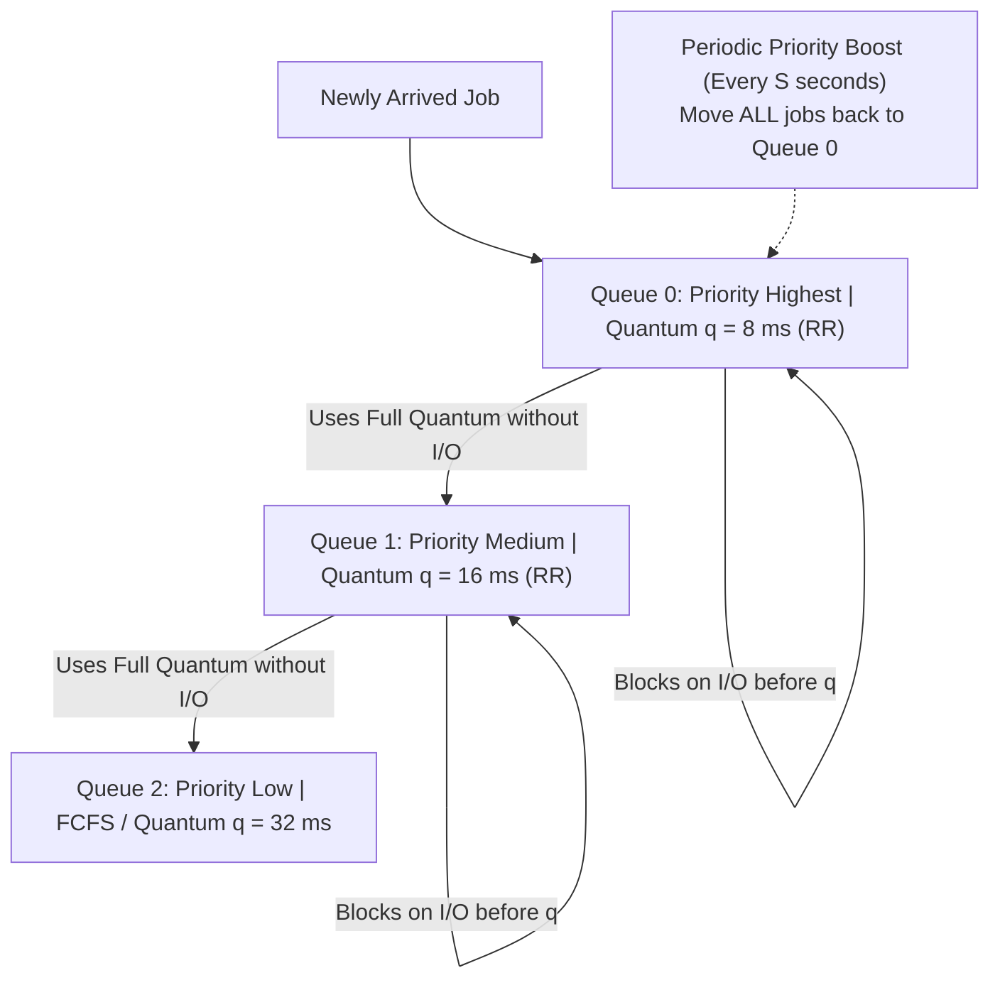

# Interactive Scheduling Algorithms

> 📖 **Reading Order:** Step 14 of 34 | **Module 3:** CPU Scheduling  
> ◄ **Previous:** [[Batch Scheduling Algorithms]] | ► **Next:** [[Scheduling Metrics and Burst Estimation Formulas]]

---

## Overview

In interactive multi-user and desktop operating systems, human users expect near-instantaneous feedback to keyboard, mouse, and network events. Algorithms cannot allow long jobs to monopolize the CPU. The overriding design goals are **minimizing response time**, **preventing starvation**, and **maintaining fairness**.

The dominant interactive algorithms are:
1. **Round Robin (RR)**
2. **Priority Scheduling (with Aging)**
3. **Multilevel Feedback Queue (MLFQ)**
4. **Lottery Scheduling (Proportional Share)**

---

## 1. Round Robin (RR) Scheduling

### Algorithmic Logic
- **Type:** Preemptive time-slicing.
- **Mechanism:** The scheduler maintains a FIFO Ready Queue. Each process is allocated a fixed small chunk of CPU time called a **Time Quantum** (or time slice), typically between $10\text{ ms}$ and $100\text{ ms}$.
- The CPU scheduler pops the process at the head of the queue, starts the hardware timer, and dispatches the process.
- **Branching Conditions:**
  1. **Process finishes or blocks before quantum expires:** The process voluntarily yields the CPU (e.g., for I/O), the timer is reset, and the next process is dispatched.
  2. **Quantum expires while process is computing:** The hardware timer generates an interrupt. The OS moves the running process to the **tail of the Ready Queue** and dispatches the new head of the queue.

```mermaid
flowchart LR
    Head["Ready Queue Head (P1)"] -->|Dispatch| CPU["CPU Execution (Time Quantum q)"]
    CPU -->|Blocks for I/O| Blocked["I/O Wait Queue"]
    CPU -->|Quantum Expires (Timer Interrupt)| Tail["Ready Queue Tail"]
    Tail --> Head
```

### The Quantum Sizing Dilemma ($q$)

Choosing the length of the time quantum $q$ involves a fundamental trade-off:

```
                      TIME QUANTUM SIZING TRADE-OFF
                      
      q Too Small (< 1 ms)                     q Too Large (> 500 ms)
<-------------------------------------------------------------------->
High Context Switch Overhead             Poor Interactive Response Time
CPU wastes time swapping registers       Degrades into FCFS (Convoy Effect)
```

- **If $q$ is extremely small (e.g., $1\text{ ms}$):**
  If context switch time is $0.2\text{ ms}$, then $\frac{0.2}{1.2} \approx 16.7\%$ of all CPU capability is burned on context switching!
- **If $q$ is extremely large (e.g., $1000\text{ ms}$):**
  Short interactive tasks must wait behind long tasks. The system feels sluggish and non-responsive; RR degenerates into [[Batch Scheduling Algorithms|FCFS]].
- **Golden Rule of Thumb:**  
  Set the time quantum $q$ such that **$80\%$ of all CPU bursts are shorter than $q$**, while keeping context switch overhead below $1\%$ of the quantum. (Modern desktop kernels set $q \approx 10\text{–}50\text{ ms}$ with context switch overhead $\approx 1\text{–}5\text{ }\mu\text{s}$).

---

## 2. Priority Scheduling (Static & Dynamic)

### Algorithmic Logic
- Each process is assigned an integer **priority level**.
- The scheduler always allocates the CPU to the highest-priority ready process. (Convention: In UNIX, a smaller integer value represents a higher priority—e.g., priority 0 is higher than priority 20).
- Can be **preemptive** (new high-priority arrival immediately preempts a lower-priority running job) or **non-preemptive**.

### The Starvation Problem & The Aging Solution
- **Starvation (Indefinite Blocking):** In pure static priority scheduling, low-priority processes can sit in the Ready Queue forever if higher-priority processes keep arriving. (In 1973, when the IBM 7094 at MIT was decommissioned, a low-priority job submitted in 1967 was discovered sitting unexecuted in the queue!).
- **Aging Solution:** The OS dynamically increases the priority of processes that wait in the Ready Queue over time:
  $$\text{Priority}_{\text{new}} = \text{Priority}_{\text{base}} - \lfloor \alpha \cdot T_{\text{wait}} \rfloor$$
  Eventually, any starving process's priority climbs high enough to outrank all other jobs and seize the CPU.

### Priority Inversion & Priority Inheritance (The Mars Pathfinder Bug)
Consider three processes: High ($H$), Medium ($M$), Low ($L$):
1. $L$ acquires a shared mutex lock on a shared data bus.
2. $H$ becomes ready, preempts $L$, and attempts to acquire the lock. $H$ blocks waiting for $L$ to unlock it.
3. Suddenly, medium-priority process $M$ (which does not need the lock) becomes ready. Because $\text{Priority}(M) > \text{Priority}(L)$, $M$ preempts $L$!
4. **Disaster:** $H$ is waiting for $L$, but $L$ cannot run because $M$ is executing. A medium-priority process is indirectly blocking a high-priority process indefinitely!
- **Solution (Priority Inheritance Protocol):**  
  Whenever a high-priority process $H$ blocks on a resource held by low-priority process $L$, process $L$ temporarily **inherits the high priority of $H$** until it releases the lock, preventing medium processes from preempting it.

---

## 3. Multilevel Feedback Queue (MLFQ)

Created by Fernando Corbató (Turing Award winner), the **Multilevel Feedback Queue (MLFQ)** is the gold-standard scheduling framework adopted by modern general-purpose operating systems (Linux CFS, Windows NT, macOS).

### Why MLFQ?
SJF is optimal, but requires knowing the future. MLFQ **learns from process history** to approximate SJF dynamically without knowing burst lengths in advance!



### The 5 Core MLFQ Rules:
1. **Rule 1:** If $\text{Priority}(A) > \text{Priority}(B)$, Process $A$ runs ($B$ does not).
2. **Rule 2:** If $\text{Priority}(A) == \text{Priority}(B)$, $A$ and $B$ run in Round Robin using the quantum of that queue.
3. **Rule 3:** When a job enters the system, it is placed at the **highest priority queue** (Queue 0).
4. **Rule 4 (Demotion):** If a job uses up its entire time quantum without voluntarily yielding, its priority is **reduced by 1 level** (demoted to the next lower queue with a larger quantum). If a job yields for I/O before its quantum expires, it stays at the same priority level.
5. **Rule 5 (Priority Boost):** After some time period $S$, move **all jobs in the system to Queue 0**. (This guarantees CPU-bound jobs will not starve, and handles processes that transition from compute-bound to interactive).

---

## 4. Lottery Scheduling (Proportional Share)

- **Mechanism:** The OS allocates each process a set of discrete **lottery tickets**. Whenever a scheduling decision is made, the OS generates a pseudo-random number between $1$ and $T_{\text{total}}$. Whichever process holds the winning ticket gets the CPU!
- **Proportional Share Property:** If Process $A$ holds 75 tickets and Process $B$ holds 25 tickets, over time Process $A$ receives exactly $75\%$ of CPU cycles and Process $B$ receives $25\%$.
- **Ticket Transfers:** A client can temporarily transfer its lottery tickets to a server process while waiting for an RPC, preventing server bottlenecks.

---

## Comparative Reference Table

| Algorithm | Primary Strengths | Primary Weaknesses | Best Suited For |
|---|---|---|---|
| **Round Robin (RR)** | Fair, starvation-free, predictable response times | High context switch overhead if $q$ is small; higher average turnaround time | General interactive systems |
| **Priority with Aging** | Differentiates critical system daemons from background jobs | Risk of priority inversion without inheritance | Real-time and server kernels |
| **MLFQ** | Automatic learning, approximates SJF, optimizes both response & turnaround time | Complex parameter tuning (number of queues, quanta, boost frequency) | General desktop and mobile OSes |
| **Lottery Scheduling** | Mathematically simple proportional sharing, flexible ticket delegation | Non-deterministic in short time horizons | Virtual machine hypervisors, cloud multi-tenancy |

---

## Cross-Topic Connections / Exam Relevance

- **Next Step:** Mathematical formulas for calculating waiting times and predicting future burst times using exponential smoothing (see [[Scheduling Metrics and Burst Estimation Formulas]]).
- **Simulation:** Full step-by-step Gantt chart walkthroughs of Round Robin vs FCFS vs SJF (see [[Comprehensive CPU Scheduling Simulation Example]]).
- **Exam Testing:** High-frequency exam questions:
  - "Explain how Round Robin behaves when $q \to 0$ and $q \to \infty$."
  - "Define the Priority Inversion problem and describe how Priority Inheritance resolves it."
  - "State the 5 rules of the Multilevel Feedback Queue."

---

## Sources & Traceability

- **Lectures:** `cse313/01 - Sources/Lectures/3. Scheduling-week-3-RRR.pdf` (Slides 25–48)
- **Textbook:** Andrew S. Tanenbaum & Herbert Bos, *Modern Operating Systems* (4th Edition), Chapter 2 (Section 2.4.3: Scheduling in Interactive Systems)
