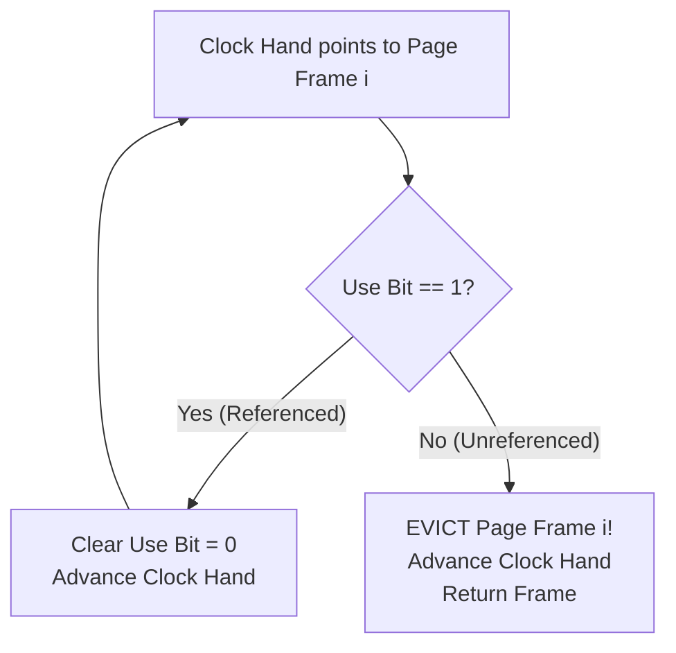

# Page Replacement Policies and the Clock Algorithm

> 📖 **Reading Order:** Step 46 of 68 | **Module 7: Paging & Virtual Memory Systems**  
> ◄ **Previous:** [[Swapping Mechanisms and Page Fault Handling]] | ► **Next:** [[Virtual Memory Performance and Address Translation Formulas]]

---

## Starting Point and the Problem

When a page fault occurs and physical memory contains no free frames, the operating system must choose a **victim page** to evict to disk.

Because accessing secondary storage is roughly 100,000 times slower than reading from RAM ($10\,\text{ms}$ disk latency vs $100\,\text{ns}$ RAM latency), an ineffective replacement policy that evicts actively needed pages causes catastrophic performance degradation known as **Thrashing**.

The goal of a **Page Replacement Policy** is to minimize the total number of page faults across the execution lifetime of the workload.

---

## Classic Replacement Policies

### 1. Optimal Replacement (Belady's MIN)
- **Rule:** Evict the page that will not be accessed for the **longest time in the future**.
- **Theoretical Benchmark:** Belady's MIN provably achieves the absolute minimum possible number of page faults for any given reference string and frame capacity.
- **Fatal Practical Limitation:** Impossible to implement in a real operating system because the OS cannot foresee the future memory access sequence of arbitrary user programs. It serves strictly as a theoretical upper bound for evaluating practical algorithms.

### 2. First-In, First-Out (FIFO)
- **Rule:** Pages are placed in a queue when loaded into memory; the oldest page in memory is evicted first.
- **Pros:** Simple to implement using a standard queue.
- **Cons:** Suffer from poor hit rates because an old page may contain heavily used shared libraries or loop code.
- **Belady's Anomaly:** For certain reference strings, **increasing the number of page frames results in MORE page faults!** (Proved in the worked example below).

### 3. Least Recently Used (LRU)
- **Rule:** Exploit temporal locality by using the recent past to predict the future: evict the page that has not been accessed for the **longest period of time**.
- **Why LRU is Hard in Practice:** True LRU requires updating a timestamp or moving a node to the front of a linked list on **every single instruction and memory access**. Doing this in software is too slow, and doing it in hardware requires expensive associative silicon.

---

## The Clock Algorithm (Second-Chance LRU Approximation)

Modern operating systems approximate LRU using an elegant hardware-software algorithm: the **Clock Algorithm** (or Second-Chance Algorithm).

### Hardware Support
The CPU MMU provides a single 1-bit **Use (Reference) Bit** in every Page Table Entry. Whenever the processor reads or writes to a page, the hardware automatically asserts:
$$\text{Use Bit} = 1$$

### Algorithmic Procedure
1. All physical page frames are organized logically in a circular buffer with a sweeping **Clock Hand**.
2. When a victim page must be selected:
   - The OS inspects the page currently pointed to by the clock hand:
     - **Case 1 ($\text{Use Bit} == 1$):** The page has been referenced recently. The OS gives it a "second chance": it clears $\text{Use Bit} = 0$, advances the clock hand to the next frame, and repeats.
     - **Case 2 ($\text{Use Bit} == 0$):** The page has not been referenced since the clock hand last swept past it. **This page is chosen as the victim for eviction!**
   - The clock hand is advanced to the next frame for the subsequent eviction event.

### Enhanced Clock: Prioritizing Clean Pages
Evicting a modified ("dirty") page requires writing it to disk, whereas evicting a clean page is free (just discard). The Enhanced Clock inspects the pair $(\text{Use}, \text{Dirty})$:
1. Best choice: $(0, 0)$ — Not recently used, clean (0 disk writes).
2. Second choice: $(0, 1)$ — Not recently used, dirty (requires 1 disk write).
3. Third choice: $(1, 0)$ — Recently used, clean.
4. Worst choice: $(1, 1)$ — Recently used, dirty.

---

## Belady's Anomaly: Mathematical Proof by Counterexample

Consider the reference string:
$$\mathbf{1, 2, 3, 4, 1, 2, 5, 1, 2, 3, 4, 5}$$

### FIFO with 3 Frames:
- `1` $\implies$ [1] (Fault 1)
- `2` $\implies$ [1, 2] (Fault 2)
- `3` $\implies$ [1, 2, 3] (Fault 3)
- `4` $\implies$ evict 1 $\to$ [2, 3, 4] (Fault 4)
- `1` $\implies$ evict 2 $\to$ [3, 4, 1] (Fault 5)
- `2` $\implies$ evict 3 $\to$ [4, 1, 2] (Fault 6)
- `5` $\implies$ evict 4 $\to$ [1, 2, 5] (Fault 7)
- `1` $\implies$ Hit!
- `2` $\implies$ Hit!
- `3` $\implies$ evict 1 $\to$ [2, 5, 3] (Fault 8)
- `4` $\implies$ evict 2 $\to$ [5, 3, 4] (Fault 9)
- `5` $\implies$ Hit!
- **Total Faults with 3 Frames: 9 Faults.**

### FIFO with 4 Frames:
- `1` $\implies$ [1] (Fault 1)
- `2` $\implies$ [1, 2] (Fault 2)
- `3` $\implies$ [1, 2, 3] (Fault 3)
- `4` $\implies$ [1, 2, 3, 4] (Fault 4)
- `1` $\implies$ Hit!
- `2` $\implies$ Hit!
- `5` $\implies$ evict 1 $\to$ [2, 3, 4, 5] (Fault 5)
- `1` $\implies$ evict 2 $\to$ [3, 4, 5, 1] (Fault 6)
- `2` $\implies$ evict 3 $\to$ [4, 5, 1, 2] (Fault 7)
- `3` $\implies$ evict 4 $\to$ [5, 1, 2, 3] (Fault 8)
- `4` $\implies$ evict 5 $\to$ [1, 2, 3, 4] (Fault 9)
- `5` $\implies$ evict 1 $\to$ [2, 3, 4, 5] (Fault 10)
- **Total Faults with 4 Frames: 10 Faults.**

$$\mathbf{\text{Result: } 4\text{ Frames produce MORE faults (10) than } 3\text{ Frames (9)! } \blacksquare}$$

---

## Thrashing and the Working Set Model

When total memory demand across all active processes exceeds physical RAM capacity:
- Processes constantly fault.
- As processes block waiting for swap disk I/O, CPU utilization drops.
- The CPU scheduler sees idle CPU and introduces *more* processes, exacerbating the collapse!
- The system spends $100\%$ of its time waiting on swap I/O. This state is called **Thrashing**.

### The Working Set Solution (Peter Denning):
The **Working Set** $W(t, \Delta)$ is the set of distinct pages accessed by a process during the most recent time window $\Delta$.
- If $\sum |W_i| \le \text{Total RAM}$, all processes run smoothly.
- If $\sum |W_i| > \text{Total RAM}$, the OS must suspend one or more entire processes (swapping their full address spaces out) to allow the remaining processes to execute without thrashing.

---

## Complexity

- **Time Complexity:**
  - *Clock Algorithm Search:* $O(N)$ worst case (when all Use bits are 1, requiring one full revolution to clear them), $O(1)$ amortized average case.
  - *FIFO:* $O(1)$ queue pop.
  - *True LRU:* $O(1)$ update with full hardware timestamping, $O(N)$ without.
- **Space Complexity:**
  - $O(1)$ auxiliary overhead beyond the 1-bit Use flag in each PTE.

---

## Important Properties and Guarantees

- **Stack Property (Exclusion of Belady's Anomaly):** An algorithm belongs to the class of **Stack Algorithms** if the set of pages in an $N$-frame memory is strictly a subset of the pages in an $(N+1)$-frame memory for any reference string.
  - **Theorem:** Optimal and LRU are Stack Algorithms $\implies$ they *never* exhibit Belady's Anomaly.
  - FIFO and Clock do *not* possess the Stack Property $\implies$ susceptible to Belady's Anomaly.

---

## Common Mistakes

- **Clearing the Use Bit on Hit:** The Use bit is set to 1 by the hardware MMU on every reference; it is only cleared to 0 by the *operating system's clock hand* during eviction sweeps.
- **Assuming LRU is Always Best:** For looping sequential workloads (e.g., repeatedly looping over 51 pages with a 50-page buffer), LRU achieves a $0\%$ hit rate! In such patterns, MRU (Most Recently Used) or Random performs substantially better.

---

## Exam Relevance

Extremely high exam frequency:
- Simulating FIFO, LRU, Optimal, and Clock on a given reference string and counting page faults.
- Reproducing Belady's Anomaly proof.
- Explaining the mechanics of Thrashing and the Working Set Model.

---

## Related Concepts

- [[Swapping Mechanisms and Page Fault Handling]]
- [[Virtual Memory Performance and Address Translation Formulas]]
- [[Two-Level Page Table Translation and Clock Replacement Example]]

---

## Prerequisites

- [[Paging Architecture and Linear Page Tables]]
- [[Swapping Mechanisms and Page Fault Handling]]

---

## Problems

- [[Problem — Multi-Level Paging and Page Replacement Simulation]]

---

## Sources

- **Lecture Slides:** [[cse313/01 - Sources/Lectures/CSE313_KRV_Merged.pdf|CSE313_KRV_Merged.pdf]], Chapter 22 (Slides 187–208).
- **Textbook:** Arpaci-Dusseau & Arpaci-Dusseau, *Operating Systems: Three Easy Pieces (OSTEP)*, Chapter 22 (Beyond Physical Memory: Policies).
