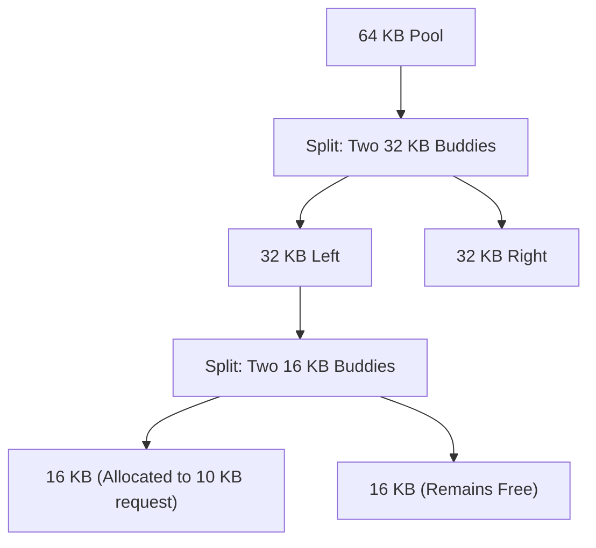

# Segregated Free Lists and Binary Buddy Allocation

> 📖 **Reading Order:** Step 39 of 68 | **Module 6: Virtual Memory Foundations**  
> ◄ **Previous:** [[Free-Space Management and Allocation Policies]] | ► **Next:** [[Segmentation Translation and Buddy Allocation Example]]

---

## The Problem and Earlier Tools

As established in [[Free-Space Management and Allocation Policies]], general-purpose free-list policies (First-Fit, Best-Fit) suffer from two major drawbacks:
1. **Search Latency:** Finding a suitable free block requires traversing a linked list ($O(N)$ worst case), which is too slow for high-frequency kernel allocations (e.g., allocating network packet buffers or process control blocks).
2. **Coalescing Complexity:** Finding adjacent neighbors in memory to merge free blocks requires maintaining sorted lists or boundary tags.

To achieve $O(1)$ allocation speeds and eliminate external fragmentation for common object sizes, specialized allocators use **Segregated Lists** and **Binary Buddy Allocation**.

---

## Segregated Free Lists

A **Segregated Free List** maintains separate, dedicated free lists for commonly requested fixed allocation sizes (e.g., 16 B, 32 B, 64 B, 128 B, 256 B).

```
Segregated Lists Array:
[ 16 B ]  --> [ Chunk ] --> [ Chunk ] --> NULL
[ 32 B ]  --> [ Chunk ] --> [ Chunk ] --> [ Chunk ] --> NULL
[ 64 B ]  --> [ Chunk ] --> NULL
[ 128 B ] --> [ Chunk ] --> [ Chunk ] --> NULL
[ General ] -> [ Variable-size Free List (Best-Fit / First-Fit) ]
```

### Allocation Mechanics
1. When an allocation for 32 bytes arrives, the allocator accesses array index `[ 32 B ]`.
2. It pops the first free block from the list in **instantaneous $O(1)$ time**.
3. If the list is empty, it requests a new virtual memory page from the OS, slices the page into 32-byte chunks, and links them into the list.
4. Requests of irregular or large sizes are forwarded to a general-purpose allocator.

### The McKusick-Karels Allocator (4.3BSD UNIX)
To eliminate the in-band header overhead for every tiny block, the 4.3BSD kernel implemented the **McKusick-Karels Allocator**:
- The kernel maintains a global page-level array `kmemsizes[]` indexed by `address / PageSize`.
- Every page in the allocator's pool is dedicated exclusively to blocks of a single power-of-two size.
- When `free(ptr)` is called, the allocator computes `page_index = (uintptr_t)ptr >> PageShift` and looks up `kmemsizes[page_index]` to instantly know the block's size without inspecting any header!

---

## The Binary Buddy Allocator

The **Binary Buddy Allocator** is an elegant memory allocation algorithm designed to make both allocation and coalescing extremely fast by exploiting binary address arithmetic.

### Core Architecture
- The entire memory pool is sized as a power of two: $2^U$ (e.g., 64 KB, 1 MB).
- Allocation requests are rounded up to the nearest power of two: $2^k$.
- The allocator maintains an array of free lists, where list $k$ holds free blocks of size $2^k$.



### Algorithmic Procedure

#### 1. Allocation (Splitting):
To allocate a block of size $S$:
1. Compute the target power of two: $k = \lceil \log_2(S + 	ext{header}) 
ceil$.
2. Check the free list for size $2^k$:
   - If a free block exists, remove and return it.
   - If not, search higher free lists ($k+1, k+2, \dots$) for the smallest available block of size $2^m$ ($m > k$).
3. Remove the $2^m$ block and **recursively split it in half** into two equal-sized "buddies" of size $2^{m-1}$.
4. Place one buddy on the $m-1$ free list and continue splitting the other until a block of size $2^k$ is obtained.

#### 2. Deallocation (Binary Coalescing):
When freeing a block of size $2^k$ at memory address $A$:
1. Compute the physical address of its **Buddy** using a single bitwise XOR operation:
   $$\mathbf{	ext{Buddy Address} = A \oplus 2^k}$$
2. Check if the buddy is currently free and has the same size $2^k$:
   - If **Yes**: Remove the buddy from the $2^k$ free list, merge them into a single block of size $2^{k+1}$ starting at $\min(A, 	ext{Buddy Address})$, and recursively attempt to coalesce with the next higher buddy!
   - If **No**: Insert block $A$ into the $2^k$ free list.

---

## Concrete Example: Buddy Coalescing Arithmetic

Consider a 64 KB memory pool spanning addresses `0x0000` to `0xFFFF`:
1. **Request 7 KB:**
   - Rounded up to power of two: $8\,	ext{KB}$ ($2^{13} = 8192 = 	ext{0x2000}$).
   - 64 KB split $	o$ two 32 KB blocks: `[0x0000, 0x8000]`.
   - 32 KB (`0x0000`) split $	o$ two 16 KB blocks: `[0x0000, 0x4000]`.
   - 16 KB (`0x0000`) split $	o$ two 8 KB blocks: `[0x0000, 0x2000]`.
   - Block `0x0000` (8 KB) is allocated.
2. **Finding the Buddy:**
   - Address $A = 	ext{0x0000}$, Size $= 	ext{0x2000}$.
   - $	ext{Buddy} = 	ext{0x0000} \oplus 	ext{0x2000} = \mathbf{	ext{0x2000}}$.
   - Block `0x2000` is its exact matching buddy!
3. **When `0x0000` is freed:**
   - Allocator checks if `0x2000` is free. If yes, they immediately merge back into `0x0000` (16 KB)!

---

## Complexity

- **Time Complexity:**
  - *Allocation:* $O(\log_2(	ext{Pool Size}))$, bounded by the maximum tree height (typically $\le 20$ operations).
  - *Deallocation / Coalescing:* $O(\log_2(	ext{Pool Size}))$, requiring only fast bitwise XOR checks and pointer updates.
- **Space Complexity:**
  - $O(\log_2(	ext{Pool Size}))$ free list head pointers.

---

## Properties and Trade-offs

- **External Fragmentation Resistance:** Power-of-two blocks pack tightly into virtual memory pages, dramatically reducing external fragmentation.
- **Internal Fragmentation Penalty:** Rounding allocations up to the next power of two incurs substantial **internal fragmentation**. A request for 33 KB must be granted a 64 KB block, wasting nearly 48% of the allocated space.

---

## Common Mistakes

- **Incorrect Buddy Calculation:** Calculating buddy address by adding or subtracting instead of using bitwise XOR. Only XOR correctly toggles the $k$-th address bit to identify the true sibling in the binary tree.
- **Coalescing Non-Buddies:** Attempting to merge two free 8 KB blocks that are adjacent in memory but belong to different 16 KB parents. They are not binary buddies and cannot be coalesced!

---

## Exam Relevance

Consistently tested through:
- Tracing buddy allocator tree splits and merges for a given sequence of allocations and frees.
- Calculating internal fragmentation percentage for specific request sizes.
- Bitwise computation of buddy addresses for given block sizes.

---

## Related Concepts

- [[Free-Space Management and Allocation Policies]]
- [[Segmentation and External Fragmentation]]
- [[Kernel Memory Allocation Architecture and the Slab Allocator]]

---

## Prerequisites

- [[Free-Space Management and Allocation Policies]]

---

## Problems

- [[Problem — Segmentation Address Translation and Buddy Memory Allocation]]

---

## Sources

- **Lecture Slides:** [[cse313/01 - Sources/Lectures/CSE313_KRV_Merged.pdf|CSE313_KRV_Merged.pdf]], Chapter 17 (Slides 100–111) & Kernel Allocator Slides (Slides 397–413).
- **Textbook:** Arpaci-Dusseau & Arpaci-Dusseau, *Operating Systems: Three Easy Pieces (OSTEP)*, Chapter 17 (Free-Space Management).
