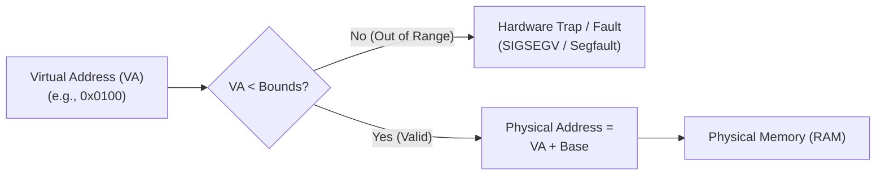

# Address Space Abstraction and Hardware Relocation

> 📖 **Reading Order:** Step 35 of 68 | **Module 6: Virtual Memory Foundations**  
> ◄ **Previous:** [[Problem — Resource Allocation Graph Reduction and Cycle Detection]] | ► **Next:** [[Memory API and Allocation Safety]]

---

## Starting Point and the Problem

In the early eras of computing, computers had no memory virtualization. Physical memory was exposed directly to the running program. When a program executed `mov 0x1000, %eax`, it fetched data from byte `0x1000` on the physical RAM bus.

While straightforward for single-user batch systems, this direct physical mapping collapsed when multiprogramming and time-sharing arrived:
1. **Zero Protection and Isolation:** Any running program could read or overwrite the physical memory belonging to the operating system or other running programs. A single rogue pointer crashed the entire machine.
2. **Fixed Static Relocation:** If two programs were compiled with instructions expecting to load at address `0x2000`, they could not run simultaneously in physical RAM without complex, slow binary patching at load time.
3. **Rigid Resource Allocation:** Programs could not grow dynamically, and swapping entire programs out to disk to make room for another process incurred crippling I/O overhead.

To support safe, concurrent execution, the operating system and hardware must decouple the programmer's view of memory from actual physical silicon addresses.

---

## Developing the Idea

The solution is an illusion created through hardware-software cooperation: the **Address Space**.

The operating system presents every running process with the abstraction of its own private, dedicated, contiguous physical memory array, spanning from virtual address `0` up to a large maximum (such as $2^{32}-1$ or $2^{64}-1$). The running process has no awareness of where its bytes actually sit in physical RAM chips, or even whether other processes exist in memory alongside it.

```
+-----------------------------------+ 0x00000000 (0 KB)
|            Code (Text)            | (Compiled binary instructions; static size)
+-----------------------------------+
|               Heap                | (Dynamically allocated via malloc; grows downward)
|                 |                 |
|                 v                 |
|                                   |
|                 ^                 |
|                 |                 |
|               Stack               | (Local variables, return frames; grows upward)
+-----------------------------------+ 0xFFFFFFFF (4 GB in 32-bit architecture)
```

The canonical process address space consists of three distinct logical segments:
1. **Code (Text):** The compiled machine instructions. This region is fixed in size and typically marked read-only to prevent self-modifying code bugs.
2. **Heap:** Dynamically allocated memory requested at runtime (`malloc()`, `new`). It starts directly above the code and grows downward toward higher addresses as more memory is requested.
3. **Stack:** Call stack managing function execution, parameter passing, return addresses, and local variables. It starts at the top of the address space and grows downward (toward lower addresses) with each nested function call.

Between the heap and the stack lies a vast unused void. If the address space is 4 GB, a typical program might only use 1 MB for code, 2 MB for heap, and 128 KB for stack—leaving over 3.99 GB of the address space completely empty.

### The Three Goals of Virtual Memory
To make this abstraction viable, the virtual memory system must satisfy three fundamental design goals:
1. **Transparency:** The virtualization must be completely invisible to the running program. Compilers and programs behave as though they possess private physical memory.
2. **Efficiency:** Virtualization must not degrade system throughput. Address translation must be performed in hardware at clock-cycle speeds without excessive memory storage overhead.
3. **Protection and Isolation:** The architecture must enforce strict boundaries. Process $A$ cannot read, write, or execute memory belonging to Process $B$ or the OS kernel, preventing bugs and security breaches.

---

## How It Works: Base-and-Bounds Dynamic Relocation

To provide address translation at hardware speeds without software interpretation, the CPU Memory Management Unit (MMU) introduces two privileged hardware registers: the **Base Register** and the **Bounds (Limit) Register**.



### The Translation Equations
When the CPU executes an instruction referencing virtual address $	ext{VA}$:
1. **Bounds Check:** The hardware MMU verifies that the virtual address is within the legal allocation size:
   $$0 \le 	ext{Virtual Address} < 	ext{Bounds}$$
   If $	ext{VA} \ge 	ext{Bounds}$ or $	ext{VA} < 0$, the MMU halts execution and triggers a **Hardware Exception (Segmentation Fault / Trap to Kernel)**.
2. **Base Relocation:** If valid, the MMU computes the physical memory address:
   $$	ext{Physical Address} = 	ext{Virtual Address} + 	ext{Base}$$

### Operating System Responsibilities
Dynamic relocation requires direct cooperation between the hardware MMU and the OS kernel:
- **Process Creation:** When a new process is spawned, the OS searches its physical memory free list for a contiguous chunk of RAM equal to the process's allocated address space size, sets the Base register to the chunk's physical start, and sets Bounds to its size.
- **Context Switching:** Because each process resides at a different physical base address, the OS saves the outgoing process's Base and Bounds registers into its Process Control Block (PCB). When dispatching the incoming process, the OS executes privileged instructions to reload the MMU's Base and Bounds registers.
- **Exception Handling:** If a process attempts an illegal memory access, the MMU triggers an architectural trap. The OS kernel's trap handler intercepts the fault, terminates the offending process, and reclaims its resources.

---

## Example

Consider a system with 64 KB of physical memory. A process with a 16 KB virtual address space is loaded into physical RAM starting at physical address $32768$ (32 KB):
- $	ext{Base} = 32768$ (`0x8000`)
- $	ext{Bounds} = 16384$ (`0x4000`, 16 KB)

Suppose the process executes the following memory accesses:

| Virtual Address | Bounds Check ($	ext{VA} < 16384$) | Translation Equation | Physical Address | Result |
|---|---|---|---|---|
| `0` (Code entry) | $0 < 16384$ (Pass) | $32768 + 0$ | $32768$ (`0x8000`) | Valid fetch |
| `1024` (Load var) | $1024 < 16384$ (Pass) | $32768 + 1024$ | $33792$ (`0x8400`) | Valid load |
| `16380` (Stack read) | $16380 < 16384$ (Pass) | $32768 + 16380$ | $49148$ (`0xBFFC`) | Valid access |
| `16400` (Illegal array index) | $16400 < 16384$ (Fail) | N/A | N/A | **Trap: Segmentation Fault** |

---

## Technical Details

1. **Kernel Mode vs. User Mode Protection:** The Base and Bounds registers are privileged hardware registers. User-space programs cannot execute instructions to modify Base or Bounds; attempting to do so in User Mode triggers a privileged-instruction trap. Only the kernel executing in Supervisor/Kernel Mode can alter these registers.
2. **Context Switch Overhead:** Base-and-bounds has virtually zero context-switch overhead because only two CPU registers need to be swapped in the MMU.
3. **The Fatal Flaw of Pure Base-and-Bounds:** Pure base-and-bounds requires the entire virtual address space to be allocated **contiguously** in physical memory. Even if a process uses only 20 KB of combined code, heap, and stack inside a 16 MB address space, the entire 16 MB must be reserved in physical RAM. This causes immense internal and external memory fragmentation.

---

## Important Properties and Why They Hold

- **Dynamic Relocation Invariant:** Once compiled, binary code never needs to know where it resides in physical RAM. The addition of the base register by the MMU ensures that position-independent execution is achieved with zero software recompilation or runtime patching overhead.
- **Fail-Safe Spatial Isolation:** Because the bounds check occurs in physical hardware circuits *before* the address bus is asserted, illegal memory reads and writes never reach physical RAM cells, guaranteeing absolute memory safety between distinct processes.

---

## Common Mistakes

- **Confusing Virtual and Physical Addresses:** Beginners often assume pointer values printed in user code (e.g., `printf("%p", ptr)`) represent motherboard RAM addresses. Pointers are *always* virtual addresses that are translated by the MMU on the fly.
- **Assuming Bounds is an Address:** In some CPU architectures, Bounds is defined as the maximum *virtual address* (size), while in others it is defined as the *physical limit address* ($	ext{Base} + 	ext{Size}$). The standard OSTEP/Dragon model treats Bounds as the **size limit** of the virtual address space.

---

## Exam Relevance

Tested frequently in Operating Systems midterms and finals through:
- Calculating physical addresses given Base, Bounds, and a sequence of virtual memory operations.
- Identifying whether specific virtual addresses trigger hardware traps.
- Explaining the trade-offs of dynamic relocation and why base-and-bounds necessitates more advanced schemes like segmentation and paging.

---

## Related Concepts

- [[Process Concepts and Memory Layout]]
- [[Process Control Block and Context Switching]]
- [[Segmentation and External Fragmentation]]
- [[Paging Architecture and Linear Page Tables]]

---

## Prerequisites

- [[Dual-Mode Operation and System Calls]]
- [[Process Concepts and Memory Layout]]

---

## Problems

- [[Problem — Segmentation Address Translation and Buddy Memory Allocation]]

---

## Sources

- **Lecture Slides:** [[cse313/01 - Sources/Lectures/CSE313_KRV_Merged.pdf|CSE313_KRV_Merged.pdf]], Chapter 13 & 15 (Slides 2–61).
- **Textbook:** Arpaci-Dusseau & Arpaci-Dusseau, *Operating Systems: Three Easy Pieces (OSTEP)*, Chapter 13 (The Abstraction: Address Spaces) and Chapter 15 (Mechanism: Address Translation).
