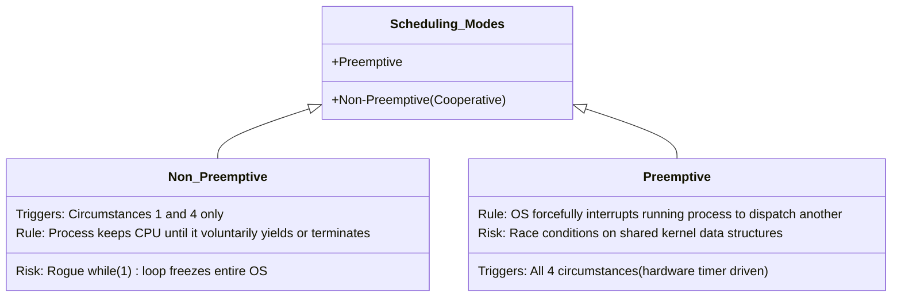

# CPU Scheduling Principles and Criteria

> 📖 **Reading Order:** Step 12 of 34 | **Module 3:** CPU Scheduling  
> ◄ **Previous:** [[Problem — Fork Execution Tree and Process Tracing]] | ► **Next:** [[Batch Scheduling Algorithms]]

---

## Definition

In a multiprogramming operating system, multiple processes reside simultaneously in the Ready state competing for execution time. **CPU Scheduling** is the core operating system mechanism that selects one process from the Ready Queue and allocates a physical CPU core to it.

The component of the operating system that performs this selection is the **Scheduler**, and the algorithm it executes is the **Scheduling Algorithm**.

---

## The CPU–I/O Burst Cycle

Process execution consists of an alternating cycle of **CPU execution (bursts)** and **I/O wait (bursts)**:
- A process computes on the CPU for some duration (CPU burst).
- It then initiates an I/O operation (disk read, network packet, keystroke) and blocks (I/O burst).
- Upon I/O completion, it re-enters the Ready Queue for another CPU burst.
- Eventually, the final CPU burst ends with a system call to terminate.

### Compute-Bound vs. I/O-Bound Processes:
1. **Compute-Bound (CPU-Bound) Processes:**
   - Spend almost all their time doing intense calculations.
   - Characterized by **long, infrequent CPU bursts** and very short, infrequent I/O requests.
   - *Examples:* Scientific simulations, video rendering, cryptographic hashing, machine learning model training.
2. **I/O-Bound Processes:**
   - Spend almost all their time waiting for external I/O.
   - Characterized by **short, frequent CPU bursts** interspersed with frequent I/O requests.
   - *Examples:* Text editors, database queries, web servers, file copiers.

*Key Scheduler Goal:* Prioritize I/O-bound processes to keep I/O devices fully utilized while keeping CPU latency low.

---

## When Scheduling Decisions Occur: Preemption

CPU scheduling decisions must be made under four circumstances:

1. When a process transitions from the **Running** state to the **Waiting (Blocked)** state (e.g., executing `read()`).
2. When a process transitions from the **Running** state to the **Ready** state (e.g., hardware timer interrupt expires).
3. When a process transitions from the **Waiting** state to the **Ready** state (e.g., I/O completion interrupt fires).
4. When a process **Terminates** (`exit()`).

### Preemptive vs. Non-Preemptive Scheduling:

- **Non-Preemptive (Cooperative) Scheduling:**
  Once a process is given the CPU, it continues running until it voluntarily releases it—either by requesting an I/O operation (blocking) or by terminating.
  *Drawback:* A poorly written process in an infinite loop will freeze the entire machine.
- **Preemptive Scheduling:**
  The operating system uses a periodic hardware **timer interrupt** (clock tick) to take the CPU away from a running process, moving it back to the Ready Queue.
  *Requirement:* Standard in all modern operating systems (Linux, Windows, macOS).

---

## Scheduling Criteria (Performance Metrics)

Different environments demand different optimization criteria:

1. **CPU Utilization (Maximized):**
   - The percentage of time the CPU is actively performing useful work (typically $40\%$ on light loads to $90\%$ on heavy loads; see [[CPU Multiprogramming Utilization Formula]]).
2. **Throughput (Maximized):**
   - The number of completed processes per unit of time (e.g., 50 jobs/hour).
3. **Turnaround Time ($T_{\text{turn}}$) (Minimized):**
   - The total elapsed time from the moment a process is submitted/arrives until it completely finishes:
     $$T_{\text{turn}} = T_{\text{completion}} - T_{\text{arrival}}$$
   - Includes time spent waiting in the ready queue, executing on the CPU, and waiting for I/O.
4. **Waiting Time ($T_{\text{wait}}$) (Minimized):**
   - The total cumulative time a process spends sitting in the **Ready Queue** waiting to be allocated the CPU:
     $$T_{\text{wait}} = T_{\text{turn}} - T_{\text{burst}}$$
   - *(Note: Scheduling algorithms have zero control over how long a disk takes to read data; they directly control only waiting time)*.
5. **Response Time ($T_{\text{resp}}$) (Minimized):**
   - The time from submission until the process produces its **very first output or response** on the CPU:
     $$T_{\text{resp}} = T_{\text{first CPU dispatch}} - T_{\text{arrival}}$$
   - Crucial in interactive systems (typing, gaming).
6. **Fairness:**
   - Every process should receive an equitable share of CPU time; no process should suffer **Starvation** (indefinite postponement).

---

## Scheduling Environments: The Three Kingdoms

Operating systems categorize workloads into three fundamentally distinct environments:

| Environment | Primary Goals | Representative Algorithms |
|---|---|---|
| **Batch Systems** | Maximize throughput, minimize turnaround time, maximize CPU utilization | FCFS, SJF, SRTF (see [[Batch Scheduling Algorithms]]) |
| **Interactive Systems** | Minimize response time, ensure fairness, prevent starvation | Round Robin, Priority, MLFQ (see [[Interactive Scheduling Algorithms]]) |
| **Real-Time Systems** | Guarantee meeting hard/soft deadlines, maintain predictability | Rate Monotonic (RMS), Earliest Deadline First (EDF) |

---

## Edge Cases & Common Pitfalls

1. **Confusing Waiting Time with Turnaround Time:**
   - Turnaround time includes the process's own CPU burst time. Waiting time is *strictly* the time spent waiting in the Ready Queue doing nothing.
2. **Optimizing One Metric at the Expense of Another:**
   - Maximizing throughput (by running short jobs first via SJF) often harms fairness and can cause long jobs to starve indefinitely.
   - Providing instantaneous response times (via tiny Round Robin time quanta) incurs severe context switch overhead, degrading overall throughput.

---

## Cross-Topic Connections / Exam Relevance

- **Next Step:** How batch systems optimize turnaround time using non-preemptive and shortest-burst strategies (see [[Batch Scheduling Algorithms]]).
- **Interactive Systems:** How time-sharing interactive systems slice CPU time into quanta (see [[Interactive Scheduling Algorithms]]).
- **Formulas:** Detailed mathematical definitions and exponential smoothing burst estimation (see [[Scheduling Metrics and Burst Estimation Formulas]]).
- **Exam Testing:** Frequently tested by asking students to define the 5 scheduling criteria and categorize an algorithm as preemptive vs non-preemptive.

---

## Sources & Traceability

- **Lectures:** `cse313/01 - Sources/Lectures/3. Scheduling-week-3-RRR.pdf` (Slides 1–14)
- **Textbook:** Andrew S. Tanenbaum & Herbert Bos, *Modern Operating Systems* (4th Edition), Chapter 2 (Section 2.4: Scheduling)
