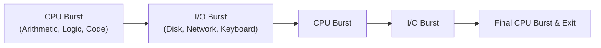

# CPU Scheduling Principles and Criteria

> 📖 **Reading Order:** Step 12 of 34 | **Module 3:** CPU Scheduling  
> ◄ **Previous:** [[Problem — Fork Execution Tree and Process Tracing]] | ► **Next:** [[Batch Scheduling Algorithms]]

---

> [!IMPORTANT] **Exam practice references (Appeared in 2017 Q4a, 2020 Q2a)**
>
> ### Practice tasks and reasoning:
> 1. **Differentiating Compute-Bound vs I/O-Bound Processes with Diagrams (2017 Q4a & 2020 Q2a):**
>    - **Compute-Bound (CPU-Bound):** Spends the vast majority of time executing arithmetic/logic instructions. Exhibits very long CPU bursts punctuated by brief, infrequent I/O requests (e.g., scientific computing, video encoding, matrix multiplication).
>    - **I/O-Bound:** Spends the vast majority of its lifecycle waiting for I/O operations (user typing, disk reads, network sockets). Characterized by frequent, very short CPU bursts followed by long I/O wait periods.
>    - **The Diagram Expected by Examiners:**
>      ```
>      Compute-Bound:
>      |================ Long CPU Burst ================|==| I/O |================ CPU ================|
>
>      I/O-Bound:
>      |==| CPU |======== Long I/O Wait ========|==| CPU |======== Long I/O Wait ========|==| CPU |
>      ```

---

## Building the idea

[[Process Lifecycle and State Transitions]] tells us which processes are ready. Scheduling asks which ready process should run next. That choice matters even when all jobs eventually receive exactly the CPU work they need: a short interactive task can feel very different depending on whether it waits behind a long calculation.

Follow one process's timeline. Its **response time** ends when it first receives the CPU. Its **turnaround time** ends when it finishes. Its **waiting time** accumulates while it is ready but not running. These measure different experiences, so a scheduler can improve one and worsen another.

A non-preemptive scheduler lets a running burst continue until it blocks or ends. A preemptive scheduler can interrupt it at an allowed event, such as quantum expiration or a higher-priority arrival. Preemption creates opportunities for responsiveness, but it also requires the state-saving mechanism from [[Process Control Block and Context Switching]].

When comparing policies, specify the workload and overhead assumptions. A finite collection of known CPU bursts is not the same problem as interactive jobs whose next burst is unknown. The policy's goal and available information determine which comparison makes sense.

## Definition

In a multiprogramming operating system, multiple processes reside simultaneously in the Ready state competing for execution time. **CPU Scheduling** is the core operating system mechanism that selects one process from the Ready Queue and allocates a physical CPU core to it.

The component of the operating system that performs this selection is the **Scheduler**, and the algorithm it executes is the **Scheduling Algorithm**.

---

## How It Works

### The CPU–I/O Burst Cycle

Process execution consists of an alternating cycle of **CPU execution (bursts)** and **I/O wait (bursts)**:
- A process computes on the CPU for some duration (CPU burst).
- It then initiates an I/O operation (disk read, network packet, keystroke) and blocks (I/O burst).
- Upon I/O completion, it re-enters the Ready Queue for another CPU burst.
- Eventually, the final CPU burst ends with a system call to terminate.



### Compute-Bound vs. I/O-Bound Processes:
1. **Compute-Bound (CPU-Bound) Processes:**
   - Spend almost all their time doing intense calculations.
   - Characterized by **long, infrequent CPU bursts** and very short, infrequent I/O requests.
   - *Examples:* Scientific simulations, video rendering, cryptographic hashing, machine learning model training.
2. **I/O-Bound Processes:**
   - Spend almost all their time waiting for external I/O.
   - Characterized by **short, frequent CPU bursts** interspersed with frequent I/O requests.
   - *Examples:* Text editors, database queries, web servers, file copiers.

*Key Scheduler Goal:* Prioritize I/O-bound processes to keep I/O devices fully utilized while keeping CPU latency low.

---

## Example

Scheduling decisions at 4 critical points:
1. Process switches from Running to Waiting state (e.g. `read()` system call) $	o$ Non-preemptive scheduling.
2. Process switches from Running to Ready state (e.g. timer interrupt ticks) $	o$ Preemptive scheduling.
3. Process switches from Waiting to Ready state (e.g. I/O completion interrupt) $	o$ Preemptive scheduling choice.
4. Process terminates $	o$ Non-preemptive scheduling.

---

## Important Properties and Why They Hold

- **Preemption tradeoff:** Time slicing can improve response opportunities, but a bound requires the scheduling policy and workload assumptions. Switching also adds overhead and can disturb cache state.
- **Turnaround vs. Waiting Equivalence:** Turnaround Time ($T_{TAT} = T_{	ext{completion}} - T_{	ext{arrival}}$) is always strictly equal to Waiting Time plus Burst Time: $T_{TAT} = T_{wait} + T_{burst}$.
- **Workload Trade-Off Invariant:** No single scheduling algorithm can simultaneously optimize all criteria (Throughput, Turnaround, Waiting Time, Response Time, and CPU Utilization).

---

## Common Mistakes

1. **Confusing Waiting Time with Turnaround Time:**
   - Turnaround time includes the process's own CPU burst time. Waiting time is *strictly* the time spent waiting in the Ready Queue doing nothing.
2. **Optimizing One Metric at the Expense of Another:**
   - Maximizing throughput (by running short jobs first via SJF) often harms fairness and can cause long jobs to starve indefinitely.
   - Providing instantaneous response times (via tiny Round Robin time quanta) incurs severe context switch overhead, degrading overall throughput.

---

## Exam Relevance

- **Next Step:** How batch systems optimize turnaround time using non-preemptive and shortest-burst strategies (see [[Batch Scheduling Algorithms]]).
- **Interactive Systems:** How time-sharing interactive systems slice CPU time into quanta (see [[Interactive Scheduling Algorithms]]).
- **Formulas:** Detailed mathematical definitions and exponential smoothing burst estimation (see [[Scheduling Metrics and Burst Estimation Formulas]]).
- **Exam Testing:** Frequently tested by asking students to define the 5 scheduling criteria and categorize an algorithm as preemptive vs non-preemptive.

---

## What to carry forward

For a CPU-only scheduling exercise, turnaround equals CPU service plus ready-queue waiting. If a process also waits for I/O, include that blocked time separately. [[Batch Scheduling Algorithms]] emphasizes completion-oriented choices; [[Interactive Scheduling Algorithms]] adds time slicing and responsiveness.

## Related notes

- [[Process Lifecycle and State Transitions]]
- [[Process Control Block and Context Switching]]
- [[Batch Scheduling Algorithms]]
- [[Interactive Scheduling Algorithms]]

## Sources

- **Lectures:** `cse313/01 - Sources/Lectures/3. Scheduling-week-3-RRR.pdf` (Slides 1–14)
- **Textbook:** Andrew S. Tanenbaum & Herbert Bos, *Modern Operating Systems* (4th Edition), Chapter 2 (Section 2.4: Scheduling)
