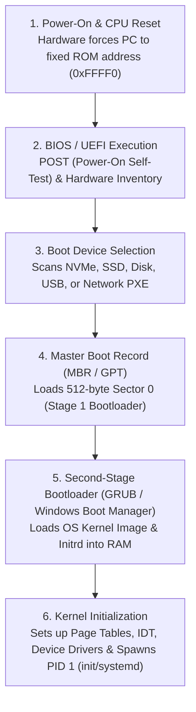
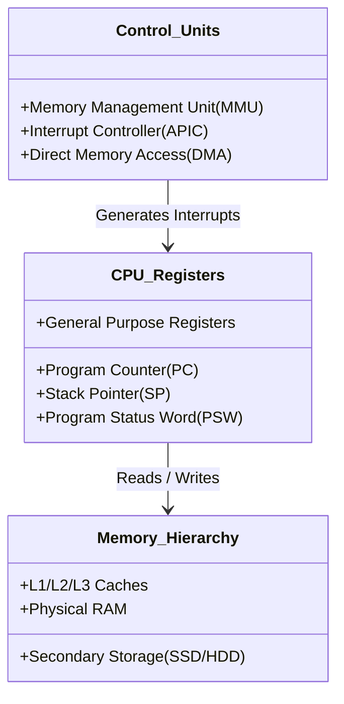

# Computer Booting and Hardware Abstractions

> 📖 **Reading Order:** Step 03 of 34 | **Module 1:** OS Architecture & Kernel Fundamentals  
> ◄ **Previous:** [[Dual-Mode Operation and System Calls]] | ► **Next:** [[Process Concepts and Memory Layout]]

---

> [!IMPORTANT] 🎯 **Exam Frequency & Intelligence (Appeared in 2017 Q1a, 2021 Q3d)**
> **Frequency:** ⭐⭐⭐⭐ **High Recurrence (Repeated Verbatim in 2017 and 2021!)**
>
> ### What Exam Questions Expect & How to Master Them:
> 1. **Writing Down the Exact Steps of Booting a Computer (2017 Q1a & 2021 Q3d verbatim):**
>    - **The Setup:** "Write down the steps of booting a computer."
>    - **The 7-Step Full-Credit Answer Key:**
>      1. **Power-On & Hardware Reset Vector:** Power supply asserts `POWER_GOOD`. The CPU starts execution at a hardwired ROM reset vector (`0xFFFFFFF0` on x86).
>      2. **POST (Power-On Self-Test):** Firmware conducts diagnostic hardware self-tests (checks RAM integrity, CPU registers, system buses, keyboard, disks).
>      3. **Boot Device Selection:** BIOS/UEFI scans configured NVRAM boot order (NVMe, SSD/HDD, USB, PXE network) for a bootable medium.
>      4. **MBR / Boot Sector Loading:** The firmware loads the primary boot sector (Sector 0, 512 bytes) into RAM at address `0x7C00` and verifies the `0x55AA` boot signature.
>      5. **Stage 1 Bootloader Execution:** Small bootloader code within the MBR executes, locates the active boot partition, and loads the Stage 2 Bootloader.
>      6. **Stage 2 Bootloader (GRUB2 / NTLDR):** Displays the OS selection menu, loads the OS kernel image (`vmlinuz`) and initial RAM disk (`initramfs`) into memory, and switches CPU from 16-bit real mode to 32/64-bit protected/long mode.
>      7. **Kernel Initialization & PID 1 Launch:** Kernel initializes memory paging, device drivers, and CPU scheduler, mounts real root (`/`), and spawns the first user-space process (`systemd` or `init`, PID 1).

---

## Definition

**Booting** (short for *bootstrapping*) is the initial sequential process that starts an operating system when a computer is powered on or restarted.

Because main memory (RAM) is volatile, it contains random, meaningless data at power-on. The CPU cannot immediately run an operating system from RAM. Instead, hardware and firmware must work in a multi-stage chain—each link loading a slightly more complex piece of software—culminating in an initialized OS kernel running in privileged mode.

---

## The Step-by-Step Boot Sequence

The modern computer boot sequence follows six precise phases:

### Phase 1: CPU Hardware Reset
1. Power supply stabilizes and sends a `POWER GOOD` signal to the motherboard chipset.
2. The CPU hardware reset line is pulsed, resetting all internal registers to default states.
3. The **Program Counter (PC / Instruction Pointer)** is hardwired to a predetermined, fixed memory address in non-volatile read-only memory (ROM/Flash)—on x86 systems, this is `0xFFFF0`.

### Phase 2: BIOS / UEFI Firmware Execution
- **POST (Power-On Self-Test):** Firmware verifies basic hardware operational integrity (checks CPU registers, tests RAM chips, verifies keyboard and video controllers).
- **Device Inventory & Configuration:** Detects connected storage buses (PCIe, NVMe, SATA, USB), initializes display adapters, and loads basic configuration settings from CMOS/NVRAM.

### Phase 3: Reading the Master Boot Record (MBR) / GPT
- Firmware reads the configured boot order list (e.g., SSD, USB drive, Network).
- For the primary storage drive, firmware reads **Sector 0** (the very first 512-byte physical sector on disk, known as the **Master Boot Record**):
  - **Bytes 0–445:** Primary Bootstrap Code (Stage 1 Bootloader).
  - **Bytes 446–509:** Partition Table (describes up to 4 primary partitions).
  - **Bytes 510–511:** Magic Boot Signature `0x55AA` (validates that the sector is bootable).

### Phase 4: The Bootloader (GRUB / Windows Boot Manager)
Because 446 bytes is far too tiny to understand modern file systems (ext4, NTFS) or parse kernel binaries, the bootloader runs in stages:
- **Stage 1 (MBR code):** Merely knows how to find and load Stage 2 from a fixed sector location.
- **Stage 2 (GRUB):** Contains disk and file system drivers. Presents the OS selection menu, reads kernel configuration parameters, and loads the compressed OS kernel image (`vmlinuz`) and initial RAM disk (`initrd`) into physical RAM.

### Phase 5: Kernel Initialization
Control is handed over to the kernel entry point. The kernel runs in **Kernel Mode**:
1. **CPU Mode Transition:** Switches the CPU from legacy 16-bit Real Mode into 32-bit Protected Mode or 64-bit Long Mode.
2. **Memory Setup:** Initializes the Memory Management Unit (MMU), sets up the kernel page tables, and begins virtual memory paging.
3. **Interrupt Vector Table (IVT / IDT):** Populates the Interrupt Descriptor Table with pointers to the kernel's interrupt and exception handlers.
4. **Driver Probing:** Detects, probes, and loads drivers for all physical hardware components.

### Phase 6: Spawning the First User-Space Process (PID 1)
Once kernel initialization is complete, the kernel mounts the root file system and spawns the ancestor of all user processes:
- In Linux/UNIX: `/sbin/init` or `/lib/systemd/systemd` (**Process ID = 1**).
- The kernel sets the hardware mode bit to $1$ (**User Mode**) and transitions to PID 1.
- PID 1 reads system configuration files to spawn background service daemons (networking, cron, logging) and finally launches graphical login managers or terminal shells (`getty`/`login`).

---

## Essential Hardware Abstractions

To understand process execution and scheduling, an operating system relies on four fundamental hardware abstractions:

### 1. Key CPU Registers
- **Program Counter (PC / EIP / RIP):** Contains the memory address of the next machine instruction to be fetched and executed.
- **Stack Pointer (SP / ESP / RSP):** Points to the top of the current execution call stack in memory (used for local variables, parameter passing, and return addresses).
- **Program Status Word (PSW / Flags):** Holds critical CPU status flags (Carry, Zero, Overflow, Interrupt Enable flag, and the **Kernel/User Mode Bit**).

### 2. The Memory Hierarchy
Systems trade speed for capacity and cost:
$$\text{Registers (< 1 ns, < 1 KB)} \to \text{Caches (1–10 ns, MBs)} \to \text{RAM (50–100 ns, GBs)} \to \text{NVMe/SSD (10–100 }\mu\text{s, TBs)} \to \text{HDD (ms, TBs)}$$
The OS abstracts this entire hierarchy into a clean, uniform **Virtual Address Space** per process.

### 3. Interrupt Descriptor Table (IDT)
An array of function pointers stored in kernel memory. When interrupt line $k$ triggers, the hardware pauses the current instruction, looks up index $k$ in the IDT, and vectors execution immediately to that address in kernel mode.

---

## Edge Cases & Common Pitfalls

1. **Missing Boot Signature:** If sector 0 does not terminate with `0x55AA`, the BIOS refuses to boot and reports: *"No bootable device found"*.
2. **Volatile vs Non-Volatile Memory:** Beginners often wonder why the kernel isn't kept permanently in RAM. RAM requires continuous electrical power to maintain capacitive charges; turning off power resets RAM to random electrical noise.
3. **Difference between Reboot (Warm Boot) and Cold Boot:**
   - Cold Boot: Machine powers on from zero electricity; full POST executed.
   - Warm Boot (Restart): Memory and CPU reset without cycling physical power; skips several low-level hardware test phases.

---

## Cross-Topic Connections / Exam Relevance

- **Next Step:** Once the OS is booted and PID 1 is running, how does the OS represent, structure, and isolate individual running programs? (See [[Process Concepts and Memory Layout]]).
- **Process Trees:** The boot sequence culminates in spawning PID 1, from which all subsequent processes are created via `fork()` (see [[Process Creation and Termination Operations]]).
- **Exam Testing:** Frequently appears in exam short-answer questions:
  - "Outline the steps that occur between pressing the power button and the shell prompt."
  - "What is the purpose of the MBR and its magic signature?"
  - "Why is the bootloader split into multiple stages?"

---

## Sources & Traceability

- **Lectures:** `cse313/01 - Sources/Lectures/1. Introduction-week1-RRR-2026.pdf` (Slides 7–10, 29–36)
- **Textbook:** Andrew S. Tanenbaum & Herbert Bos, *Modern Operating Systems* (4th Edition), Chapter 1 (Section 1.3: Hardware Overview, Section 1.5: Booting)
