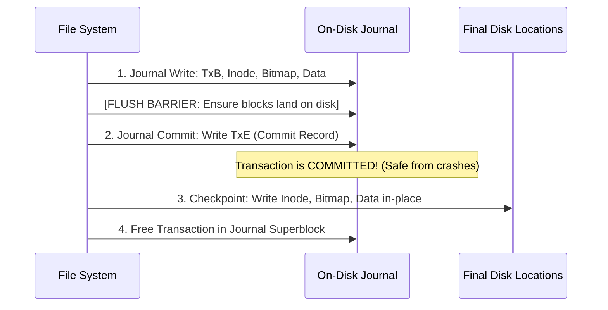

# Crash Consistency, FSCK, and Write-Ahead Journaling

> 📖 **Reading Order:** Step 60 of 68 | **Module 9: File Systems & Persistence**  
> ◄ **Previous:** [[Locality and the Berkeley Fast File System (FFS)]] | ► **Next:** [[Log-Structured File Systems (LFS) and Segment Cleaning]]

---

## Starting Point and the Problem

Storage drives operate in discrete, atomic sector writes (typically 512 bytes or 4 KB). However, high-level file system operations are **multi-block transitions**.

Consider appending a single 4 KB data block to an existing file:
The operating system must perform **three separate writes** to disk:
1. **$I$ (Updated Inode):** Updates file size and adds a pointer to the new data block.
2. **$B$ (Updated Data Bitmap):** Marks the allocated block as used.
3. **$D$ (New Data Block):** Writes the user data payload.

```
Disk State During 3-Block Append:
[ Inode Table: I ]          [ Bitmap: B ]          [ Data Block: D ]
```

Because disks can write only one block at a time, what happens if power is cut or the operating system crashes halfway through?

### The Four Crash Scenarios:
1. **Only $D$ is written:** The data block is on disk, but neither the inode nor bitmap knows it exists. It is harmless (the file simply didn't append), but the data write is lost.
2. **Only $I$ is written:** The inode points to block $D$, but $D$ was never written! Reading the file returns **uninitialized garbage bytes from disk**! Furthermore, bitmap $B$ thinks $D$ is free, so a subsequent file will overwrite it!
3. **Only $B$ is written:** The bitmap marks block $D$ as used, but no inode points to it. The block is **permanently leaked**—lost to both user and OS.
4. **$I$ and $B$ written, but NOT $D$:** The file points to validly allocated storage containing garbage data.

This fundamental hazard is known as the **Crash Consistency Problem**.

---

## The Historical Solution: FSCK (File System Checker)

In early UNIX file systems, the OS tolerated inconsistent states and resolved them upon reboot using **`fsck`**:
- `fsck` scans the entire storage partition before mounting.
- It verifies superblock validity, compares free bitmaps against all allocated inode pointers, fixes orphaned inodes by linking them to `/lost+found`, and verifies link counts.

### The Fatal Flaw of FSCK:
`fsck` must inspect **every single inode and directory block across the entire drive**.
On modern 10 TB drives containing millions of files, running `fsck` takes **hours or days**! Shutting down an enterprise database server for 12 hours after a 1-second power flicker is completely unacceptable.

---

## The Modern Solution: Write-Ahead Logging (Journaling)

Modern file systems (`ext3`, `ext4`, NTFS, XFS) borrow an idea from database transactions: **Write-Ahead Logging (Journaling)**.

The file system reserves a dedicated on-disk circular log called the **Journal**.
> **The Golden Rule of Journaling:**  
> Before writing any metadata updates to their permanent in-place locations on disk, write a description of the intended changes into the journal and commit it!

---

## Data Journaling Protocol (Step-by-Step)

In **Data Journaling**, both user data and metadata pass through the journal:



### The 4 Phases of Data Journaling:
1. **Journal Write:** Write a Transaction Begin block (`TxB`), the updated Inode ($I$), updated Bitmap ($B$), and Data block ($D$) into the journal.
2. **Journal Commit (The Disk Barrier):**
   - The OS issues a hardware **Flush Barrier** to guarantee all transaction blocks land on physical platters.
   - The OS writes the **Transaction End (`TxE`)** commit block to the journal.
   - Once `TxE` is written, the transaction is officially **Committed**. Even if power fails 1 millisecond later, all data is guaranteed recoverable!
3. **Checkpointing:** The OS copies the updated structures ($I, B, D$) from the journal to their permanent in-place disk locations.
4. **Free:** Mark the transaction as free in the journal superblock so the circular log space can be reused.

### Crash Recovery in Data Journaling:
- **Crash before `TxE` is written:** The transaction is incomplete. The OS discards it upon reboot. State remains cleanly as if the write never occurred.
- **Crash after `TxE`, before Checkpointing:** The OS scans the journal, spots the valid `TxE`, and **replays the transaction** (copying $I, B, D$ to permanent locations). Recovery takes **milliseconds**, regardless of disk capacity!

---

## Metadata Journaling (Ordered Journaling)

Data Journaling has a major performance penalty: **every user data byte is written twice** (once to the journal, once to the checkpoint), cutting write throughput in half!

Modern file systems default to **Metadata Journaling (Ordered Journaling)**:
- **Only metadata ($I, B$) is written to the journal.**
- User data ($D$) is written directly to its permanent disk location!

### The Critical Ordering Invariant:
> **Data block $D$ must be written and flushed to disk BEFORE the metadata transaction commits (`TxE`) in the journal!**

$$\mathbf{D \implies [\text{TxB}, I, B] \implies \text{Flush Barrier} \implies \text{TxE} \implies \text{Checkpoint}}$$

If the system crashes before `TxE`, the transaction is discarded. Because the metadata was never committed, the file never points to garbage data.

---

## Important Properties and Guarantees

- **Bounded Recovery Time Principle:** Journal recovery time depends strictly on the size of the *journal* (a few megabytes), completely independent of total disk partition capacity.
- **Commit Atomicity Invariant:** A transaction is either 100% committed (if `TxE` is written) or 0% committed (if `TxE` is missing). Fractional transactions are never replayed.

---

## Common Mistakes

- **Omitting the Flush Barrier before `TxE`:** If the drive controller reorders writes and writes `TxE` to disk *before* $I$ or $B$ land, a crash will cause recovery to replay unwritten, corrupted garbage from the journal!
- **Believing Metadata Journaling Prevents User Data Loss:** Metadata journaling guarantees *file system structural integrity* (no broken pointers, no leaked blocks), but does not guarantee that in-flight user data was committed before power failure.

---

## Exam Relevance

Extremely high examination prominence:
- Detailing the 3 writes involved in file appends and identifying corruption states in crash scenarios.
- Comparing `fsck` vs Journaling recovery performance.
- Writing the step-by-step Data Journaling vs Ordered Journaling timelines and explaining the role of flush barriers.

---

## Related Concepts

- [[File System Implementation and VSFS On-Disk Structures]]
- [[Locality and the Berkeley Fast File System (FFS)]]
- [[Log-Structured File Systems (LFS) and Segment Cleaning]]

---

## Prerequisites

- [[File System Implementation and VSFS On-Disk Structures]]

---

## Problems

- [[Problem — File System Inode Capacity and Journaling Recovery]]

---

## Sources

- **Lecture Slides:** [[cse313/01 - Sources/Lectures/CSE313_KRV_Merged.pdf|CSE313_KRV_Merged.pdf]], Chapter 42 (Slides 352–377).
- **Textbook:** Arpaci-Dusseau & Arpaci-Dusseau, *Operating Systems: Three Easy Pieces (OSTEP)*, Chapter 42 (Crash Consistency: FSCK and Journaling).
