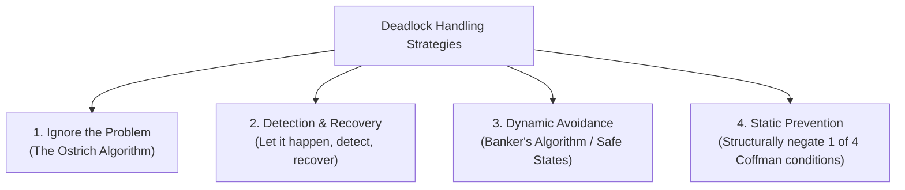

# Deadlock Fundamentals and Coffman Conditions

> 📖 **Reading Order:** Step 26 of 34 | **Module 5:** Deadlocks  
> ◄ **Previous:** [[Problem — Dining Philosophers Deadlock-Free Synchronization]] | ► **Next:** [[Resource Allocation Graphs and Deadlock Modeling]]

---

## 1. Formal Definition & Motivation

In a multiprogramming system, processes execute concurrently and compete for a finite set of hardware and software resources (such as CPU, memory pages, disk drives, printers, mutex locks, and database records).

> **Formal Definition of Deadlock:**  
> A set of processes is in a state of **deadlock** if every process in the set is waiting for an event that can only be caused by another process within the same set.

Because every process is waiting for another sleeping process to awaken it or release a resource, **none of them can ever run, none can ever release resources, and none can ever be awakened**. Execution halts indefinitely.

### Preemptable vs Nonpreemptable Resources
- **Preemptable Resource:** A resource that can be forcibly taken away from the process holding it with zero ill effects (e.g., CPU, physical RAM swapped to disk).
- **Nonpreemptable Resource:** A resource that cannot be confiscated without causing the allocated task or computation to fail (e.g., optical drive burner, tape drive, hardware printer, or exclusive database row lock).  
*Deadlocks predominantly involve nonpreemptable resources.*

### Resource Lifecycle Protocol
Any legitimate process must interact with a resource through three sequential phases:
1. **Request:** Request the resource (blocks if unavailable).
2. **Use:** Perform operations on the allocated resource.
3. **Release:** Explicitly relinquish the resource back to the OS.

---

## 2. The Four Coffman Conditions (1971)

In 1971, Edward G. Coffman Jr. proved that a resource deadlock can occur **if and only if** the following four structural conditions hold simultaneously:

| # | Coffman Condition | Formal Description |
|---|---|---|
| **1** | **Mutual Exclusion** | Each resource is either currently assigned to exactly one process or is available. Resources cannot be shared simultaneously. |
| **2** | **Hold and Wait** | Processes currently holding resources granted earlier are permitted to request and wait for new resources without relinquishing their current holdings. |
| **3** | **No Preemption** | Resources previously granted cannot be forcibly confiscated by the OS; they can only be released voluntarily by the holding process after completing its task. |
| **4** | **Circular Wait** | There must exist a closed circular chain of two or more processes $\{P_0, P_1, \dots, P_n\}$, such that $P_0$ is waiting for a resource held by $P_1$, $P_1$ is waiting for a resource held by $P_2$, and $P_n$ is waiting for a resource held by $P_0$. |

> [!IMPORTANT] The Golden Rule of Deadlock Elimination
> **All four conditions are necessary.** If an operating system successfully invalidates or breaks **even one** of these four conditions, a deadlock is mathematically impossible!

---

## 3. Four Major Strategies for Handling Deadlocks

Modern computer science identifies four distinct strategies for dealing with deadlocks:

### Strategy 1: The Ostrich Algorithm
- **Concept:** *"Stick your head in the sand and pretend there is no problem."*
- **Engineering Justification:** In general-purpose systems (Linux, Windows, macOS), deadlocks occur very rarely. The runtime overhead, programming constraints, and algorithmic complexity needed to permanently prevent or avoid deadlocks would degrade system performance every second. Thus, operating systems accept the rare risk of a deadlock, relying on manual user termination (e.g., `kill -9` or rebooting).

---

## 4. Deadlock vs Livelock vs Starvation

It is vital to distinguish between three related concurrency failures:

| Metric | Deadlock | Livelock | Starvation |
|---|---|---|---|
| **Process State** | `BLOCKED` / Sleeping | `RUNNING` / Active | `READY` / Waiting |
| **CPU Consumption** | $0\%$ (Zero CPU consumed) | $100\%$ (Tight busy loop) | Normal CPU consumption |
| **Forward Progress** | Permanently zero | Permanently zero | Zero for starved process |
| **Cause** | Circular wait on locked resources | Processes actively alter states in response to each other without making progress | Unfair scheduling policy continually favors other tasks |
| **Analogy** | Two cars wedged head-to-head on a single-lane bridge. | Two polite pedestrians in a hallway repeatedly stepping left and right together. | A quiet customer in a restaurant ignored while loud customers are served. |

---

## 5. Communication Deadlocks

Deadlocks are not restricted to physical hardware resources. In computer networking and distributed messaging:
- Process $A$ sends a request message to Process $B$ and blocks waiting for a reply.
- The request packet is dropped by an unreliable network router.
- Process $B$ never receives the message, so it never sends a reply.
- Process $A$ is blocked forever waiting for $B$, while $B$ is waiting for an incoming request.
- **Resolution:** Communication protocols employ **timeouts**; if an acknowledgment is not received within a timeout window, the message is retransmitted.

---

## Source Traceability & Metadata
- **Source Material:** `5. Deadlocks-week6-7-RRR.pdf` (Slides 1–15, 38–41: Resources, Conditions for Deadlocks, Ostrich Algorithm, Livelock, Starvation).
- **Previous Topic:** [[Problem — Dining Philosophers Deadlock-Free Synchronization]] (Step 25).
- **Next Topic:** [[Resource Allocation Graphs and Deadlock Modeling]] (Step 27).
