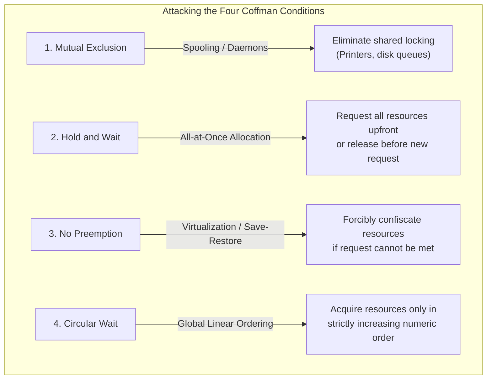

# Deadlock Prevention and Avoidance Strategies

> 📖 **Reading Order:** Step 28 of 68 | **Module 5:** Deadlocks  
> ◄ **Previous:** [[Resource Allocation Graphs and Deadlock Modeling]] | ► **Next:** [[Banker's Algorithm]]

---
> [!IMPORTANT] 🎯 **Exam Frequency & Intelligence (Appeared in 2019 Q1c, 2019 Q3c, 2021 Q1c, 2021 Q3a)**
> **Frequency:** ⭐⭐⭐⭐⭐ **100% Core Recurrence (Appeared across 4 exam years!)**
>
> ### What Exam Questions Expect & How to Master Them:
> 1. **Differentiating Safe, Unsafe, and Deadlock States (2019 Q1c & 2021 Q3a):**
>    - **Safe State:** A state from which there exists at least one order $\langle P_1, P_2, \dots, P_n \rangle$ where all processes can satisfy their peak claims, execute to completion, and return their resources.
>    - **Unsafe State:** A state where NO such guaranteed sequence exists. **Crucial point:** An unsafe state is **NOT** necessarily deadlocked! Deadlock will only materialize if processes actually exercise their maximum claims simultaneously.
>    - **Deadlock State:** A state where two or more processes are actively and permanently frozen.
>    - **Venn Diagram Relation:** $\text{Deadlock States} \subset \text{Unsafe States} \subset \text{Total System States}$.
> 2. **Deadlock Avoidance Mechanism:**
>    - Deadlock Avoidance operates strictly on the principle of dynamic gatekeeping: whenever a process requests resources, the OS tests whether allocating them would move the system from a Safe state into an Unsafe state. If Unsafe, the request is denied and the process is forced to sleep.
> 3. **Eliminating Circular Wait via Global Linear Ordering (2019 Q3c, 2021 Q1c):**
>    - Define a 1-to-1 function $F: R \to \mathbb{N}$ mapping every resource type to an integer (e.g., $F(\text{Tape Drive})=1, F(\text{Disk})=5, F(\text{Printer})=12$).
>    - Enforce the rule: A process may request resource $R_j$ if and only if $F(R_j) > F(R_i)$ for all resources $R_i$ it currently holds.
>    - **Why it works:** In any dependency chain $P_0 \to P_1 \to \dots \to P_k \to P_0$, the resource indices would have to strictly increase: $F(R_0) < F(R_1) < \dots < F(R_k) < F(R_0)$, which implies $F(R_0) < F(R_0)$, a mathematical contradiction! Thus, cycles are impossible.

---
## Starting Point and the Problem

Once deadlock occurs, processes freeze, hardware resources sit idle, and human intervention or process killing is typically required to restore system function.

We want the operating system to guarantee that deadlocks never occur in the first place. The central obstacle is balancing safety against system efficiency: overly restrictive policies prevent deadlock by crippling concurrency and wasting hardware capacity.

---
## Developing the Idea

Operating system designers developed two distinct proactive strategies:
1. **Deadlock Prevention:** A static design-time approach that eliminates deadlocks by constraining how requests are made, ensuring that at least one of the four Coffman conditions can never hold.
   - Attack Mutual Exclusion: Spooling.
   - Attack Hold and Wait: Require processes to request all resources upfront.
   - Attack No Preemption: Forcibly seize resources if a process cannot get what it needs.
   - Attack Circular Wait: Establish a global total ordering $F: R 	o \mathbb{N}$ and require processes to request resources in strictly increasing order.
2. **Deadlock Avoidance:** A dynamic runtime approach where the OS inspects every request in real time, granting it only if the resulting system state remains **Safe** (a guaranteed safe sequence exists).

---
## Definition

---
## How It Works

### 2. Deadlock Prevention: Attacking the Four Coffman Conditions

Havender (1968) and Tanenbaum demonstrated that deadlocks are prevented by structurally invalidating any one of the four necessary conditions:

### 1. Attacking Mutual Exclusion
- **Strategy:** Make resources shareable or virtualize access via daemon processes (e.g., printer spooling daemon). No user process directly locks physical hardware.
- **Limitation:** Inherent physical constraints make some resources fundamentally non-shareable (e.g., hardware write heads, mutually exclusive database locks).

### 2. Attacking Hold and Wait
- **Strategy A (All-at-once):** A process must request **all** resources it will ever need at initialization. If even one is unavailable, none are granted, and the process waits.
- **Strategy B (Release-before-request):** A process must release all currently held resources before requesting any new resource.
- **Severe Drawbacks:** Extreme resource underutilization (e.g., reserving a tape drive for 3 hours when it is only used during the final 30 seconds); high risk of starvation for processes requiring many resources.

### 3. Attacking No Preemption
- **Strategy:** If process $P_A$ holds resources and requests resource $R_B$ which is currently busy, the OS forcibly revokes all of $P_A$'s held resources and puts $P_A$ to sleep.
- **Limitation:** Only feasible for resources whose state can be saved and restored cleanly (CPU registers, memory pages). Devastating for I/O operations or database transactions.

### 4. Attacking Circular Wait (Linear Resource Ordering)
- **The Most Practical Prevention Method:**
  1. Define a global 1-to-1 mapping function $F: R \to \mathbb{N}$ assigning every resource type a unique integer index:
     $$F(\text{Tape Drive}) = 1, \quad F(\text{Plotter}) = 2, \quad F(\text{Printer}) = 3, \quad F(\text{Disk}) = 4$$
  2. **The Protocol:** A process can request resource $R_j$ **if and only if** $F(R_j) > F(R_i)$ for all resources $R_i$ currently held by that process.
  3. **Formal Mathematical Proof of Deadlock Freedom:**
     Suppose a circular wait exists: $P_0 \to R_1 \to P_1 \to R_2 \to \dots \to P_k \to R_0 \to P_0$.
     According to the ordering rule:
     $$F(R_0) < F(R_1) < F(R_2) < \dots < F(R_k) < F(R_0)$$
     This implies $F(R_0) < F(R_0)$, which is a logical contradiction! Therefore, **no cycle can ever form**. $\blacksquare$

---
## Example

Havender's Global Resource Ordering ($F(R)$):
Let Disk $= 1$, Printer $= 2$, Tape Drive $= 3$.
- Rule: A process holding Resource $i$ may only request Resource $j$ if $F(j) > F(i)$.
- Suppose $P_1$ holds Disk ($1$) and wants Printer ($2$): Valid! ($2 > 1$).
- Suppose $P_2$ holds Printer ($2$) and wants Disk ($1$): Rejected by compiler/kernel! ($1 < 2$).
Circular wait is mathematically impossible because a cycle would require $i_1 < i_2 < \dots < i_k < i_1$, a logical contradiction.

---
## Technical Details

See related modules for microarchitectural implementation details.

---
## Important Properties and Why They Hold

- **Safe State Invariant:** A safe state is NOT deadlock; a safe state guarantees that at least one execution sequence exists where all processes can terminate.
- **Deadlock Subset Invariant:** Deadlock is a strict subset of Unsafe states. An unsafe state is not necessarily deadlocked; it simply means the OS cannot prevent deadlock if all processes claim their maximum demands simultaneously.
- **Prevention vs. Avoidance Trade-Off:** Prevention restricts programming flexibility and resource utilization statically; Avoidance requires prior knowledge of maximum resource claims at runtime.

---
## Common Mistakes

- Assuming user mode code can execute privileged instructions directly without a system call trap.
- Overlooking race conditions in shared variables without explicit synchronization.

---
## Exam Relevance

Frequently examined through conceptual comparison questions, trace diagrams, and architectural trade-off evaluations.

---
## Related Concepts

- [[Banker's Algorithm]]
- [[Deadlock Detection and Recovery Algorithms]]
- [[Banker's Algorithm Multi-Resource Step-by-Step Example]]

---
## Prerequisites

- [[Deadlock Fundamentals and Coffman Conditions]]
- [[Resource Allocation Graphs and Deadlock Modeling]]

---
## Problems

- [[Problem — Banker's Algorithm Safe State and Request Granting]]

---
## Sources

- **Source Material:** `5. Deadlocks-week6-7-RRR.pdf` (Slides 25–27, 32–37: Resource Trajectories, Safe and Unsafe States, Deadlock Prevention Methods).
- **Previous Topic:** [[Resource Allocation Graphs and Deadlock Modeling]] (Step 27).
- **Next Topic:** [[Banker's Algorithm]] (Step 29).
