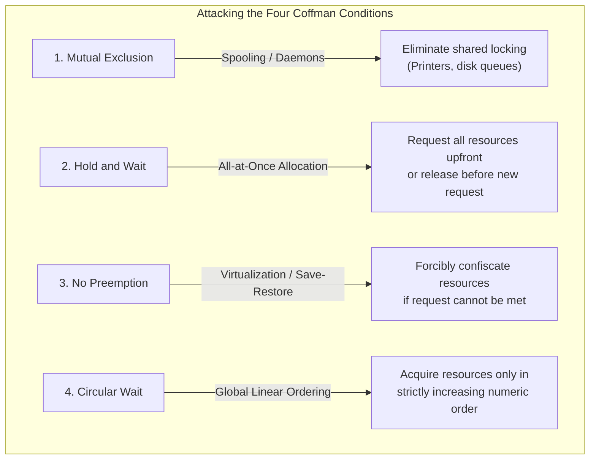
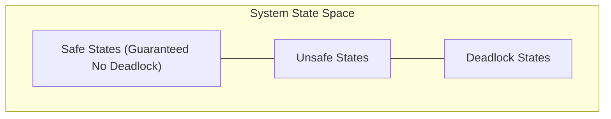

# Deadlock Prevention and Avoidance Strategies

> 📖 **Reading Order:** Step 28 of 34 | **Module 5:** Deadlocks  
> ◄ **Previous:** [[Resource Allocation Graphs and Deadlock Modeling]] | ► **Next:** [[Banker's Algorithm]]

---

> [!IMPORTANT] 🎯 **Exam Frequency & Intelligence (Appeared in 2019 Q1c, 2019 Q3c, 2021 Q1c, 2021 Q3a)**
> **Frequency:** ⭐⭐⭐⭐⭐ **100% Core Recurrence (Appeared across 4 exam years!)**
>
> ### What Exam Questions Expect & How to Master Them:
> 1. **Differentiating Safe, Unsafe, and Deadlock States (2019 Q1c & 2021 Q3a):**
>    - **Safe State:** A state from which there exists at least one order $\langle P_1, P_2, \dots, P_n \rangle$ where all processes can satisfy their peak claims, execute to completion, and return their resources.
>    - **Unsafe State:** A state where NO such guaranteed sequence exists. **Crucial point:** An unsafe state is **NOT** necessarily deadlocked! Deadlock will only materialize if processes actually exercise their maximum claims simultaneously.
>    - **Deadlock State:** A state where two or more processes are actively and permanently frozen.
>    - **Venn Diagram Relation:** $\text{Deadlock States} \subset \text{Unsafe States} \subset \text{Total System States}$.
> 2. **Deadlock Avoidance Mechanism:**
>    - Deadlock Avoidance operates strictly on the principle of dynamic gatekeeping: whenever a process requests resources, the OS tests whether allocating them would move the system from a Safe state into an Unsafe state. If Unsafe, the request is denied and the process is forced to sleep.
> 3. **Eliminating Circular Wait via Global Linear Ordering (2019 Q3c, 2021 Q1c):**
>    - Define a 1-to-1 function $F: R \to \mathbb{N}$ mapping every resource type to an integer (e.g., $F(\text{Tape Drive})=1, F(\text{Disk})=5, F(\text{Printer})=12$).
>    - Enforce the rule: A process may request resource $R_j$ if and only if $F(R_j) > F(R_i)$ for all resources $R_i$ it currently holds.
>    - **Why it works:** In any dependency chain $P_0 \to P_1 \to \dots \to P_k \to P_0$, the resource indices would have to strictly increase: $F(R_0) < F(R_1) < \dots < F(R_k) < F(R_0)$, which implies $F(R_0) < F(R_0)$, a mathematical contradiction! Thus, cycles are impossible.

---

## 1. Architectural Distinction: Prevention vs Avoidance

While both strategies ensure that a system never encounters a deadlock, they operate on fundamentally different principles:

| Dimension | Deadlock Prevention (Static) | Deadlock Avoidance (Dynamic) |
|---|---|---|
| **Operating Principle** | Enforces structural constraints on program behavior so that at least one of the 4 Coffman conditions **cannot physically occur**. | Tracks runtime resource requests dynamically using **a priori knowledge** (maximum claims) to guarantee the system stays in a **safe state**. |
| **Information Required** | None; pure static protocol. | Maximum resource requirement vector for each process. |
| **Resource Utilization** | Low (overly restrictive rules). | Higher (flexible allocation when safe). |
| **Algorithmic Overhead** | Low runtime overhead. | High runtime computation on every allocation request. |

---

## 2. Deadlock Prevention: Attacking the Four Coffman Conditions

Havender (1968) and Tanenbaum demonstrated that deadlocks are prevented by structurally invalidating any one of the four necessary conditions:

### 1. Attacking Mutual Exclusion
- **Strategy:** Make resources shareable or virtualize access via daemon processes (e.g., printer spooling daemon). No user process directly locks physical hardware.
- **Limitation:** Inherent physical constraints make some resources fundamentally non-shareable (e.g., hardware write heads, mutually exclusive database locks).

### 2. Attacking Hold and Wait
- **Strategy A (All-at-once):** A process must request **all** resources it will ever need at initialization. If even one is unavailable, none are granted, and the process waits.
- **Strategy B (Release-before-request):** A process must release all currently held resources before requesting any new resource.
- **Severe Drawbacks:** Extreme resource underutilization (e.g., reserving a tape drive for 3 hours when it is only used during the final 30 seconds); high risk of starvation for processes requiring many resources.

### 3. Attacking No Preemption
- **Strategy:** If process $P_A$ holds resources and requests resource $R_B$ which is currently busy, the OS forcibly revokes all of $P_A$'s held resources and puts $P_A$ to sleep.
- **Limitation:** Only feasible for resources whose state can be saved and restored cleanly (CPU registers, memory pages). Devastating for I/O operations or database transactions.

### 4. Attacking Circular Wait (Linear Resource Ordering)
- **The Most Practical Prevention Method:**
  1. Define a global 1-to-1 mapping function $F: R \to \mathbb{N}$ assigning every resource type a unique integer index:
     $$F(\text{Tape Drive}) = 1, \quad F(\text{Plotter}) = 2, \quad F(\text{Printer}) = 3, \quad F(\text{Disk}) = 4$$
  2. **The Protocol:** A process can request resource $R_j$ **if and only if** $F(R_j) > F(R_i)$ for all resources $R_i$ currently held by that process.
  3. **Formal Mathematical Proof of Deadlock Freedom:**
     Suppose a circular wait exists: $P_0 \to R_1 \to P_1 \to R_2 \to \dots \to P_k \to R_0 \to P_0$.
     According to the ordering rule:
     $$F(R_0) < F(R_1) < F(R_2) < \dots < F(R_k) < F(R_0)$$
     This implies $F(R_0) < F(R_0)$, which is a logical contradiction! Therefore, **no cycle can ever form**. $\blacksquare$

---

## 3. Deadlock Avoidance: Safe and Unsafe States

Deadlock avoidance does not impose restrictive ordering rules. Instead, each process must declare its **maximum resource requirement** ($\text{MaxReq}_i$) upfront.

### Definitions:
- **Safe State:** A state is safe if the OS can guarantee that all processes can run to completion without deadlocking, even if **every process suddenly requests its declared maximum resource needs simultaneously**.
- **Unsafe State:** An unsafe state is **NOT** a deadlock! Rather, an unsafe state is a state from which the OS can no longer guarantee avoidance of a deadlock if processes request their maximum claims.
- **Deadlock:** An inevitable circular blockage. A deadlock is a strict subset of unsafe states ($\text{Deadlock} \subset \text{Unsafe}$).

### Resource Trajectories
Tanenbaum visualizes avoidance using a 2D resource trajectory plot where Process $A$'s progress is on the $x$-axis and Process $B$'s progress is on the $y$-axis. The intersection of their resource requirements forms a rectangular **forbidden zone** (unsafe region). The OS scheduler must steer execution paths around the forbidden zone so the trajectory never enters it.

---

## 4. The Concept of a Safe Sequence

A state is **safe** if and only if there exists at least one ordered sequence of processes:
$$\langle P_1, P_2, \dots, P_n \rangle$$
known as a **Safe Sequence**, such that for each process $P_i$, the additional resources that $P_i$ can still request can be satisfied by:
$$\text{Need}_i \le \text{Available} + \sum_{j < i} \text{Allocation}_j$$

If such a sequence exists, the OS can let $P_1$ run to completion, collect its released resources, then run $P_2$, and so forth, guaranteeing that every process successfully terminates!

---

## Source Traceability & Metadata
- **Source Material:** `5. Deadlocks-week6-7-RRR.pdf` (Slides 25–27, 32–37: Resource Trajectories, Safe and Unsafe States, Deadlock Prevention Methods).
- **Previous Topic:** [[Resource Allocation Graphs and Deadlock Modeling]] (Step 27).
- **Next Topic:** [[Banker's Algorithm]] (Step 29).
