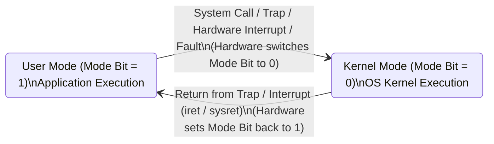
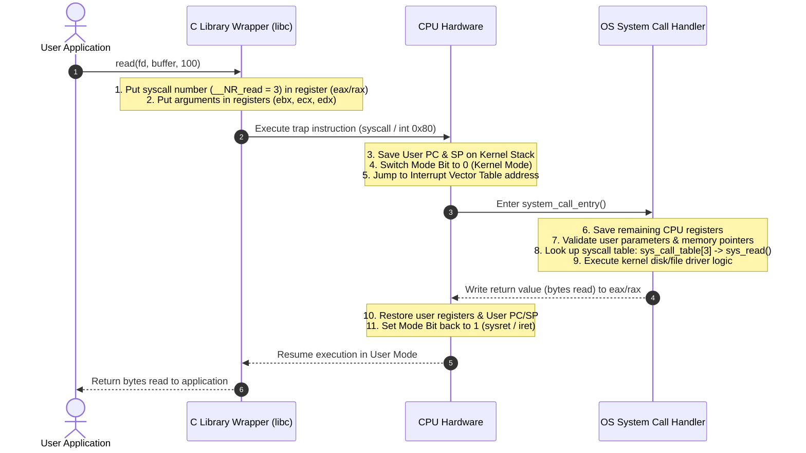

# Dual-Mode Operation and System Calls

> 📖 **Reading Order:** Step 02 of 68 | **Module 1:** OS Architecture & Kernel Fundamentals  
> ◄ **Previous:** [[Operating System Structures and Functions]] | ► **Next:** [[Computer Booting and Hardware Abstractions]]

---
> [!IMPORTANT] 🎯 **Exam Frequency & Intelligence (Appeared in 2017 Q1c, 2019 Q4a, 2021 Q3b)**
> **Frequency:** ⭐⭐⭐⭐ **High Recurrence (Appeared across 3 exam years, repeated!)**
>
> ### What Exam Questions Expect & How to Master Them:
> 1. **Step-by-Step Execution of a System Call (2017 Q1c & 2019 Q4a verbatim):**
>    - **The 7-Step Sequence:**
>      1. *User-Space Invocation:* User application calls a C library wrapper (e.g., `read()`). The wrapper places arguments into CPU registers (`%rdi`, `%rsi`, `%rdx`) and loads the unique system call number into `%rax`.
>      2. *Trap Trigger:* The program executes a software interrupt/trap instruction (`syscall` or `int 0x80`).
>      3. *Hardware Mode Switch:* CPU hardware switches the execution mode bit from User Mode (Ring 3) to Kernel Mode (Ring 0) and switches the stack pointer from user stack to kernel stack.
>      4. *State Preservation:* Hardware/microcode pushes the User Program Counter (PC) and processor flags onto the kernel stack.
>      5. *Dispatch Table Lookup:* The kernel interrupt handler indexes into `sys_call_table[]` using the system call number in `%rax`.
>      6. *Service Execution:* The kernel function validates user pointer bounds and executes the privileged operation.
>      7. *Mode Return:* Kernel places return code into `%rax`, pops saved registers, and executes `sysret` or `iret`, resetting the mode bit to Ring 3 and resuming user program execution.
> 2. **Differentiating User/Kernel Mode vs User/Kernel Space (2021 Q3b):**
>    - **User Mode vs Kernel Mode (CPU Privilege):** Hardware state controlled by the CPU mode bit in the Program Status Word (PSW). Dictates whether privileged instructions (like `cli`, `sti`, modifying CR3, accessing I/O ports) are allowed.
>    - **User Space vs Kernel Space (Memory Address Segmentation):** Division of the virtual address space. User space (lower addresses) is mapped per-process; Kernel space (upper addresses) is reserved for the OS core, page tables, and drivers, guarded by supervisor bit flags in page table entries.

---
## Starting Point and the Problem

In an operating system supporting multiple processes, user code must share the CPU with kernel code. If any running program could execute arbitrary machine instructions—such as disabling hardware timer interrupts, clearing device controllers, or rewriting memory page tables—a single malicious or flawed application could take over the entire system.

We want to guarantee that user applications can execute computational code at full hardware speed, yet remain strictly prohibited from performing dangerous low-level hardware manipulations. The central obstacle is that software checks alone are too slow: checking every instruction in software before executing it would cause catastrophic performance degradation.

---
## Developing the Idea

The breakthrough insight is **hardware-enforced protection levels**. Rather than checking instructions in software, CPU architects built a physical **Mode Bit** directly into the CPU's Program Status Word (PSW) register.

When the Mode Bit is $0$ (**Kernel Mode / Privileged Mode**), the CPU executes any instruction in its instruction set architecture (ISA). When the Mode Bit is $1$ (**User Mode**), the CPU hardware automatically rejects any privileged instruction by triggering a hardware exception (trap).

To request privileged operations (such as reading a file or sending network data), user processes must execute a dedicated software interrupt or trap instruction (`syscall` / `sysenter` / `int 0x80`), transferring control through fixed, immutable kernel entry points.

---
## Definition

To prevent user programs from interfering with the proper operation of the system, crashing other programs, or taking exclusive control of hardware, modern computer architectures implement **Dual-Mode Operation**:
- **Kernel Mode (also called Supervisor Mode, Protected Mode, System Mode, or Ring 0):**  
  The CPU has unrestricted access to all hardware, can execute all machine instructions (including privileged instructions), and can access all physical memory. The operating system kernel runs exclusively in this mode.
- **User Mode (Ring 3):**  
  The CPU executes with restricted privileges. It can only execute a safe subset of instructions (non-privileged) and can only access the memory mapped to the currently running process. All user applications (web browsers, text editors, games) execute in user mode.

The boundary between these two worlds is crossed safely and strictly via **System Calls**, **Interrupts**, and **Exceptions**.

---
## How It Works

### Hardware Mechanism: The Mode Bit

Dual-mode operation requires direct hardware enforcement. The CPU architecture includes a dedicated **mode bit** inside the Program Status Word (PSW) or flags register:
- $\text{Mode Bit} = 0 \implies \mathbf{Kernel\ Mode}$
- $\text{Mode Bit} = 1 \implies \mathbf{User\ Mode}$

When the system boots, hardware initializes the CPU in **Kernel Mode** ($\text{bit} = 0$). Before handing control over to a user program, the kernel sets the mode bit to $1$.

---
### Step-by-Step Mechanics of a System Call

When a user program calls a library function such as `read(fd, buffer, nbytes)`, the execution proceeds through a precise sequence:

### Parameter Passing Mechanisms
System calls require arguments (file descriptors, buffer pointers, lengths). Since user space and kernel space have distinct stacks, three standard parameter-passing conventions exist:
1. **CPU Registers (Fastest):** Parameters are loaded directly into general-purpose registers (e.g., `rdi`, `rsi`, `rdx` in x86-64). Limited by the number of registers (typically $\le 6$).
2. **Memory Block / Table:** Parameters are placed in a contiguous memory block in user space, and a single pointer to the block is passed in a register.
3. **Stack:** Parameters are pushed onto the user stack by the calling program and popped by the operating system.

---
## Example

A C program calls `read(fd, buffer, 1024)`:
1. The user application places parameter values into registers and issues `syscall`.
2. The CPU hardware switches the mode bit from $1$ (User) to $0$ (Kernel) and saves the Program Counter (PC).
3. The CPU vectors through the Interrupt Descriptor Table (IDT) to `system_call_entry`.
4. The kernel validates the buffer address in `sys_read()`, performs the disk transfer, and places the result in `rax`.
5. The kernel executes `sysret`, restoring User Mode ($1$) and returning to user code.

---
## Technical Details

See related modules for microarchitectural implementation details.

---
## Important Properties and Why They Hold

- **Hardware-Enforced Atomicity:** The transition from User Mode to Kernel Mode via `syscall` atomically saves the return address and elevates privileges, preventing race conditions during mode switches.
- **Kernel Memory Invariance:** User-mode code cannot read or write physical frames marked as supervisor-only in page tables; any such access triggers an immediate segmentation fault (Page Fault Exception).
- **Controlled Entry Point Invariant:** User applications cannot jump to arbitrary kernel addresses; entry is restricted to predefined handlers registered in the IDT.

---
## Common Mistakes

1. **Confusing Function Calls with System Calls:**
   - A normal C function call (e.g., `strcpy()`, `strlen()`, `sqrt()`) stays entirely in **User Mode** using standard `call`/`ret` instructions without involving the kernel.
   - A system call (e.g., `open()`, `fork()`, `write()`) crosses the hardware privilege boundary into **Kernel Mode**.
2. **Buffer Security & Parameter Validation:**
   - The kernel can never trust pointers passed by user programs. If a malicious user passes a buffer pointer pointing into kernel memory, an unvalidated `read()` could overwrite kernel data structures. The kernel must explicitly verify that all user buffer addresses lie strictly within the user's allocated virtual memory space before dereferencing them.
3. **Disabling Interrupts in User Mode:**
   - Allowing a user program to disable interrupts would allow a rogue `while(1)` loop to seize the CPU forever, destroying time-sharing. Therefore, `cli` (clear interrupt flag) is strictly privileged.

---
## Exam Relevance

- **Next Step:** How the hardware and OS bootstrap themselves into dual-mode operation (see [[Computer Booting and Hardware Abstractions]]).
- **Process Context:** Every process initiates state changes via system calls (see [[Process Concepts and Memory Layout]] and [[Process Creation and Termination Operations]]).
- **CPU Scheduling:** Preemption relies upon hardware timer interrupts forcing periodic returns to kernel mode (see [[CPU Scheduling Principles and Criteria]]).
- **Exam Testing:** High-yield exam topic. Common questions include:
  - Explaining the difference between an interrupt and a trap.
  - Identifying which instructions from a list are privileged vs non-privileged.
  - Tracing the exact sequence of events during a system call transition.

---
## Related Concepts

- [[Operating System Structures and Functions]]
- [[Process Control Block and Context Switching]]
- [[Process Creation and Termination Operations]]

---
## Prerequisites

- [[Operating System Structures and Functions]]
- [[Computer Booting and Hardware Abstractions]]

---
## Problems

- [[Problem — Fork Execution Tree and Process Tracing]]

---
## Sources

- **Lectures:** `cse313/01 - Sources/Lectures/1. Introduction-week1-RRR-2026.pdf` (Slides 13–28)
- **Textbook:** Andrew S. Tanenbaum & Herbert Bos, *Modern Operating Systems* (4th Edition), Chapter 1 (Section 1.4: Hardware Review, Section 1.6: System Calls)
