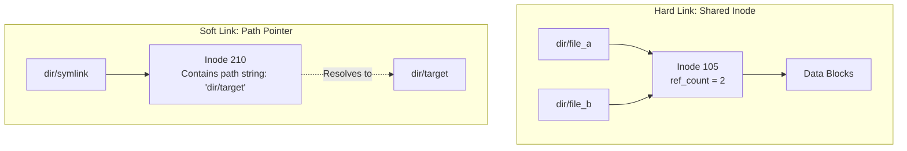

# File and Directory Abstractions and POSIX File API

> 📖 **Reading Order:** Step 57 of 68 | **Module 9: File Systems & Persistence**  
> ◄ **Previous:** [[Problem — Disk Arm Scheduling and RAID Performance Analysis]] | ► **Next:** [[File System Implementation and VSFS On-Disk Structures]]

---

## Starting Point and the Problem

Storage hardware (Hard Disks, SSDs, RAID arrays) exposes storage as a flat, linear array of 512-byte or 4 KB blocks, referenced strictly by integer physical sector numbers.

Human users and software applications cannot interact directly with sector numbers. A user expects:
1. Meaningful, hierarchical human-readable names (`/home/user/document.txt`).
2. An abstraction that treats data as an arbitrary-length stream of bytes.
3. Access control permissions (who can read, write, or execute).
4. Automated allocation of underlying physical blocks.

The operating system bridges this divide via the **File System**.

---

## Developing the Idea: The Two Core Abstractions

The file system provides two fundamental abstractions:

### 1. The File
A **File** is a linear array of bytes that can be read, written, or resized. Every file possesses:
- **Low-Level Name:** An integer identifier known as its **inode number** (index node number).
- **Metadata:** File size, access permissions, owner UID/GID, creation/modification timestamps, and pointers to physical data blocks.
- **Payload:** The actual user data bytes.

### 2. The Directory
A **Directory** is a special file whose contents consist of a table mapping human-readable string names to inode numbers:
$$\text{Directory Entry} = (\text{filename string}, \text{inode number})$$

Because directories can contain entries for other directories, they form a hierarchical **Directory Tree** rooted at `/` (root directory).

```
Directory Tree:
       / (Root Inode 2)
      / \
   bin   home (Inode 128)
          \
          alice (Inode 256)
           \
         report.pdf (Inode 1024)
```

---

## The POSIX File System API

User-space processes interact with persistent files through standard POSIX system calls:

### 1. `int open(const char *path, int flags, mode_t mode)`
Traverses the directory tree from `/` (or current working directory), resolves the path to an inode number, checks permissions, allocates an entry in the system-wide **Open File Table**, and returns an integer **File Descriptor (`fd`)** to the calling process.
- File descriptors are per-process integers ($0 = \text{stdin}$, $1 = \text{stdout}$, $2 = \text{stderr}$, $3+ = \text{user files}$).

### 2. `ssize_t read(int fd, void *buf, size_t count)` and `write(...)`
Reads or writes up to `count` bytes. The operating system maintains an implicit **File Offset** for each open file description:
- Reading 100 bytes advances the offset by 100.
- Subsequent calls to `read()` automatically resume from the updated offset.

### 3. `off_t lseek(int fd, off_t offset, int whence)`
Repositioning the file offset to arbitrary byte coordinates without performing physical disk I/O.
- `SEEK_SET`: Offset relative to start of file.
- `SEEK_CUR`: Offset relative to current position.
- `SEEK_END`: Offset relative to end of file.

### 4. `int fsync(int fd)`
When a process executes `write()`, the operating system does not immediately write the bytes to disk; it buffers them in the in-memory **Page Cache** to optimize throughput. If the computer loses power, cached writes are lost!
- `fsync()` forces the kernel to immediately flush all dirty in-memory data and metadata blocks for `fd` directly onto persistent storage.

---

## Hard Links vs. Symbolic (Soft) Links



### 1. Hard Links (`link(oldpath, newpath)`)
- Creates another directory entry pointing to the **exact same inode number**.
- Increments the inode's **Reference Count (`ref_count`)**.
- The file data is physically identical. Modifying `file_b` immediately reflects in `file_a`.
- **Deletion (`unlink`):** When `unlink("file_a")` is called, the OS removes the directory entry and decrements `ref_count`. Physical data blocks are freed **only when `ref_count == 0`** AND all open file descriptors are closed!
- **Restrictions:** Cannot link across different file system partitions; cannot hard-link directories (to prevent infinite cycles).

### 2. Symbolic Links (`symlink(target, linkpath)`)
- Creates an independent, new file with its **own unique inode number**.
- The data block of the symlink simply stores the **text string pathname** of the target file.
- When an application opens the symlink, the kernel reads the pathname string and transparently redirects to the target.
- **Capabilities & Pitfalls:** Can link across different partitions and link to directories; however, if the target file is deleted or renamed, the symlink becomes a **Dangling Link** pointing to nothing.

---

## Technical Details

- **Open File Table Sharing:**
  - If two distinct processes call `open("file.txt")` independently, they receive separate entries in the Open File Table with independent file offsets.
  - If a process calls `fork()`, the child process inherits the parent's file descriptor table, pointing to the **exact same Open File Table entry**! The parent and child share a single, coordinated file offset.

---

## Important Properties and Guarantees

- **Inode-Centric Identity Principle:** A file's true identity in POSIX is its unique `(filesystem_id, inode_number)` tuple, not its human-readable pathname. Pathnames are merely reachability aliases stored in directory records.
- **Unlink Atomicity Guarantee:** A file remains completely accessible to any process holding an open file descriptor even after `unlink()` removes all directory references. The kernel reclaims the inode and blocks only when the final file descriptor is closed.

---

## Common Mistakes

- **Confusing `unlink()` with Physical Deletion:** Calling `unlink()` only removes a directory name-to-inode link. If another hard link exists, or if a running process holds the file open, zero disk blocks are freed.
- **Assuming `write()` Writes to Disk:** Beginners assume data is safe on disk once `write()` returns. Without an explicit `fsync()`, data remains volatile in the OS page cache for up to 30 seconds.

---

## Exam Relevance

Frequently tested through:
- Tracing hard link vs soft link reference counts and determining when disk space is actually reclaimed after multiple `unlink()` calls.
- Analyzing `fork()` shared file offset interactions across concurrent reads.
- Explaining the necessity of `fsync()` for transactional database integrity.

---

## Related Concepts

- [[File System Implementation and VSFS On-Disk Structures]]
- [[Locality and the Berkeley Fast File System (FFS)]]
- [[Crash Consistency, FSCK, and Write-Ahead Journaling]]

---

## Prerequisites

- [[IO System Architecture and Direct Memory Access]]
- [[Hard Disk Drive Architecture and Mechanical Latency]]

---

## Problems

- [[Problem — File System Inode Capacity and Journaling Recovery]]

---

## Sources

- **Lecture Slides:** [[cse313/01 - Sources/Lectures/CSE313_KRV_Merged.pdf|CSE313_KRV_Merged.pdf]], Chapter 39 (Slides 295–319).
- **Textbook:** Arpaci-Dusseau & Arpaci-Dusseau, *Operating Systems: Three Easy Pieces (OSTEP)*, Chapter 39 (Interlude: Files and Directories).
