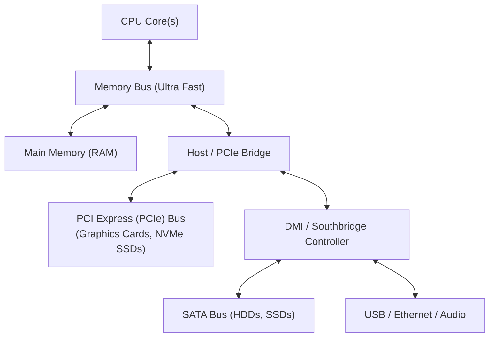
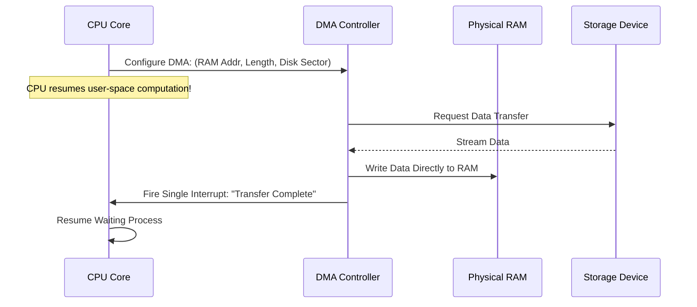

# IO System Architecture and Direct Memory Access

> 📖 **Reading Order:** Step 50 of 68 | **Module 8: I/O Hardware & Storage Systems**  
> ◄ **Previous:** [[Problem — Multi-Level Paging and Page Replacement Simulation]] | ► **Next:** [[Hard Disk Drive Architecture and Mechanical Latency]]

---

## Starting Point and the Problem

A computer system cannot merely compute; it must interact with the outside world. It must read keystrokes, display graphics, transmit packets across networks, and read/write persistent data to storage drives.

However, peripheral devices present a massive engineering obstacle to the operating system:
1. **Speed Mismatch:** CPU cores execute instructions in sub-nanosecond clock cycles ($< 1\,\text{ns}$), whereas physical I/O devices operate on mechanical or network timescales (milliseconds or microseconds)—a difference of **six orders of magnitude**!
2. **Extreme Diversity:** Devices range from simple keyboards to ultra-fast NVMe storage, each with unique register layouts, protocols, and timing constraints.

If the CPU is forced to wait synchronously on slow devices, or if device communication is poorly architected, system throughput collapses.

---

## Developing the Idea: The System Bus Hierarchy

Modern computer architectures solve this using a hierarchical structure of interconnected buses, balancing speed, cost, and cable length:



- **Memory Bus:** Connects CPU registers and caches directly to physical RAM at maximum bandwidth.
- **PCIe (PCI Express):** High-speed interconnect for bandwidth-intensive peripherals (GPUs, NVMe drives, 100GbE network cards).
- **SATA / USB / Legacy Buses:** Slower peripheral buses connected through a Southbridge controller chip, providing cheap, flexible connectivity for disks and keyboards.

---

## The Canonical Device Model

Despite their differences, almost all hardware devices expose a standardized interface consisting of two parts:
1. **Hardware Interface (Registers):** Silicon registers mapped into CPU address space.
2. **Internal Implementation:** On-device microcontroller, firmware, and device-specific memory.

```
Canonical Device Registers:
+-------------------+-------------------+-------------------+
|  Status Register  | Command Register  |   Data Register   |
| (Read: Ready/Busy)| (Write: Command)  | (Read/Write Data) |
+-------------------+-------------------+-------------------+
```

### The Three I/O Communication Protocols

#### 1. Polling (Programmed I/O - PIO)
The CPU writes a command to the device and loops continuously, checking the Status register until the device marks itself ready:
```c
while (DEVICE->STATUS & STATUS_BUSY) {
    // Spin-wait (Polling)
}
DEVICE->DATA = data_byte;
DEVICE->COMMAND = CMD_WRITE;
```
- **Pros:** Extremely fast for ultra-quick devices (e.g., sub-microsecond NVMe writes); zero context-switch overhead.
- **Cons:** Catastrophic waste of CPU time for slow devices. A mechanical hard disk spinning for 10 ms wastes roughly **30 million CPU cycles** in an idle spinning loop!

#### 2. Interrupt-Driven I/O
Instead of polling, the CPU issues the command, puts the requesting process into the **Blocked / Waiting** state, and context-switches to run another Ready process.
- When the device finishes the operation, it raises a physical voltage signal on the CPU's interrupt pin.
- The CPU pauses the current process, switches to kernel mode, and executes the device driver's **Interrupt Service Routine (ISR)**.
- The ISR wakes up the waiting process and marks it Ready.

#### 3. Direct Memory Access (DMA)
Even with interrupts, Programmed I/O requires the CPU to copy every byte between RAM and the device's Data register via `%eax` instructions. For a 4 KB disk block or multi-megabyte network packet, this CPU copying overhead is intolerable.
- A **DMA Engine** is a dedicated co-processor on the system bus.
- The CPU tells the DMA controller:
  1. Memory source/destination address in RAM.
  2. Number of bytes to transfer.
  3. Device command (Read/Write).
- The CPU immediately resumes user computation. The DMA engine transfers the entire data buffer directly across the bus between RAM and the device.
- Upon completion, the DMA controller raises **a single interrupt** to notify the CPU!



---

## Device Drivers: The OS Abstraction Layer

Operating systems bridge the gap between general-purpose kernel abstractions (e.g., files, network sockets) and idiosyncratic device registers via **Device Drivers**:
- A device driver is a kernel module that translates high-level requests (e.g., `read_block(1048)`) into specific register writes for a particular hardware controller.
- Standard interfaces categorize drivers into:
  - **Block Devices:** Provide random-access arrays of fixed-size blocks (disks, SSDs, USB drives).
  - **Character Devices:** Provide sequential streams of unbuffered bytes (keyboards, serial ports, mice).
  - **Network Devices:** Socket-based packet stream interfaces.

---

## Important Properties and Guarantees

- **CPU Liberation Invariant:** Direct Memory Access completely eliminates CPU involvement during the movement of data between memory and I/O devices, reducing CPU utilization from $100\%$ to near $0\%$ during multi-megabyte transfers.
- **Cache Coherency Challenge:** When DMA writes directly to RAM, CPU L1/L2 caches may hold stale copies of those memory lines. Modern hardware implements **Bus Snooping** or cache-invalidation protocols to maintain strict cache-memory coherency during DMA operations.

---

## Common Mistakes

- **Assuming Interrupts are Always Better than Polling:** If an I/O device finishes an operation in $50\,\text{ns}$, servicing an interrupt (which costs thousands of nanoseconds in pipeline flushes and context-switch overhead) is vastly slower than polling for 50 ns! High-performance systems use **Hybrid Two-Phase I/O**: poll briefly; if not ready, switch to interrupts.
- **Ignoring DMA Memory Alignment:** DMA engines require physical memory buffers to be contiguous in physical RAM and aligned to 64-byte or 4 KB boundaries.

---

## Exam Relevance

Common exam questions include:
- Comparing Polling vs Interrupt-Driven I/O vs DMA across CPU utilization and latency.
- Drawing sequence diagrams of a DMA-mediated storage read.
- Explaining the cache coherence dilemma when DMA writes directly to RAM.

---

## Related Concepts

- [[Dual-Mode Operation and System Calls]]
- [[Process Control Block and Context Switching]]
- [[Hard Disk Drive Architecture and Mechanical Latency]]

---

## Prerequisites

- [[Dual-Mode Operation and System Calls]]
- [[Process Control Block and Context Switching]]

---

## Problems

- [[Problem — Disk Arm Scheduling and RAID Performance Analysis]]

---

## Sources

- **Lecture Slides:** [[cse313/01 - Sources/Lectures/CSE313_KRV_Merged.pdf|CSE313_KRV_Merged.pdf]], Chapter 36 (Slides 209–250).
- **Textbook:** Arpaci-Dusseau & Arpaci-Dusseau, *Operating Systems: Three Easy Pieces (OSTEP)*, Chapter 36 (I/O Devices).
