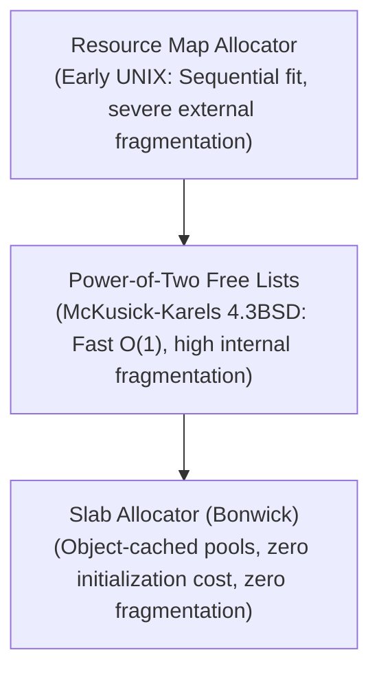

# Kernel Memory Allocation Architecture and the Slab Allocator

> 📖 **Reading Order:** Step 65 of 68 | **Module 10: Advanced Kernel Systems & Multiprocessors**  
> ◄ **Previous:** [[Problem — File System Inode Capacity and Journaling Recovery]] | ► **Next:** [[Multiprocessor Operating System Architectures]]

---

## Starting Point and the Problem

In user space, memory allocation via `malloc()` operates under forgiving constraints: if memory is low, the process can sleep or block while the virtual memory manager swaps pages out to disk.

The operating system kernel operates under far harsher physical constraints:
1. **Interrupt Context Restrictions:** The kernel must allocate memory inside hardware interrupt handlers and device drivers. **Interrupt handlers cannot sleep, block, or wait on page faults!** If an allocator blocks inside an interrupt, the CPU hangs indefinitely.
2. **High-Frequency Allocation:** Kernel objects (such as Process Control Blocks `task_struct`, Open File Descriptors `struct file`, and Network Packet Buffers `sk_buff`) are allocated, initialized, and destroyed millions of times per second.
3. **Severe Initialization Overhead:** Reconstructing complex kernel objects with initialized locks, queues, and function pointers consumes more CPU cycles than allocating the raw bytes themselves.

A general-purpose heap allocator like First-Fit or Best-Fit is completely inadequate for kernel internals.

---

## Evolution of Kernel Allocators

The UNIX kernel evolved through three generations of memory allocators:



### 1. Resource Map Allocator (Early UNIX)
Maintained a simple linked list of `<base, size>` descriptors sorted by address. It suffered from extreme external fragmentation and slow $O(N)$ allocation searches.

### 2. Power-of-Two Free Lists (McKusick-Karels, 4.3BSD)
Maintained separate free lists for powers-of-two (32 B, 64 B, 128 B). Block sizes were tracked at the page level via a kernel array `kmemsizes[]`. While fast, it suffered up to **$50\%$ internal fragmentation** when objects did not fit exact power-of-two boundaries.

---

## Developing the Idea: Jeff Bonwick's Slab Allocator

In 1994, Jeff Bonwick (Sun Microsystems) introduced the **Slab Allocator** (now standard in Linux and Solaris):

> **The Slab Insight:**  
> The kernel does not allocate arbitrary bytes; it allocates **specific object types**!  
> Instead of repeatedly allocating raw bytes, constructing an object, and destroying it on free, **keep objects pre-initialized in dedicated caches**!

```
Slab Allocator Architecture:
+-----------------------------------------------------------------------+
| Cache: "struct task_struct" (PCB Cache)                               |
+-----------------------------------------------------------------------+
|  Slab 1 (Full):    [ Obj ][ Obj ][ Obj ][ Obj ]                       |
|  Slab 2 (Partial): [ Obj ][ Free ][ Obj ][ Free ] <--- Allocate Here!  |
|  Slab 3 (Empty):   [ Free ][ Free ][ Free ][ Free ]                   |
+-----------------------------------------------------------------------+
```

---

## How It Works: Caches and Slabs

The Slab Allocator is structured into two hierarchical layers:

### 1. Object Caches (`kmem_cache`)
The kernel maintains dedicated caches for each major data structure:
- A cache for `task_struct`
- A cache for `struct inode`
- A cache for `struct file`
- General-purpose size-based caches: `kmalloc-32`, `kmalloc-64`, `kmalloc-128`, etc.

### 2. Slabs
Each cache manages a collection of **Slabs**. A slab consists of one or more contiguous virtual memory pages carved into an exact number of pre-allocated, pre-initialized object slots.

Slabs exist in one of three states:
- **Full:** All object slots in the slab are allocated.
- **Partial:** Some slots are allocated, and some are free.
- **Empty:** All slots are free (can be reclaimed by the OS page allocator if memory is needed).

### The Allocation Flow (`kmem_cache_alloc`):
1. The kernel requests an object from the cache (e.g., `kmem_cache_alloc(task_struct_cache)`).
2. The allocator immediately retrieves an already-initialized object from a **Partial Slab** in **instantaneous $O(1)$ time**!
3. If no partial slab exists, it allocates an **Empty Slab**.
4. If no empty slabs remain, it requests a new page from the kernel buddy allocator.

### The Deallocation Flow (`kmem_cache_free`):
When the kernel releases an object:
- The object is returned to its slab.
- Its initialized locks and state are **preserved** (not destroyed!).
- When the object is next allocated, it requires zero re-initialization.

---

## Technical Details: Eliminating Memory Fragmentation

- **Zero External Fragmentation:** Every slab is packed with identical, fixed-size objects. Slabs fit perfectly into page boundaries, completely eliminating external fragmentation.
- **Minimal Internal Fragmentation:** Slabs are sized to the exact byte requirement of the kernel structure (e.g., an 832-byte `task_struct`), rather than being rounded up to 1024 bytes.
- **Slab Coloring:** Hardware CPU caches (L1/L2) map memory addresses using modulo arithmetic. If all slabs place their first object at offset 0 of a page, identical fields across all objects compete for the same hardware cache lines! **Slab Coloring** offsets the start of objects in consecutive slabs by small amounts (e.g., 64 bytes) to distribute cache line utilization evenly.

---

## Important Properties and Guarantees

- **Non-Blocking Allocation Guarantee:** Flags such as `GFP_ATOMIC` in Linux guarantee that the allocator will never sleep or block, allowing safe execution inside interrupt service routines.
- **Constructor / Destructor Efficiency:** Object constructor functions run only when a slab is created, not on individual allocation cycles, yielding massive speedups for complex objects.

---

## Common Mistakes

- **Using Blocking Allocation in Interrupt Context:** Calling `kmalloc(..., GFP_KERNEL)` inside an interrupt handler causes a kernel panic if the allocator must sleep to reclaim memory. Interrupt code must strictly use `GFP_ATOMIC`.
- **Assuming Slabs are Used in User Space:** The Slab Allocator is an internal kernel architecture; user programs manage memory via user-space allocators like `ptmalloc` or `jemalloc`.

---

## Exam Relevance

Frequently tested through:
- Comparing Resource Map, Power-of-Two, and Slab allocators across speed, internal fragmentation, and external fragmentation.
- Explaining the three states of slabs (Full, Partial, Empty) and the allocation sequence.
- Describing the role of slab coloring in CPU cache utilization.

---

## Related Concepts

- [[Free-Space Management and Allocation Policies]]
- [[Segregated Free Lists and Binary Buddy Allocation]]
- [[Multiprocessor Operating System Architectures]]

---

## Prerequisites

- [[Free-Space Management and Allocation Policies]]
- [[Segregated Free Lists and Binary Buddy Allocation]]

---

## Problems

- [[Problem — Multiprocessor Memory Latency and Kernel Memory Allocation]]

---

## Sources

- **Lecture Slides:** [[cse313/01 - Sources/Lectures/CSE313_KRV_Merged.pdf|CSE313_KRV_Merged.pdf]], Kernel Allocators (Slides 397–413).
- **Reference:** Jeff Bonwick, *The Slab Allocator: An Object-Caching Kernel Memory Allocator*, USENIX Summer 1994 Technical Conference.
