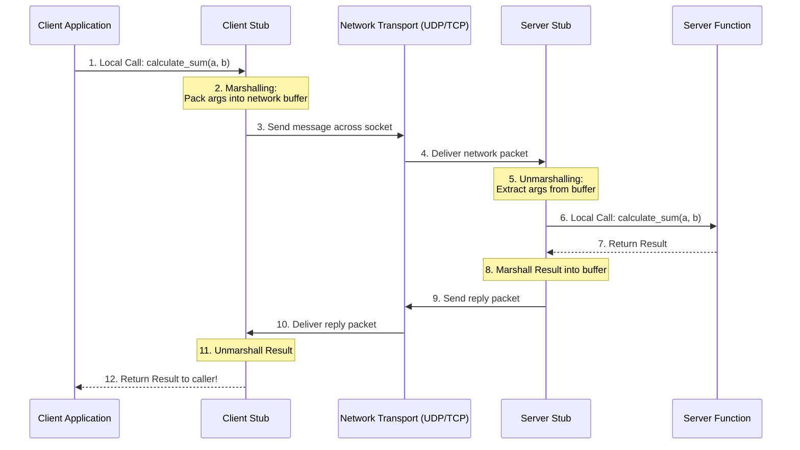

# Linux System Architecture and Remote Procedure Calls (RPC)

> 📖 **Reading Order:** Step 67 of 68 | **Module 10: Advanced Kernel Systems & Multiprocessors**  
> ◄ **Previous:** [[Multiprocessor Operating System Architectures]] | ► **Next:** [[Problem — Multiprocessor Memory Latency and Kernel Memory Allocation]]

---

## Starting Point and the Problem

Operating systems provide rich Inter-Process Communication (IPC) primitives—pipes, message queues, and shared memory—allowing processes on a single physical machine to exchange data.

However, modern computing is distributed across networks of independent physical machines. A developer building a client-server application across physical boundaries faces major obstacles:
1. **Network Complexity:** Managing raw socket connections (`connect`, `send`, `recv`), connection drops, and byte streaming is tedious and error-prone.
2. **Data Representation (Endianness):** Machine $A$ may be Little-Endian (x86), while Machine $B$ is Big-Endian (SPARC/ARM). Sending raw binary structs over the wire results in corrupted data.
3. **Programming Paradigm Mismatch:** Programmers think in terms of **procedure calls** (`result = calculate(x, y)`), not low-level packet streaming.

To bridge this, Birrell and Nelson (1984) invented **Remote Procedure Calls (RPC)**.

---

## Developing the Idea: The Remote Procedure Call (RPC)

The goal of RPC is to make a procedure call on a **remote machine across a network look identical to a local function call in code**.

```c
// Client code looks like a normal local function call!
int total = calculate_sum(a, b);
```

Under the hood, the RPC runtime transparently packages the parameters into a network packet, transmits them to the server, executes the function on the server CPU, and returns the result to the caller!

---

## How It Works: The Five-Component RPC Architecture



### The Step-by-Step Execution Sequence:
1. **Client Application:** Calls the target function normally (e.g., `calculate_sum(a, b)`).
2. **Client Stub:** A generated wrapper function that intercepts the call. It performs **Marshalling (Serialization)**: packing the function identifier and parameters into a canonical, machine-independent network byte stream (such as XDR - External Data Representation, JSON, or Protocol Buffers).
3. **Transport Layer:** The client stub transmits the marshalled packet across the network using UDP or TCP.
4. **Server Stub:** Intercepts the incoming network packet. It performs **Unmarshalling (Deserialization)**: decoding the byte stream into native data types.
5. **Server Function:** The server stub calls the actual local server function with the unpacked arguments.
6. **Return Path:** The server function returns its result to the server stub; the stub marshalls the result and transmits it back across the network to the client stub, which unmarshalls the value and returns it to the client application!

---

## Interface Definition Language (IDL) and Stub Generation

How are client and server stubs created? Manually writing socket packing for dozens of functions is impractically bug-prone.

Systems use an **Interface Definition Language (IDL)** and a compiler (such as `rpcgen` in UNIX/Linux, or `protoc` for gRPC):
```c
// Example: math.x (IDL specification)
program MATH_PROG {
    version MATH_VERS {
        int ADD(pair_of_ints) = 1;
    } = 1;
} = 0x20000001;
```
Running `rpcgen math.x` automatically compiles this specification into:
- `math_clnt.c` (Client Stub)
- `math_svc.c` (Server Stub / Skeleton)
- `math_xdr.c` (Marshalling / Unmarshalling routines)

---

## Network Transport Choices: RPC over UDP vs. TCP

| Metric | RPC over UDP | RPC over TCP |
|---|---|---|
| **Connection Overhead** | Zero connection setup ($0$ handshakes) | 3-way handshake required ($1.5$ RTT) |
| **Packet Overhead** | Tiny 8-byte UDP header | 20-byte TCP header + sequence numbers |
| **Reliability** | Unreliable; caller must implement timeout/retry | Guaranteed reliable delivery & ordering |
| **Ideal Workloads** | Lightweight, **Idempotent** operations (NFS reads, DNS lookups) | Large payloads, non-idempotent operations (e.g., fund transfers) |

### The Idempotency Principle:
An operation is **Idempotent** if executing it multiple times produces the exact same outcome as executing it once (e.g., `Read Block 5`, `Set Temperature to 22`).
- Idempotent operations can safely use lightweight UDP with simple retry timeouts.
- Non-idempotent operations (e.g., `Append $500 to account balance`) require TCP or strict transaction IDs to prevent double execution upon network packet retransmission!

---

## Important Properties and Guarantees

- **Transparency Boundary Limit:** RPC achieves syntactic transparency (calling syntax matches local calls), but cannot achieve semantic transparency. Local calls never fail with network timeouts, packet drops, or server reboots, whereas remote calls must always handle partial failure modes.
- **Canonical Endianness Invariant:** Marshalling converts host byte order (whether Big-Endian or Little-Endian) into standard **Network Byte Order (Big-Endian)** using `htonl()` and `htons()`, guaranteeing platform interoperability.

---

## Common Mistakes

- **Passing Memory Pointers Across RPC:** A pointer is an address within the *local process virtual address space*. Passing `int *ptr` across a network to a remote machine is meaningless and crashes the server! Pointers must be dereferenced and the actual data payload marshalled.
- **Ignoring Network Partial Failures:** Assuming an RPC call either succeeds or fails cleanly. A server may execute the function, crash *right before* transmitting the reply, causing the client to believe the call failed even though it succeeded!

---

## Exam Relevance

Frequently tested in Operating Systems and Distributed Systems exams:
- Drawing and explaining the complete 12-step RPC architectural timeline.
- Defining Marshalling, Unmarshalling, and the role of Interface Definition Languages (IDL).
- Comparing RPC over UDP vs RPC over TCP and explaining why memory pointers cannot be passed directly across RPC calls.

---

## Related Concepts

- [[Message Passing and IPC Models]]
- [[Multiprocessor Operating System Architectures]]
- [[Dual-Mode Operation and System Calls]]

---

## Prerequisites

- [[Message Passing and IPC Models]]
- [[Dual-Mode Operation and System Calls]]

---

## Problems

- [[Problem — Multiprocessor Memory Latency and Kernel Memory Allocation]]

---

## Sources

- **Lecture Slides:** [[cse313/01 - Sources/Lectures/CSE313_KRV_Merged.pdf|CSE313_KRV_Merged.pdf]], Tanenbaum Linux & RPC (Slides 428–445).
- **Textbook:** Tanenbaum & Bos, *Modern Operating Systems (3rd/4th Ed.)*, Chapter 10 (UNIX and Linux).
