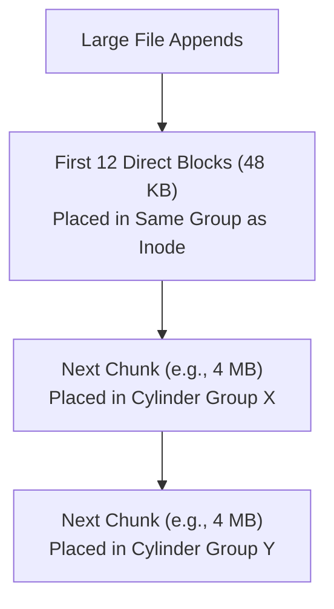

# Locality and the Berkeley Fast File System (FFS)

> 📖 **Reading Order:** Step 59 of 68 | **Module 9: File Systems & Persistence**  
> ◄ **Previous:** [[File System Implementation and VSFS On-Disk Structures]] | ► **Next:** [[Crash Consistency, FSCK, and Write-Ahead Journaling]]

---

## Starting Point and the Problem

The original UNIX file system treated the storage disk as an oblivious random-access memory array:
- All inodes were clustered together at the very beginning of the drive.
- All data blocks were placed on the remainder of the disk.

Over time, this naive organization resulted in disastrous performance:
1. **Severe Arm Thrashing:** Every time an application accessed a file, the mechanical disk arm had to seek to the beginning of the disk to read the inode, then seek thousands of cylinders outward to read the data block, and seek back to update the inode.
2. **Free Space Fragmentation:** As files were created and deleted, free blocks became scattered. A newly created sequential file had its blocks allocated across disparate cylinders, turning sequential I/O into random I/O.
3. **Dismal Bandwidth:** The original UNIX file system achieved only **$2 - 4\%$ of maximum disk throughput**!

To solve this, Kirk McKusick and his Berkeley team designed **FFS: The Fast File System**—the first "disk-aware" file system.

---

## Developing the Idea: Cylinder Groups

The core insight of FFS is designing on-disk data structures around the **physical geometry of mechanical disk drives**:

Instead of one global inode table and one global data region, FFS divides the physical disk into consecutive **Cylinder Groups** (modern file systems call them **Block Groups**):
- A cylinder group consists of $G$ consecutive cylinders on the drive.
- Crucially, the disk arm can access *any* block within a cylinder group with near-zero seek latency!

```
FFS Cylinder Group Architecture:
+-----------------------------------------------------------------------+
| Cylinder Group 0  | Cylinder Group 1  | Cylinder Group 2  | ...       |
+-----------------------------------------------------------------------+
  Each Cylinder Group contains:
  +-----+-----+-----+-------------+-----------------------------------+
  | SB  | ib  | db  | Inode Table | Data Blocks (0 .. K)              |
  +-----+-----+-----+-------------+-----------------------------------+
```

Every cylinder group contains:
- A backup copy of the **Superblock** (for disaster recovery).
- A local **Inode Bitmap** and local **Data Bitmap**.
- A local **Inode Table** slice.
- A local **Data Region**.

---

## FFS Placement Policies: "Keep Related Stuff Together"

FFS introduces two fundamental heuristics to maximize spatial locality:

### 1. Directory Placement Policy
When a new directory is created:
- Find the cylinder group that has an **unusually low number of allocated directories** AND a **high number of free inodes**.
- Put the directory there!
- This ensures directories are balanced across groups rather than crowding a single cylinder.

### 2. File Placement Policy
When a file is created within a directory:
- Allocate the file's **inode in the EXACT SAME cylinder group as its parent directory**!
- Allocate the file's **data blocks in the same cylinder group as its inode**!
- **Why this is revolutionary:** When a user executes `ls -l` or compiles code in a directory, all inodes and all data blocks sit in the same physical cylinder group. The disk arm remains stationary, achieving **near-instantaneous sequential throughput**!

---

## The Large-File Exception

A naive implementation of the file placement policy breaks down for large files:
> If a user creates a single 5 GB movie file, placing all its data blocks in the directory's cylinder group would **fill the entire group**, evicting all other files and destroying locality!

To prevent this, FFS implements the **Large-File Exception**:
- Allocate the file's first 12 direct blocks in the initial cylinder group (preserving fast access for small files).
- Allocate the first indirect block chunk in a **different cylinder group**.
- Continue chunking subsequent indirect blocks across other cylinder groups!



Because seeking once per 4 MB chunk incurs an amortization cost of only $\frac{10\,\text{ms}}{4\,\text{MB}} \approx 2.5\%$, high throughput is preserved while preventing cylinder group exhaustion.

---

## Sub-Blocks and Fragments: Eliminating Internal Fragmentation

To improve transfer speeds, FFS increased the block size from 512 bytes to **4 KB (or 8 KB)**.
However, studies showed that over $50\%$ of UNIX files were smaller than 1 KB! Allocating a 4 KB block to a 512-byte file wastes nearly $87.5\%$ of disk space in **internal fragmentation**.

### The FFS Fragment Solution:
- FFS divides each 4 KB block into smaller **Fragments (Sub-blocks)** (typically 512 bytes or 1 KB).
- When writing a small file, FFS allocates only the required fragments.
- When the file grows to exceed 4 KB, FFS automatically finds a full 4 KB block, copies the data, and frees the fragments for other small files.

---

## Important Properties and Guarantees

- **Disk-Aware Locality Invariant:** Files within the same directory share physical cylinder proximity with their parent directory, minimizing actuator arm seek distance.
- **Redundant Superblock Resilience:** If a disk head crash or bad sector corrupts the primary superblock at block 0, the file system can be mounted and repaired using backup superblocks distributed across other cylinder groups.

---

## Common Mistakes

- **Confusing Block Groups with Disk Partitions:** Block groups are logical, contiguous zones *within* a single file system partition; they do not require separate partition table entries.
- **Assuming FFS Solves Crash Inconsistencies:** FFS solved performance and locality, but did *not* solve the crash consistency problem. Power failures in FFS still required hours of slow `fsck` scans.

---

## Exam Relevance

High exam prominence:
- Explaining the cylinder group architecture and placement policies.
- Describing the Large-File Exception and why it does not degrade throughput.
- Contrasting the performance of original UNIX FS vs Berkeley FFS.

---

## Related Concepts

- [[Hard Disk Drive Architecture and Mechanical Latency]]
- [[File System Implementation and VSFS On-Disk Structures]]
- [[Crash Consistency, FSCK, and Write-Ahead Journaling]]

---

## Prerequisites

- [[Hard Disk Drive Architecture and Mechanical Latency]]
- [[File System Implementation and VSFS On-Disk Structures]]

---

## Problems

- [[Problem — File System Inode Capacity and Journaling Recovery]]

---

## Sources

- **Lecture Slides:** [[cse313/01 - Sources/Lectures/CSE313_KRV_Merged.pdf|CSE313_KRV_Merged.pdf]], Chapter 41 (Slides 338–351).
- **Textbook:** Arpaci-Dusseau & Arpaci-Dusseau, *Operating Systems: Three Easy Pieces (OSTEP)*, Chapter 41 (Locality and The Fast File System).
