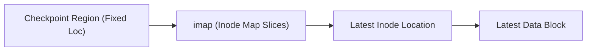

# Log-Structured File Systems (LFS) and Segment Cleaning

> 📖 **Reading Order:** Step 61 of 68 | **Module 9: File Systems & Persistence**  
> ◄ **Previous:** [[Crash Consistency, FSCK, and Write-Ahead Journaling]] | ► **Next:** [[VSFS Inode Block Indexing and Journaling Crash Recovery Example]]

---

## Starting Point and the Problem

In the early 1990s, Mendel Rosenblum and John Ousterhout observed two fundamental technology trends:
1. **System Memory (RAM) was Growing Exponentially:** Larger RAM meant larger page caches. The page cache absorbs almost all read requests, meaning **storage traffic is heavily dominated by writes**.
2. **Disk Seek Latency was Stagnating:** Disk transfer bandwidth was improving, but mechanical seek time ($5 - 10\,\text{ms}$) remained stagnant. Existing file systems (like FFS) performed widespread random writes (updating inodes, bitmaps, directories, and data blocks in place).

On mechanical disks, random writes achieve less than $1\%$ of disk bandwidth. Rosenblum and Ousterhout asked:
> Can we design a file system that converts **ALL file system writes into large, sequential writes**?

---

## Developing the Idea: The Log-Structured Architecture

The result was **LFS: The Log-Structured File System**.

In LFS:
- The file system never updates data in place.
- All updates (data blocks, inodes, directories, indirect blocks) are buffered in memory into large contiguous chunks called **Segments** (typically $1 - 2\,\text{MB}$).
- When a segment fills, it is written out sequentially to the end of the disk log in **one massive sequential I/O burst**, utilizing $100\%$ of disk bandwidth!

```
LFS Sequential Segment Emission:
+-----------------------------------------------------------------------+
| Data Block D0 | Inode I[0] | Data Block D1 | Inode I[1] | Inode Map   |
+-----------------------------------------------------------------------+
  <---------------------- 1 to 2 MB Contiguous Segment ----------------->
```

---

## The Wandering Inode Problem and the Inode Map (imap)

Because LFS never overwrites blocks in place, modifying a file writes its new inode to a **brand-new location** at the head of the log.
- In FFS, Inode 5 always resides at a fixed physical block address.
- In LFS, Inode 5 moves every time the file is updated!

How can an application find Inode 5 if its location keeps moving across the disk?

### The Solution: The Inode Map (`imap`)
LFS introduces an indirection layer called the **Inode Map (`imap`)**:
- The `imap` is an array that maps:
  $$\mathbf{\text{Inode Number} \longrightarrow \text{Current Disk Address}}$$
- When Inode 5 is written to a new segment, the OS updates `imap[5]` to point to its new disk address.
- **Where is the `imap` stored?**
  LFS writes slices of the `imap` right into the log immediately following the inodes!

### The Checkpoint Region (CR)
To bootstrap the system upon mount, LFS maintains a fixed location on disk called the **Checkpoint Region (CR)**:
- The CR contains pointers to all current pieces of the `imap`.
- The CR is updated periodically (e.g., every 30 seconds) or during clean shutdown.



---

## Segment Cleaning (Garbage Collection)

Because LFS appends new versions of blocks rather than overwriting old ones, obsolete, dead versions of files remain trapped in older segments. Over time, the disk fills up with garbage!

LFS must continuously reclaim dead space through **Segment Cleaning**:
1. **Read Old Segments:** The cleaner thread reads partially filled, older segments into memory.
2. **Identify Live Blocks:** For each block in the segment, the cleaner inspects the **Segment Summary Block** at the tail of the segment, which records:
   $$\text{Summary}[B] = (\text{inode\_num}, \text{file\_offset})$$
   The cleaner checks `imap[inode_num]`. If the inode's block pointer still matches block $B$, the block is **Live**; if the inode points elsewhere, block $B$ is **Dead (Garbage)**!
3. **Write Live Blocks Out:** The cleaner takes the live blocks from multiple old segments, packs them together into a new contiguous segment, and writes it out sequentially to the head of the log.
4. **Reclaim Segments:** The old segments are completely freed and made available for future sequential writes!

---

## The Segment Cleaning Cost Equation

Rosenblum and Ousterhout derived the write overhead of segment cleaning:

Let $u$ be the fraction of live data in cleaned segments ($0 \le u \le 1$):
$$\mathbf{\text{Write Cost} = \frac{1 + u}{1 - u}}$$

- If a segment is $80\%$ live ($u = 0.8$):
  $$\text{Write Cost} = \frac{1 + 0.8}{1 - 0.8} = \frac{1.8}{0.2} = \mathbf{9.0}.$$
  The system must perform 9 block I/Os for every 1 block of useful user data written!
- To make LFS viable, the segment cleaner must prioritize segments with low $u$ (cold data) or wait until segments become mostly dead.

---

## Important Properties and Guarantees

- **All-Sequential Write Invariant:** Every write operation—whether data, metadata, or directory—is appended strictly to the tail of the log in large contiguous segments, completely eliminating random disk seeks.
- **Copy-on-Write Foundation:** LFS is the direct ancestor of modern Copy-on-Write (CoW) file systems, such as Sun ZFS, Linux Btrfs, and Flash Memory Translation Layers (FTL) in modern SSDs.

---

## Common Mistakes

- **Assuming LFS Inodes Have Fixed Addresses:** Inodes in LFS move continuously. Only the Checkpoint Region resides at fixed disk sector addresses.
- **Ignoring the Segment Cleaning Bottleneck:** While LFS write bursts are blisteringly fast, if the disk is full ($> 85\%$ capacity), segment cleaning overhead can degrade performance below that of traditional file systems.

---

## Exam Relevance

Frequently tested in advanced Operating Systems exams through:
- Tracing file reads using the Checkpoint Region, `imap`, Inode, and Data block hierarchy.
- Calculating Write Cost given segment live utilization $u$.
- Explaining how the Segment Summary Block identifies live vs dead blocks.

---

## Related Concepts

- [[File System Implementation and VSFS On-Disk Structures]]
- [[Locality and the Berkeley Fast File System (FFS)]]
- [[Crash Consistency, FSCK, and Write-Ahead Journaling]]

---

## Prerequisites

- [[File System Implementation and VSFS On-Disk Structures]]
- [[Crash Consistency, FSCK, and Write-Ahead Journaling]]

---

## Problems

- [[Problem — File System Inode Capacity and Journaling Recovery]]

---

## Sources

- **Lecture Slides:** [[cse313/01 - Sources/Lectures/CSE313_KRV_Merged.pdf|CSE313_KRV_Merged.pdf]], Chapter 43 (Slides 378–396).
- **Textbook:** Arpaci-Dusseau & Arpaci-Dusseau, *Operating Systems: Three Easy Pieces (OSTEP)*, Chapter 43 (Log-structured File Systems).
