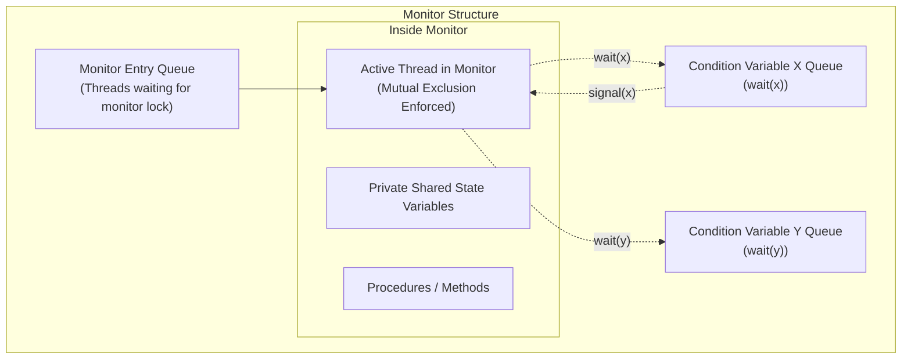

# Monitors and Condition Variables

> 📖 **Reading Order:** Step 21 of 34 | **Module 4:** Inter-Process Communication & Synchronization  
> ◄ **Previous:** [[Semaphores and Synchronization Primitives]] | ► **Next:** [[Message Passing and IPC Models]]

---

## 1. Intuition & Language-Level Abstraction

While semaphores solve race conditions, they are low-level and unstructured. A single misplaced `wait()` or omitted `signal()` can crash an entire operating system.

To make concurrent programming robust, **C.A.R. Hoare (1974)** and **Per Brinch Hansen (1975)** invented the **Monitor**:
> A monitor is a higher-level synchronization construct implemented directly within a programming language or runtime (e.g., Java, C#, Concurrent Pascal).

### The Core Monitor Invariant:
**Only one process or thread can be actively executing inside a monitor at any single moment.**
The compiler and language runtime automatically enforce mutual exclusion upon entry to any monitor procedure. The developer does not manually call `acquire_lock()` or `release_lock()`.



---

## 2. Monitor Architecture & Syntax

A monitor encapsulates private shared state variables, initialization code, and public access procedures:

```
monitor ProducerConsumerMonitor {
    // Shared private variables
    condition full, empty;
    int count = 0;
    item buffer[N];

    public procedure insert(item val) {
        if (count == N) wait(full);
        buffer[count] = val;
        count++;
        if (count == 1) signal(empty);
    }

    public procedure remove(item *val) {
        if (count == 0) wait(empty);
        *val = buffer[count - 1];
        count--;
        if (count == N - 1) signal(full);
    }
}
```

---

## 3. Condition Variables

Monitors alone cannot handle situations where a process enters a monitor procedure, finds that a condition is not met (e.g., buffer is full), and must wait. If it simply halted, it would hold the monitor lock, blocking all other processes from entering to change the condition!

To resolve this, monitors provide **Condition Variables**:
A condition variable is a synchronization object (not an integer counter) with two primitive operations:

1. **`wait(condition_var)`**:
   - The calling process is suspended and placed into `condition_var`'s waiting queue.
   - The monitor lock is **atomically released**, allowing another process to enter.
2. **`signal(condition_var)`**:
   - Awakens exactly one process currently sleeping on `condition_var`.
   - **Crucial Distinction from Semaphores:** If no process is currently waiting on `condition_var`, the signal is **silently lost and discarded**. Condition variables have **no memory** and do not accumulate counts.

---

## 4. Signaling Disciplines: Hoare vs Mesa Semantics

When process $P$ executes `signal(c)` inside a monitor, waking up sleeping process $Q$, both $P$ and $Q$ could potentially execute inside the monitor simultaneously, violating the fundamental monitor invariant. Operating systems and languages resolve this using two paradigms:

### 1. Hoare Semantics (Signal-and-Wait)
- **Rule:** The signaler $P$ is immediately suspended and yields the monitor lock directly to $Q$. $Q$ runs immediately. When $Q$ exits or waits, $P$ resumes.
- **Advantage:** The condition that $Q$ waited for is guaranteed to remain strictly TRUE when $Q$ wakes up.
- **Syntax:** A simple `if` condition suffices:
  ```c
  if (count == N)
      wait(full);
  ```

### 2. Mesa Semantics (Signal-and-Continue — Java, POSIX Pthreads, C#)
- **Rule:** The signaler $P$ keeps the monitor lock and continues execution until it naturally leaves the monitor. The awakened process $Q$ is merely moved from the condition queue to the monitor ready queue.
- **Hazard:** By the time $Q$ actually re-acquires the monitor lock, a third process may have sneaked in and altered the shared state!
- **Mandatory Rule:** In Mesa semantics, a process **MUST ALWAYS re-check the condition in a `while` loop**:
  ```c
  while (count == N) {
      wait(full); // Re-evaluates condition upon re-awakening!
  }
  ```

---

## 5. POSIX Pthreads Implementation: `pthread_cond_t`

In C/C++, monitors are modeled using a POSIX mutex and condition variable pair:

```c
#include <pthread.h>

pthread_mutex_t lock = PTHREAD_MUTEX_INITIALIZER;
pthread_cond_t cond  = PTHREAD_COND_INITIALIZER;

void *worker_thread(void *arg) {
    pthread_mutex_lock(&lock);
    
    // Always use a while loop for Mesa-style condition variables!
    while (resource_available == 0) {
        // Atomically unlocks 'lock' and puts thread to sleep
        pthread_cond_wait(&cond, &lock);
        // Automatically re-acquires 'lock' before returning here!
    }
    
    // Consume resource
    use_resource();
    
    pthread_mutex_unlock(&lock);
    return NULL;
}

void *signaler_thread(void *arg) {
    pthread_mutex_lock(&lock);
    
    resource_available = 1;
    pthread_cond_signal(&cond); // Wakes one waiting thread
    // Or pthread_cond_broadcast(&cond) to wake all waiting threads
    
    pthread_mutex_unlock(&lock);
    return NULL;
}
```

---

## 6. Comprehensive Comparison: Semaphores vs Monitors

| Feature | Semaphore | Monitor |
|---|---|---|
| **Level of Abstraction** | Low-level OS kernel primitive | High-level language construct |
| **Mutual Exclusion** | Explicit developer responsibility (`wait`/`signal` calls) | Handled automatically by compiler / runtime |
| **Data Encapsulation** | None; variables are scattered | Complete; private shared data inside monitor |
| **Memory / History** | `signal()` increments integer; remembered forever | `signal()` without waiters is **discarded immediately** |
| **Error Proneness** | High; easy to forget `signal()` or introduce deadlock | Low; compiler prevents illegal concurrent entry |
| **Supported Systems** | C, OS kernels, POSIX systems | Java (`synchronized`), C#, Concurrent Pascal |

---

## Source Traceability & Metadata
- **Source Material:** `4. IPC-week-4-5-RRR.pptx` (Slides 43–52: Monitors, Condition Variables, Hoare vs Mesa Semantics).
- **Previous Topic:** [[Semaphores and Synchronization Primitives]] (Step 20).
- **Next Topic:** [[Message Passing and IPC Models]] (Step 22).
