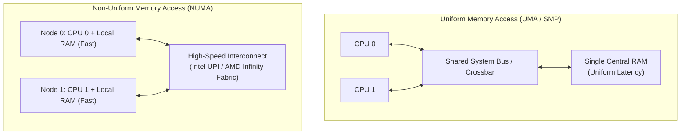

# Multiprocessor Operating System Architectures

> 📖 **Reading Order:** Step 66 of 68 | **Module 10: Advanced Kernel Systems & Multiprocessors**  
> ◄ **Previous:** [[Kernel Memory Allocation Architecture and the Slab Allocator]] | ► **Next:** [[Linux System Architecture and Remote Procedure Calls (RPC)]]

---

## Starting Point and the Problem

Single-processor systems reached a physical frequency wall in the mid-2000s: increasing CPU clock frequencies beyond 4 GHz generated unsustainable heat dissipation (the Power Wall). To increase computational performance, hardware manufacturers transitioned to **Multicore and Multiprocessor Systems**.

However, having multiple physical CPUs running simultaneously introduces profound operating system challenges:
1. **Memory Contention:** How do multiple CPU cores access shared physical memory without bottlenecking a shared bus?
2. **Cache Coherence:** If CPU 1 modifies variable $X$ in its local L1 cache, how does CPU 2 avoid reading stale data from its own cache?
3. **Kernel Scalability:** Can multiple CPU cores execute kernel code concurrently, or does the operating system itself become a bottleneck?

---

## Hardware Architectures: UMA vs. NUMA



### 1. UMA (Uniform Memory Access / Symmetric Multiprocessing - SMP)
- All physical CPUs connect to a central memory controller across a shared system bus, crossbar switch, or multistage Omega network.
- **Key Characteristic:** Access latency to any physical memory address is identical regardless of which CPU core issues the access.
- **Scalability Limit:** Buses saturate when scaled beyond 8 to 16 cores.

### 2. NUMA (Non-Uniform Memory Access)
- The system is partitioned into multiple **Nodes**. Each node contains one or more CPU cores and dedicated **Local Physical RAM**.
- Nodes communicate across high-speed point-to-point interconnects.
- **Access Latency Disparity:**
  - Accessing **Local Memory** on the same node takes $\sim 60\,\text{ns}$.
  - Accessing **Remote Memory** on a different node across the interconnect takes $\sim 150 - 300\,\text{ns}$ (a $3\times$ latency penalty!).
- **OS Responsibility:** The NUMA-aware OS scheduler must place processes and their memory pages on the **same physical node** to maximize local memory hits.

---

## Cache Coherence and the MESI Protocol

Each CPU core maintains private L1 and L2 caches. If Core 0 writes `x = 5` and Core 1 reads `x`, Core 1 must see `5`.

Hardware enforces coherence via the **MESI Protocol** (an invalidation-based snooping protocol):
Every cache line resides in one of four states:
1. **Modified ($M$):** Present only in this cache, modified (dirty), inconsistent with RAM.
2. **Exclusive ($E$):** Present only in this cache, clean, matches RAM.
3. **Shared ($S$):** Present in this and possibly other CPU caches, clean, matches RAM.
4. **Invalid ($I$):** Stale/empty; reading requires a bus broadcast.

### Snooping Rule:
When Core 0 writes to a line in state $S$, it broadcasts an **Invalidation Signal** across the bus. All other cores change their state from $S$ to $I$. Subsequent reads by other cores miss and fetch the updated value.

---

## Operating System Multiprocessor Organizations

Operating systems manage multiple CPUs using three historical models:

```
+-----------------------------------------------------------------------+
| 1. Separate OS per CPU: Disjoint memory, no sharing (like cluster).   |
+-----------------------------------------------------------------------+
| 2. Master-Slave OS: Kernel runs strictly on CPU 0; Slaves run user.   |
+-----------------------------------------------------------------------+
| 3. Symmetric Multiprocessing (SMP): Re-entrant kernel on all cores!   |
+-----------------------------------------------------------------------+
```

### 1. Master-Slave Architecture
- CPU 0 (Master) handles all system calls, I/O interrupts, and scheduling.
- CPUs 1 through $N-1$ (Slaves) execute user code only.
- **Fatal Bottleneck:** As core counts grow, CPU 0 becomes completely overwhelmed handling system calls, capping system throughput.

### 2. Symmetric Multiprocessing (SMP)
- The operating system kernel is **fully re-entrant**: any CPU core can execute kernel code and service interrupts concurrently!
- **Synchronization Evolution:**
  - *Big Kernel Lock (BKL):* Early Linux used a single global lock around the entire kernel. Only one CPU could execute kernel code at a time, severely limiting multicore scaling.
  - *Fine-Grained Locking:* Modern kernels use thousands of independent locks guarding individual data structures (per-CPU runqueues, per-inode locks).
  - *Read-Copy-Update (RCU):* Modern lockless synchronization mechanism allowing concurrent readers to access data with zero lock overhead while writers produce new versions.

---

## Important Properties and Guarantees

- **Affinity Scheduling Guarantee:** Multiprocessor schedulers enforce **CPU Affinity** (Soft and Hard Affinity), prioritizing dispatching a thread onto the same CPU core where it previously ran to preserve warm L1/L2 cache contents.
- **Memory Consistency Models:** Hardware architectures vary in ordering guarantees (Sequential Consistency, Total Store Order on x86, Weak Ordering on ARM). Compilers and kernels insert **Memory Barriers (`mfence`, `dmb`)** to prevent instruction reordering bugs across cores.

---

## Common Mistakes

- **Assuming Spinlocks Work Without Interrupt Disabling:** If a core acquires a spinlock and an interrupt fires on that same core that attempts to acquire the identical spinlock, the CPU deadlocks itself! Spinlocks protecting interrupt data must disable local interrupts (`spin_lock_irqsave`).
- **Ignoring NUMA Remote Memory Traversal:** Allocating memory blindly on NUMA architectures causes catastrophic performance drops due to remote bus traversal.

---

## Exam Relevance

Frequently tested through:
- Contrasting UMA vs NUMA hardware characteristics and latency trade-offs.
- Tracing cache line state transitions under the MESI protocol.
- Explaining the transition from Big Kernel Lock to fine-grained locking and CPU affinity scheduling.

---

## Related Concepts

- [[Threads and Multithreading Models]]
- [[Race Conditions and Critical-Section Problem]]
- [[Kernel Memory Allocation Architecture and the Slab Allocator]]

---

## Prerequisites

- [[Threads and Multithreading Models]]
- [[Race Conditions and Critical-Section Problem]]

---

## Problems

- [[Problem — Multiprocessor Memory Latency and Kernel Memory Allocation]]

---

## Sources

- **Lecture Slides:** [[cse313/01 - Sources/Lectures/CSE313_KRV_Merged.pdf|CSE313_KRV_Merged.pdf]], Tanenbaum Multiprocessors (Slides 414–427).
- **Textbook:** Tanenbaum & Bos, *Modern Operating Systems (3rd/4th Ed.)*, Chapter 8 (Multiple Processor Systems).
