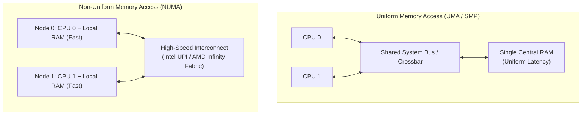
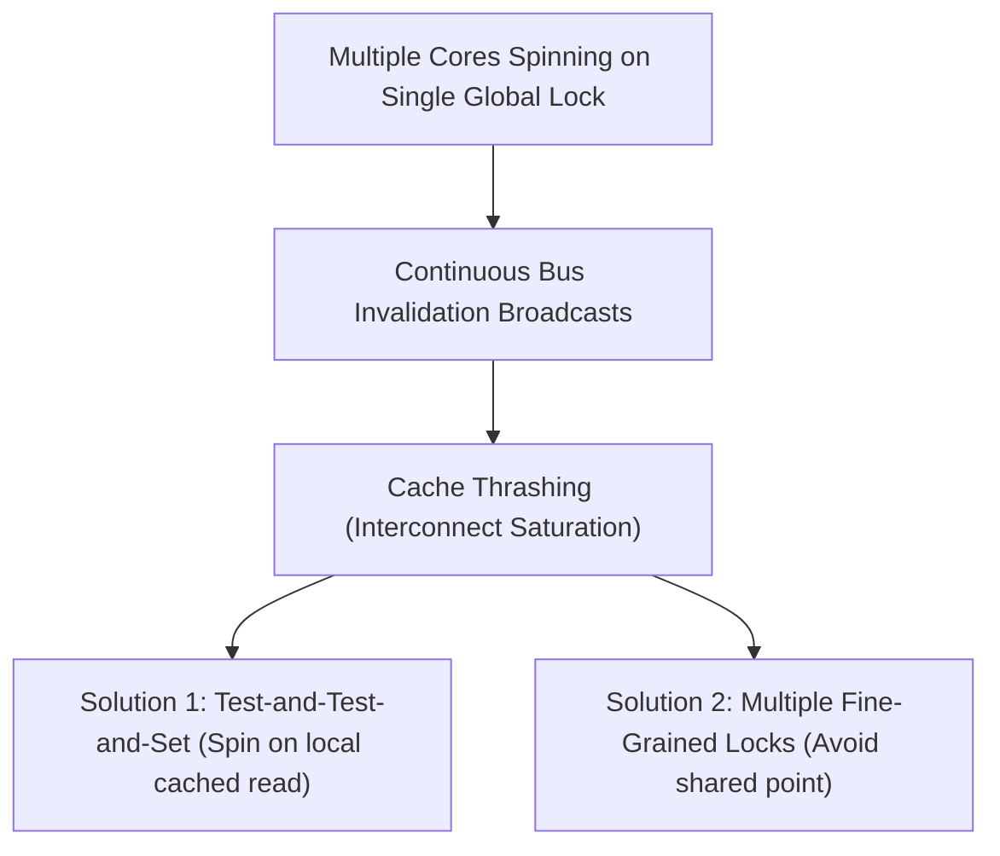

# Multiprocessor Operating System Architectures

> 📖 **Reading Order:** Step 66 of 68 | **Module 10: Advanced Kernel Systems & Multiprocessors**  
> ◄ **Previous:** [[Kernel Memory Allocation Architecture and the Slab Allocator]] | ► **Next:** [[Linux System Architecture and Remote Procedure Calls (RPC)]]

---

## Starting Point and the Problem

Single-processor systems reached a physical frequency wall in the mid-2000s: increasing CPU clock frequencies beyond 4 GHz generated unsustainable heat dissipation (the Power Wall). To increase computational performance, hardware manufacturers transitioned to **Multicore and Multiprocessor Systems**.

However, having multiple physical CPUs running simultaneously introduces profound operating system challenges:
1. **Memory Contention:** How do multiple CPU cores access shared physical memory without bottlenecking a shared bus?
2. **Cache Coherence:** If CPU 1 modifies variable $X$ in its local L1 cache, how does CPU 2 avoid reading stale data from its own cache?
3. **Kernel Scalability:** Can multiple CPU cores execute kernel code concurrently, or does the operating system itself become a bottleneck?

---

## Hardware Architectures: UMA vs. NUMA



### 1. UMA (Uniform Memory Access / Symmetric Multiprocessing - SMP)
All physical CPUs connect to a centralized memory pool where physical access latency is identical across all cores. Modern architectures implement three UMA interconnect models:

1. **Bus-Based Multiprocessors:** All CPUs and memory connect to a single shared bus. Saturated easily beyond 8 to 16 cores due to electrical bus contention.
2. **Crossbar Switches:** An $N \times M$ matrix grid connecting $N$ CPUs directly to $M$ memory banks using electronic crosspoint switches.
   - *Advantage:* Non-blocking; any CPU can access any distinct memory bank simultaneously without contention.
   - *Cost:* Hardware complexity scales quadratically as $O(N \times M)$ crosspoints, making large matrices prohibitively expensive.
3. **Multistage Switching Networks (Omega Network):** Connects $N$ CPUs to $N$ memory modules using $2 \times 2$ crossbar switching elements arranged in stages.
   - Each $2 \times 2$ switch can route inputs straight through or crossed.
   - Total stages required: $\mathbf{\log_2 N}$ stages, each containing $N/2$ switches (total switches: $\frac{N}{2}\log_2 N$).
   - Balances cost and concurrency, scaling to dozens of processors.

```
2x2 Switch States:             Omega Multistage Network (8 CPUs to 8 Memories):
  +---+                         Stage 0      Stage 1      Stage 2
A-|---|-> A (Straight)          [ 2x2 ] ---> [ 2x2 ] ---> [ 2x2 ] ---> Mem 0..1
B-|---|-> B                     [ 2x2 ] ---> [ 2x2 ] ---> [ 2x2 ] ---> Mem 2..3
  +---+                         [ 2x2 ] ---> [ 2x2 ] ---> [ 2x2 ] ---> Mem 4..5
  +---+                         [ 2x2 ] ---> [ 2x2 ] ---> [ 2x2 ] ---> Mem 6..7
A- \ / -> B (Cross)             (Total Stages = log2(8) = 3; Switches per stage = 4)
B- / \ -> A
  +---+
```

### 2. NUMA (Non-Uniform Memory Access)
When scaling to hundreds of cores, bus and crossbar saturation forces systems into a distributed memory model with a single unified address space:
- The system is partitioned into independent **Nodes**. Each node contains CPU cores, caches, and a dedicated **Local Memory Controller**.
- **Access Latency Disparity:**
  - Local node memory: $\sim 60\,\text{ns}$.
  - Remote memory across the interconnect: $\sim 150 - 300\,\text{ns}$ ($3\times$ latency penalty).

#### Directory-Based CC-NUMA (Cache-Coherent NUMA)
Because broadcasting bus invalidations across hundreds of nodes would overwhelm the network, large systems (such as the 256-node model in course slides) use **Directory-Based Coherence**:
- Every physical memory bank maintains an internal **Directory**:
  - **Presence Bitvector:** A 256-bit mask indicating exactly which nodes currently hold a cached copy of that memory line.
  - **State Bits:** Clean (unmodified, cached in 1+ nodes), Shared, or Dirty/Modified (held exclusively by 1 node).
- Invalidation messages are transmitted **point-to-point only to nodes with their bit set in the directory**, avoiding global network broadcasts!

#### Division of a 32-Bit NUMA Memory Address (256 Nodes)
```
32-Bit NUMA Physical Address Layout:
31              24 23                                            0
+-----------------+----------------------------------------------+
|   Node Number   |          Memory Offset Within Node           |
|     (8 Bits)    |                  (24 Bits)                   |
+-----------------+----------------------------------------------+
```
- **High 8 Bits:** Identifies the "Home Node" ($2^8 = 256$ nodes) that physically owns the RAM chip.
- **Low 24 Bits:** Addresses up to $2^{24} = 16\,\text{MB}$ of local RAM within that node module.

---

## Cache Coherence and the MESI Protocol

Each CPU core maintains private L1 and L2 caches. If Core 0 writes `x = 5` and Core 1 reads `x`, Core 1 must see `5`.

Hardware enforces coherence via the **MESI Protocol** (an invalidation-based snooping protocol):
Every cache line resides in one of four states:
1. **Modified ($M$):** Present only in this cache, modified (dirty), inconsistent with RAM.
2. **Exclusive ($E$):** Present only in this cache, clean, matches RAM.
3. **Shared ($S$):** Present in this and possibly other CPU caches, clean, matches RAM.
4. **Invalid ($I$):** Stale/empty; reading requires a bus broadcast.

### Snooping Rule:
When Core 0 writes to a line in state $S$, it broadcasts an **Invalidation Signal** across the bus. All other cores change their state from $S$ to $I$. Subsequent reads by other cores miss and fetch the updated value.

---

## Operating System Multiprocessor Organizations

Operating systems manage multiple CPUs using three historical models:

```
+-----------------------------------------------------------------------+
| 1. Separate OS per CPU: Disjoint memory, no sharing (like cluster).   |
+-----------------------------------------------------------------------+
| 2. Master-Slave OS: Kernel runs strictly on CPU 0; Slaves run user.   |
+-----------------------------------------------------------------------+
| 3. Symmetric Multiprocessing (SMP): Re-entrant kernel on all cores!   |
+-----------------------------------------------------------------------+
```

### 1. Master-Slave Architecture
- CPU 0 (Master) handles all system calls, I/O interrupts, and scheduling.
- CPUs 1 through $N-1$ (Slaves) execute user code only.
- **Fatal Bottleneck:** As core counts grow, CPU 0 becomes completely overwhelmed handling system calls, capping system throughput.

### 2. Symmetric Multiprocessing (SMP)
- The operating system kernel is **fully re-entrant**: any CPU core can execute kernel code and service interrupts concurrently!
- **Synchronization Evolution:**
  - *Big Kernel Lock (BKL):* Early Linux used a single global lock around the entire kernel. Only one CPU could execute kernel code at a time, severely limiting multicore scaling.
  - *Fine-Grained Locking:* Modern kernels use thousands of independent locks guarding individual data structures (per-CPU runqueues, per-inode locks).
  - *Read-Copy-Update (RCU):* Modern lockless synchronization mechanism allowing concurrent readers to access data with zero lock overhead while writers produce new versions.

---

## Multiprocessor Synchronization: TSL, Bus Locking, and Cache Thrashing

Synchronization on a multiprocessor is fundamentally different from a uniprocessor because disabling interrupts on one CPU does *not* stop other CPUs from executing!

### 1. The TSL Instruction and Bus Locking
- The CPU provides an atomic hardware instruction: **`TSL RX, LOCK`** (Test and Set Lock).
- **The Hardware Trap:** In a shared-bus multiprocessor, simply reading and writing memory in two steps can fail because another CPU can interleave an access between the read and write cycles.
- **Physical Bus Lock Signal:** When executing `TSL`, the executing CPU asserts the physical hardware **`LOCK#` signal pin** on the bus:
  - This electrically disconnects all other CPU cores from the memory bus for the entire read-modify-write duration.
  - No other processor can access memory until the instruction completes, guaranteeing hardware atomicity.

### 2. Spinlocks and Cache Line Thrashing
When multiple CPUs spin on a shared lock:
```c
while (TSL(&lock) != 0)
    ; // Spin-wait
```
- Every execution of `TSL` performs a write to the lock variable.
- Under the MESI protocol, each write issues an invalidation broadcast across the system bus, evicting the lock from all other CPUs' L1 caches!
- As 8 or 16 cores spin, the cache line bounces constantly between cores—a severe bottleneck known as **Cache Thrashing**.



- **Solution 1: Test-and-Test-and-Set (TTAS):** The CPU spins reading the lock in its local cache (in state $S$) without asserting bus writes; only when the lock is freed does it execute `TSL`.
- **Solution 2: Multiple Locks (Tanenbaum MOS):** Dividing large kernel structures into multiple independent locks (e.g., per-table or per-record locks) distributes lock contention across distinct cache lines, eliminating interconnect traffic storms.

---

## Important Properties and Guarantees

- **Affinity Scheduling Guarantee:** Multiprocessor schedulers enforce **CPU Affinity** (Soft and Hard Affinity), prioritizing dispatching a thread onto the same CPU core where it previously ran to preserve warm L1/L2 cache contents.
- **Memory Consistency Models:** Hardware architectures vary in ordering guarantees (Sequential Consistency, Total Store Order on x86, Weak Ordering on ARM). Compilers and kernels insert **Memory Barriers (`mfence`, `dmb`)** to prevent instruction reordering bugs across cores.

---

## Common Mistakes

- **Assuming Spinlocks Work Without Interrupt Disabling:** If a core acquires a spinlock and an interrupt fires on that same core that attempts to acquire the identical spinlock, the CPU deadlocks itself! Spinlocks protecting interrupt data must disable local interrupts (`spin_lock_irqsave`).
- **Ignoring NUMA Remote Memory Traversal:** Allocating memory blindly on NUMA architectures causes catastrophic performance drops due to remote bus traversal.

---

## Exam Relevance

Frequently tested through:
- Contrasting UMA vs NUMA hardware characteristics and latency trade-offs.
- Tracing cache line state transitions under the MESI protocol.
- Explaining the transition from Big Kernel Lock to fine-grained locking and CPU affinity scheduling.

---

## Related Concepts

- [[Threads and Multithreading Models]]
- [[Race Conditions and Critical-Section Problem]]
- [[Kernel Memory Allocation Architecture and the Slab Allocator]]

---

## Prerequisites

- [[Threads and Multithreading Models]]
- [[Race Conditions and Critical-Section Problem]]

---

## Problems

- [[Problem — Multiprocessor Memory Latency and Kernel Memory Allocation]]

---

## Sources

- **Lecture Slides:** [[cse313/01 - Sources/Lectures/CSE313_KRV_Merged.pdf|CSE313_KRV_Merged.pdf]], Tanenbaum Multiprocessors (Slides 414–427).
- **Textbook:** Tanenbaum & Bos, *Modern Operating Systems (3rd/4th Ed.)*, Chapter 8 (Multiple Processor Systems).
