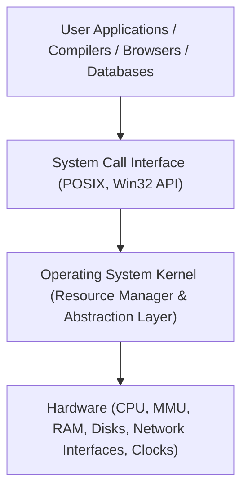

# Operating System Structures and Functions

> 📖 **Reading Order:** Step 01 of 34 | **Module 1:** OS Architecture & Kernel Fundamentals  
> ◄ **Previous:** *Start of Course* | ► **Next:** [[Dual-Mode Operation and System Calls]]

---

## Definition

An **Operating System (OS)** is a foundational system software layer that runs directly on bare computer hardware in privileged mode, acting as an intermediary between computer hardware and user applications.

Fundamentally, an operating system performs two primary, dual roles:
1. **Extended Machine (Top-Down View / Abstraction Provider):**  
   Presents programmers with clean, standardized, hardware-independent abstractions (such as files, processes, virtual address spaces, and sockets) in place of the complex, error-prone, low-level physical reality of raw hardware (interrupts, disk controllers, timers, and bus interfaces).
2. **Resource Manager (Bottom-Up View / Resource Arbiter):**  
   Manages, coordinates, and multiplexes access to physical hardware resources (CPU cores, physical memory frames, network interfaces, and secondary storage) across competing programs and users, ensuring fairness, protection, efficiency, and system stability.

---

## Why Does It Exist? (Motivation & History)

In the earliest computing systems (1940s–1950s), there was no operating system. Programmers wrote machine code directly against bare hardware, manually toggling console switches and managing punch cards. This had critical drawbacks:
- **No Resource Sharing:** Only one user could execute one program at a time. If the program waited for a slow paper-tape reader, the expensive vacuum-tube CPU sat idle.
- **Hardware Fragility:** Every application had to implement its own device drivers. An accidental memory write by a programmer could freeze or destroy hardware state.
- **Wasted Programmer Effort:** Every software development team had to reinvent basic I/O routines, memory allocators, and program loaders.

The OS arose to solve these problems through:
- **Batch Processing:** Grouping similar jobs together to eliminate setup downtime.
- **Multiprogramming:** Keeping multiple jobs resident in memory simultaneously so that when Job A blocks on I/O, the CPU immediately switches to Job B, maximizing CPU utilization.
- **Time-Sharing (Multitasking):** Rapidly switching the CPU between users (round-robin scheduling with timer interrupts) to give each interactive user the illusion of a dedicated personal computer.

---

## Operating System Architectures

The architectural organization of the kernel governs how OS components interact, execute, and isolate faults:

### 1. Monolithic Architecture
- **Structure:** The entire operating system runs as a single, large, highly privileged binary in kernel mode. All kernel subsystems (process scheduler, virtual memory, file systems, IPC, network stack, and hardware drivers) share a single flat address space.
- **Communication:** Internal subsystems communicate via blazing-fast, direct C function calls.
- **Advantages:** Maximum performance with minimal execution overhead (no context switching between kernel modules).
- **Disadvantages:** Monolithic fragility. Because all modules share the same address space, a bug or null-pointer dereference in a third-party printer driver immediately causes a kernel panic / blue screen of death (BSOD).
- **Examples:** Traditional UNIX, Linux, FreeBSD, MS-DOS.

### 2. Microkernel Architecture
- **Structure:** Strips the kernel down to the absolute bare minimum required to maintain system integrity—typically only:
  - Low-level address space management (virtual memory paging mechanisms).
  - Low-level inter-process communication (IPC / message passing).
  - Basic CPU scheduling.
- All non-essential services (file systems, device drivers, network protocols, user authentication) are evicted from kernel space and run as isolated, unprivileged **user-space servers**.
- **Communication:** User applications and OS servers communicate exclusively via microkernel IPC message passing.
- **Advantages:** High modularity, fault tolerance, and security. If the file system server crashes, it can be restarted automatically without crashing the entire machine.
- **Disadvantages:** Significant performance degradation caused by repeated context switches and boundary crossings during IPC message forwarding.
- **Examples:** Minix 3, QNX (used in automotive/medical safety-critical systems), Mach, seL4.

### 3. Layered Architecture
- Organizes the OS into a strict hierarchy of $N$ layers ($0$ to $N$).
- Layer $0$ interfaces with hardware; Layer $N$ interfaces with user applications.
- **Rule:** Layer $M$ can only invoke functions implemented by Layer $M-1$.
- **Advantages:** Clean modularity and incremental verification/debugging.
- **Disadvantages:** Difficult to strictly define layers without circular dependencies (e.g., backing store driver needs virtual memory, but virtual memory needs backing store driver).

### 4. Hybrid Architectures
- Combines the high performance of monolithic kernels with the modular abstractions of microkernels.
- Drivers and core subsystems run in kernel space for speed, but follow structured, object-oriented, message-like interfaces.
- **Examples:** Windows NT kernel, macOS (XNU / Darwin).

---

## Core Operating System Responsibilities

1. **Process Management:** Creating, terminating, scheduling, and synchronizing processes and threads (see [[Process Concepts and Memory Layout]] and [[CPU Scheduling Principles and Criteria]]).
2. **Memory Management:** Allocating memory dynamically, tracking free frames, translating virtual addresses to physical addresses via the MMU, and swapping/paging (see [[Process Control Block and Context Switching]]).
3. **Storage & File System Management:** Organizing raw physical disk sectors into human-readable hierarchical directories, files, permissions, and metadata.
4. **I/O Device Management:** Providing uniform device driver interfaces, interrupt handlers, DMA (Direct Memory Access) channels, and buffering/caching.
5. **Protection and Security:** Enforcing access control lists, maintaining authentication, and defending hardware resources via [[Dual-Mode Operation and System Calls]].

---

## Edge Cases & Common Misconceptions

1. **"The OS is the same as the GUI or Shell":**
   - The graphical desktop environment (e.g., Windows Desktop, GNOME) or command-line shell (e.g., `bash`, `zsh`) is **NOT** part of the kernel.
   - They are standard user-space programs that make system calls to the kernel just like any user application.
2. **"An OS makes programs run faster":**
   - An OS introduces unavoidable overhead (context switching, privilege boundary crossings, system call dispatching).
   - A single program running alone on bare metal executes faster than on an OS. The OS exists to enable safe *sharing*, *multiplexing*, and *portability*, not raw single-task speed.

---

## Cross-Topic Connections / Exam Relevance

- **Next Step:** To enforce protection, hardware provides CPU execution rings (see [[Dual-Mode Operation and System Calls]]).
- **Process Abstraction:** The primary resource unit managed by the OS is the process (see [[Process Concepts and Memory Layout]]).
- **Exam Testing:** Frequently tested on midterms via comparison tables (Monolithic vs. Microkernel trade-offs), defining the two primary views of an OS, and explaining why bare-metal execution is unsuitable for modern multitasking.

---

## Sources & Traceability

- **Lectures:** `cse313/01 - Sources/Lectures/1. Introduction-week1-RRR-2026.pdf` (Slides 1–6, 11–12)
- **Textbook:** Andrew S. Tanenbaum & Herbert Bos, *Modern Operating Systems* (4th Edition), Chapter 1: Introduction (Sections 1.1–1.7)
