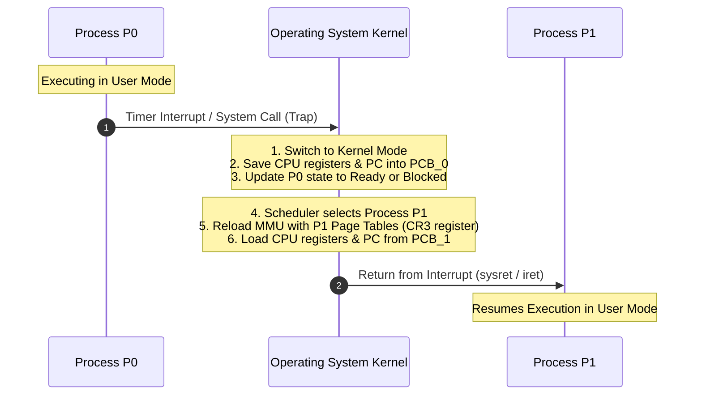

# Process Control Block and Context Switching

> 📖 **Reading Order:** Step 06 of 34 | **Module 2:** Processes & Threads  
> ◄ **Previous:** [[Process Lifecycle and State Transitions]] | ► **Next:** [[Process Creation and Termination Operations]]

---

## Building the idea

Imagine pausing a program between two instructions. To resume correctly, knowing its filename is useless: we need its next instruction address, register contents, stack position, and relevant kernel bookkeeping. A **process control block (PCB)** is the kernel's record of a particular process. A process table organizes those records.

While a thread is running, its current execution values live in physical CPU registers. When it stops, the kernel saves the required context in kernel-owned structures, often split between a PCB or thread structure and a kernel stack. The saved program counter is a value in memory; there is no extra physical CPU register for every inactive process.

A context switch saves the outgoing task's resumable state, chooses or receives the next task, installs the incoming state and necessary address-space context, and transfers execution. The precise saved registers depend on the kernel and architecture. On one core, application A has stopped while the kernel performs the switch, and B has not yet resumed. The CPU is doing kernel work during that interval.

This makes [[Process Lifecycle and State Transitions]] concrete: a state change says why execution stops or becomes possible; context switching makes the change happen without losing the execution history.

## Definition

To manage multiple concurrent processes and enable time-sharing on a single CPU, the operating system requires a dedicated data structure to represent each process.
- **Process Control Block (PCB):** A repository of information stored in kernel memory that contains all metadata and hardware state necessary to track, schedule, and pause/resume a process. (In the Linux kernel, this is implemented as `struct task_struct`).
- **Context Switch:** The hardware and software procedure of stopping the currently executing process, saving its execution state into its PCB, selecting another process, and loading the saved state from that process's PCB into the CPU registers to resume execution seamlessly.

---

## How It Works

### The Context Switching Mechanism

When the CPU scheduler decides to switch execution from Process $P_0$ to Process $P_1$, the kernel executes the following timeline:

### What Happens During a Context Switch?
1. **Save Context of $P_0$:**
   The CPU registers, stack pointer, and program counter of $P_0$ are saved into $PCB_0$ in kernel memory.
2. **Update Process State:**
   The state of $P_0$ in $PCB_0$ is updated from `Running` to `Ready` (if preempted by timer) or `Blocked` (if waiting for I/O).
3. **Move to Appropriate Queue:**
   $PCB_0$ is enqueued into the Ready Queue or the appropriate I/O device wait queue.
4. **Select Next Process:**
   The CPU scheduler selects $PCB_1$ from the Ready Queue according to its scheduling algorithm.
5. **Switch Memory Mapping:**
   The MMU base register (e.g., `cr3` register in x86) is updated to point to $P_1$'s page directory, replacing $P_0$'s virtual address space with $P_1$'s virtual address space.
6. **Restore Context of $P_1$:**
   The hardware registers, stack pointer, and program counter are restored from $PCB_1$.
7. **Switch to User Mode:**
   The CPU mode bit is set to $1$, jumping to the restored Program Counter to resume $P_1$.

---

## Example

Context switch sequence between $P_1$ and $P_2$:
1. Timer interrupt fires while $P_1$ is executing instruction `ADD R1, R2`.
2. CPU mode switches to Kernel Mode ($0$). Hardware pushes $P_1$'s PC and flags to the kernel stack.
3. OS scheduler decides to run $P_2$.
4. OS copies remaining registers (`R1`-`R15`, SP) into $P_1$'s PCB.
5. OS points CPU memory management register (CR3) to $P_2$'s page directory (invalidating TLB entries).
6. OS loads saved registers from $P_2$'s PCB into physical CPU registers.
7. OS executes return-from-interrupt (`iret`), switching to User Mode and resuming $P_2$.

---

## Technical Details

### Context Switch Overhead: The Cost of Time-Sharing

A context switch is **pure system overhead (dead time)**: during a context switch, the CPU performs administrative book-keeping and executes **zero useful user application instructions**.

Context switch costs fall into two categories:

### 1. Direct Costs (Microseconds)
- Saving and restoring tens of CPU registers to and from memory.
- Executing the scheduler's selection logic.
- Flashing and rewriting memory management registers.

### 2. Indirect Costs (The "Cache-Cold" Effect)
- **TLB Invalidation:** Switching page tables invalidates the **Translation Lookaside Buffer (TLB)**. The newly scheduled process experiences a burst of slow, multi-level page table walks in RAM.
- **CPU Cache Pollution:** The L1, L2, and L3 caches contain cache lines belonging to the old process $P_0$. When $P_1$ begins executing, almost every memory access results in a cache miss until $P_1$ warms up the cache.

---

## Important Properties and Why They Hold

- **State Transparency:** Context switching is completely transparent to the user application; no process can detect that it was suspended other than by querying physical wall-clock time.
- **Direct Overhead Invariant:** Context switching performs zero useful application computation; it is pure operating system administrative overhead.
- **Indirect Cache Penalties:** Switching address spaces forces Translation Lookaside Buffer (TLB) flushes and causes CPU L1/L2 cache misses as the new process warms up the cache lines.

---

## Common Mistakes

1. **Context Switch vs. Mode Switch:**
   - **Mode Switch:** A transition between User Mode and Kernel Mode for the *same* process (e.g., handling a quick `getpid()` system call). The process does not change, the address space does not change, and TLB is not flushed. Overhead is very small.
   - **Context Switch:** A transition between *different* processes ($P_0 \to P_1$). Requires changing the active PCB, updating memory page tables, and invalidating caches. Overhead is significantly higher!
2. **Quantum Sizing Dilemma:**
   - If the time quantum $q$ is too small (e.g., $1\text{ ms}$ with a context switch cost of $0.2\text{ ms}$), $16.7\%$ of CPU time is wasted on context switching alone.
   - If $q$ is too large (e.g., $500\text{ ms}$), the system loses interactive responsiveness and degrades to batch FCFS.

---

## Exam Relevance

- **Next Step:** How are new processes generated, and how does the OS clone PCBs during execution? (See [[Process Creation and Termination Operations]]).
- **Threads:** Why were threads invented? Because switching between threads sharing the same address space avoids TLB flushes and heavy context switch overhead (see [[Threads and Multithreading Models]]).
- **Exam Testing:** Frequently asked to:
  - Contrast a mode switch with a context switch.
  - List at least 5 distinct fields stored within a PCB.
  - Explain why frequent context switching degrades memory and CPU performance.

---

## What to carry forward

PCB state belongs to a process instance; thread-specific execution state may have a separate record. Switching threads in one process can share address-space state, whereas switching processes may require changing it. [[Threads and Multithreading Models]] uses that distinction to separate resource ownership from execution paths.

## Related notes

- [[Process Lifecycle and State Transitions]]
- [[Threads and Multithreading Models]]

## Sources

- **Lectures:** `cse313/01 - Sources/Lectures/2. ProcessAndThread-week2-RRR.pdf` (Slides 8–10, 16–21)
- **Textbook:** Andrew S. Tanenbaum & Herbert Bos, *Modern Operating Systems* (4th Edition), Chapter 2 (Section 2.1.3: Process Implementation)
