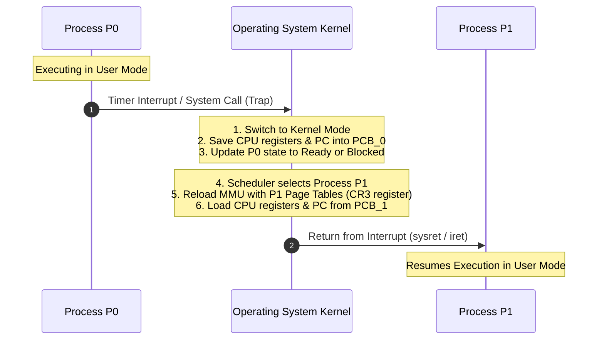

# Process Control Block and Context Switching

> 📖 **Reading Order:** Step 06 of 34 | **Module 2:** Processes & Threads  
> ◄ **Previous:** [[Process Lifecycle and State Transitions]] | ► **Next:** [[Process Creation and Termination Operations]]

---

## Definition

To manage multiple concurrent processes and enable time-sharing on a single CPU, the operating system requires a dedicated data structure to represent each process.
- **Process Control Block (PCB):** A repository of information stored in kernel memory that contains all metadata and hardware state necessary to track, schedule, and pause/resume a process. (In the Linux kernel, this is implemented as `struct task_struct`).
- **Context Switch:** The hardware and software procedure of stopping the currently executing process, saving its execution state into its PCB, selecting another process, and loading the saved state from that process's PCB into the CPU registers to resume execution seamlessly.

---

## Structure of the Process Control Block (PCB)

A PCB contains all the vital signs of a process:

```
+-------------------------------------------------------+
|                 Process Control Block (PCB)           |
+-------------------------------------------------------+
|  Process Identifier (PID) & Parent PID (PPID)        |
+-------------------------------------------------------+
|  Process State (Ready, Running, Blocked, etc.)        |
+-------------------------------------------------------+
|  Program Counter (PC / Instruction Pointer)           |
+-------------------------------------------------------+
|  CPU Registers (Accumulator, Index, Stack Pointer)    |
+-------------------------------------------------------+
|  CPU Scheduling Information (Priority, Queue Ptrs)    |
+-------------------------------------------------------+
|  Memory Management Info (Page Tables, Segment Tables) |
+-------------------------------------------------------+
|  Accounting Information (CPU time consumed, Limits)   |
+-------------------------------------------------------+
|  I/O Status Info (Allocated Devices, Open Files Table)|
+-------------------------------------------------------+
```

### Detailed Field Breakdown:

1. **Identification:**
   - **PID (Process ID):** A unique non-negative integer assigned by the OS upon creation.
   - **PPID (Parent Process ID):** Identifies the process that created this process.
   - **User ID (UID) & Group ID (GID):** Governs access permissions and security privileges.
2. **Execution Context:**
   - **Program Counter (PC):** The address of the next machine instruction to execute when this process is scheduled.
   - **CPU Registers:** The contents of all hardware registers (general-purpose, accumulator, stack pointer, frame pointer, index registers, and condition codes).
3. **Process Scheduling Information:**
   - Priority level, pointers to scheduling queues, dynamic CPU usage history.
4. **Memory Management Information:**
   - Pointers to the page tables, segment tables, and base/limit registers defining the boundaries of the process's virtual address space.
5. **Accounting & Resource Limits:**
   - Cumulative CPU time used, clock time elapsed, memory limits, process priority.
6. **I/O Status Information:**
   - The **File Descriptor Table** (mapping integer file descriptors like $0$ for `stdin`, $1$ for `stdout`, $2$ for `stderr` to open file objects in the kernel), list of assigned I/O devices.

The operating system organizes all PCBs into a **Process Table** (typically structured as an array, hash table, or doubly linked circular list).

---

## The Context Switching Mechanism

When the CPU scheduler decides to switch execution from Process $P_0$ to Process $P_1$, the kernel executes the following timeline:



### What Happens During a Context Switch?
1. **Save Context of $P_0$:**
   The CPU registers, stack pointer, and program counter of $P_0$ are saved into $PCB_0$ in kernel memory.
2. **Update Process State:**
   The state of $P_0$ in $PCB_0$ is updated from `Running` to `Ready` (if preempted by timer) or `Blocked` (if waiting for I/O).
3. **Move to Appropriate Queue:**
   $PCB_0$ is enqueued into the Ready Queue or the appropriate I/O device wait queue.
4. **Select Next Process:**
   The CPU scheduler selects $PCB_1$ from the Ready Queue according to its scheduling algorithm.
5. **Switch Memory Mapping:**
   The MMU base register (e.g., `cr3` register in x86) is updated to point to $P_1$'s page directory, replacing $P_0$'s virtual address space with $P_1$'s virtual address space.
6. **Restore Context of $P_1$:**
   The hardware registers, stack pointer, and program counter are restored from $PCB_1$.
7. **Switch to User Mode:**
   The CPU mode bit is set to $1$, jumping to the restored Program Counter to resume $P_1$.

---

## Context Switch Overhead: The Cost of Time-Sharing

A context switch is **pure system overhead (dead time)**: during a context switch, the CPU performs administrative book-keeping and executes **zero useful user application instructions**.

Context switch costs fall into two categories:

### 1. Direct Costs (Microseconds)
- Saving and restoring tens of CPU registers to and from memory.
- Executing the scheduler's selection logic.
- Flashing and rewriting memory management registers.

### 2. Indirect Costs (The "Cache-Cold" Effect)
- **TLB Invalidation:** Switching page tables invalidates the **Translation Lookaside Buffer (TLB)**. The newly scheduled process experiences a burst of slow, multi-level page table walks in RAM.
- **CPU Cache Pollution:** The L1, L2, and L3 caches contain cache lines belonging to the old process $P_0$. When $P_1$ begins executing, almost every memory access results in a cache miss until $P_1$ warms up the cache.

---

## Edge Cases & Common Pitfalls

1. **Context Switch vs. Mode Switch:**
   - **Mode Switch:** A transition between User Mode and Kernel Mode for the *same* process (e.g., handling a quick `getpid()` system call). The process does not change, the address space does not change, and TLB is not flushed. Overhead is very small.
   - **Context Switch:** A transition between *different* processes ($P_0 \to P_1$). Requires changing the active PCB, updating memory page tables, and invalidating caches. Overhead is significantly higher!
2. **Quantum Sizing Dilemma:**
   - If the time quantum $q$ is too small (e.g., $1\text{ ms}$ with a context switch cost of $0.2\text{ ms}$), $16.7\%$ of CPU time is wasted on context switching alone.
   - If $q$ is too large (e.g., $500\text{ ms}$), the system loses interactive responsiveness and degrades to batch FCFS.

---

## Cross-Topic Connections / Exam Relevance

- **Next Step:** How are new processes generated, and how does the OS clone PCBs during execution? (See [[Process Creation and Termination Operations]]).
- **Threads:** Why were threads invented? Because switching between threads sharing the same address space avoids TLB flushes and heavy context switch overhead (see [[Threads and Multithreading Models]]).
- **Exam Testing:** Frequently asked to:
  - Contrast a mode switch with a context switch.
  - List at least 5 distinct fields stored within a PCB.
  - Explain why frequent context switching degrades memory and CPU performance.

---

## Sources & Traceability

- **Lectures:** `cse313/01 - Sources/Lectures/2. ProcessAndThread-week2-RRR.pdf` (Slides 8–10, 16–21)
- **Textbook:** Andrew S. Tanenbaum & Herbert Bos, *Modern Operating Systems* (4th Edition), Chapter 2 (Section 2.1.3: Process Implementation)
