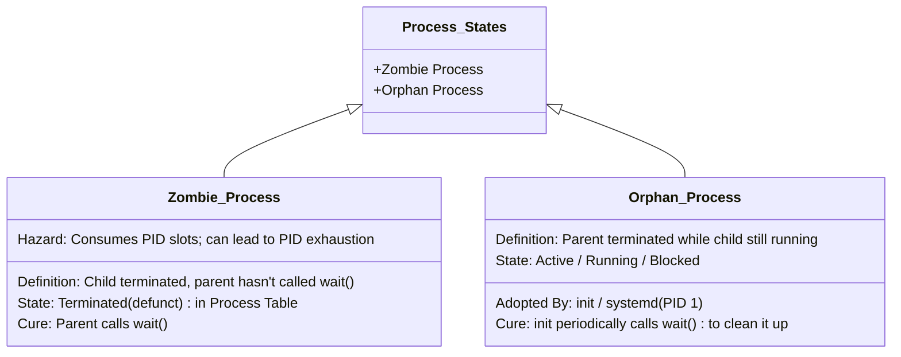

# Process Creation and Termination Operations

> 📖 **Reading Order:** Step 07 of 34 | **Module 2:** Processes & Threads  
> ◄ **Previous:** [[Process Control Block and Context Switching]] | ► **Next:** [[Threads and Multithreading Models]]

---

> [!IMPORTANT] **Exam practice references (Appeared in 2017 Q1b, 2018 Q2c, 2018 Q4a, 2020 Q4b)**
>
> ### Practice tasks and reasoning:
> 1. **Drawing the `for (; i < 3; i++) fork();` Process Tree (2017 Q1b & 2020 Q4b verbatim):**
>    - **The Setup:** A loop runs for $i = 0, 1, 2$, calling `fork()`. Draw the process tree and label the **starting value of $i$** for each created process node ($P_0$ to $P_7$).
>    - **The tracing method:**
>      - When `fork()` is called, the child is born at that exact instruction line and starts with the parent's current value of $i$ *before* the loop increment `i++` is executed!
>      - **Iteration 0 ($i=0$):** $P_0$ forks $P_1$. $\implies$ **$P_1$ starts with $i = 0$**. Both execute `i++` to become $i=1$.
>      - **Iteration 1 ($i=1$):** $P_0$ forks $P_2$, $P_1$ forks $P_3$. $\implies$ **$P_2$ starts with $i = 1$**, **$P_3$ starts with $i = 1$**. All four execute `i++` to become $i=2$.
>      - **Iteration 2 ($i=2$):** $P_0$ forks $P_4$, $P_2$ forks $P_5$, $P_1$ forks $P_6$, $P_3$ forks $P_7$. $\implies$ **$P_4, P_5, P_6, P_7$ all start with $i = 2$**.
>      - Total processes created $= 2^3 = 8$ (1 root + 7 children).
> 2. **Memory Isolation in Nested `fork()` Output Tracing (2018 Q2c):**
>    - Because each child process receives a private, duplicated copy of the address space, modifying a variable `count++` in a child does **not** affect the parent or sibling processes.
> 3. **Standard UNIX Execution Pattern (2018 Q4a):**
>    - Know how to write robust C code utilizing `fork()`, `execvp(args[0], args)`, and `waitpid(pid, &status, 0)` with proper error checking on return values.

---

## Building the idea

Process creation and program replacement answer different questions. **`fork()` creates another process. `exec()` replaces the program executed by an existing process.** Keeping them separate explains how a shell launches a command.

After a successful fork, parent and child continue after the same call, but receive different return values: the parent receives the child's PID, and the child receives zero. This lets the child take the program-loading branch while the parent takes the waiting branch. Their ordinary writable variables are logically independent, even when copy-on-write temporarily shares physical pages.

The child can call `exec` to load the command. A successful exec begins the new program rather than returning to the old call site. The process identity remains, while its program image changes. Later, exit releases execution resources and makes termination information available. The parent calls `wait` or `waitpid` to collect that information.

Use [[Process Lifecycle and State Transitions]] to interpret a waiting parent: it can be blocked while its child executes. Use [[Process Control Block and Context Switching]] to understand why the kernel can retain an exit record after the child has stopped running.

## Definition

Operating systems manage processes through distinct, fundamental operations:
- **Process Creation:** The mechanism by which an existing process (the **parent**) spawns a new process (the **child**), forming a hierarchical tree of processes rooted at `init`/`systemd` (PID 1).
- **Process Termination:** The mechanism by which a process ends its execution, releases allocated resources, and reports an exit status code to its parent.

---

## How It Works

### Process Creation in UNIX/Linux: `fork()` and `exec()`

In UNIX-like systems, process creation is decoupled into two separate, elegant primitives: `fork()` and `exec()`.

```mermaid
sequenceDiagram
    autonumber
    participant Parent as Parent Process (PID 1000)
    participant Kernel as OS Kernel
    participant Child as Child Process (PID 1001)

    Parent->>Kernel: pid = fork()
    Note over Kernel: 1. Duplicate Parent PCB<br/>2. Assign new PID (1001)<br/>3. Copy or mark pages Copy-On-Write (COW)<br/>4. Duplicate Open File Table descriptors
    Kernel-->>Parent: Returns Child PID (1001)
    Kernel-->>Child: Returns 0
    Note over Parent: Executes: if (pid > 0) { wait(&status); }
    Note over Child: Executes: if (pid == 0) { execve("/bin/ls", ...); }
    Child->>Kernel: execve("/bin/ls", ...)
    Note over Kernel: 5. Overwrite Child Address Space with /bin/ls<br/>6. Reset User Stack & PC to /bin/ls main()<br/>7. Keep PID (1001) unchanged!
    Kernel-->>Child: Starts executing /bin/ls
    Child->>Kernel: exit(0)
    Kernel-->>Parent: wait() unblocks, returns child status
```

### 1. The `fork()` System Call
- **Operation:** Creates an exact duplicate of the calling parent process.
- **What is Cloned:**
  - Complete virtual memory address space (Text, Data, BSS, Heap, Stack).
  - CPU register states and Program Counter.
  - Open file descriptors (the child inherits open files at the exact same file offsets!).
  - Current working directory and environment variables.
- **The Magic Return Value of `fork()`:**
  Although `fork()` is called **once**, it returns **twice** (once in the parent, once in the child):
  $$\text{return value} = \begin{cases} > 0 & \text{In the Parent: returns the newly created child's PID} \\ 0 & \text{In the Child: indicates this is the child process} \\ < 0 & \text{Error: creation failed (e.g., process limit reached)} \end{cases}$$

### 2. Copy-On-Write (COW) Optimization
Historically, duplicating an entire multi-gigabyte address space during `fork()` was prohibitively slow. Modern operating systems use **Copy-On-Write (COW)**:
- During `fork()`, the kernel does not physically copy memory pages.
- Instead, the child's page table points to the exact same physical frames as the parent, and all shared pages are marked **Read-Only**.
- If either parent or child attempts to write to a page, the MMU hardware triggers a **page fault**. The kernel intercepts the fault, allocates a fresh physical frame, copies *only that single 4 KB page*, marks it read-write, and resumes execution.
- If the child immediately calls `exec()`, the parent's memory was never copied, saving immense time and RAM!

### 3. The `exec()` Family of System Calls
- Replaces the current process's memory space, code, data, heap, and stack with a brand-new executable file loaded from disk.
- **Critical Property:** The **PID remains completely unchanged**! `exec()` transforms the soul of the process while retaining its original identity and open file descriptors.

---

### Process Termination: The 4 Causes

A process terminates due to one of four events:

1. **Normal Exit (Voluntary):**
   - The process completes its task and explicitly calls `exit(status)` or returns from `main()`.
2. **Error Exit (Voluntary):**
   - The process detects a fatal application condition (e.g., required input file missing) and exits with a non-zero status code: `exit(2)`.
3. **Fatal Error (Involuntary):**
   - The process executes an illegal operation (division by zero, accessing unauthorized memory `SIGSEGV`, executing a privileged instruction). The CPU generates a hardware trap and the OS forcefully terminates it.
4. **Killed by Another Process (Involuntary):**
   - Another process with appropriate privileges sends a fatal terminating signal via the `kill()` system call (e.g., `kill -9 <PID>` sending `SIGKILL`).

---

## Example

Shell command execution `ls -l`:
1. The shell process calls `fork()`.
2. In child ($PID_{	ext{ret}} = 0$): child calls `execvp("ls", args)`, replacing its shell image with the `/bin/ls` binary.
3. In parent ($PID_{	ext{ret}} > 0$): shell calls `waitpid(child_pid, &status, 0)`, blocking until `ls` finishes.
4. When `ls` finishes, it returns code $0$; kernel notifies parent, reaps child's PCB, and the shell prompts for the next command.

---

## Important Properties and Why They Hold

- **Copy-On-Write (COW) Efficiency:** `fork()` does not physically copy memory pages immediately; it marks pages read-only and shares them. A physical page copy occurs only if either parent or child writes to memory.
- **Zombie Invariant:** A terminated process whose parent has not invoked `wait()` remains in the kernel process table as a zombie; excessive zombies exhaust the OS process ID table.
- **Orphan Adoption Invariant:** No process is ever left without a valid parent; the operating system guarantees that PID 1 adopts all orphaned processes and calls `wait()` periodically.

---

## Common Mistakes

1. **You Cannot "Kill" a Zombie:**
   - Executing `kill -9 <zombie_pid>` does **NOTHING** because the process is already dead!
   - To remove a zombie, you must kill its parent (which causes the zombie to be adopted by `init`, which immediately calls `wait()`), or send the parent a `SIGCHLD` signal to force it to call `wait()`.
2. **Cascading Termination:**
   - In some operating systems (like VMS), when a parent process terminates, the OS automatically terminates all of its children, grandchildren, and descendants. UNIX does not enforce cascading termination by default—children simply become orphans.

---

## Exam Relevance

When a process terminates, its memory space, open files, and CPU allocations are immediately released back to the OS. However, its entry in the **Process Table** (and its PCB) cannot be deleted yet, because the parent process has a right to read the child's exit status code and CPU statistics using `wait()` or `waitpid()`.



### 1. Zombie Process (Defunct Process)
- **Definition:** A process that has terminated via `exit()`, but whose parent has **not yet invoked `wait()` or `waitpid()`** to reap its exit status.
- **Appearance in `ps`:** Marked as `<defunct>` or state `Z`.
- **Dangers:** A zombie process consumes zero RAM and zero CPU, but it holds a valuable **PID entry** in the OS Process Table. If a parent program runs an infinite loop spawning children without calling `wait()`, the process table fills up with zombies, leading to **PID Exhaustion** (no other process on the entire computer can be created!).

### 2. Orphan Process
- **Definition:** A child process that is still actively running, but whose **parent process terminates before the child**.
- **Resolution (Adoption by `init`):**
  When a parent dies, the operating system kernel re-parents all of its orphaned children to **PID 1 (`init` or `systemd`)**.
  `init` continuously runs an infinite loop executing `wait()`, instantly reaping any adopted orphan as soon as it terminates. Thus, orphans never remain zombies permanently.

---

## What to carry forward

Fork return values identify execution branches, not scheduling order. In [[Process Forking and Zombie Orphan Example]], compare ordinary copied variables with inherited file descriptors: separate address spaces do not mean all underlying OS resources are separate.

## Related notes

- [[Process Lifecycle and State Transitions]]
- [[Process Control Block and Context Switching]]
- [[Process Forking and Zombie Orphan Example]]

## Sources

- **Lectures:** `cse313/01 - Sources/Lectures/2. ProcessAndThread-week2-RRR.pdf` (Slides 9–10, 22–28)
- **Textbook:** Andrew S. Tanenbaum & Herbert Bos, *Modern Operating Systems* (4th Edition), Chapter 2 (Section 2.1.1: Process Creation, Section 2.1.2: Process Termination)
