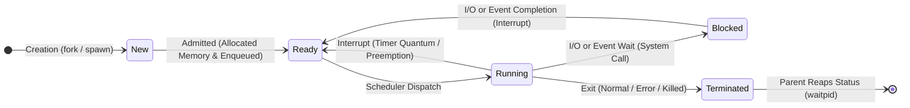
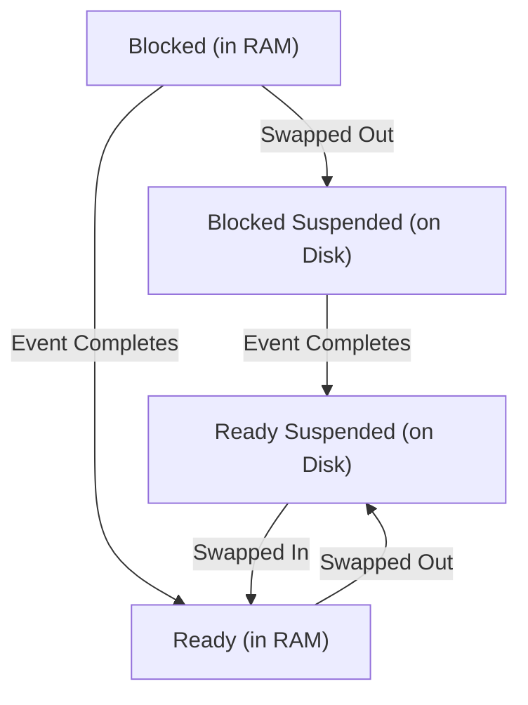

# Process Lifecycle and State Transitions

> 📖 **Reading Order:** Step 05 of 68 | **Module 2:** Processes & Threads  
> ◄ **Previous:** [[Process Concepts and Memory Layout]] | ► **Next:** [[Process Control Block and Context Switching]]

---
> [!IMPORTANT] 🎯 **Exam Frequency & Intelligence (Appeared in 2017 Q3b, 2018 Q1a, 2020 Q4a)**
> **Frequency:** ⭐⭐⭐⭐ **High Recurrence (Appeared across 3 exam years, verbatim repeated!)**
>
> ### What Exam Questions Expect & How to Master Them:
> 1. **The 5 xv6/UNIX Process States & Transitions (2018 Q1a):**
>    - **EMBRYO:** Memory and PCB allocated, but not yet fully initialized or runnable.
>    - **RUNNABLE (Ready):** Ready to execute, waiting in the ready queue for CPU time.
>    - **RUNNING:** Actively executing instructions on a physical CPU core.
>    - **SLEEPING (Blocked):** Waiting for an external I/O event, timer, or lock.
>    - **ZOMBIE:** Terminated execution, memory freed, but exit code retained in PCB until reaped by parent via `wait()`.
> 2. **Process States During Starvation vs Livelock (2017 Q3b & 2020 Q4a verbatim):**
>    - **Starvation:** The victim process is in the **`RUNNABLE` (Ready)** state (or `SLEEPING` awaiting an unfairly withheld lock). It consumes **0% CPU**; it is entirely ready to run, but the CPU scheduler continually bypasses it in favor of other jobs.
>    - **Livelock:** The process is in the **`RUNNING`** state. It consumes **100% CPU cycles** spinning in an active loop. Its internal state values continuously oscillate and change in response to another process, yet neither makes functional forward progress.

---
## Starting Point and the Problem

In any modern computing system, there are typically hundreds or thousands of processes configured, but only a small number of physical CPU cores (e.g. 4 to 16 cores).

We want the system to multiplex these cores fairly and efficiently so that all active programs make progress, interactive applications respond instantly to user input, and batch computations utilize spare cycles. The central obstacle is that processes have radically different immediate needs: some are actively computing, some are waiting for slow disk or network I/O, and others are waiting for timer alarms.

---
## Developing the Idea

The operating system structures process management around a formal **Finite State Machine (FSM)**: the **Process Lifecycle**.

By categorizing every process into one of several well-defined states, the OS CPU scheduler only ever considers processes that are genuinely ready to run:
- A process waiting for disk data cannot consume CPU cycles even if the CPU is completely idle.
- When an I/O operation completes, a hardware interrupt signals the kernel, transitioning that process from Blocked back to Ready.
- Under memory pressure, the OS extends this model with **Suspended States**, paging out entire processes to secondary storage to reclaim physical RAM frames.

---
## Definition

During its existence from initial creation to final termination, a process changes its execution status dynamically. The **process lifecycle** is modeled as a finite state machine governed by the operating system scheduler and hardware events.

The standard representation is the **Five-State Process Model**:
1. **New:** The process is in the process of being created (its Process Control Block is being allocated and initialized, but its address space is not yet fully admitted into the ready queue).
2. **Ready:** The process is resident in main memory, possesses all required resources, and is waiting only to be assigned to a CPU core by the scheduler.
3. **Running:** The process's machine instructions are currently being fetched, decoded, and executed on a physical CPU core.
4. **Waiting (Blocked):** The process cannot execute even if the CPU were completely free, because it is awaiting an asynchronous external event (e.g., disk I/O completion, a network packet, user keyboard input, a semaphore signal, or a child process termination).
5. **Terminated (Exit):** The process has finished executing its code (or was killed), its memory and file descriptors are released, but its exit status remains in the process table until its parent collects it.

---
## How It Works

### The 5-State Transition Diagram

### Detailed Transition Analysis:

1. **Admitted ($\text{New} \to \text{Ready}$):**
   - The OS loads the program binary from secondary storage into main memory, builds the address space, initializes the PCB, and inserts the process pointer into the Ready Queue.
2. **Scheduler Dispatch ($\text{Ready} \to \text{Running}$):**
   - The CPU scheduler selects a process from the Ready Queue according to a scheduling algorithm (see [[CPU Scheduling Principles and Criteria]]), restores its register state via a context switch, and transfers CPU control.
3. **Interrupt / Preemption ($\text{Running} \to \text{Ready}$):**
   - A hardware timer interrupt fires indicating the process's allocated time slice (quantum) has expired, or a higher-priority process becomes ready. The OS saves the running process's state and places it back into the Ready Queue.
4. **I/O or Event Wait ($\text{Running} \to \text{Blocked}$):**
   - The process executes a blocking system call (e.g., `read()` from disk, `sleep()`, or waiting on a locked mutex). The OS moves the process out of the CPU and places it into an I/O Wait Queue.
5. **I/O or Event Completion ($\text{Blocked} \to \text{Ready}$):**
   - The disk controller or network card generates a hardware interrupt signaling that the requested data has arrived in memory. The OS moves the process from the Blocked Queue into the Ready Queue.
   - **Crucial Rule:** A blocked process **NEVER transitions directly from Blocked to Running!** It must enter the Ready Queue and wait its turn for the scheduler to select it.
6. **Exit ($\text{Running} \to \text{Terminated}$):**
   - The process finishes its `main()` function, explicitly calls `exit()`, or receives a fatal terminating signal (`SIGKILL`, `SIGSEGV`).

---
### The Extended 7-State Model (Suspended States)

When physical RAM is heavily overcommitted (thrashing), the OS must free up memory by swapping entire processes out of physical RAM and onto secondary storage (the swap partition/file). This introduces two **Suspended States**:

1. **Blocked Suspended:** The process is swapped out to disk and is also waiting for an external event.
2. **Ready Suspended:** The process has been swapped out to disk, but its blocking event has already completed. It is ready to run as soon as sufficient physical memory becomes available to swap it back into RAM.

---
## Example

Tracing a text editor process:
1. User launches editor: OS allocates PCB and transitions process to **New**, then **Ready**.
2. Scheduler picks it: Transitions to **Running**.
3. User types a key: Editor waits for next keystroke and invokes `read()`, transitioning to **Waiting (Blocked)**. The CPU is yielded to another process.
4. Keyboard interrupt fires: OS moves editor back to **Ready**.
5. Timer slice expires during spell-check: OS moves editor from **Running** to **Ready** (preemption).
6. User clicks Save & Exit: Editor writes file, executes `exit()`, and enters **Terminated**.

---
## Technical Details

See related modules for microarchitectural implementation details.

---
## Important Properties and Why They Hold

- **Strict Invariance of Transitions:** A process cannot jump directly from Blocked to Running; it *must* first enter the Ready state so the scheduler can evaluate priorities fairly.
- **Uniprocessor Running Uniqueness:** On a system with $C$ CPU cores, at most $C$ processes can occupy the Running state simultaneously at any instant.
- **State Determinism:** Every state transition is triggered either by a hardware interrupt (timer, I/O device) or an explicit software trap/system call.

---
## Common Mistakes

- Assuming user mode code can execute privileged instructions directly without a system call trap.
- Overlooking race conditions in shared variables without explicit synchronization.

---
## Exam Relevance

- **Next Step:** What underlying data structure records these states and enables saving/restoring them? (See [[Process Control Block and Context Switching]]).
- **CPU Scheduling:** Scheduling algorithms operate directly on the collection of processes sitting in the **Ready** state (see [[CPU Scheduling Principles and Criteria]] and [[Interactive Scheduling Algorithms]]).
- **Exam Testing:** Consistently tested on exams:
  - "Draw the 5-state process diagram with all labels."
  - "Can a process transition directly from Blocked to Running? Explain why or why not."
  - "What event triggers the transition from Running to Ready vs. Running to Blocked?"

---
## Related Concepts

- [[Process Control Block and Context Switching]]
- [[CPU Scheduling Principles and Criteria]]
- [[CPU Multiprogramming Utilization Formula]]

---
## Prerequisites

- [[Process Concepts and Memory Layout]]

---
## Problems

- [[Problem — Fork Execution Tree and Process Tracing]]

---
## Sources

- **Lectures:** `cse313/01 - Sources/Lectures/2. ProcessAndThread-week2-RRR.pdf` (Slides 11–15)
- **Textbook:** Andrew S. Tanenbaum & Herbert Bos, *Modern Operating Systems* (4th Edition), Chapter 2 (Section 2.1.2: Process States)
