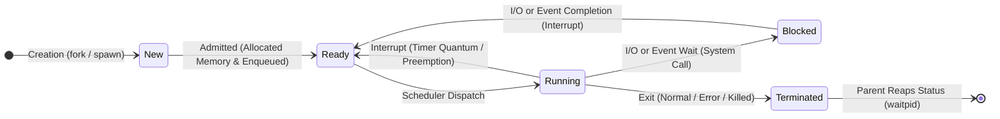
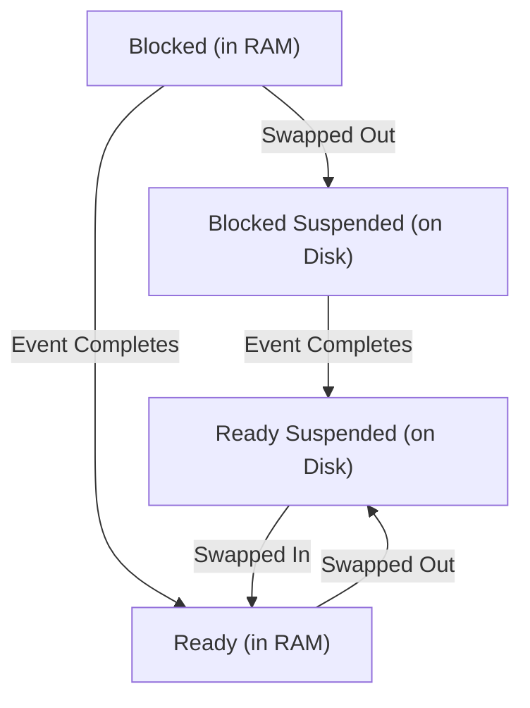

# Process Lifecycle and State Transitions

> 📖 **Reading Order:** Step 05 of 34 | **Module 2:** Processes & Threads  
> ◄ **Previous:** [[Process Concepts and Memory Layout]] | ► **Next:** [[Process Control Block and Context Switching]]

---

## Definition

During its existence from initial creation to final termination, a process changes its execution status dynamically. The **process lifecycle** is modeled as a finite state machine governed by the operating system scheduler and hardware events.

The standard representation is the **Five-State Process Model**:
1. **New:** The process is in the process of being created (its Process Control Block is being allocated and initialized, but its address space is not yet fully admitted into the ready queue).
2. **Ready:** The process is resident in main memory, possesses all required resources, and is waiting only to be assigned to a CPU core by the scheduler.
3. **Running:** The process's machine instructions are currently being fetched, decoded, and executed on a physical CPU core.
4. **Waiting (Blocked):** The process cannot execute even if the CPU were completely free, because it is awaiting an asynchronous external event (e.g., disk I/O completion, a network packet, user keyboard input, a semaphore signal, or a child process termination).
5. **Terminated (Exit):** The process has finished executing its code (or was killed), its memory and file descriptors are released, but its exit status remains in the process table until its parent collects it.

---

## The 5-State Transition Diagram

### Detailed Transition Analysis:

1. **Admitted ($\text{New} \to \text{Ready}$):**
   - The OS loads the program binary from secondary storage into main memory, builds the address space, initializes the PCB, and inserts the process pointer into the Ready Queue.
2. **Scheduler Dispatch ($\text{Ready} \to \text{Running}$):**
   - The CPU scheduler selects a process from the Ready Queue according to a scheduling algorithm (see [[CPU Scheduling Principles and Criteria]]), restores its register state via a context switch, and transfers CPU control.
3. **Interrupt / Preemption ($\text{Running} \to \text{Ready}$):**
   - A hardware timer interrupt fires indicating the process's allocated time slice (quantum) has expired, or a higher-priority process becomes ready. The OS saves the running process's state and places it back into the Ready Queue.
4. **I/O or Event Wait ($\text{Running} \to \text{Blocked}$):**
   - The process executes a blocking system call (e.g., `read()` from disk, `sleep()`, or waiting on a locked mutex). The OS moves the process out of the CPU and places it into an I/O Wait Queue.
5. **I/O or Event Completion ($\text{Blocked} \to \text{Ready}$):**
   - The disk controller or network card generates a hardware interrupt signaling that the requested data has arrived in memory. The OS moves the process from the Blocked Queue into the Ready Queue.
   - **Crucial Rule:** A blocked process **NEVER transitions directly from Blocked to Running!** It must enter the Ready Queue and wait its turn for the scheduler to select it.
6. **Exit ($\text{Running} \to \text{Terminated}$):**
   - The process finishes its `main()` function, explicitly calls `exit()`, or receives a fatal terminating signal (`SIGKILL`, `SIGSEGV`).

---

## The Extended 7-State Model (Suspended States)

When physical RAM is heavily overcommitted (thrashing), the OS must free up memory by swapping entire processes out of physical RAM and onto secondary storage (the swap partition/file). This introduces two **Suspended States**:

1. **Blocked Suspended:** The process is swapped out to disk and is also waiting for an external event.
2. **Ready Suspended:** The process has been swapped out to disk, but its blocking event has already completed. It is ready to run as soon as sufficient physical memory becomes available to swap it back into RAM.

---

## Edge Cases & Strict Invariants

| Proposed Transition | Possible? | Explanation |
|---|---|---|
| $\text{Running} \to \text{Blocked}$ | **YES** | Process voluntarily requests I/O or blocks on a lock. |
| $\text{Blocked} \to \text{Running}$ | **IMPOSSIBLE** | Violates scheduling arbitration. Must enter Ready first. |
| $\text{Ready} \to \text{Blocked}$ | **IMPOSSIBLE** | A process can only request a blocking operation while actively executing on the CPU! |
| $\text{Blocked} \to \text{Ready}$ | **YES** | Standard event completion via hardware interrupt handler. |

---

## Cross-Topic Connections / Exam Relevance

- **Next Step:** What underlying data structure records these states and enables saving/restoring them? (See [[Process Control Block and Context Switching]]).
- **CPU Scheduling:** Scheduling algorithms operate directly on the collection of processes sitting in the **Ready** state (see [[CPU Scheduling Principles and Criteria]] and [[Interactive Scheduling Algorithms]]).
- **Exam Testing:** Consistently tested on exams:
  - "Draw the 5-state process diagram with all labels."
  - "Can a process transition directly from Blocked to Running? Explain why or why not."
  - "What event triggers the transition from Running to Ready vs. Running to Blocked?"

---

## Sources & Traceability

- **Lectures:** `cse313/01 - Sources/Lectures/2. ProcessAndThread-week2-RRR.pdf` (Slides 11–15)
- **Textbook:** Andrew S. Tanenbaum & Herbert Bos, *Modern Operating Systems* (4th Edition), Chapter 2 (Section 2.1.2: Process States)
