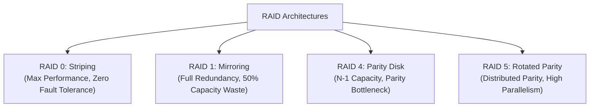

# RAID Architectures and Redundancy Models

> 📖 **Reading Order:** Step 53 of 68 | **Module 8: I/O Hardware & Storage Systems**  
> ◄ **Previous:** [[Disk Arm Scheduling Algorithms]] | ► **Next:** [[Disk Latency and RAID Performance Evaluation Formulas]]

---

## Starting Point and the Problem

Single hard drives suffer from three inescapable limitations:
1. **Limited Capacity:** A single drive cannot hold petabytes of enterprise data.
2. **Limited Performance:** A single disk transfers data at only $150 - 250\,\text{MB/s}$ and processes roughly $100 - 200$ I/O operations per second (IOPS).
3. **Catastrophic Failure:** Hard drives are mechanical and fail regularly. If a single drive containing corporate data crashes, all data is lost.

To solve this, David Patterson, Garth Gibson, and Randy Katz proposed **RAID: Redundant Arrays of Inexpensive (Independent) Disks**.

---

## Developing the Idea: Multi-Disk Virtualization

RAID virtualizes a collection of $N$ physical hard drives into a single large, high-performance, fault-tolerant logical disk presented to the operating system.

RAID schemes are evaluated across three fundamental dimensions:
1. **Capacity:** How much usable storage is available from $N$ disks of capacity $C$?
2. **Reliability:** How many concurrent drive failures can the array tolerate without data loss?
3. **Performance:** Throughput for Sequential Reads ($S$), Sequential Writes ($S$), Random Reads ($R$), and Random Writes ($R$).

---

## The Four Primary RAID Architectures

---

### 1. RAID Level 0: Striping
- **Mechanism:** Blocks are striped in round-robin fashion across all $N$ disks.
  - Disk 0: Blocks 0, 4, 8, 12 ...
  - Disk 1: Blocks 1, 5, 9, 13 ...
  - Disk 2: Blocks 2, 6, 10, 14 ...
  - Disk 3: Blocks 3, 7, 11, 15 ...
- **Capacity:** $N \cdot C$ ($100\%$ usable).
- **Reliability:** **0 failures tolerated.** If any single disk fails, the entire array is destroyed!
- **Performance:** Full linear speedup across all disks: $N \cdot S$ sequential, $N \cdot R$ random.

---

### 2. RAID Level 1: Mirroring
- **Mechanism:** Every logical block is written identically to two separate physical disks (primary and copy).
  - Disk 0: Blocks 0, 1, 2, 3 (Primary)
  - Disk 1: Blocks 0, 1, 2, 3 (Mirror Copy)
  - Disk 2: Blocks 4, 5, 6, 7 (Primary)
  - Disk 3: Blocks 4, 5, 6, 7 (Mirror Copy)
- **Capacity:** $\frac{N}{2} \cdot C$ ($50\%$ storage overhead).
- **Reliability:** Tolerates at least 1 failure, and up to $\frac{N}{2}$ failures if failed drives belong to different mirror pairs.
- **Performance:**
  - Sequential Read: $\frac{N}{2} \cdot S$ (or up to $N \cdot S$ with interleaving).
  - Sequential Write: $\frac{N}{2} \cdot S$ (every write must duplicate to mirror).
  - Random Read: $N \cdot R$ (reads can be dispatched independently to either mirror).
  - Random Write: $\frac{N}{2} \cdot R$.

---

### 3. RAID Level 4: Parity Disk
- **Mechanism:** Data blocks are striped across $N-1$ data disks, while a single dedicated disk stores the bitwise XOR **Parity**:
  $$P_i = D_0 \oplus D_1 \oplus \dots \oplus D_{N-2}$$
- **Error Recovery:** If Disk $K$ fails, its contents are reconstructed by XORing all surviving disks:
  $$D_K = D_0 \oplus \dots \oplus P_i \dots$$
- **Capacity:** $(N-1) \cdot C$.
- **Reliability:** Tolerates **1 disk failure**.

#### The Fatal Flaw of RAID 4: The Small-Write Parity Bottleneck
To update a single data block $D_0$, the array must recalculate the new parity $P_{\text{new}}$:
$$P_{\text{new}} = (D_{\text{old}} \oplus D_{\text{new}}) \oplus P_{\text{old}}$$
Updating one block requires:
1. Read $D_{\text{old}}$ and Read $P_{\text{old}}$ (2 reads)
2. Compute new parity via XOR
3. Write $D_{\text{new}}$ and Write $P_{\text{new}}$ (2 writes)

Because all parity blocks reside on the **single dedicated parity disk**, the parity disk must participate in **every single write in the entire system**! The parity disk becomes a catastrophic bottleneck, capping random write throughput at $\frac{R}{2}$ regardless of how many disks $N$ exist!

---

### 4. RAID Level 5: Distributed Rotated Parity
- **Mechanism:** Solves the RAID 4 bottleneck by **rotating parity blocks symmetrically across all $N$ disks**!
  - Stripe 0: Data on Disks 0, 1, 2; Parity on **Disk 3**.
  - Stripe 1: Data on Disks 0, 1, 3; Parity on **Disk 2**.
  - Stripe 2: Data on Disks 0, 2, 3; Parity on **Disk 1**.
  - Stripe 3: Data on Disks 1, 2, 3; Parity on **Disk 0**.
- **Capacity:** $(N-1) \cdot C$.
- **Reliability:** Tolerates **1 disk failure**.
- **Performance:**
  - Random Read: $N \cdot R$ (all disks hold readable data).
  - Random Write: $\frac{N}{4} \cdot R$ (all disks participate equally in writes; no single parity disk bottleneck!).

---

## RAID Master Comparison Matrix ($N$ Disks)

| Metric | RAID 0 | RAID 1 | RAID 4 | RAID 5 |
|---|---|---|---|---|
| **Capacity** | $N \cdot C$ | $\frac{N}{2} \cdot C$ | $(N-1) \cdot C$ | $(N-1) \cdot C$ |
| **Failures Tolerated**| 0 | 1 (or up to $N/2$) | 1 | 1 |
| **Sequential Read** | $N \cdot S$ | $\frac{N}{2} \cdot S$ | $(N-1) \cdot S$ | $(N-1) \cdot S$ |
| **Sequential Write**| $N \cdot S$ | $\frac{N}{2} \cdot S$ | $(N-1) \cdot S$ | $(N-1) \cdot S$ |
| **Random Read** | $N \cdot R$ | $N \cdot R$ | $(N-1) \cdot R$ | $N \cdot R$ |
| **Random Write** | $N \cdot R$ | $\frac{N}{2} \cdot R$ | $\frac{R}{2}$ (Bottleneck) | $\frac{N}{4} \cdot R$ |

---

## Important Properties and Guarantees

- **XOR Parity Invariant:** $A \oplus B \oplus C = P \implies A \oplus B \oplus P = C$. Parity allows the reconstruction of *any* single missing data operand using symmetric bitwise operations.
- **The Reconstruction Window Vulnerability:** When a disk fails in RAID 5, reading all surviving disks to rebuild the replacement disk subjects the remaining drives to heavy I/O stress, significantly increasing the probability of a second catastrophic failure during reconstruction (motivating **RAID 6** with dual parity).

---

## Common Mistakes

- **Confusing RAID with Backup:** RAID protects against *hardware disk failure*, not human error, malware, or file corruption. If a user deletes a file (`rm -rf`), the deletion is immediately mirrored/parity-updated across all disks!
- **Overlooking the 4-I/O Penalty in RAID 5:** Updating one block in RAID 5 always requires 2 reads and 2 writes. Therefore, the total write throughput across $N$ disks is $\frac{N \cdot R}{4} = \frac{N}{4} \cdot R$.

---

## Exam Relevance

Frequently tested through:
- Calculating usable capacity and cost-per-gigabyte across RAID levels.
- Deriving random write throughput and explaining the small-write parity problem.
- Step-by-step XOR reconstruction of a failed disk block.

---

## Related Concepts

- [[Hard Disk Drive Architecture and Mechanical Latency]]
- [[Disk Arm Scheduling Algorithms]]
- [[Disk Latency and RAID Performance Evaluation Formulas]]

---

## Prerequisites

- [[Hard Disk Drive Architecture and Mechanical Latency]]

---

## Problems

- [[Problem — Disk Arm Scheduling and RAID Performance Analysis]]

---

## Sources

- **Lecture Slides:** [[cse313/01 - Sources/Lectures/CSE313_KRV_Merged.pdf|CSE313_KRV_Merged.pdf]], Chapter 38 (Slides 278–294).
- **Textbook:** Arpaci-Dusseau & Arpaci-Dusseau, *Operating Systems: Three Easy Pieces (OSTEP)*, Chapter 38 (Redundant Arrays of Inexpensive Disks (RAIDs)).
