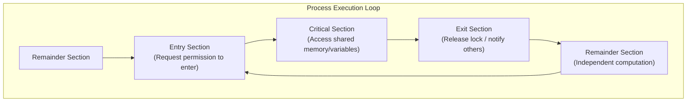

# Race Conditions and Critical-Section Problem

> 📖 **Reading Order:** Step 18 of 34 | **Module 4:** Inter-Process Communication & Synchronization  
> ◄ **Previous:** [[Problem — CPU Scheduling Algorithm Simulation and Gantt Chart]] | ► **Next:** [[Peterson's Algorithm and Hardware Mutual Exclusion]]

---

## 1. Intuition & Real-World Motivation

In a multiprogramming or multithreaded system, processes share resources such as common memory buffers, global variables, files, or I/O devices. When two or more concurrent processes read and write shared data, and the final outcome depends on the exact order or timing in which the instructions interleave, a **race condition** occurs.

### Real-World Analogy: The Spooler Directory
Consider a print spooler directory. When a process wishes to print a file, it enters the file name into an open slot in the spooler table. A global shared variable `next_free_slot` points to the next available index:
1. Process $A$ reads `next_free_slot = 7`.
2. Before Process $A$ can store its file name at index 7, its time quantum expires, and a context switch occurs.
3. Process $B$ is scheduled. It reads `next_free_slot = 7`, writes its document name into slot 7, increments `next_free_slot` to 8, and yields.
4. Process $A$ resumes. Unaware of $B$'s actions, it writes its file name into slot 7—**completely overwriting Process $B$'s document**! Process $B$'s print job is lost forever.

```
Time  | Process A                      | Process B                      | next_free_slot
------+--------------------------------+--------------------------------+----------------
t0    | reads next_free_slot (7)       |                                | 7
t1    | [Context Switched / Preempted] |                                | 7
t2    |                                | reads next_free_slot (7)       | 7
t3    |                                | writes file to slot 7          | 7
t4    |                                | increments next_free_slot (8)  | 8
t5    | writes file to slot 7 (CLOBBER)|                                | 8 (B lost!)
```

To eliminate race conditions, access to shared memory must be mutually exclusive.

---

## 2. The Critical-Section Problem Architecture

Any portion of a program that accesses shared memory or shared resources is designated as a **Critical Region** (or **Critical Section**).

To prevent concurrency bugs, execution of a process must be structured into four distinct structural sections:



```c
do {
    // 1. Entry Section: Acquire lock / test condition
    entry_section();

    // 2. Critical Section: Shared data manipulation
    access_shared_resource();

    // 3. Exit Section: Release lock / wake up waiting processes
    exit_section();

    // 4. Remainder Section: Non-shared, private processing
    remainder_section();
} while (TRUE);
```

---

## 3. The Four Criteria for a Valid Solution

According to Tanenbaum and Silberschatz, any correct mutual exclusion mechanism must satisfy the following **four conditions**:

| # | Criterion | Formal Definition & Implication |
|---|---|---|
| **1** | **Mutual Exclusion** | No two processes may be simultaneously present inside their critical regions accessing the same shared resource. |
| **2** | **Progress (No Outside Blocking)** | No process executing outside its critical region (i.e., in its remainder section) may block other processes from entering their critical regions. Selection of the next process must depend only on those currently competing. |
| **3** | **Bounded Waiting (Starvation Freedom)** | No process should have to wait indefinitely to enter its critical region. There must exist a bound on the number of times other processes are allowed to enter their critical regions after a process has requested entry. |
| **4** | **Speed and CPU Independence** | No assumptions may be made regarding the relative speeds of processes or the number of hardware CPUs/cores available. |

---

## 4. Failed Software Approaches: Why Simple Logic Fails

Understanding why naive attempts fail illustrates the subtle hazards of concurrent execution:

### Approach A: Disabling Interrupts (Hardware approach)
- **Concept:** Process executes a CLI (`Clear Interrupt Enable Flag`) upon entering, and STI (`Set Interrupt Enable Flag`) upon exiting.
- **Why it Fails:**
  1. *Unacceptable user privilege:* If a user program disables interrupts and enters an infinite loop, the entire OS halts.
  2. *Multicore ineffectiveness:* Disabling interrupts on CPU Core 0 only prevents switches on Core 0. Other CPU cores continue executing and modifying shared memory simultaneously.

### Approach B: Simple Software Lock Variable
- **Concept:** A single shared boolean variable `lock` (initially 0).
  ```c
  while (lock == 1); // Wait until lock is free (spin)
  lock = 1;          // Acquire lock
  critical_section();
  lock = 0;          // Release lock
  ```
- **Why it Fails:**
  The `lock` variable itself is a shared memory location!
  If Process 0 sees `lock == 0` and is preempted immediately before setting `lock = 1`, Process 1 executes, sees `lock == 0`, sets `lock = 1`, and enters. When Process 0 resumes, it sets `lock = 1` and also enters. **Both processes are now in the critical section!**

### Approach C: Strict Alternation
- **Concept:** A shared turn variable initialized to 0.
  ```c
  // Process 0:
  while (turn != 0); // Busy wait
  critical_section();
  turn = 1;
  remainder_section();

  // Process 1:
  while (turn != 1); // Busy wait
  critical_section();
  turn = 0;
  remainder_section();
  ```
- **Why it Fails (Violates Criterion 2: Progress):**
  Suppose Process 0 finishes its critical section, sets `turn = 1`, and enters a long remainder section. Process 1 enters, exits, sets `turn = 0`, and finishes its remainder section quickly. Process 1 now wishes to re-enter its critical section, but `turn` is 0! Process 1 is blocked by Process 0, even though Process 0 is **outside** its critical section.

---

## 5. Busy Waiting vs Blocking

- **Busy Waiting (Spinning):** Continuously testing a variable in a tight loop (`while (condition);`).
  - *Pro:* No context switch overhead if wait time is microscopic.
  - *Con:* Wastes CPU cycles doing useless polling; susceptible to **Priority Inversion** (if a high-priority process spins waiting for a low-priority process that never gets scheduled to release the lock).
- **Blocking (Sleep/Wakeup):** Relinquishing the CPU by changing state to `BLOCKED` until an event/signal awakens the process.

---

## 6. Summary Comparison of Fundamental Locking Primitives

| Mechanism | Software/Hardware | Satisfies Mutual Exclusion? | Satisfies Progress? | Satisfies Bounded Waiting? | CPU Utilization During Wait |
|---|---|---|---|---|---|
| **Disabling Interrupts** | Hardware (Privileged) | Yes (single core only) | Yes | Yes | High (runs unhindered) |
| **Lock Variable** | Pure Software | **No** (race condition) | N/A | N/A | Wasted (Busy-wait) |
| **Strict Alternation** | Pure Software | Yes | **No** (outside blocking) | No (forced lock-step) | Wasted (Busy-wait) |
| **Peterson's Algorithm** | Pure Software | **Yes** | **Yes** | **Yes** | Wasted (Busy-wait) |
| **Hardware TSL / XCHG** | Hardware Atomic | **Yes** | **Yes** | Yes (with fair queuing) | Wasted (Spinlock) |
| **Semaphores / Mutexes** | OS Kernel + Hardware | **Yes** | **Yes** | **Yes** | **Optimal** (Puts to Sleep) |

---

## Source Traceability & Metadata
- **Source Material:** `4. IPC-week-4-5-RRR.pptx` (Slides 3–15: Interprocess Communication, Race Conditions, Critical Regions, Strict Alternation).
- **Next Topic:** [[Peterson's Algorithm and Hardware Mutual Exclusion]] (Step 19).
