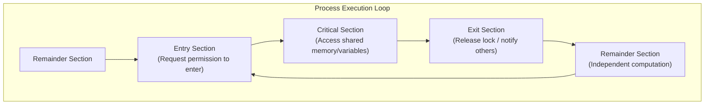

# Race Conditions and Critical-Section Problem

> 📖 **Reading Order:** Step 18 of 34 | **Module 4:** Inter-Process Communication & Synchronization  
> ◄ **Previous:** [[Problem — CPU Scheduling Algorithm Simulation and Gantt Chart]] | ► **Next:** [[Peterson's Algorithm and Hardware Mutual Exclusion]]

---

> [!IMPORTANT] **Exam practice references (Appeared in 2018 Q2a, 2019 Q2c)**
>
> ### Practice tasks and reasoning:
> 1. **The Four Essential Requirements for a Valid Critical Section Solution (2019 Q2c):**
>    - **Mutual Exclusion:** If process $P_i$ is in its critical section, no other processes can enter their critical sections.
>    - **Progress:** If the CS is empty and processes want to enter, only processes outside their remainder sections participate in selecting who enters next; selection cannot be postponed indefinitely.
>    - **Bounded Waiting:** A bound must exist on how many times other processes can enter their CS after a process has requested entry and before that request is granted (prevents starvation).
>    - **No Speed Assumptions:** The algorithm must remain correct regardless of CPU execution speeds or the number of physical cores.
> 2. **Shared Variable Data Races (2018 Q2a):**
>    - An unsynchronized `counter++` operation expands at machine level into 3 non-atomic instructions: `LOAD R, [counter]`, `ADD R, 1`, `STORE [counter], R`. Interleaving between concurrent threads produces lost updates.

---

## Building the idea

A single line of source code can hide several machine operations. In an illustrative shared-counter update, one thread loads 5, computes 6, and stores 6. If another thread performs its own load before that store, it also starts from 5. Both can finish without either update having had the intended combined effect.

A **race condition** means the outcome depends on an uncontrolled execution ordering. A language-level **data race** is a more specific notion involving unsynchronized conflicting accesses; in C and C++, it can cause undefined behavior rather than merely one of a few tidy interleavings. The classroom load/add/store trace explains the hazard under its machine model.

The critical section is the operation whose shared-state invariant needs protection. Locking only the final store does not protect a read-modify-write update, because the decision was already made using stale data. Protect the full relevant operation.

[[Threads and Multithreading Models]] explains why memory can be shared; [[Process Control Block and Context Switching]] explains why execution can interleave. Mutual exclusion prevents overlap, but a useful solution also needs progress and a stated waiting/fairness guarantee. Those are separate properties to prove.

## How It Works

### 2. The Critical-Section Problem Architecture

Any portion of a program that accesses shared memory or shared resources is designated as a **Critical Region** (or **Critical Section**).

To prevent concurrency bugs, execution of a process must be structured into four distinct structural sections:



```c
do {
    // 1. Entry Section: Acquire lock / test condition
    entry_section();

    // 2. Critical Section: Shared data manipulation
    access_shared_resource();

    // 3. Exit Section: Release lock / wake up waiting processes
    exit_section();

    // 4. Remainder Section: Non-shared, private processing
    remainder_section();
} while (TRUE);
```

---

### Comparing entry mechanisms

| Mechanism | Exclusion argument | Waiting and fairness limits |
|---|---|---|
| Disable interrupts | Prevents local interrupt-driven preemption in a suitable single-core kernel context. | Does not stop another core; keep the protected interval short. |
| Ordinary check/set variable | Separate reads and writes can interleave. | Does not establish mutual exclusion. |
| Strict alternation | Only the designated turn can enter. | A participant in its remainder section can block the other, violating progress. |
| Peterson | Intent flags plus tie-breaking establish exclusion under the stated memory model. | Two participants; progress assumes eventual execution and finite critical sections. |
| Test-and-set spinlock | Atomic acquisition prevents two successful owners. | Basic spinning does not guarantee bounded waiting. |
| Mutex/semaphore protocol | Correct acquisition and release protect the relevant invariant. | Blocking behavior and fairness depend on the implementation and policy. |

Prove safety separately from progress and bounded overtaking. An atomic primitive alone does not supply all three.

## Example

Interleaving of `count++` ($P_1$) and `count--` ($P_2$) starting with `count = 5`:
- $P_1$ loads `count` into register $R_1$ ($R_1 = 5$).
- Timer interrupt preempts $P_1$! $P_2$ runs.
- $P_2$ loads `count` into $R_2$ ($R_2 = 5$), decrements ($R_2 = 4$), and stores back to `count` (`count = 4`).
- Timer preempts $P_2$! $P_1$ resumes.
- $P_1$ increments its saved register ($R_1 = 6$) and stores back to `count` (`count = 6`).
The correct result was 5; the actual result is 6! One update was completely destroyed.

---

## Important Properties and Why They Hold

- **The 4 Criteria Invariant:** A valid solution to the critical-section problem must strictly satisfy:
  1. *Mutual Exclusion:* Only one process in CS at a time.
  2. *Progress:* Only processes attempting to enter CS participate in deciding who enters next; decision cannot be postponed indefinitely.
  3. *Bounded Waiting:* A bound exists on how many times other processes can enter CS after a process requests entry (prevents starvation).
  4. *Arbitrary Speed:* No assumptions can be made regarding CPU clock speed or scheduling quantum.
- **Memory-model assumption:** Shared reads and writes need a defined atomicity and ordering model. Use suitable language atomics or synchronization primitives; fences alone do not make data-racing ordinary C/C++ variables valid.

---

## What to carry forward

Atomicity describes an indivisible operation, not an entire application. [[Peterson's Algorithm and Hardware Mutual Exclusion]] develops ways to control entry. [[Semaphores and Synchronization Primitives]] adds waiting and signaling. A mutex or semaphore does not automatically promise bounded waiting unless its scheduling policy supplies that guarantee.

## Related notes

- [[Threads and Multithreading Models]]
- [[Process Control Block and Context Switching]]
- [[Peterson's Algorithm and Hardware Mutual Exclusion]]
- [[Semaphores and Synchronization Primitives]]

## Sources

- **Source Material:** `4. IPC-week-4-5-RRR.pptx` (Slides 3–15: Interprocess Communication, Race Conditions, Critical Regions, Strict Alternation).
- **Next Topic:** [[Peterson's Algorithm and Hardware Mutual Exclusion]] (Step 19).
