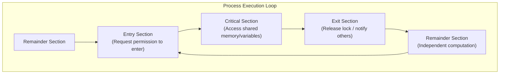

# Race Conditions and Critical-Section Problem

> 📖 **Reading Order:** Step 18 of 68 | **Module 4:** Inter-Process Communication & Synchronization  
> ◄ **Previous:** [[Problem — CPU Scheduling Algorithm Simulation and Gantt Chart]] | ► **Next:** [[Peterson's Algorithm and Hardware Mutual Exclusion]]

---
> [!IMPORTANT] 🎯 **Exam Frequency & Intelligence (Appeared in 2018 Q2a, 2019 Q2c)**
> **Frequency:** ⭐⭐⭐⭐ **Foundational Theory of Concurrency**
>
> ### What Exam Questions Expect & How to Master Them:
> 1. **The Four Essential Requirements for a Valid Critical Section Solution (2019 Q2c):**
>    - **Mutual Exclusion:** If process $P_i$ is in its critical section, no other processes can enter their critical sections.
>    - **Progress:** If the CS is empty and processes want to enter, only processes outside their remainder sections participate in selecting who enters next; selection cannot be postponed indefinitely.
>    - **Bounded Waiting:** A bound must exist on how many times other processes can enter their CS after a process has requested entry and before that request is granted (prevents starvation).
>    - **No Speed Assumptions:** The algorithm must remain correct regardless of CPU execution speeds or the number of physical cores.
> 2. **Shared Variable Data Races (2018 Q2a):**
>    - An unsynchronized `counter++` operation expands at machine level into 3 non-atomic instructions: `LOAD R, [counter]`, `ADD R, 1`, `STORE [counter], R`. Interleaving between concurrent threads produces lost updates.

---
## Starting Point and the Problem

When multiple concurrent processes or threads execute simultaneously on multi-core hardware or are interleaved via preemptive scheduling, they often read and write shared data structures in memory (such as a shared buffer count or account balance).

We want the final state of the shared data and program outputs to remain strictly correct, predictable, and deterministic regardless of thread scheduling order. The central obstacle is that high-level programming language statements (like `count++` or `count--`) are **not atomic** at the machine instruction level: they decompose into separate Load, Modify, and Store instructions that can be arbitrarily interrupted.

---
## Developing the Idea

If thread execution interleaves between the Load and Store instructions of a shared variable, updates are silently lost—a bug known as a **Race Condition**.

To eliminate race conditions, computer scientists formalized the **Critical-Section Problem**:
Any portion of code that accesses shared memory or shared resources is designated a **Critical Section (CS)**. The system must enforce an execution protocol:
1. **Entry Section:** Requests permission to enter.
2. **Critical Section:** Executes shared memory operations with guaranteed **Mutual Exclusion** (at most one thread inside at any time).
3. **Exit Section:** Releases access and notifies waiting threads.
4. **Remainder Section:** Executes non-critical local operations.

---
## Definition


---
## How It Works

### 2. The Critical-Section Problem Architecture

Any portion of a program that accesses shared memory or shared resources is designated as a **Critical Region** (or **Critical Section**).

To prevent concurrency bugs, execution of a process must be structured into four distinct structural sections:



```c
do {
    // 1. Entry Section: Acquire lock / test condition
    entry_section();

    // 2. Critical Section: Shared data manipulation
    access_shared_resource();

    // 3. Exit Section: Release lock / wake up waiting processes
    exit_section();

    // 4. Remainder Section: Non-shared, private processing
    remainder_section();
} while (TRUE);
```

---
### 6. Summary Comparison of Fundamental Locking Primitives

| Mechanism | Software/Hardware | Satisfies Mutual Exclusion? | Satisfies Progress? | Satisfies Bounded Waiting? | CPU Utilization During Wait |
|---|---|---|---|---|---|
| **Disabling Interrupts** | Hardware (Privileged) | Yes (single core only) | Yes | Yes | High (runs unhindered) |
| **Lock Variable** | Pure Software | **No** (race condition) | N/A | N/A | Wasted (Busy-wait) |
| **Strict Alternation** | Pure Software | Yes | **No** (outside blocking) | No (forced lock-step) | Wasted (Busy-wait) |
| **Peterson's Algorithm** | Pure Software | **Yes** | **Yes** | **Yes** | Wasted (Busy-wait) |
| **Hardware TSL / XCHG** | Hardware Atomic | **Yes** | **Yes** | Yes (with fair queuing) | Wasted (Spinlock) |
| **Semaphores / Mutexes** | OS Kernel + Hardware | **Yes** | **Yes** | **Yes** | **Optimal** (Puts to Sleep) |

---
## Example

Interleaving of `count++` ($P_1$) and `count--` ($P_2$) starting with `count = 5`:
- $P_1$ loads `count` into register $R_1$ ($R_1 = 5$).
- Timer interrupt preempts $P_1$! $P_2$ runs.
- $P_2$ loads `count` into $R_2$ ($R_2 = 5$), decrements ($R_2 = 4$), and stores back to `count` (`count = 4`).
- Timer preempts $P_2$! $P_1$ resumes.
- $P_1$ increments its saved register ($R_1 = 6$) and stores back to `count` (`count = 6`).
The correct result was 5; the actual result is 6! One update was completely destroyed.

---
## Technical Details

### 6. Summary Comparison of Fundamental Locking Primitives

| Mechanism | Software/Hardware | Satisfies Mutual Exclusion? | Satisfies Progress? | Satisfies Bounded Waiting? | CPU Utilization During Wait |
|---|---|---|---|---|---|
| **Disabling Interrupts** | Hardware (Privileged) | Yes (single core only) | Yes | Yes | High (runs unhindered) |
| **Lock Variable** | Pure Software | **No** (race condition) | N/A | N/A | Wasted (Busy-wait) |
| **Strict Alternation** | Pure Software | Yes | **No** (outside blocking) | No (forced lock-step) | Wasted (Busy-wait) |
| **Peterson's Algorithm** | Pure Software | **Yes** | **Yes** | **Yes** | Wasted (Busy-wait) |
| **Hardware TSL / XCHG** | Hardware Atomic | **Yes** | **Yes** | Yes (with fair queuing) | Wasted (Spinlock) |
| **Semaphores / Mutexes** | OS Kernel + Hardware | **Yes** | **Yes** | **Yes** | **Optimal** (Puts to Sleep) |

---
## Important Properties and Why They Hold

- **The 4 Criteria Invariant:** A valid solution to the critical-section problem must strictly satisfy:
  1. *Mutual Exclusion:* Only one process in CS at a time.
  2. *Progress:* Only processes attempting to enter CS participate in deciding who enters next; decision cannot be postponed indefinitely.
  3. *Bounded Waiting:* A bound exists on how many times other processes can enter CS after a process requests entry (prevents starvation).
  4. *Arbitrary Speed:* No assumptions can be made regarding CPU clock speed or scheduling quantum.
- **Hardware Atomicity Foundation:** Pure software solutions require atomic hardware read/write memory semantics; on modern out-of-order processors, hardware atomic instructions (Test-and-Set, Compare-and-Swap) or memory barriers are mandatory.

---
## Common Mistakes

- Assuming user mode code can execute privileged instructions directly without a system call trap.
- Overlooking race conditions in shared variables without explicit synchronization.

---
## Exam Relevance

Frequently examined through conceptual comparison questions, trace diagrams, and architectural trade-off evaluations.

---
## Related Concepts

- [[Peterson's Algorithm and Hardware Mutual Exclusion]]
- [[Semaphores and Synchronization Primitives]]
- [[Monitors and Condition Variables]]

---
## Prerequisites

- [[Threads and Multithreading Models]]
- [[Process Concepts and Memory Layout]]

---
## Problems

- [[Problem — Dining Philosophers Deadlock-Free Synchronization]]

---
## Sources

- **Source Material:** `4. IPC-week-4-5-RRR.pptx` (Slides 3–15: Interprocess Communication, Race Conditions, Critical Regions, Strict Alternation).
- **Next Topic:** [[Peterson's Algorithm and Hardware Mutual Exclusion]] (Step 19).
