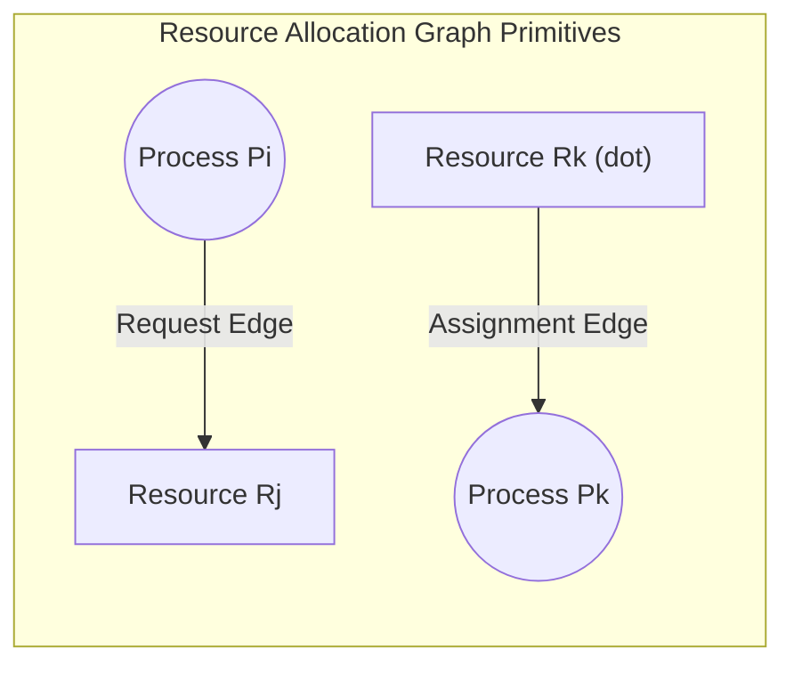
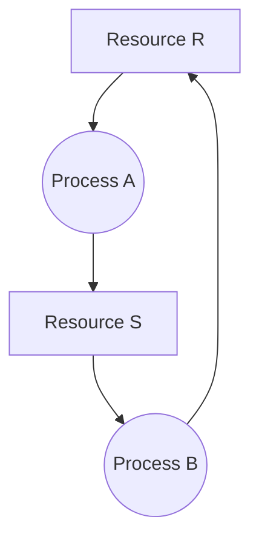
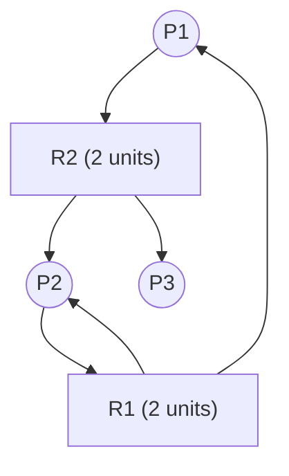

# Resource Allocation Graphs and Deadlock Modeling

> 📖 **Reading Order:** Step 27 of 68 | **Module 5:** Deadlocks  
> ◄ **Previous:** [[Deadlock Fundamentals and Coffman Conditions]] | ► **Next:** [[Deadlock Prevention and Avoidance Strategies]]

---
> [!IMPORTANT] 🎯 **Exam Frequency & Intelligence (Appeared in 2017 Q3c, 2018 Q2b, 2019 Q3b, 2020 Q3a, 2020 Q3c)**
> **Frequency:** ⭐⭐⭐⭐⭐ **100% Core Recurrence (Appeared across 4 exam years!)**
>
> ### What Exam Questions Expect & How to Master Them:
> 1. **The Graph Cycle Theorem (Single vs Multi-Instance):**
>    - **Single-Unit Resources:** A directed cycle is both **necessary and sufficient** for deadlock. (Cycle $\iff$ Deadlock).
>    - **Multi-Unit Resources:** A directed cycle is **necessary but NOT sufficient**. A cycle can exist without deadlock if processes outside the cycle hold and eventually release resources needed inside the cycle.
> 2. **Can a Process Be Deadlocked Without Being in a Cycle? (2019 Q3b & 2020 Q3c verbatim):**
>    - Yes! Any process waiting for a resource that is permanently held by a deadlocked cycle is also deadlocked, even if the process has no directed path back to itself.
> 3. **Step-by-Step Graph Tracing via DFS (2017 Q3c & 2020 Q3a):**
>    - Trace edges strictly from request ($P \to R$) to assignment ($R \to P$). If you hit a node with no outgoing edges, backtrack. If you hit an active node currently on your recursion stack, a cycle is confirmed!

---
## Starting Point and the Problem

In real-world operating systems with dozens of processes and hundreds of heterogeneous resources (some with multiple identical instances, like 4 tape drives or 8 memory buffers), informal reasoning about deadlocks quickly becomes impossible.

We want a formal mathematical model to precisely represent system allocation state and detect whether deadlock exists. The central obstacle is distinguishing harmless resource contention from true deadlock when resources have multiple instances: a cycle in dependency may or may not mean deadlock.

---
## Developing the Idea

Computer scientists solve this by modeling resource allocations as a directed bipartite graph: the **Resource Allocation Graph (RAG)** $G = (V, E)$.

The vertices $V$ are partitioned into:
- Process nodes $P = \{P_1, P_2, \dots, P_n\}$ (represented as circles).
- Resource nodes $R = \{R_1, R_2, \dots, R_m\}$ (represented as squares containing dots for each instance).

The edges $E$ represent dependencies:
- **Request Edge ($P_i \to R_j$):** Process $P_i$ is waiting for an instance of resource $R_j$.
- **Assignment Edge ($R_j \to P_i$):** An instance of resource $R_j$ is allocated to process $P_i$.

---
## Definition

---
## How It Works

### 1. Graph Theoretical Formulation

Holt (1972) modeled resource allocation and deadlocks as a directed bipartite graph:
$$G = (V, E)$$

### Vertex Set $V = P \cup R$:
- **Process Nodes ($P$):** Represented visually as circles:
  $$P = \{P_1, P_2, \dots, P_n\}$$
- **Resource Nodes ($R$):** Represented visually as rectangles/squares:
  $$R = \{R_1, R_2, \dots, R_m\}$$
  Dots inside a rectangle indicate the number of identical available **instances** (units) of that resource type.

### Directed Edge Set $E$:
- **Request Edge ($P_i \to R_j$):** A directed arrow from process $P_i$ to resource class $R_j$. Signifies that $P_i$ is currently blocked waiting for an instance of $R_j$.
- **Assignment Edge ($R_j \to P_i$):** A directed arrow from a specific instance dot inside $R_j$ to process $P_i$. Signifies that the resource instance has been granted to and is currently held by $P_i$.

---
## Example

Cycle analysis on RAGs:
- **Single-Instance Resources:** If every resource has exactly 1 instance, a directed cycle in the RAG is both **necessary and sufficient** for deadlock. A cycle strictly proves deadlock!
- **Multiple-Instance Resources:** If resources have multiple instances, a cycle is **necessary but NOT sufficient**. For example, processes outside the cycle may finish and return resources, breaking the dependency.

---
## Technical Details

See related modules for microarchitectural implementation details.

---
## Important Properties and Why They Hold

- **Graph Reduction Theorem:** A RAG is deadlocked if and only if it cannot be completely reduced. The **Graph Reduction Algorithm** repeatedly finds unblocked processes, satisfies their requests, and deletes all their edges until no more processes can be reduced.
- **Bipartite Invariant:** Edges strictly alternate between Process nodes and Resource nodes; an edge can never directly connect two processes or two resources.

---
## Common Mistakes

- Assuming user mode code can execute privileged instructions directly without a system call trap.
- Overlooking race conditions in shared variables without explicit synchronization.

---
## Exam Relevance

### Case A: Single-Instance Cycle $\implies$ Permanent Deadlock
Consider processes $A, B$ and resources $R, S$ (1 instance each):
- Process $A$ holds Resource $R$ and requests Resource $S$.
- Process $B$ holds Resource $S$ and requests Resource $R$.

Cycle: $A \to S \to B \to R \to A$. Neither $A$ nor $B$ can proceed. **Definite Deadlock.**

---
### Case B: Multi-Instance Cycle $\implies$ NO Deadlock (False Alarm)
Consider processes $P_1, P_2, P_3$ and resources $R_1, R_2$ (2 instances each):
- $R_1$ has 2 instances: held by $P_1$ and $P_2$.
- $R_2$ has 2 instances: held by $P_2$ and $P_3$.
- $P_1$ requests an instance of $R_2$ ($P_1 \to R_2$).
- $P_2$ requests an instance of $R_1$ ($P_2 \to R_1$).
- **Cycle exists:** $P_1 \to R_2 \to P_2 \to R_1 \to P_1$.

**Why there is NO Deadlock:**
Notice Process $P_3$! $P_3$ holds an instance of $R_2$, but $P_3$ is **not waiting for any resource**.
1. $P_3$ executes independently and finishes.
2. $P_3$ releases its instance of $R_2$.
3. The released instance of $R_2$ is allocated to $P_1$, fulfilling $P_1$'s request!
4. $P_1$ executes to completion and releases its resources.
5. Finally, $P_2$ completes.
The cycle dissolved completely!

---
## Related Concepts

- [[Deadlock Prevention and Avoidance Strategies]]
- [[Banker's Algorithm]]
- [[Deadlock Detection and Recovery Algorithms]]
- [[Resource Allocation Graph Cycle Detection Example]]

---
## Prerequisites

- [[Deadlock Fundamentals and Coffman Conditions]]

---
## Problems

- [[Problem — Resource Allocation Graph Reduction and Cycle Detection]]

---
## Sources

- **Source Material:** `5. Deadlocks-week6-7-RRR.pdf` (Slides 10–13, 16–17: Deadlock Modeling, Resource Allocation Graphs, Cycle Analysis).
- **Previous Topic:** [[Deadlock Fundamentals and Coffman Conditions]] (Step 26).
- **Next Topic:** [[Deadlock Prevention and Avoidance Strategies]] (Step 28).
